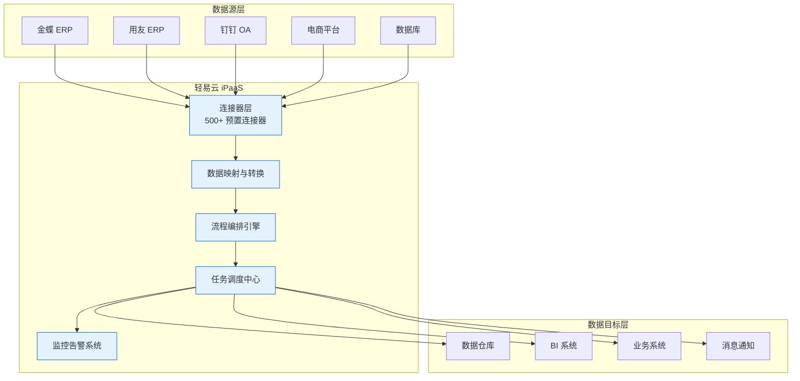

# 轻易云 iPaaS 集成平台

> 企业级数据集成与流程自动化平台，让企业数据无缝集成、自由流动。

轻易云 iPaaS（Integration Platform as a Service）是广东轻亿云软件科技有限公司自主研发的企业级数据集成平台，致力于帮助企业快速打通异构系统之间的数据壁垒，实现业务流程的自动化流转。平台采用云原生架构，支持私有化部署与 SaaS 模式，已服务 5000+ 企业客户，日数据流量超过 100 万单。

---

## 核心能力概览

轻易云 iPaaS 提供全栈式数据集成能力，覆盖从数据采集、转换、同步到监控的全生命周期。

### 500+ 预置连接器

平台预置丰富的应用连接器，覆盖 ERP、CRM、OA、电商、数据库等主流企业系统：

| 类别 | 代表系统 | 说明 |
|------|----------|------|
| **ERP 系统** | 金蝶云星空、用友 NC、畅捷通 T+ | 支持财务、供应链、生产制造等模块数据互通 |
| **OA 协同** | 钉钉、飞书、企业微信、泛微 | 组织架构、审批流程、消息通知无缝集成 |
| **电商平台** | 旺店通、聚水潭、万里牛 | 订单、库存、物流数据实时同步 |
| **数据库** | MySQL、Oracle、SQL Server、MongoDB | 支持关系型与 NoSQL 数据库双向同步 |
| **SaaS 应用** | 简道云、纷享销客、Moka | 快速连接各类云端应用 |

> [!TIP]
> 平台已累计集成 **4,992,134** 个 API 接口资产， connectors 持续更新中。

### 零代码可视化集成

通过可视化流程设计器，拖拽式构建数据集成流程：

- **可视化配置界面**：无需编写代码，通过图形化界面完成复杂的系统集成
- **预置标准 API 库**：继承经过验证的标准 API 预设，极大缩减配置时间
- **敏捷交付开箱即用**：平均实施周期缩短 60%，2 小时即可完成首个集成流程
- **非侵入式集成**：不修改现有业务系统，松耦合架构保障系统稳定性

### 实时数据同步

基于 CDC（Change Data Capture，变更数据捕获）技术实现数据的实时捕获与同步：

- **毫秒级延迟**：关键业务数据实时推送，延迟 < 100 ms
- **双队列池机制**：亿级数据有序处理，确保数据不丢失、不重复
- **断点续传**：网络中断自动重连，保障数据完整性
- **智能异常处理**：自动识别并处理数据异常，支持人工干预

### 企业级安全保障

多层安全防护机制，保障企业数据资产安全：

- **数据加密传输**：全链路 SSL/TLS 加密，支持国密算法
- **分级权限管控**：细粒度的数据访问权限控制
- **完整审计日志**：所有操作可追溯，满足合规要求
- **多环境隔离**：开发、测试、生产环境完全隔离

---

## 文档导航地图

根据你的需求和角色，选择合适的学习路径：

### 📖 快速开始（5 分钟上手）

适合初次接触轻易云 iPaaS 的用户，快速了解平台并完成首个集成流程。

| 文档 | 说明 |
|------|------|
| [平台简介](./quick-start/introduction) | 了解平台基础概念与架构 |
| [账号注册](./quick-start/registration) | 注册并激活你的轻易云账号 |
| [环境配置](./quick-start/environment-setup) | 配置开发与生产环境 |
| [第一个集成流程 🔥](./quick-start/first-integration) | 手把手教你完成首个数据同步任务 |
| [快速入门视频](./quick-start/video-tutorials) | 通过视频教程快速上手 |

### 📘 使用指南（功能详解）

深入学习平台各项核心功能，掌握数据集成全流程。

| 模块 | 核心内容 |
|------|----------|
| [平台总览](./guide/platform-overview) | 控制台功能介绍与导航 |
| [数据源管理](./guide/data-source-management) | 配置与管理各类数据源连接 |
| [数据目标管理](./guide/data-target-management) | 配置数据输出目标 |
| [数据映射](./guide/data-mapping) | 字段映射、数据转换规则配置 |
| [流程编排](./guide/process-orchestration) | 可视化流程设计与调试 |
| [任务调度](./guide/task-scheduling) | 定时任务与触发器配置 |
| [监控告警](./guide/monitoring-alerts) | 实时监控与异常告警 |

### 🔧 进阶应用（高阶技巧）

> [!IMPORTANT]
> 进阶应用内容需要登录后查看。

面向有复杂集成需求的高级用户，深入掌握平台高级特性。

| 功能 | 说明 |
|------|------|
| [CDC 实时同步](./advanced/cdc-realtime) 🆕 | 基于日志解析的实时数据捕获 |
| [自定义脚本](./advanced/custom-scripts) | 使用 JavaScript/Python 实现复杂转换 |
| [批量数据处理](./advanced/batch-processing) | 大规模数据批量导入导出 |
| [性能优化](./advanced/performance-tuning) | 提升集成效率的最佳实践 |
| [高可用配置](./advanced/high-availability) | 集群部署与故障转移 |

### 🔌 连接器生态

查看平台支持的各类系统连接器，了解详细配置方法：

- [ERP 类连接器](./connectors/erp/) — 金蝶、用友、畅捷通等
- [OA 协同连接器](./connectors/oa/) — 钉钉、飞书、企业微信等
- [电商/WMS 连接器](./connectors/ecommerce/) — 旺店通、聚水潭等
- [数据库连接器](./connectors/database/) — MySQL、Oracle、MongoDB 等
- [CRM 连接器](./connectors/crm/) — Salesforce、纷享销客等

### 🎯 行业解决方案

针对特定行业的典型应用场景，提供完整的集成解决方案：

- [制造业解决方案](./solutions/manufacturing) — MES 与 ERP 数据互通
- [零售业解决方案](./solutions/retail) — 全渠道库存统一管理
- [跨境电商方案](./solutions/crossborder-ecommerce) — 多平台订单履约
- [医药健康方案](./solutions/healthcare) — 药品追溯与合规
- [金融服务方案](./solutions/finance) — 风控数据实时汇聚

### 💻 开发者资源

> [!IMPORTANT]
> 开发者文档需要登录后查看。

面向开发者的技术文档，支持二次开发与系统集成。

| 资源 | 说明 |
|------|------|
| [开放接口概览](./developer/api-overview) | RESTful API 接口总览 |
| [认证授权](./developer/authentication) | API Key 与 OAuth2 认证 |
| [Webhook 配置](./developer/webhook) | 事件订阅与回调机制 |
| [自定义连接器开发](./developer/custom-connector) 🆕 | 开发专属连接器 |
| [SDK 使用](./developer/sdk) | 官方 SDK 集成指南 |

### 📚 参考资料

- [API 参考](./api-reference/) — 完整接口文档
- [FAQ](./faq/) — 常见问题解答
- [更新日志](./changelog/) — 版本更新记录

---

## 适合人群

轻易云 iPaaS 文档中心为不同角色提供差异化的学习路径：

### 👤 基础用户

**典型角色**：业务人员、项目经理、系统管理员

**推荐路径**：
1. 阅读 [平台简介](./quick-start/introduction) 了解基础概念
2. 观看 [快速入门视频](./quick-start/video-tutorials)
3. 跟随 [第一个集成流程](./quick-start/first-integration) 完成实践
4. 查阅 [使用指南](./guide/) 深入学习具体功能

**你将获得**：无需编程基础，即可独立完成常见的数据同步任务配置。

### 🧑‍💻 进阶用户

**典型角色**：数据工程师、集成顾问、技术运维

**推荐路径**：
1. 完成 [快速开始](./quick-start/) 全部内容
2. 深入学习 [数据映射](./guide/data-mapping) 与 [流程编排](./guide/process-orchestration)
3. 掌握 [CDC 实时同步](./advanced/cdc-realtime) 与 [性能优化](./advanced/performance-tuning)
4. 参考 [行业解决方案](./solutions/) 解决实际业务问题

**你将获得**：能够设计复杂的数据集成架构，优化集成性能，解决疑难问题。

### 👨‍💻 开发者

**典型角色**：软件工程师、架构师、ISV 合作伙伴

**推荐路径**：
1. 阅读 [开发指南](./developer/guide)
2. 了解 [开放接口](./developer/api-overview) 与 [认证授权](./developer/authentication)
3. 学习 [自定义连接器开发](./developer/custom-connector)
4. 参考 [API 参考](./api-reference/) 进行系统集成

**你将获得**：能够通过 API 与 SDK 深度集成轻易云平台，开发自定义连接器扩展平台能力。

---

## 产品架构

---

## 获取支持

在使用过程中遇到问题？我们提供多种支持渠道：

- 📖 **查阅文档**：[FAQ](./faq/) 收录了常见问题与解答
- 📝 **查看更新**：[更新日志](./changelog/) 了解产品最新动态
- 💬 **联系顾问**：拨打 181-7571-6035 或访问 [官网](https://www.qeasy.cloud/contact) 联系集成专家
- 🐛 **问题反馈**：通过控制台提交工单，我们将在 24 小时内响应

---

## 下一步

> [!TIP]
> 如果你刚开始接触轻易云 iPaaS，建议从 [快速开始](./quick-start/README) 章节开始，5 分钟即可完成首个集成流程。

准备好开始了吗？点击下方按钮，开启你的数据集成之旅：

- [→ 开始快速入门](./quick-start/introduction)
- [→ 浏览使用指南](./guide/README)
- [→ 查看连接器列表](./connectors/README)
