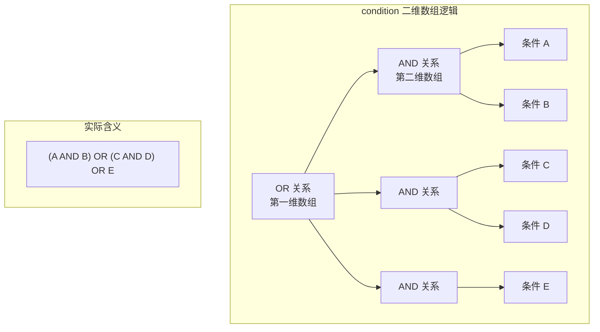
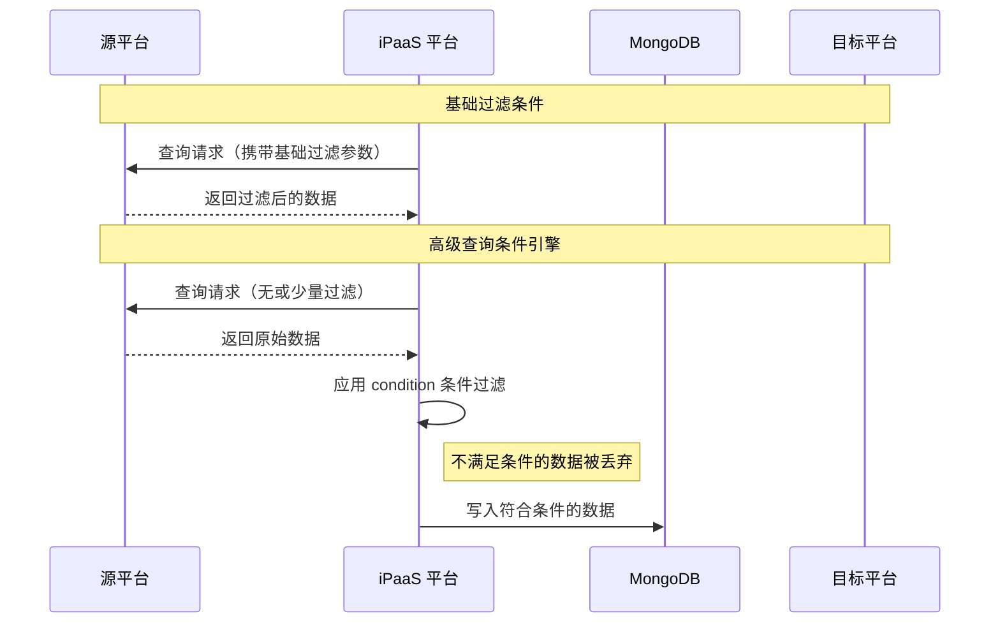

# 高级查询条件引擎

高级查询条件引擎是轻易云 iPaaS 平台提供的强大数据过滤工具，用于在源平台查询接口的基础上，对拉取的数据进行更精细的二次过滤。通过灵活的条件组合语法（AND/OR/嵌套条件）和丰富的操作符支持，帮助你精准控制哪些数据应该被写入目标系统。

> [!NOTE]
> 查询条件仅在**源平台配置**中生效。数据从源平台拉取后、写入 MongoDB 之前，系统会根据配置的条件进行过滤。不满足条件的数据将被丢弃，不会进入后续处理流程。

## 适用场景

| 场景 | 说明 |
| ---- | ---- |
| **接口过滤能力不足** | 源平台查询接口提供的过滤参数有限，无法满足业务需求 |
| **复杂业务规则** | 需要基于多个字段的组合条件进行数据筛选 |
| **子表数据过滤** | 需要根据明细行（子表）字段进行过滤决策 |
| **动态条件** | 需要基于运行时参数或上下文变量构建查询条件 |

## 基本语法结构

### 配置位置

在源平台配置的源码视图中，于一级对象下新增 `condition` 字段：

```json
{
  "api": "purchasein.query",
  "type": "QUERY",
  "method": "POST",
  "condition": [
    // 条件组数组
  ]
}
```

### 逻辑层级关系

`condition` 采用**二维数组结构**实现逻辑组合：

```text
condition: [
  [条件1, 条件2, ...],   // 第一层数组：OR 关系
  [条件3, 条件4, ...],   // 组间为 OR
  ...
]
// 第二层数组：组内条件为 AND 关系
```



## 过滤对象

### 基本结构

每个过滤对象包含三个核心字段：

| 字段 | 类型 | 必填 | 说明 |
| ---- | ---- | ---- | ---- |
| `field` | string | ✅ | 要过滤的字段名，支持子表字段（如 `items.name`） |
| `logic` | string | ✅ | 逻辑操作符，见下方支持列表 |
| `value` | any | — | 对比值，部分操作符可省略 |

### 字段引用方式

```json
// 主表字段
{ "field": "io_id", "logic": "eq", "value": "1001" }

// 子表/明细字段（使用点号分隔）
{ "field": "items.name", "logic": "like", "value": "商品A" }

// 嵌套对象字段
{ "field": "content.billdate", "logic": "eq", "value": "2024-01-01" }
```

## 支持的操作符

| 操作符 | 全称 | 说明 | 示例值 |
| ------ | ---- | ---- | ------ |
| `eq` | equal | 等于 | `"816403"` |
| `neq` | not equal | 不等于 | `"cancelled"` |
| `gt` | greater than | 大于 | `100` 或 `timestamp:1704067200` |
| `egt` | equal or greater than | 大于等于 | `100` |
| `lt` | less than | 小于 | `500` |
| `elt` | equal or less than | 小于等于 | `500` |
| `like` | like | 包含（模糊匹配） | `"活动"` |
| `notlike` | not like | 不包含 | `"test"` |
| `between` | between | 范围（两值逗号分隔） | `"100,500"` |
| `notnull` | not null | 不为空（无需 value） | — |
| `isnull` | is null | 为空（无需 value） | — |

### 日期比较说明

当使用 `gt`、`egt`、`lt`、`elt` 进行日期比较时，需在 `value` 前添加 `timestamp:` 前缀：

```json
{
  "field": "created_at",
  "logic": "gt",
  "value": "timestamp:1704067200"
}
```

## 严格模式（strictMode）

在处理子表（明细行）过滤时，支持 `strictMode` 配置决定过滤行为：

| 模式 | 值 | 行为说明 |
| ---- | ---- | ---- |
| **严格模式** | `true` | 只要有一行不满足条件，整张单据（包括所有明细行）被丢弃 |
| **非严格模式** | `false`（默认） | 仅删除不满足条件的明细行，保留满足条件的行和主表数据 |

### 示例场景

假设有如下采购入库单明细：

| 行号 | 货品编码 | 货品名称 | 数量 | 仓库 |
| ---- | ---- | ---- | ---- | ---- |
| 1 | AAA0001 | 电动剃须刀 | 1000 | CK0001 |
| 2 | BBB0001 | 磨牙棒 | 500 | YY002 |
| 3 | EEE0088 | 飞天茅台 | 88 | MT0003 |

配置过滤条件：

```json
{
  "field": "items.仓库",
  "logic": "like",
  "value": "MT",
  "strictMode": true
}
```

- **严格模式开启（`strictMode: true`）**：只有第 3 行满足条件，但由于开启了严格模式，整张单据被丢弃
- **严格模式关闭（`strictMode: false`）**：系统保留第 3 行数据，删除第 1、2 行

> [!WARNING]
> `strictMode` 默认**不开启**（值为 `false`）。在处理子表过滤时，请根据业务需求谨慎选择是否开启严格模式。

## 完整配置示例

### 示例一：多条件组合

```json
{
  "api": "purchasein.query",
  "type": "QUERY",
  "method": "POST",
  "number": "io_id",
  "id": "io_id",
  "condition": [
    [
      {
        "field": "io_id",
        "logic": "eq",
        "value": "816403"
      },
      {
        "field": "items.name",
        "logic": "like",
        "value": "活动",
        "strictMode": true
      }
    ],
    [
      {
        "field": "io_id",
        "logic": "like",
        "value": "512"
      }
    ],
    [
      {
        "field": "items.name",
        "logic": "eq",
        "value": "企鹅爸爸15合1桌游"
      }
    ]
  ]
}
```

**逻辑解析**：

```text
( io_id = 816403 AND items.name 包含 '活动' [严格模式] )
OR
( io_id 包含 '512' )
OR
( items.name = '企鹅爸爸15合1桌游' )
```

### 示例二：日期范围过滤

```json
{
  "condition": [
    [
      {
        "field": "created_at",
        "logic": "gt",
        "value": "timestamp:1704067200"
      },
      {
        "field": "created_at",
        "logic": "lt",
        "value": "timestamp:1735689600"
      },
      {
        "field": "status",
        "logic": "eq",
        "value": "completed"
      }
    ]
  ]
}
```

### 示例三：范围与空值判断

```json
{
  "condition": [
    [
      {
        "field": "amount",
        "logic": "between",
        "value": "1000,50000"
      }
    ],
    [
      {
        "field": "remark",
        "logic": "notnull"
      }
    ]
  ]
}
```

**逻辑解析**：金额在 1000~50000 之间 **OR** 备注不为空。

## 与基础过滤条件的区别

| 特性 | 基础过滤条件 | 高级查询条件引擎 |
| ---- | ---- | ---- |
| **作用时机** | 源平台查询时 | 数据拉取后、写入前 |
| **作用位置** | 请求源平台接口 | 平台内部数据处理层 |
| **复杂度** | 简单字段匹配 | 支持 AND/OR 嵌套组合 |
| **子表支持** | 有限 | 完整支持（含严格模式） |
| **动态参数** | 支持基础变量 | 支持更复杂的参数化查询 |
| **性能影响** | 无额外开销 | 增加内存过滤处理 |



## 与数据管理查询的区别

数据管理页面的自定义查询与源平台的高级查询条件引擎使用不同的语法：

| 功能 | 源平台 condition | 数据管理查询 |
| ---- | ---- | ---- |
| **语法格式** | 自定义 JSON 结构 | MongoDB 标准查询语法 |
| **使用场景** | 集成方案数据过滤 | 数据管理页面手动查询 |
| **操作符** | `eq`, `like`, `between` 等 | `$eq`, `$regex`, `$gte` 等 |

### 数据管理查询语法参考

```json
{
  "created_at": {
    "$gt": 1600043610,
    "$lt": 1653643610
  },
  "status": {
    "$eq": 1
  },
  "content.billdate": {
    "$eq": "SO20002111"
  }
}
```

轻易云数据管理页面支持的标准字段：

| 字段 | 说明 | 数据类型 |
| ---- | ---- | ---- |
| `id` | 数据的 ID 字段 | 动态类型 |
| `number` | 数据的编码字段 | 动态类型 |
| `status` | 数据状态：0 等待中、1 重复的、2 已完成、3 错误的、5 队列中 | 整型 |
| `created_at` | 数据创建时间，带小数位的毫秒级时间戳 | 浮点数 |
| `response_at` | 数据处理时间，带小数位的毫秒级时间戳 | 浮点数 |
| `content` | 数据内容 | 动态对象 |
| `response` | 响应内容 | 动态对象 |

## 最佳实践

### 1. 优先使用基础过滤

尽可能利用源平台接口自带的基础过滤条件，减少数据传输量：

```json
{
  "api": "purchasein.query",
  "params": {
    "start_time": "{{LAST_SYNC_TIME}}"
  },
  "condition": [
    // 仅在基础过滤无法满足需求时使用
  ]
}
```

### 2. 合理组织条件层级

将最可能过滤掉数据的条件放在前面，减少后续处理：

```json
{
  "condition": [
    [
      { "field": "status", "logic": "eq", "value": "active" },
      { "field": "amount", "logic": "gt", "value": "1000" }
    ]
  ]
}
```

### 3. 子表过滤注意事项

- 明确业务需求是否需要保留部分明细行
- 谨慎使用 `strictMode: true`，避免误丢弃完整单据
- 测试阶段充分验证子表过滤效果

### 4. 调试技巧

使用平台的[调试器](../guide/debugger)和[数据与队列管理](../guide/data-queue-management)功能：

1. 开启调试模式查看原始数据
2. 检查过滤前后的数据量变化
3. 验证条件表达式是否正确匹配预期数据

## 常见问题

### Q: 条件不生效，所有数据都被写入了？

请检查：
- `condition` 是否位于源平台配置的一级对象下
- 字段名是否正确（区分大小写）
- 逻辑操作符拼写是否正确

### Q: 如何调试条件是否按预期工作？

1. 在[数据管理](../guide/data-queue-management)页面查看数据详情
2. 使用调试器单步执行，观察过滤前后的数据
3. 临时添加一个确定能匹配的条件进行测试

### Q: 子表过滤后数据格式会变化吗？

- **非严格模式**：子表数组会被更新为仅包含满足条件的行
- **严格模式**：整张单据（包括主表和所有子表）被丢弃

### Q: 支持正则表达式匹配吗？

目前 `like` 操作符使用简单包含匹配，不支持正则表达式。如需复杂匹配，建议结合[自定义脚本](./custom-scripts)处理。

## 相关文档

- [源平台配置](../guide/source-platform-config) — 了解源平台配置的完整结构
- [自定义脚本](./custom-scripts) — 实现更复杂的数据过滤逻辑
- [数据与队列管理](../guide/data-queue-management) — 查看和管理过滤后的数据
- [调试器](../guide/debugger) — 调试条件过滤效果
