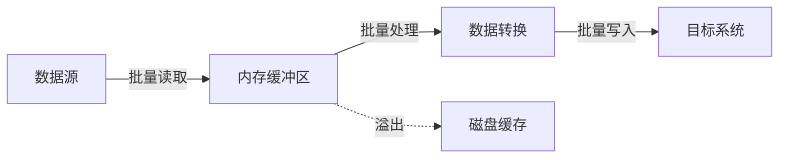
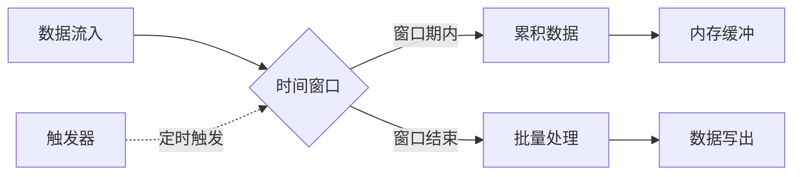
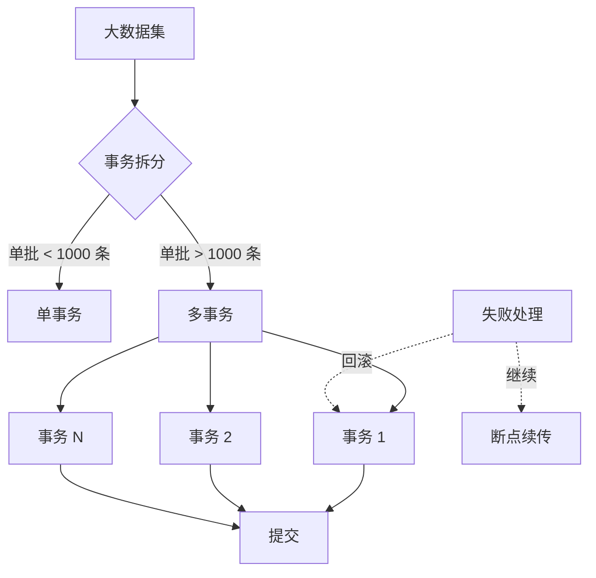

# 批量数据处理

批量数据处理是轻易云 DataHub 的核心能力之一，通过合理的批量处理策略可以显著提升数据集成效率。本文档详细介绍批量处理策略、分页查询技巧、批量写入优化等内容。

## 概述

批量数据处理是指将多条数据记录作为一个批次进行处理，而不是逐条处理。这种方式可以显著减少网络往返次数和数据库事务开销，提高整体处理效率。



### 批处理 vs 单条处理对比

| 指标 | 单条处理 | 批量处理 | 提升幅度 |
|-----|---------|---------|---------|
| 网络往返 | N 次 | N/1000 次 | 1000x |
| 事务开销 | N 次 | N/1000 次 | 1000x |
| 处理速度 | 100 条/秒 | 10,000 条/秒 | 100x |
| 内存占用 | 低 | 中 | - |
| 失败影响 | 单条 | 批量 | 需重试机制 |

## 批量处理策略

### 1. 固定批次大小策略

最常见的批量处理策略，每积累到一定数量的记录就进行一次批量操作。

```javascript
// 固定批次配置
const batchConfig = {
  mode: "fixed_size",
  batchSize: 1000,  // 每批 1000 条
  maxWaitTime: 5000,  // 最长等待 5 秒
  
  // 回调函数
  onBatchReady: async (records) => {
    await database.bulkInsert(records);
  }
};

// 使用示例
const processor = new BatchProcessor(batchConfig);

// 添加记录
for (const record of sourceData) {
  await processor.add(record);
}

// 刷新剩余记录
await processor.flush();
```

### 2. 动态批次大小策略

根据数据大小和系统负载动态调整批次大小。

```javascript
// 动态批次配置
const dynamicBatchConfig = {
  mode: "dynamic_size",
  minBatchSize: 100,
  maxBatchSize: 5000,
  targetBatchBytes: 1024 * 1024,  // 目标批次 1MB
  
  // 动态调整算法
  adjustStrategy: (metrics) => {
    if (metrics.avgLatency < 100) {
      return Math.min(metrics.currentSize * 1.2, 5000);
    } else if (metrics.avgLatency > 1000) {
      return Math.max(metrics.currentSize * 0.8, 100);
    }
    return metrics.currentSize;
  }
};
```

### 3. 时间窗口策略

基于时间窗口的批量处理，适用于实时数据流场景。



```javascript
// 时间窗口配置
const windowConfig = {
  mode: "time_window",
  windowSize: 10000,  // 10 秒窗口
  maxRecordsPerWindow: 10000,
  
  // 窗口触发方式
  triggers: ["time", "count", "memory"],
  
  // 内存限制
  maxMemoryMB: 512,
  
  // 水印机制（处理乱序数据）
  watermarkDelay: 2000  // 2 秒延迟
};
```

### 4. 策略对比

| 策略 | 适用场景 | 延迟 | 吞吐量 | 复杂度 |
|-----|---------|------|-------|-------|
| 固定批次 | 批处理任务 | 中 | 高 | 低 |
| 动态批次 | 负载变化大的场景 | 中 | 高 | 中 |
| 时间窗口 | 实时流处理 | 可控 | 中 | 高 |
| 混合策略 | 通用场景 | 低 | 高 | 高 |

## 分页查询技巧

### 1. 基于游标的分页

最推荐的分页方式，性能稳定且不受数据变更影响。

```sql
-- 游标分页查询（推荐）
SELECT * FROM orders
WHERE order_id > :last_order_id  -- 上次查询的最大 ID
ORDER BY order_id
LIMIT 1000;
```

```javascript
// 游标分页实现
async function cursorPagination(table, orderColumn, batchSize = 1000) {
  let lastValue = null;
  let hasMore = true;
  
  while (hasMore) {
    const query = lastValue 
      ? `SELECT * FROM ${table} WHERE ${orderColumn} > ? ORDER BY ${orderColumn} LIMIT ?`
      : `SELECT * FROM ${table} ORDER BY ${orderColumn} LIMIT ?`;
    
    const params = lastValue ? [lastValue, batchSize] : [batchSize];
    const rows = await db.query(query, params);
    
    if (rows.length === 0) {
      hasMore = false;
    } else {
      yield rows;
      lastValue = rows[rows.length - 1][orderColumn];
      hasMore = rows.length === batchSize;
    }
  }
}
```

### 2. 基于偏移量的分页

适用于数据量较小或需要跳转到特定页的场景。

```sql
-- 偏移量分页
SELECT * FROM orders
ORDER BY order_id
LIMIT 1000 OFFSET 10000;  -- 第 11 页
```

> [!WARNING]
> 偏移量分页在大数据量时性能急剧下降，因为数据库仍需扫描 OFFSET 之前的所有记录。

### 3. 基于时间戳的分页

适用于按时间排序的数据查询。

```sql
-- 时间戳分页
SELECT * FROM events
WHERE created_at >= '2024-01-01'
  AND created_at < '2024-01-02'
  AND (created_at > :last_timestamp 
       OR (created_at = :last_timestamp AND id > :last_id))
ORDER BY created_at, id
LIMIT 1000;
```

### 4. 分页策略对比

| 分页方式 | 优点 | 缺点 | 适用场景 |
|---------|------|------|---------|
| 游标分页 | 性能稳定，无深页问题 | 不能跳页，需排序列 | 大数据量导出 |
| 偏移分页 | 可跳页，实现简单 | 深页性能差 | 小数据量展示 |
| 时间分页 | 支持时间范围筛选 | 需要复合索引 | 时序数据 |
| 键集分页 | 性能最优 | 实现复杂 | 高并发场景 |

## 批量写入优化

### 1. 数据库批量写入

#### MySQL 批量插入

```sql
-- 单条插入（慢）
INSERT INTO orders (id, amount) VALUES (1, 100);
INSERT INTO orders (id, amount) VALUES (2, 200);

-- 批量插入（快）
INSERT INTO orders (id, amount) VALUES 
  (1, 100),
  (2, 200),
  (3, 300);
```

```javascript
// DataHub MySQL 批量写入配置
const mysqlConfig = {
  driver: "mysql",
  batchInsert: {
    enabled: true,
    batchSize: 1000,
    // 使用 LOAD DATA LOCAL INFILE（更快）
    useLoadData: true,
    // 忽略重复键
    onDuplicate: "ignore",  // ignore, update, error
  }
};
```

#### PostgreSQL 批量写入

```sql
-- 使用 COPY 命令（最快）
COPY orders (id, amount, created_at) 
FROM '/path/to/data.csv' 
WITH (FORMAT csv, HEADER true);

-- 批量插入
INSERT INTO orders (id, amount) VALUES 
  (1, 100),
  (2, 200)
ON CONFLICT (id) DO UPDATE SET amount = EXCLUDED.amount;
```

```javascript
// DataHub PostgreSQL 批量写入配置
const pgConfig = {
  driver: "postgresql",
  batchInsert: {
    enabled: true,
    batchSize: 1000,
    // 使用 COPY 协议
    useCopy: true,
    // 冲突处理
    onConflict: "upsert",  // ignore, upsert, error
    conflictKey: ["id"]
  }
};
```

### 2. 批量更新策略

```sql
-- MySQL 批量更新（使用 CASE）
UPDATE orders
SET status = CASE id
  WHEN 1 THEN 'completed'
  WHEN 2 THEN 'pending'
  WHEN 3 THEN 'cancelled'
END,
updated_at = NOW()
WHERE id IN (1, 2, 3);

-- PostgreSQL 批量更新（使用 VALUES）
UPDATE orders o
SET status = v.status,
    updated_at = v.updated_at
FROM (VALUES 
  (1, 'completed', NOW()),
  (2, 'pending', NOW())
) AS v(id, status, updated_at)
WHERE o.id = v.id;
```

### 3. 批量删除优化

```sql
-- 避免大事务删除
-- 方式 1：分批删除
DELETE FROM logs 
WHERE created_at < '2023-01-01'
LIMIT 1000;

-- 方式 2：使用分区表，直接删除分区
ALTER TABLE logs DROP PARTITION p2022;
```

## 大事务处理

### 1. 事务拆分策略



```javascript
// 事务拆分配置
const transactionConfig = {
  // 最大单事务记录数
  maxRecordsPerTransaction: 1000,
  
  // 事务超时（秒）
  transactionTimeout: 300,
  
  // 失败处理策略
  onBatchFailure: "continue",  // continue, abort, skip
  
  // 断点续传
  checkpoint: {
    enabled: true,
    interval: 10000,  // 每 10 秒保存检查点
    storage: "redis"  // redis, database, file
  }
};
```

### 2. 断点续传机制

```javascript
// 断点续传实现
class ResumableBatchProcessor {
  constructor(config) {
    this.config = config;
    this.checkpointKey = `batch_checkpoint:${config.jobId}`;
  }
  
  async process(dataSource) {
    // 恢复检查点
    const checkpoint = await this.loadCheckpoint();
    const startPosition = checkpoint ? checkpoint.position : 0;
    
    let currentPosition = startPosition;
    
    for await (const batch of dataSource.batches(startPosition)) {
      try {
        await this.executeBatch(batch);
        currentPosition += batch.length;
        
        // 保存检查点
        if (currentPosition % this.config.checkpointInterval === 0) {
          await this.saveCheckpoint({
            position: currentPosition,
            timestamp: Date.now(),
            lastBatch: batch[batch.length - 1].id
          });
        }
      } catch (error) {
        // 失败处理
        await this.handleBatchError(error, batch, currentPosition);
      }
    }
    
    // 清理检查点
    await this.clearCheckpoint();
  }
}
```

## 内存优化建议

### 1. 流式处理

```javascript
// 流式处理配置（避免内存溢出）
const streamConfig = {
  // 启用流式读取
  streaming: true,
  
  // 背压控制
  highWaterMark: 100,  // 缓冲区上限
  lowWaterMark: 10,    // 缓冲区下限
  
  // 对象模式
  objectMode: true,
  
  // 管道处理
  pipeline: [
    { transform: parseRecord, parallel: 2 },
    { transform: validateRecord, parallel: 4 },
    { transform: writeRecord, parallel: 2 }
  ]
};

// Node.js 流式处理示例
const { pipeline } = require('stream/promises');

await pipeline(
  source.createReadStream(),
  new Transform({
    objectMode: true,
    transform(chunk, encoding, callback) {
      // 处理数据
      const processed = processChunk(chunk);
      callback(null, processed);
    }
  }),
  target.createWriteStream()
);
```

### 2. 内存缓冲区管理

```javascript
// 内存缓冲区配置
const bufferConfig = {
  // 最大内存使用（MB）
  maxMemoryMB: 1024,
  
  // 缓冲区策略
  bufferStrategy: "adaptive",  // fixed, adaptive, offheap
  
  // 溢出到磁盘
  spillToDisk: {
    enabled: true,
    threshold: 0.8,  // 内存使用 80% 时溢出
    directory: "/tmp/batch_spill",
    maxDiskUsageGB: 10
  },
  
  // GC 调优
  gc: {
    interval: 30000,  // 30 秒触发一次建议 GC
    aggressive: false
  }
};
```

### 3. 内存使用监控

```javascript
// 内存监控实现
class MemoryMonitor {
  constructor(threshold = 0.85) {
    this.threshold = threshold;
    this.checkInterval = 5000;  // 5 秒检查一次
  }
  
  start() {
    setInterval(() => {
      const usage = process.memoryUsage();
      const usedPercent = usage.heapUsed / usage.heapTotal;
      
      if (usedPercent > this.threshold) {
        this.handleHighMemory(usage);
      }
    }, this.checkInterval);
  }
  
  handleHighMemory(usage) {
    console.warn(`内存使用过高: ${(usage.heapUsed / 1024 / 1024).toFixed(2)} MB`);
    
    // 触发降速处理
    this.throttleProcessing();
    
    // 建议 GC
    if (global.gc) {
      global.gc();
    }
  }
  
  throttleProcessing() {
    // 降低并发度
    // 增加批处理间隔
    // 触发磁盘溢出
  }
}
```

## 性能调优参数

### 数据库连接池配置

| 参数 | 说明 | 推荐值 |
|-----|------|-------|
| minPoolSize | 最小连接数 | 5 |
| maxPoolSize | 最大连接数 | 20-50 |
| connectionTimeout | 连接超时 | 30s |
| idleTimeout | 空闲超时 | 10min |
| maxLifetime | 最大生命周期 | 30min |

### 批处理参数

```yaml
batch_processing:
  # 读取批次大小
  read_batch_size: 5000
  
  # 写入批次大小
  write_batch_size: 1000
  
  # 处理队列深度
  queue_depth: 10
  
  # 并行度
  parallelism: 4
  
  # 背压阈值
  backpressure_threshold: 10000
  
  # 提交策略
  commit_strategy: "batch"  # batch, record, interval
  commit_interval: 30  # 秒
```

## 最佳实践

> [!TIP]
> 1. 始终使用游标分页处理大数据量导出
> 2. 批处理大小建议 500-2000 条，根据实际情况调整
> 3. 大事务拆分为多个小事务，避免锁表时间过长
> 4. 启用断点续传机制，提高任务可靠性
> 5. 监控内存使用，及时触发流式处理或磁盘溢出

通过以上批量数据处理技术和优化策略，您可以充分利用轻易云 DataHub 的批量处理能力，实现高效、稳定的数据集成。
