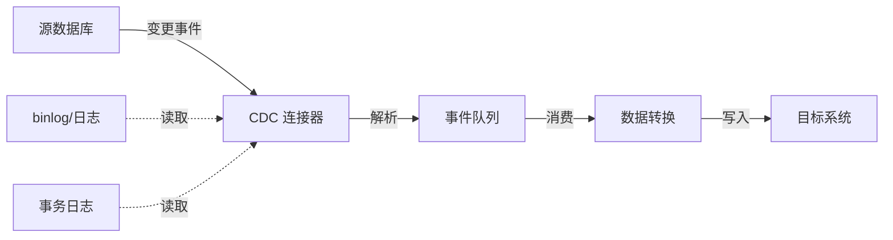
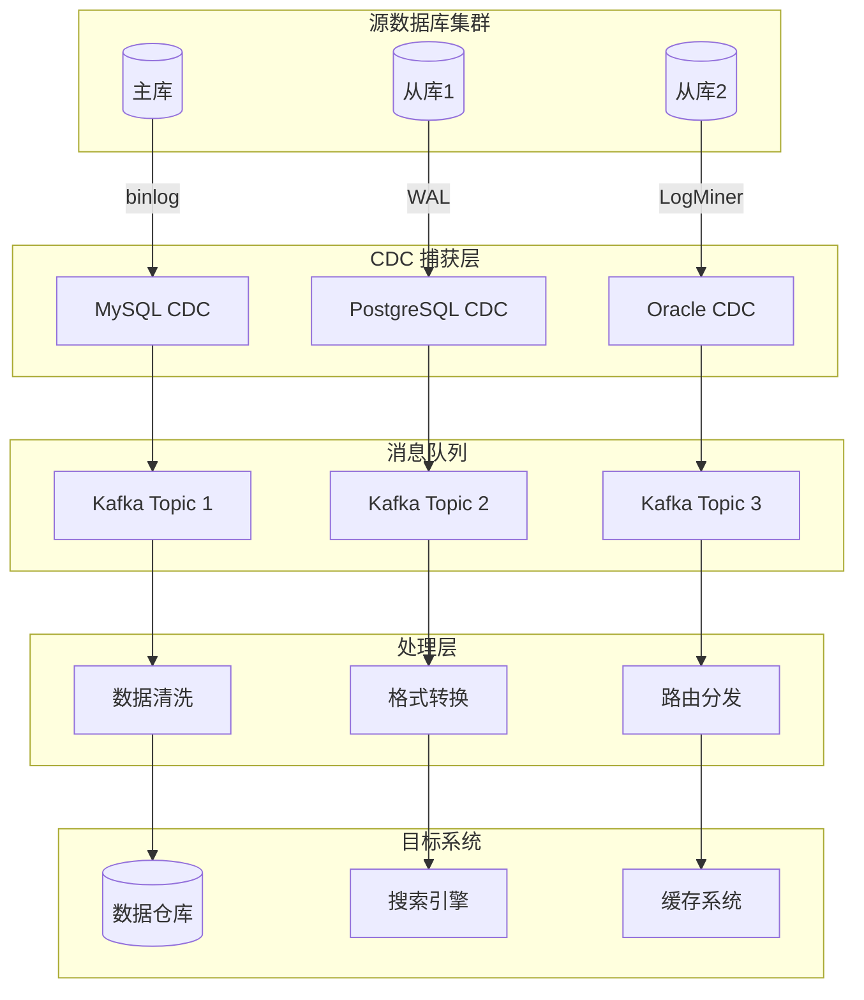

# CDC 实时同步

CDC（Change Data Capture，变更数据捕获）是一种用于实时捕获数据库变更的技术。本文档详细介绍轻易云 DataHub 中 CDC 实时同步的原理、配置方法以及常见问题处理。

## CDC 概述

CDC 技术能够实时捕获数据库中的 INSERT、UPDATE、DELETE 等变更操作，并将这些变更事件流式传输到目标系统，实现数据的实时同步。



### CDC 技术对比

| 技术方案 | 延迟 | 资源占用 | 配置复杂度 | 适用场景 |
|---------|------|---------|-----------|---------|
| 基于日志（binlog/WAL） | 低（毫秒级） | 低 | 中 | 生产环境推荐 |
| 基于触发器 | 中 | 高 | 低 | 简单场景 |
| 基于轮询 | 高（秒级） | 中 | 低 | 不支持日志的场景 |
| 基于 API | 高 | 低 | 低 | 云数据库 |

## MySQL binlog 配置

### 1. 开启 binlog

> [!NOTE]
> MySQL 5.6+ 版本支持基于 GTID 的复制，建议在生产环境启用。

编辑 MySQL 配置文件 `my.cnf`（Linux）或 `my.ini`（Windows）：

```ini
[mysqld]
# 开启 binlog
log_bin = mysql-bin

# binlog 格式，必须为 ROW
binlog_format = ROW

# server_id 必须唯一
server_id = 1

# 保留 binlog 天数
expire_logs_days = 7

# binlog 文件大小
max_binlog_size = 1G

# 开启 GTID（推荐，MySQL 5.6+）
gtid_mode = ON
enforce_gtid_consistency = ON

# 记录完整的行变更信息（MySQL 5.6.2+）
binlog_row_image = FULL
```

### 2. 创建 CDC 专用账户

```sql
-- 创建 CDC 用户
CREATE USER 'cdc_user'@'%' IDENTIFIED BY 'YourStrongPassword';

-- 授予复制权限
GRANT REPLICATION SLAVE, REPLICATION CLIENT ON *.* TO 'cdc_user'@'%';

-- 授予数据读取权限
GRANT SELECT ON your_database.* TO 'cdc_user'@'%';

-- 刷新权限
FLUSH PRIVILEGES;
```

### 3. 验证 binlog 配置

```sql
-- 检查 binlog 是否开启
SHOW VARIABLES LIKE 'log_bin';
SHOW VARIABLES LIKE 'binlog_format';
SHOW VARIABLES LIKE 'binlog_row_image';

-- 查看 binlog 文件列表
SHOW MASTER STATUS;
SHOW BINARY LOGS;

-- 查看 GTID 状态
SHOW VARIABLES LIKE 'gtid_mode';
SHOW VARIABLES LIKE 'enforce_gtid_consistency';
```

### 4. DataHub CDC 配置

```yaml
# DataHub MySQL CDC 配置
cdc_config:
  connector: "mysql-cdc"
  connection:
    host: "localhost"
    port: 3306
    database: "production_db"
    username: "${CDC_USERNAME}"
    password: "${CDC_PASSWORD}"
    
  capture:
    # 使用 GTID 定位（推荐）
    gtid_enabled: true
    # 或指定 binlog 位置
    # binlog_file: "mysql-bin.000001"
    # binlog_pos: 154
    
  tables:
    - name: "orders"
      columns: ["*"]  # 同步所有列
      # 或指定列
      # columns: ["order_id", "customer_id", "amount", "status"]
      
    - name: "order_items"
      columns: ["*"]
      
  options:
    # 心跳间隔（秒）
    heartbeat_interval: 10
    # 批量大小
    batch_size: 1000
    # 失败重试次数
    max_retries: 3
    # 连接超时（毫秒）
    connect_timeout: 30000
```

## PostgreSQL 逻辑复制配置

### 1. 配置 postgresql.conf

```ini
# 开启 WAL 归档
wal_level = logical

# 最大复制槽数
max_replication_slots = 10

# 最大 WAL 发送进程数
max_wal_senders = 10

# WAL 保留大小
wal_keep_size = 1GB

# 最大逻辑复制工作者
max_logical_replication_workers = 4
```

### 2. 配置 pg_hba.conf

```typescript
# TYPE  DATABASE        USER            ADDRESS                 METHOD

# 允许复制连接
host    replication     cdc_user        0.0.0.0/0               md5
host    your_database   cdc_user        0.0.0.0/0               md5
```

### 3. 创建发布和复制槽

```sql
-- 连接目标数据库
\c your_database

-- 创建发布（包含所有表）
CREATE PUBLICATION datahub_publication FOR ALL TABLES;

-- 或创建特定表的发布
-- CREATE PUBLICATION datahub_publication FOR TABLE orders, order_items, customers;

-- 创建复制槽
SELECT * FROM pg_create_logical_replication_slot('datahub_slot', 'pgoutput');

-- 查看复制槽
SELECT * FROM pg_replication_slots;

-- 查看发布
SELECT * FROM pg_publication;
```

### 4. 创建 CDC 用户

```sql
-- 创建专用角色
CREATE ROLE cdc_user WITH LOGIN PASSWORD 'YourStrongPassword';

-- 授予连接权限
GRANT CONNECT ON DATABASE your_database TO cdc_user;

-- 授予 schema 使用权限
GRANT USAGE ON SCHEMA public TO cdc_user;

-- 授予表读取权限
GRANT SELECT ON ALL TABLES IN SCHEMA public TO cdc_user;

-- 授予复制权限
ALTER USER cdc_user WITH REPLICATION;
```

### 5. DataHub PostgreSQL CDC 配置

```yaml
# DataHub PostgreSQL CDC 配置
cdc_config:
  connector: "postgresql-cdc"
  connection:
    host: "localhost"
    port: 5432
    database: "your_database"
    username: "${CDC_USERNAME}"
    password: "${CDC_PASSWORD}"
    
  capture:
    # 发布名称
    publication: "datahub_publication"
    # 复制槽名称
    slot_name: "datahub_slot"
    # 是否创建复制槽（首次运行）
    create_slot: false
    
  tables:
    - schema: "public"
      name: "orders"
      
    - schema: "public"
      name: "order_items"
      
  options:
    # 解码插件
    decoder: "pgoutput"
    # 批量大小
    batch_size: 1000
    # 心跳间隔（秒）
    heartbeat_interval: 10
```

## Oracle LogMiner 配置

### 1. 开启归档日志

```sql
-- 检查归档模式
SELECT log_mode FROM v$database;

-- 开启归档日志（如未开启）
SHUTDOWN IMMEDIATE;
STARTUP MOUNT;
ALTER DATABASE ARCHIVELOG;
ALTER DATABASE OPEN;

-- 验证
ARCHIVE LOG LIST;
```

### 2. 启用补充日志

```sql
-- 数据库级补充日志
ALTER DATABASE ADD SUPPLEMENTAL LOG DATA;

-- 表级标识键日志（推荐）
ALTER TABLE orders ADD SUPPLEMENTAL LOG DATA (ALL) COLUMNS;
ALTER TABLE order_items ADD SUPPLEMENTAL LOG DATA (ALL) COLUMNS;

-- 或仅添加主键日志
-- ALTER TABLE orders ADD SUPPLEMENTAL LOG DATA (PRIMARY KEY) COLUMNS;

-- 验证补充日志
SELECT supplemental_log_data_min FROM v$database;
```

### 3. 创建 CDC 用户

```sql
-- 创建表空间（可选）
CREATE TABLESPACE cdc_ts DATAFILE '/u01/app/oracle/oradata/cdc_ts.dbf' SIZE 100M AUTOEXTEND ON;

-- 创建用户
CREATE USER cdc_user IDENTIFIED BY YourStrongPassword
DEFAULT TABLESPACE cdc_ts
QUOTA UNLIMITED ON cdc_ts;

-- 授予权限
GRANT CREATE SESSION TO cdc_user;
GRANT SELECT ANY TABLE TO cdc_user;
GRANT SELECT ANY TRANSACTION TO cdc_user;
GRANT EXECUTE ON DBMS_LOGMNR TO cdc_user;
GRANT EXECUTE ON DBMS_LOGMNR_D TO cdc_user;
GRANT SELECT ON V_$LOGMNR_CONTENTS TO cdc_user;
GRANT SELECT ON V_$DATABASE TO cdc_user;
GRANT SELECT ON V_$THREAD TO cdc_user;
GRANT SELECT ON V_$PARAMETER TO cdc_user;
GRANT SELECT ON V_$NLS_PARAMETERS TO cdc_user;
GRANT SELECT ON V_$TIMEZONE_NAMES TO cdc_user;
GRANT SELECT ON ALL_INDEXES TO cdc_user;
GRANT SELECT ON ALL_OBJECTS TO cdc_user;
GRANT SELECT ON ALL_USERS TO cdc_user;
GRANT SELECT ON ALL_CATALOG TO cdc_user;
GRANT SELECT ON ALL_CONSTRAINTS TO cdc_user;
GRANT SELECT ON ALL_CONS_COLUMNS TO cdc_user;
GRANT SELECT ON ALL_TAB_COLS TO cdc_user;
GRANT SELECT ON ALL_IND_COLUMNS TO cdc_user;
GRANT SELECT ON ALL_ENCRYPTED_COLUMNS TO cdc_user;
GRANT SELECT ON ALL_LOG_GROUPS TO cdc_user;
GRANT SELECT ON ALL_TAB_PARTITIONS TO cdc_user;
GRANT SELECT ON DBA_REGISTRY TO cdc_user;
GRANT SELECT ON DBA_TABLESPACES TO cdc_user;
GRANT SELECT ON DBA_OBJECTS TO cdc_user;
GRANT SELECT ON SYS.DBA_LOGMNR_LOG TO cdc_user;
```

### 4. DataHub Oracle CDC 配置

```yaml
# DataHub Oracle CDC 配置
cdc_config:
  connector: "oracle-cdc"
  connection:
    host: "localhost"
    port: 1521
    database: "ORCL"
    username: "${CDC_USERNAME}"
    password: "${CDC_PASSWORD}"
    
  capture:
    # 使用 LogMiner
    method: "logminer"
    # 或使用 XStream（需要 GoldenGate 许可）
    # method: "xstream"
    
  tables:
    - schema: "PRODUCTION"
      name: "ORDERS"
      
    - schema: "PRODUCTION"
      name: "ORDER_ITEMS"
      
  options:
    # 读取间隔（毫秒）
    poll_interval: 1000
    # 事务缓冲区大小
    transaction_buffer_size: 10000
    # 日志保留时间（小时）
    log_retention_hours: 24
    # SCN 起始位置（可选）
    # start_scn: 1234567890
```

## 实时同步架构



### 数据流说明

| 阶段 | 组件 | 职责 | 关键指标 |
|-----|------|------|---------|
| 捕获 | CDC 连接器 | 读取数据库日志 | 延迟 < 1s |
| 传输 | 消息队列 | 事件缓冲和分发 | 吞吐量 > 10K/s |
| 处理 | 流处理引擎 | 数据转换和路由 | 处理延迟 < 100ms |
| 写入 | 目标连接器 | 数据持久化 | 写入 QPS > 5K |

## 常见问题处理

### 1. binlog 被清理导致同步中断

**问题现象**：
```text
ERROR: binlog file mysql-bin.000123 not found
```

**解决方案**：

```sql
-- 1. 检查 binlog 保留策略
SHOW VARIABLES LIKE 'expire_logs_days';

-- 2. 增加保留时间（临时）
SET GLOBAL expire_logs_days = 7;

-- 3. 修改配置文件永久生效
-- expire_logs_days = 7

-- 4. DataHub 重新定位同步点
-- 使用 GTID 模式自动恢复
-- 或手动指定新的 binlog 位置
```

> [!TIP]
> 建议启用 GTID 模式，即使 binlog 被清理也能通过 GTID 自动定位同步点。

### 2. 大事务导致内存溢出

**问题现象**：CDC 进程内存持续增长，最终 OOM。

**解决方案**：

```yaml
# DataHub 大事务处理配置
cdc_config:
  options:
    # 启用大事务拆分
    split_large_transactions: true
    # 单事务最大事件数
    max_events_per_transaction: 10000
    # 内存缓冲区限制（MB）
    buffer_memory_limit: 512
    # 溢出到磁盘
    spill_to_disk: true
    spill_dir: "/tmp/cdc_spill"
```

### 3. DDL 变更处理

**问题现象**：表结构变更后 CDC 同步失败。

```yaml
# DDL 处理配置
cdc_config:
  options:
    # DDL 处理策略
    ddl_policy: "auto_sync"  # auto_sync, ignore, stop
    # 自动同步表结构
    auto_sync_schema: true
    # DDL 变更通知
    ddl_notification: true
    notification_webhook: "https://your-webhook.com/ddl-alert"
```

### 4. 时区问题

**问题现象**：时间字段同步后出现时区偏移。

```yaml
# 时区配置
cdc_config:
  connection:
    # 数据库时区
    server_timezone: "Asia/Shanghai"
    
  options:
    # 时间转换策略
    time_conversion: "normalize_to_utc"  # normalize_to_utc, keep_original
    # 输出时区
    target_timezone: "Asia/Shanghai"
```

### 5. 主从延迟问题

**问题现象**：从库 CDC 读取的数据有延迟。

```sql
-- 检查主从延迟
SHOW SLAVE STATUS\G
-- 查看 Seconds_Behind_Master

-- 检查主库 binlog 位置
SHOW MASTER STATUS;

-- 检查从库执行位置
SHOW SLAVE STATUS;
```

**优化建议**：
- 优先从主库读取 CDC（如果资源允许）
- 监控 Seconds_Behind_Master 指标
- 配置延迟告警阈值

### 6. 字符集问题

```yaml
# 字符集配置
cdc_config:
  connection:
    # 连接字符集
    charset: "utf8mb4"
    
  options:
    # 字符集转换
    charset_conversion: true
    # 源字符集
    source_charset: "utf8mb4"
    # 目标字符集
    target_charset: "utf8mb4"
```

## 监控告警配置

```yaml
# 监控配置
monitoring:
  metrics:
    # 延迟监控（秒）
    lag_seconds:
      warning: 10
      critical: 60
      
    # 吞吐量监控（每秒事件数）
    throughput:
      warning: < 1000
      
    # 错误率监控
    error_rate:
      warning: 1%
      critical: 5%
      
  alerts:
    channels:
      - type: "email"
        recipients: ["ops@example.com"]
      - type: "webhook"
        url: "https://alerts.example.com/webhook"
        
    rules:
      - name: "cdc_lag_high"
        condition: "lag_seconds > 60"
        severity: "critical"
        
      - name: "cdc_error_spike"
        condition: "error_rate > 5%"
        severity: "critical"
```

通过以上配置和最佳实践，您可以构建稳定、高效的 CDC 实时同步系统，实现数据的准实时集成。
