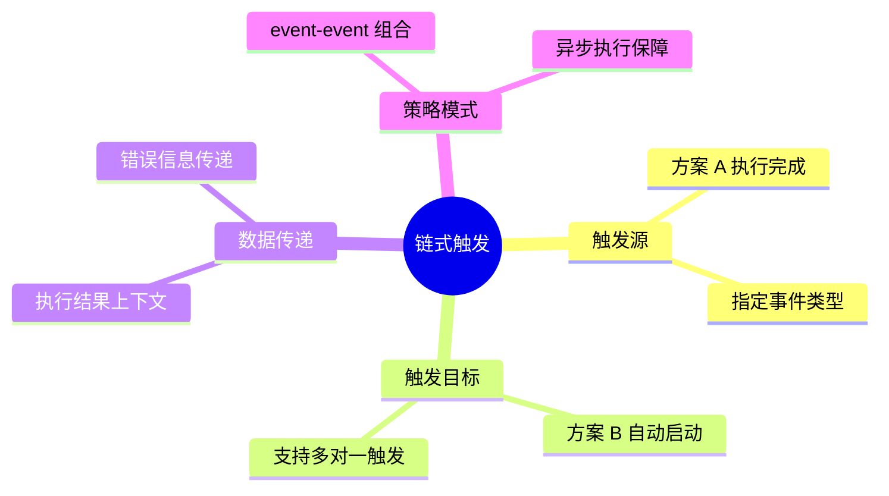
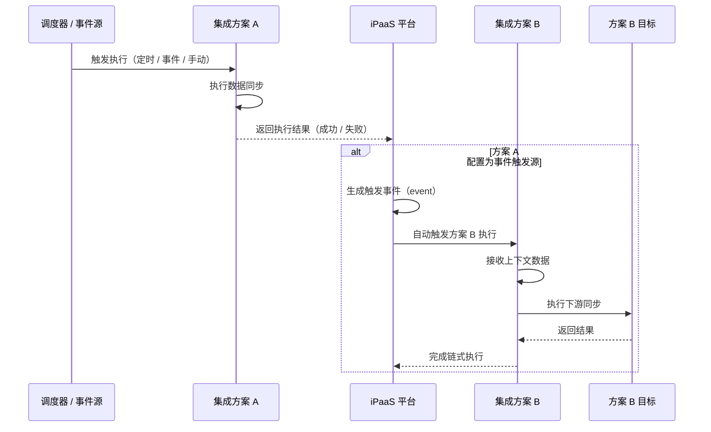
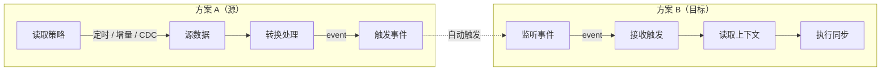
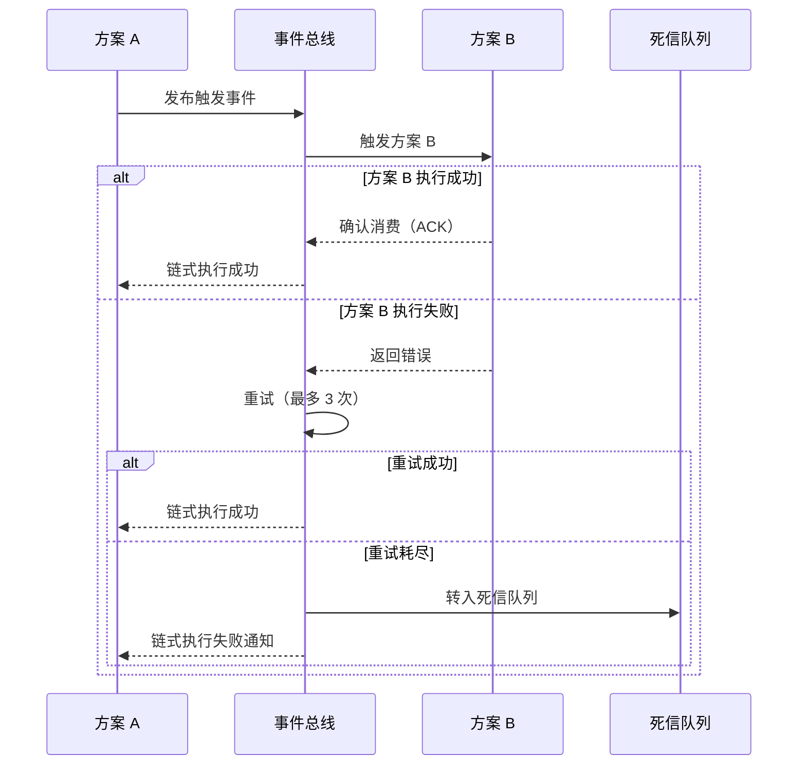
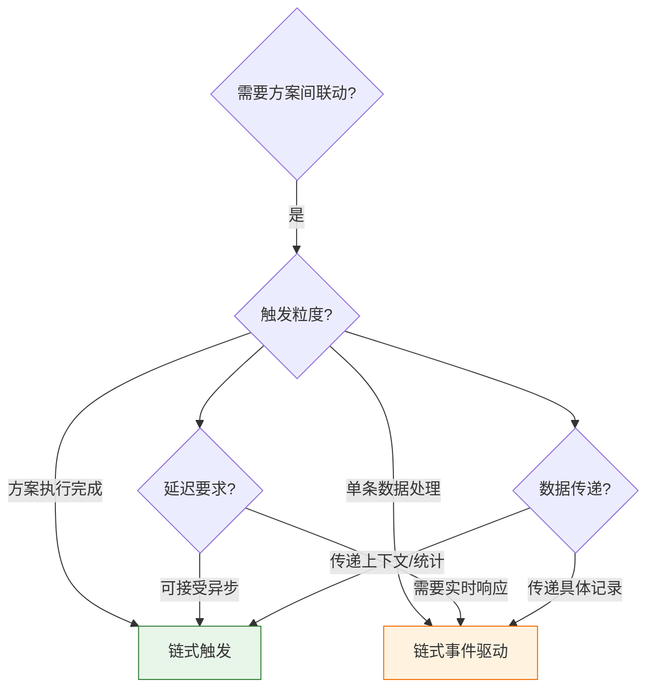
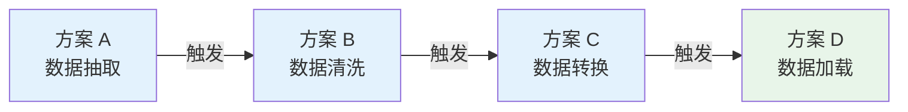
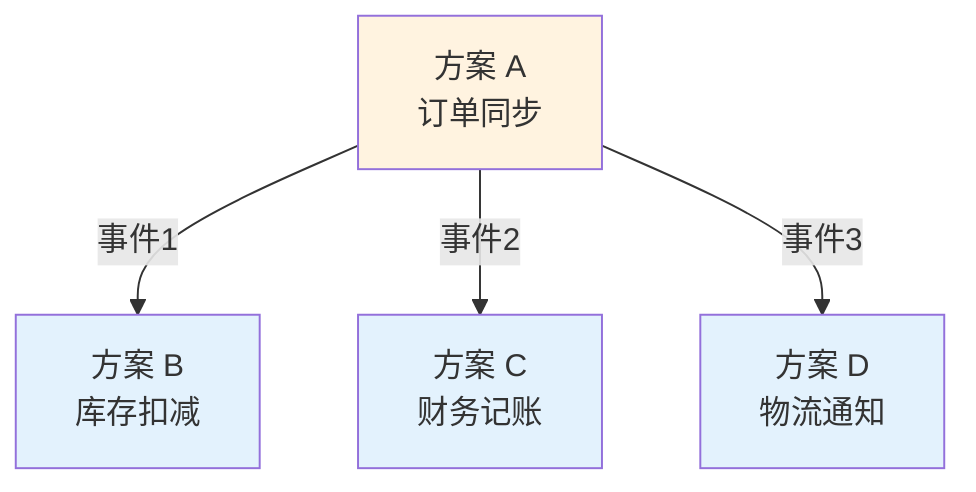
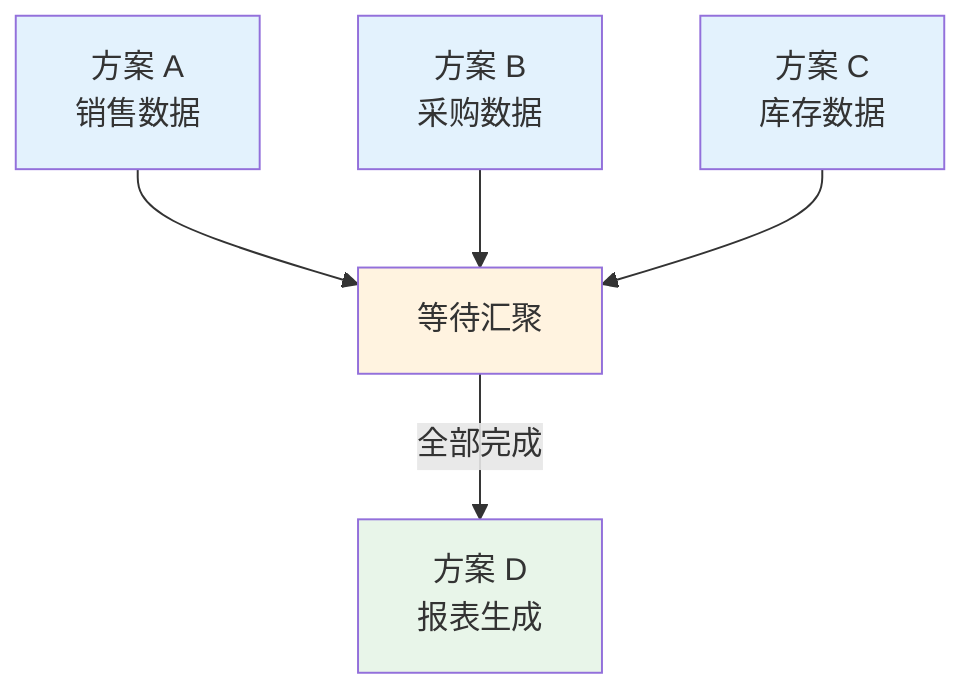
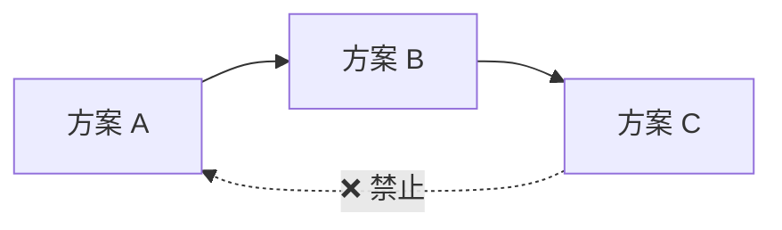
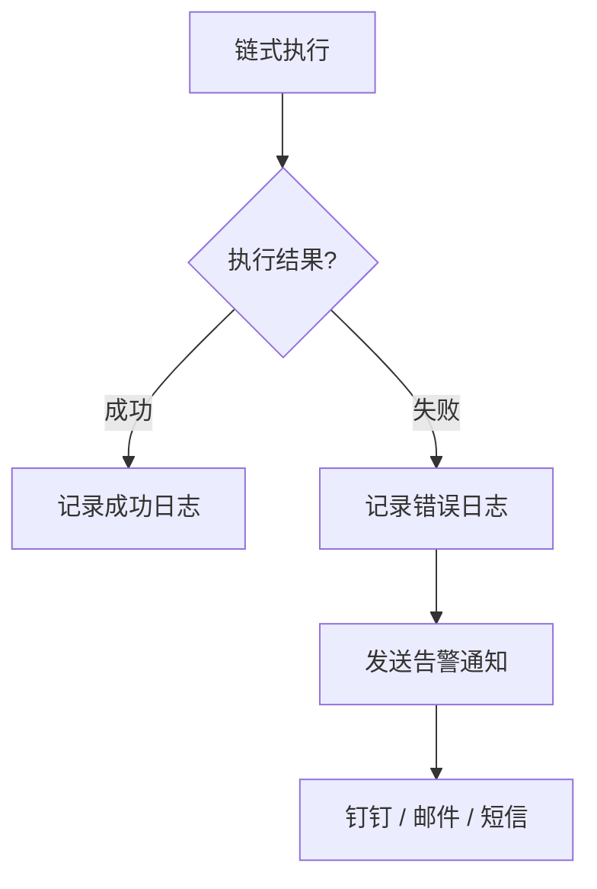

# 链式触发集成方案

链式触发是轻易云 iPaaS 平台提供的一种高级集成能力，允许将一个集成方案（方案 A）的执行结果作为触发条件，自动激活另一个集成方案（方案 B）的执行。这种机制实现了多方案之间的无缝衔接，构建复杂的数据处理流水线，无需人工干预即可完成多步骤的业务流程自动化。

> [!NOTE]
> 链式触发与[集成策略模式](./integration-strategy)中的事件驱动模式密切相关，但专注于方案间的级联执行场景。

## 核心概念



### 链式触发的工作流程



## 配置方法

### 步骤一：配置方案 A（触发源）

在方案 A 的目标平台配置中，设置策略模式为事件触发（`event`），并指定要触发的目标方案：

```json
{
  "source": {
    "api": "orders.query",
    "type": "QUERY",
    "method": "POST",
    "params": {
      "status": "confirmed",
      "start_time": "{{LAST_SYNC_TIME}}"
    }
  },
  "target": {
    "type": "EVENT",
    "eventName": "order_sync_completed",
    "strategy": "event",
    "triggerConfig": {
      "targetPlanId": "plan_b_uuid",
      "triggerOn": "success",
      "passContext": true
    }
  }
}
```

配置参数说明：

| 参数 | 类型 | 必填 | 说明 |
| ---- | ---- | ---- | ---- |
| `type` | string | ✅ | 固定值为 `EVENT`，表示事件触发模式 |
| `eventName` | string | ✅ | 自定义事件名称，用于标识本次触发 |
| `strategy` | string | ✅ | 策略模式，设置为 `event` |
| `triggerConfig.targetPlanId` | string | ✅ | 要触发的目标方案 ID |
| `triggerConfig.triggerOn` | enum | — | 触发条件：`success`（成功时）、`always`（总是触发）、`failure`（失败时触发），默认 `success` |
| `triggerConfig.passContext` | boolean | — | 是否传递执行上下文，默认 `true` |

### 步骤二：配置方案 B（触发目标）

在方案 B 的源平台配置中，设置监听指定的事件：

```json
{
  "source": {
    "type": "EVENT",
    "strategy": "event",
    "listenEvent": "order_sync_completed",
    "eventSource": "plan_a_uuid",
    "contextMapping": {
      "orderIds": "{{context.syncedIds}}",
      "syncTime": "{{context.syncTime}}",
      "recordCount": "{{context.recordCount}}"
    }
  },
  "target": {
    "api": "inventory.deduct",
    "type": "UPDATE",
    "method": "POST"
  }
}
```

配置参数说明：

| 参数 | 类型 | 必填 | 说明 |
| ---- | ---- | ---- | ---- |
| `type` | string | ✅ | 固定值为 `EVENT`，表示事件监听模式 |
| `strategy` | string | ✅ | 策略模式，设置为 `event` |
| `listenEvent` | string | ✅ | 要监听的事件名称，需与方案 A 的 `eventName` 一致 |
| `eventSource` | string | — | 指定事件来源方案 ID，不指定则监听所有同名事件 |
| `contextMapping` | object | — | 上下文数据映射，将上游数据映射到当前方案变量 |

### 步骤三：配置 event-event 策略模式

确保两个方案的策略模式组合为 `event-event`：



## 触发条件设置

### 触发时机控制

方案 A 可以通过 `triggerOn` 参数精确控制触发时机：

| 触发条件 | 说明 | 适用场景 |
| -------- | ---- | -------- |
| `success` | 方案 A 成功完成后触发 | 确保数据已成功同步后再执行下游 |
| `failure` | 方案 A 执行失败时触发 | 失败通知、错误处理、补偿机制 |
| `always` | 无论成功或失败都触发 | 日志记录、状态更新、监控上报 |
| `conditional` | 满足特定条件时触发 | 根据数据内容决定是否触发 |

### 条件触发配置示例

```json
{
  "target": {
    "type": "EVENT",
    "eventName": "conditional_trigger",
    "strategy": "event",
    "triggerConfig": {
      "targetPlanId": "plan_c_uuid",
      "triggerOn": "conditional",
      "condition": {
        "field": "recordCount",
        "operator": ">",
        "value": 0
      }
    }
  }
}
```

上述配置表示：仅当方案 A 同步的记录数大于 0 时，才触发方案 C。

### 批量触发与延迟触发

```json
{
  "target": {
    "type": "EVENT",
    "eventName": "batch_trigger",
    "strategy": "event",
    "triggerConfig": {
      "targetPlanId": "plan_d_uuid",
      "batchTrigger": {
        "enabled": true,
        "accumulateWindow": 300,
        "maxBatchSize": 100
      },
      "delayTrigger": {
        "enabled": true,
        "delaySeconds": 60
      }
    }
  }
}
```

| 参数 | 说明 |
| ---- | ---- |
| `batchTrigger.enabled` | 启用批量触发，累积多次事件后统一触发 |
| `batchTrigger.accumulateWindow` | 累积窗口时间（秒） |
| `batchTrigger.maxBatchSize` | 最大批处理数量 |
| `delayTrigger.enabled` | 启用延迟触发 |
| `delayTrigger.delaySeconds` | 延迟触发时间（秒） |

## 错误传递处理

### 错误传播机制



### 错误处理配置

方案 B 可以配置错误处理策略，决定是否将错误向上游传递：

```json
{
  "source": {
    "type": "EVENT",
    "strategy": "event",
    "listenEvent": "upstream_event",
    "errorHandling": {
      "propagateError": true,
      "fallbackAction": "notify",
      "retryPolicy": {
        "maxRetries": 3,
        "retryInterval": 30,
        "backoffMultiplier": 2
      }
    }
  }
}
```

| 参数 | 类型 | 说明 |
| ---- | ---- | ---- |
| `propagateError` | boolean | 是否将错误传递给上游方案 |
| `fallbackAction` | enum | 失败时的回退动作：`notify`（通知）、`skip`（跳过）、`abort`（中止链式执行） |
| `retryPolicy.maxRetries` | number | 最大重试次数 |
| `retryPolicy.retryInterval` | number | 重试间隔（秒） |
| `retryPolicy.backoffMultiplier` | number | 退避倍数 |

### 错误上下文传递

当链式执行失败时，错误信息会包含完整的执行上下文：

```json
{
  "chainExecutionId": "chain_abc123",
  "triggerSource": {
    "planId": "plan_a_uuid",
    "planName": "订单同步方案",
    "executionId": "exec_xxx",
    "eventName": "order_sync_completed"
  },
  "currentStep": {
    "planId": "plan_b_uuid",
    "planName": "库存扣减方案",
    "executionId": "exec_yyy",
    "status": "failed"
  },
  "error": {
    "code": "INVENTORY_INSUFFICIENT",
    "message": "库存不足，无法扣减",
    "details": {
      "productId": "SKU001",
      "requestedQty": 100,
      "availableQty": 50
    }
  },
  "context": {
    "syncedIds": ["ORD001", "ORD002"],
    "syncTime": "2026-03-13T10:30:00Z"
  }
}
```

## 与链式事件驱动的区别

链式触发与链式事件驱动虽然都涉及方案间的联动，但在实现机制和应用场景上有本质区别：

| 对比维度 | 链式触发（方案级） | 链式事件驱动（数据级） |
| -------- | ------------------ | ---------------------- |
| **触发粒度** | 方案执行完成后触发 | 单条数据处理完成后触发 |
| **触发源** | 方案 A 的整体执行结果 | 方案 A 中的某条具体数据 |
| **数据传递** | 传递执行上下文和统计信息 | 传递具体的数据记录 |
| **执行方式** | 异步触发，独立执行 | 同步或异步，通常在同一会话中 |
| **适用场景** | 多阶段业务流程、流水线 | 实时数据联动、即时响应 |
| **配置位置** | 目标平台配置 | 数据映射或转换配置 |
| **错误隔离** | 方案级隔离，独立重试 | 记录级隔离，单条失败不影响其他 |

### 链式事件驱动配置示例

对比链式触发，链式事件驱动通常配置在数据映射层：

```json
{
  "mappings": [
    {
      "source": "order_id",
      "target": "orderId"
    },
    {
      "source": "status",
      "target": "orderStatus",
      "transform": {
        "type": "chain_event",
        "trigger": {
          "condition": "{{status}} === 'paid'",
          "targetPlanId": "inventory_plan",
          "passData": {
            "orderId": "{{order_id}}",
            "items": "{{order_items}}"
          }
        }
      }
    }
  ]
}
```

### 如何选择



| 选择链式触发 | 选择链式事件驱动 |
| ------------ | ---------------- |
| 订单同步完成后触发库存扣减 | 订单状态变更时实时更新库存 |
| 全量数据清洗后触发数据分析 | 单条记录验证失败时触发通知 |
| 数据抽取完成后触发多维度转换 | 订单支付成功时实时发送短信 |

## 多方案级联配置

### 流水线模式

支持多个方案串联形成处理流水线：



配置要点：
- 每个方案的目标平台配置 `type: "EVENT"`
- 下一个方案的源平台配置 `type: "EVENT"` 并监听上一个方案的事件
- 建议设置统一的 `eventName` 命名规范，如 `pipeline_stage_{n}`

### 分支触发模式

一个方案完成后可以同时触发多个下游方案：



配置示例：

```json
{
  "target": {
    "type": "EVENT",
    "strategy": "event",
    "multiTrigger": [
      {
        "eventName": "trigger_inventory",
        "targetPlanId": "plan_b_uuid",
        "condition": "{{hasPhysicalGoods}} === true"
      },
      {
        "eventName": "trigger_finance",
        "targetPlanId": "plan_c_uuid",
        "condition": "{{orderAmount}} > 0"
      },
      {
        "eventName": "trigger_logistics",
        "targetPlanId": "plan_d_uuid",
        "condition": "{{shippingMethod}} !== 'virtual'"
      }
    ]
  }
}
```

### 汇聚模式

多个上游方案完成后触发一个下游方案：



汇聚触发配置：

```json
{
  "source": {
    "type": "EVENT",
    "strategy": "event",
    "listenEvent": "data_ready",
    "convergence": {
      "enabled": true,
      "requiredSources": ["plan_a_uuid", "plan_b_uuid", "plan_c_uuid"],
      "waitTimeout": 3600,
      "aggregationMode": "merge_context"
    }
  }
}
```

## 最佳实践

### 1. 事件命名规范

采用统一的命名规范，便于管理和排查：

```json
{业务域}_{动作}_{阶段}

示例：
- order_sync_completed    // 订单同步完成
- inventory_deduct_failed // 库存扣减失败
- report_generate_ready   // 报表生成就绪
```

### 2. 避免循环触发



> [!CAUTION]
> 链式触发必须避免形成循环依赖，否则将导致无限循环执行。平台会自动检测并阻断循环触发，但建议在配置时主动规避。

### 3. 设置合理的超时时间

```json
{
  "target": {
    "type": "EVENT",
    "strategy": "event",
    "triggerConfig": {
      "targetPlanId": "plan_b_uuid",
      "timeout": {
        "executionTimeout": 300,
        "waitForCompletion": true
      }
    }
  }
}
```

### 4. 监控与告警



关键监控指标：

| 指标 | 说明 | 建议阈值 |
| ---- | ---- | -------- |
| 链式执行成功率 | 链式触发成功完成的比例 | > 99% |
| 平均链式执行时间 | 从方案 A 到方案 B 完成的平均耗时 | 视业务而定 |
| 链式深度 | 级联执行的方案数量 | 建议不超过 5 层 |
| 死信队列积压 | 失败未处理的事件数量 | < 100 |

### 5. 幂等性设计

确保下游方案具备幂等处理能力，防止重复触发导致数据异常：

```json
{
  "target": {
    "api": "inventory.deduct",
    "type": "UPDATE",
    "idempotent": {
      "enabled": true,
      "keyField": "requestId",
      "expireTime": 86400
    }
  }
}
```

## 常见问题

### Q: 方案 A 触发方案 B 后，如何查看执行关联？

在**集成日志**页面，可以通过 `chainExecutionId` 字段查看同一链式执行的所有方案日志。系统会自动将关联的执行记录标记为同一条链。

### Q: 方案 B 执行失败会影响方案 A 的状态吗？

取决于 `triggerConfig.triggerOn` 和方案 B 的 `errorHandling.propagateError` 配置：
- 如果 `propagateError: true`，方案 A 的执行状态会标记为部分成功或失败
- 如果 `propagateError: false`，方案 A 标记为成功，方案 B 的失败独立记录

### Q: 如何临时禁用链式触发？

方式一：在方案 A 的目标平台配置中，将 `type` 从 `EVENT` 改为 `ASYNC`

方式二：在方案 B 的源平台配置中，添加 `enabled: false`：

```json
{
  "source": {
    "type": "EVENT",
    "enabled": false
  }
}
```

### Q: 链式触发支持跨工作空间吗？

支持。在 `triggerConfig.targetPlanId` 中指定完整方案 ID，格式为 `{workspaceId}:{planId}`：

```json
{
  "triggerConfig": {
    "targetPlanId": "ws_abc123:plan_b_uuid"
  }
}
```

> [!IMPORTANT]
> 跨工作空间触发需要目标方案所在工作空间的授权，且会记录跨空间调用日志。

### Q: 链式执行过程中可以人工干预吗？

可以。在**任务调度**页面，找到链式执行记录，可以执行以下操作：
- **暂停**：暂停后续方案的触发
- **跳过**：跳过当前失败的方案，继续执行下游
- **重试**：重新执行失败的方案
- **终止**：终止整个链式执行

## 相关文档

- [集成策略模式](./integration-strategy) — 深入了解各种策略模式的配置与使用
- [CDC 实时同步](./cdc-realtime) — 实现基于数据库日志的实时触发
- [异常处理机制](./error-handling) — 设计完善的错误处理与恢复策略
- [性能优化](./performance-tuning) — 优化链式执行的性能表现
- [源平台配置](../guide/source-platform-config) — 详细的源端配置指南
- [目标平台配置](../guide/target-platform-config) — 详细的目标端配置指南
