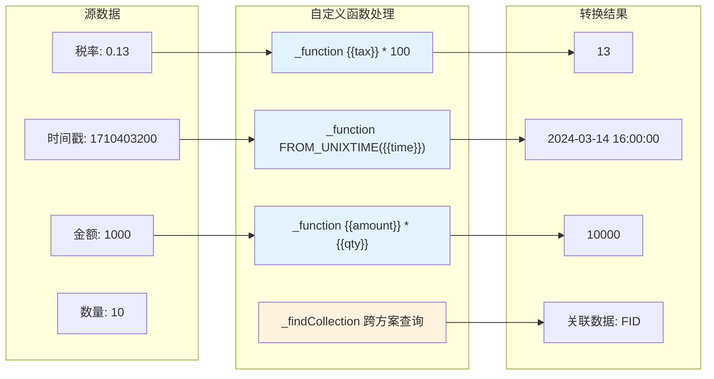
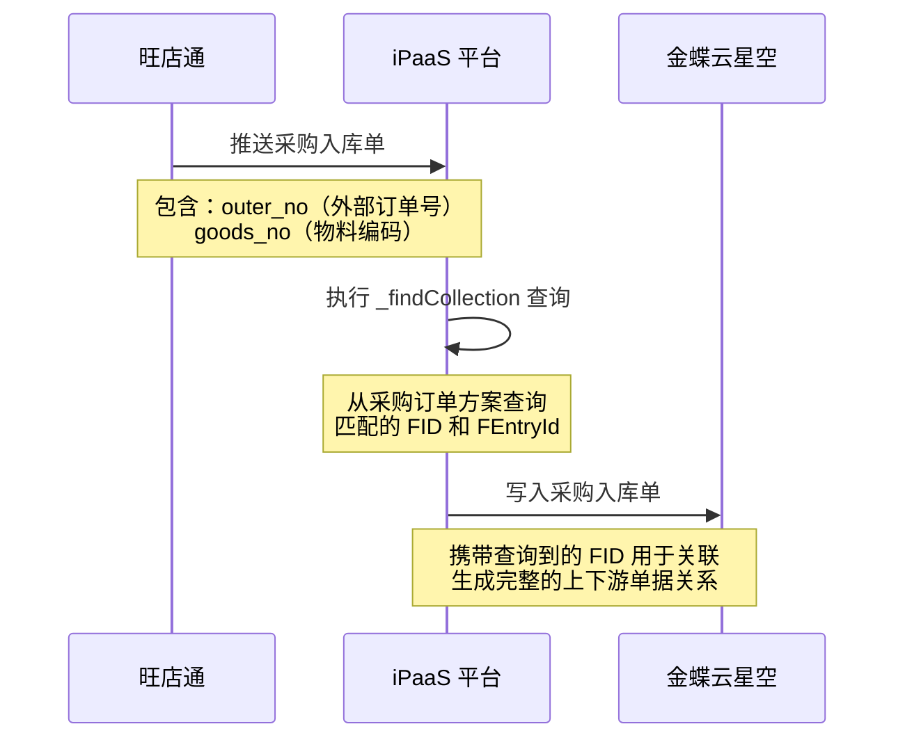

# 自定义函数

自定义函数是轻易云 iPaaS 平台提供的高级数据处理能力，允许你在数据映射过程中使用 JavaScript 表达式和 MySQL 函数语法实现复杂的数据转换逻辑。通过 `_function` 前缀表达式和 `_findCollection` 跨方案查询，你可以完成数值计算、条件判断、时间转换、数据关联等高级操作，无需编写完整的脚本代码即可应对复杂的业务场景。

---

## 概述

在数据集成过程中，简单的字段映射往往无法满足复杂的业务需求。例如：

- 税率字段需要在源值基础上乘以 100 进行单位转换
- 需要根据条件动态选择不同的字段值
- 需要将时间戳转换为特定格式的日期字符串
- 需要从其他集成方案中查询关联数据进行匹配

自定义函数功能提供了一套轻量级的表达式引擎，支持类 MySQL 的函数语法和跨方案数据查询，帮助你快速实现上述场景。



### 自定义函数类型

| 函数类型 | 前缀 | 适用场景 | 复杂度 |
|---------|------|---------|--------|
| **表达式函数** | `_function` | 数值计算、日期转换、条件判断 | 低 |
| **聚合函数** | `_function` | 求和、平均值、最大最小值 | 中 |
| **跨方案查询** | `_findCollection` | 从其他方案查询关联数据 | 中 |

### 与自定义脚本的区别

| 特性 | 自定义函数 | 自定义脚本 |
|------|-----------|-----------|
| **编写方式** | 表达式前缀 | 完整 JavaScript/Python 代码 |
| **适用场景** | 单行字段转换 | 复杂逻辑处理、多步骤运算 |
| **执行性能** | 高（原生执行） | 中等（脚本引擎解释执行） |
| **学习成本** | 低（类 SQL 语法） | 中（需要编程基础） |

> [!TIP]
> 对于简单的数据转换，优先使用自定义函数；对于复杂的多步骤逻辑，请使用[自定义脚本](./custom-scripts)。

---

## 表达式函数

表达式函数通过 `_function` 前缀声明，支持 MySQL 函数语法和基本的数学运算。

### 基本语法规则

```sql
_function {表达式内容}
```

**语法要求**：

| 规则 | 说明 | 示例 |
|------|------|------|
| 前缀格式 | 必须以下划线开头，前缀后紧跟一个空格 | `_function {{field}} + 1` ✅ |
| 空格要求 | 前缀后必须有一个英文空格作为分隔 | `_function{{field}}` ❌ |
| 变量引用 | 使用 `{{字段名}}` 引用源数据字段 | `{{details_list.tax}}` |
| 错误处理 | 表达式执行出错时，原样返回表达式文本 | 除零错误时返回原始表达式 |

> [!WARNING]
> 前缀文本开头不要有空格，结尾使用空格以保障可读性。如果表达式出现计算错误（如除以零），文本会原样返回。

---

### 数值计算

支持基本的数学运算符和常用数学函数。

#### 基本运算

| 运算符 | 说明 | 示例 |
|--------|------|------|
| `+` | 加法 | `_function {{price}} + {{tax}}` |
| `-` | 减法 | `_function {{amount}} - {{discount}}` |
| `*` | 乘法 | `_function {{qty}} * {{unit_price}}` |
| `/` | 除法 | `_function {{total}} / {{qty}}` |
| `%` | 取模 | `_function {{num}} % 2` |

#### 单位转换示例

**场景**：将旺店通的税率值（0.13）转换为金蝶的税率值（13）。

```sql
_function {{details_list.tax}} * 100
```

**输入输出示例**：

| 源数据 | 表达式 | 结果 |
|--------|--------|------|
| `0.13` | `_function {{tax}} * 100` | `13` |
| `0.06` | `_function {{tax}} * 100` | `6` |

---

### 日期时间函数

支持 MySQL 风格的日期时间转换函数。

#### FROM_UNIXTIME：时间戳转日期

将 Unix 时间戳转换为指定格式的日期字符串。

**语法**：

```sql
_function FROM_UNIXTIME({{时间戳字段}}, '格式字符串')
```

**常用格式符**：

| 格式符 | 说明 | 示例 |
|--------|------|------|
| `%Y` | 四位年份 | 2024 |
| `%m` | 两位月份 | 03 |
| `%d` | 两位日期 | 14 |
| `%H` | 两位小时（24小时制） | 16 |
| `%i` | 两位分钟 | 30 |
| `%s` | 两位秒 | 00 |

#### 时间偏移计算

**场景**：获取上次同步时间前 10 分钟的格式化时间。

```sql
_function FROM_UNIXTIME({{LAST_SYNC_TIME}} - 600, '%Y-%m-%d %H:%i:%s')
```

> [!NOTE]
> 600 秒 = 10 分钟，通过时间戳减法实现时间偏移。

**输入输出示例**：

| LAST_SYNC_TIME | 表达式 | 结果 |
|----------------|--------|------|
| `1710403200` | `_function FROM_UNIXTIME({{LAST_SYNC_TIME}} - 600, '%Y-%m-%d %H:%i:%s')` | `2024-03-14 15:50:00` |

---

### 条件判断函数

支持 `CASE WHEN THEN` 条件表达式，实现复杂的分支逻辑。

#### 基本 CASE 语法

```sql
_function CASE {表达式}
    WHEN {值1} THEN {结果1}
    WHEN {值2} THEN {结果2}
    ELSE {默认结果}
END
```

#### 简单条件判断

**场景**：根据组织 ID 返回不同的计算结果。

```sql
_function CASE '{{FOrgId}}' 
    WHEN '100' THEN {{price}} * {{qty}} 
    WHEN '200' THEN '201' 
    ELSE '{{FOrgId}}' 
END
```

**逻辑说明**：
- 当 `FOrgId` 等于 `100` 时，返回 `price * qty` 的计算结果
- 当 `FOrgId` 等于 `200` 时，返回固定值 `201`
- 其他情况返回 `FOrgId` 的原值

#### 复杂条件判断

**场景**：根据字段前缀匹配返回不同结果。

```sql
_function CASE LEFT('{{单据编号}}', 2)
    WHEN 'AD' THEN 100
    WHEN 'BB' THEN 101
    WHEN 'GG' THEN 102
    WHEN 'EE' THEN 103
    ELSE 103
END
```

#### 包含判断（LOCATE）

**场景**：检查字段是否包含特定文本，返回对应字段值。

```sql
_function CASE LOCATE('检索文本', '{{检索的字段}}')
    WHEN 0 THEN '{{不匹配时字段A}}'
    ELSE '{{匹配时的字段}}'
END
```

> [!NOTE]
> `LOCATE(substr, str)` 函数返回子串在字符串中的位置，返回 0 表示未找到。

---

### 聚合函数

支持对数组字段进行聚合计算。

#### 支持的聚合函数

| 函数 | 说明 | 示例 |
|------|------|------|
| `SUM()` | 求和 | `_function SUM({{details_list.qty}})` |
| `AVG()` | 平均值 | `_function AVG({{details_list.price}})` |
| `MAX()` | 最大值 | `_function MAX({{details_list.amount}})` |
| `MIN()` | 最小值 | `_function MIN({{details_list.discount}})` |
| `COUNT()` | 计数 | `_function COUNT({{details_list}})` |

#### 使用示例

**场景**：计算订单明细的总数量。

```sql
_function SUM({{details_list.qty}})
```

**输入数据**：

```json
{
  "details_list": [
    {"qty": 10},
    {"qty": 20},
    {"qty": 30}
  ]
}
```

**输出结果**：`60`

---

## 跨方案数据查询

`_findCollection` 函数允许你从其他集成方案中查询关联数据，实现跨方案的数据关联和匹配。

### 适用场景

| 场景 | 说明 | 示例 |
|------|------|------|
| **关联单据查询** | 从采购订单方案查询 FID，用于入库单关联 | 旺店通入库单关联金蝶采购订单 |
| **基础资料匹配** | 查询其他方案同步的基础资料编码映射 | 查询客户编码对应关系 |
| **历史数据追溯** | 查询之前同步方案生成的目标系统 ID | 查询已同步单据的目标 ID |

### 语法结构

```sql
_findCollection find {查询字段} from {方案ID} where {条件1} {条件2} ...
```

### 参数详解

| 部分 | 说明 | 示例 |
|------|------|------|
| `_findCollection` | 声明前缀，必须位于开头 | `_findCollection` |
| `find` | 关键字，声明查询操作 | `find` |
| `{查询字段}` | 需要从目标方案返回的字段名 | `FPOOrderEntry_FEntryId` |
| `from` | 关键字，分隔查询字段和方案 ID | `from` |
| `{方案ID}` | 目标集成方案的唯一标识（UUID） | `8e620793-bebb-3167-95a4-9030368e5262` |
| `where` | 关键字，声明查询条件开始 | `where` |
| `{条件}` | 查询条件，格式为 `字段名={{变量}}` | `FBillNo={{outer_no}}` |

### 完整示例

**场景**：旺店通采购入库单关联金蝶采购订单，需要获取金蝶的 FID 和分录 ID。

```sql
_findCollection find FPOOrderEntry_FEntryId from 8e620793-bebb-3167-95a4-9030368e5262 where FBillNo={{outer_no}} FMaterialId_FNumber={{details_list.goods_no}}
```

**语法分解**：

```sql
_findCollection                    -- 查询声明前缀
find                               -- 查询关键字
FPOOrderEntry_FEntryId            -- 要查询的字段（金蝶采购订单分录 ID）
from                               -- 分隔关键字
8e620793-bebb-3167-95a4-9030368e5262  -- 采购订单同步方案的 ID
where                              -- 条件关键字
FBillNo={{outer_no}}              -- 条件1：单据编号匹配（旺店通外部单号 = 金蝶单据编号）
FMaterialId_FNumber={{details_list.goods_no}}  -- 条件2：物料编码匹配
```

> [!IMPORTANT]
> 语法中每一段的分隔都必须是一个英文空格，多个条件之间也是用空格分隔，它们是 `AND` 关系，不需要额外增加 `AND` 关键字。

### 使用场景示例



### 获取方案 ID

方案 ID 可以在集成方案详情页面获取：

1. 进入**集成方案**管理页面
2. 找到目标方案，点击进入详情
3. 在浏览器地址栏或方案信息卡片中查看 UUID

> [!TIP]
> 方案 ID 是全局唯一的 UUID 格式字符串，如 `8e620793-bebb-3167-95a4-9030368e5262`。

---

## 与字段格式化和解析器配合使用

自定义函数通常与[字段格式化](../guide/value-formatting)和[解析器](./parser)配合使用，形成完整的数据处理链路。

### 处理流程


### 配合使用示例

**场景**：计算含税金额并格式化为金蝶对象格式。

#### 步骤 1：使用自定义函数计算

```sql
_function {{amount}} * (1 + {{tax_rate}})
```

#### 步骤 2：值格式化（可选）

配置数值精度，保留 2 位小数。

#### 步骤 3：使用解析器封装

```json
{
  "FTaxAmount": {
    "parser": {
      "name": "ConvertObjectParser",
      "params": "FNumber"
    },
    "mapping": "calculated_tax_amount"
  }
}
```

### 综合配置示例

```json
{
  "request": {
    "FAmount": {
      "value": "_function {{price}} * {{qty}}",
      "format": "number:2"
    },
    "FTaxRate": {
      "parser": {
        "name": "ConvertObjectParser",
        "params": "FNumber"
      },
      "value": "_function {{tax}} * 100"
    }
  }
}
```

---

## 调试方法

### 使用调试器验证

1. 在集成方案配置页面启用[调试器](../guide/debugger)
2. 执行测试运行
3. 在数据映射步骤查看自定义函数的计算结果
4. 如结果不符合预期，检查表达式语法和字段引用

### 常见问题排查

| 问题现象 | 可能原因 | 解决方案 |
|---------|---------|---------|
| 表达式原样返回 | 语法错误或计算异常（如除零） | 检查前缀格式、空格、字段名 |
| 返回 NULL | 引用的字段不存在或值为空 | 确认字段路径正确，使用默认值处理 |
| 计算结果错误 | 数据类型不匹配 | 确保参与运算的字段为数值类型 |
| 跨方案查询无结果 | 条件不匹配或方案 ID 错误 | 验证查询条件和方案 ID 正确性 |

### 调试技巧

1. **简化测试**：先使用简单表达式验证功能正常，再逐步增加复杂度
2. **查看原始数据**：在调试器中确认源数据的实际格式和值
3. **分步验证**：复杂表达式拆分为多个简单步骤，逐一验证
4. **错误日志**：查看任务执行日志中的错误信息

---

## 最佳实践

### 1. 表达式编写规范

| 建议 | 说明 | 示例 |
|------|------|------|
| 保持简洁 | 单行表达式完成单一功能 | `_function {{a}} + {{b}}` |
| 使用注释 | 复杂表达式添加说明注释 | `-- 计算含税金额` |
| 处理空值 | 对可能为空的字段使用默认值 | `_function IFNULL({{qty}}, 0) * {{price}}` |
| 避免嵌套过深 | 超过 3 层嵌套建议改用自定义脚本 | — |

### 2. 性能优化

| 优化项 | 说明 |
|--------|------|
| 避免在循环中调用跨方案查询 | `_findCollection` 有数据库查询开销 |
| 缓存查询结果 | 相同条件的查询考虑使用变量缓存 |
| 合理使用聚合函数 | 大数据量时优先在源端聚合 |

### 3. 安全注意事项

> [!CAUTION]
 - 自定义函数表达式不支持任意 JavaScript 代码执行
 - 避免在表达式中硬编码敏感信息（如密码、密钥）
 - 跨方案查询受数据权限控制，确保有相应方案的访问权限

---

## 参考函数速查

### MySQL 函数支持列表

| 类别 | 函数 | 说明 |
|------|------|------|
| **数值** | `ABS(x)` | 绝对值 |
| | `ROUND(x, d)` | 四舍五入 |
| | `CEIL(x)` | 向上取整 |
| | `FLOOR(x)` | 向下取整 |
| **字符串** | `CONCAT(s1, s2)` | 字符串拼接 |
| | `SUBSTRING(s, pos, len)` | 子串截取 |
| | `LENGTH(s)` | 字符串长度 |
| | `REPLACE(s, from, to)` | 字符串替换 |
| **日期** | `NOW()` | 当前时间 |
| | `DATE_FORMAT(d, f)` | 日期格式化 |
| | `UNIX_TIMESTAMP()` | 当前时间戳 |
| **条件** | `IFNULL(expr, val)` | 空值处理 |
| | `COALESCE(v1, v2)` | 返回第一个非空值 |

---

## 相关文档

- [数据映射](../guide/data-mapping) — 了解字段映射的基础用法
- [值格式化](../guide/value-formatting) — 学习简单值的格式化转换
- [解析器的应用](./parser) — 掌握复杂数据结构的转换方法
- [自定义脚本](./custom-scripts) — 处理更复杂的逻辑场景
- [调试器使用指南](../guide/debugger) — 排查自定义函数配置问题
