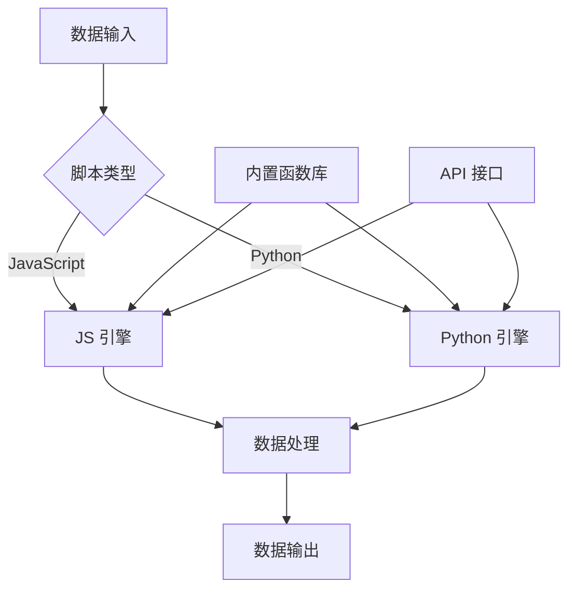

# 自定义脚本

轻易云 DataHub 支持通过自定义脚本实现灵活的数据处理逻辑。本文档详细介绍脚本编写基础、常用示例、调试技巧以及安全注意事项。

## 概述

自定义脚本允许用户在数据集成流程中嵌入自定义业务逻辑，实现标准组件无法完成的复杂数据处理需求。轻易云 DataHub 支持 JavaScript 和 Python 两种脚本语言。



## 脚本编写基础

### 脚本类型

| 脚本类型 | 执行时机 | 用途 | 性能 |
|---------|---------|------|------|
| 前置处理脚本 | 数据读取前 | 参数准备、动态 SQL 生成 | 高 |
| 字段转换脚本 | 单条记录处理 | 字段计算、格式化 | 中 |
| 记录过滤脚本 | 数据筛选 | 条件过滤、数据清洗 | 中 |
| 后置处理脚本 | 数据写入后 | 通知发送、状态更新 | 高 |
| 批量处理脚本 | 批量数据处理 | 聚合计算、分组统计 | 低 |

### 脚本执行上下文

```javascript
// JavaScript 脚本上下文
const context = {
  // 输入数据
  record: { /* 当前记录 */ },
  records: [ /* 批量记录 */ ],
  
  // 系统变量
  vars: {
    jobId: "job_12345",
    taskId: "task_67890",
    startTime: 1705315200000
  },
  
  // 全局配置
  config: {
    batchSize: 1000,
    timeout: 30000
  },
  
  // 工具函数
  utils: {
    log: (msg, level) => {},
    http: { get, post, put, delete },
    crypto: { md5, sha256, base64 },
    date: { format, parse, diff }
  }
};
```

### 脚本基本结构

```javascript
/**
 * 字段转换脚本示例
 * @param {Object} record - 输入记录
 * @param {Object} context - 执行上下文
 * @returns {Object} 处理后的记录
 */
function transform(record, context) {
  // 获取输入字段
  const { name, age, salary } = record;
  
  // 业务逻辑处理
  const result = {
    full_name: name ? name.trim().toUpperCase() : '',
    age_group: age < 30 ? '青年' : age < 50 ? '中年' : '老年',
    annual_salary: salary ? salary * 12 : 0,
    processed_at: context.utils.date.format(new Date(), 'yyyy-MM-dd HH:mm:ss')
  };
  
  // 返回处理结果
  return result;
}
```

## JavaScript 脚本示例

### 1. 数据清洗脚本

```javascript
/**
 * 客户数据清洗脚本
 * 功能：格式化手机号、清洗邮箱、标准化地址
 */
function cleanCustomerData(record, context) {
  const { phone, email, address } = record;
  const result = { ...record };
  
  // 手机号格式化：去除非数字字符
  if (phone) {
    result.phone = phone.replace(/\D/g, '');
    // 验证手机号格式
    if (!/^1[3-9]\d{9}$/.test(result.phone)) {
      context.utils.log(`无效手机号: ${phone}`, 'warn');
      result.phone = null;
    }
  }
  
  // 邮箱小写化
  if (email) {
    result.email = email.toLowerCase().trim();
    // 简单邮箱格式验证
    if (!/^[^\s@]+@[^\s@]+\.[^\s@]+$/.test(result.email)) {
      context.utils.log(`无效邮箱: ${email}`, 'warn');
      result.email = null;
    }
  }
  
  // 地址标准化
  if (address) {
    result.address = address
      .replace(/省|市|区|县/g, '')  // 去除重复行政区划
      .trim();
  }
  
  return result;
}
```

### 2. 复杂计算脚本

```javascript
/**
 * 订单金额计算脚本
 * 功能：计算折扣金额、税额、应付总额
 */
function calculateOrderAmount(record, context) {
  const { subtotal, discount_rate, tax_rate, items } = record;
  
  // 计算折扣金额
  const discountAmount = subtotal * (discount_rate || 0);
  
  // 计算税前金额
  const amountBeforeTax = subtotal - discountAmount;
  
  // 计算税额
  const taxAmount = amountBeforeTax * (tax_rate || 0.13);
  
  // 计算应付总额
  const totalAmount = amountBeforeTax + taxAmount;
  
  // 计算商品明细统计
  const itemStats = items.reduce((acc, item) => {
    acc.totalQuantity += item.quantity;
    acc.totalWeight += (item.weight || 0) * item.quantity;
    acc.categorySet.add(item.category);
    return acc;
  }, { totalQuantity: 0, totalWeight: 0, categorySet: new Set() });
  
  return {
    ...record,
    discount_amount: Math.round(discountAmount * 100) / 100,
    amount_before_tax: Math.round(amountBeforeTax * 100) / 100,
    tax_amount: Math.round(taxAmount * 100) / 100,
    total_amount: Math.round(totalAmount * 100) / 100,
    total_quantity: itemStats.totalQuantity,
    total_weight: Math.round(itemStats.totalWeight * 100) / 100,
    category_count: itemStats.categorySet.size
  };
}
```

### 3. HTTP 调用脚本

```javascript
/**
 * 外部 API 调用脚本
 * 功能：调用外部服务获取补充数据
 */
async function enrichWithExternalData(record, context) {
  const { customer_id } = record;
  
  try {
    // 调用客户信息 API
    const response = await context.utils.http.get(
      `https://api.example.com/customers/${customer_id}`,
      {
        headers: {
          'Authorization': `Bearer ${context.config.apiToken}`,
          'Content-Type': 'application/json'
        },
        timeout: 5000
      }
    );
    
    if (response.status === 200) {
      const customerData = response.data;
      
      return {
        ...record,
        customer_level: customerData.level,
        customer_score: customerData.credit_score,
        customer_tags: customerData.tags?.join(','),
        last_purchase_date: customerData.last_order_date
      };
    }
  } catch (error) {
    context.utils.log(`API 调用失败: ${error.message}`, 'error');
    // 返回原始记录，不阻断流程
    return record;
  }
  
  return record;
}
```

### 4. 数据验证脚本

```javascript
/**
 * 数据验证脚本
 * 功能：验证数据完整性，标记无效记录
 */
function validateRecord(record, context) {
  const errors = [];
  const warnings = [];
  
  // 必填字段验证
  const requiredFields = ['order_id', 'customer_id', 'amount'];
  for (const field of requiredFields) {
    if (!record[field] && record[field] !== 0) {
      errors.push(`必填字段缺失: ${field}`);
    }
  }
  
  // 数值范围验证
  if (record.amount !== undefined) {
    if (record.amount < 0) {
      errors.push('金额不能为负数');
    } else if (record.amount > 1000000) {
      warnings.push('金额超过 100 万，请确认');
    }
  }
  
  // 日期逻辑验证
  if (record.start_date && record.end_date) {
    if (new Date(record.start_date) > new Date(record.end_date)) {
      errors.push('开始日期不能晚于结束日期');
    }
  }
  
  // 业务规则验证
  if (record.order_type === 'VIP' && (!record.vip_level || record.vip_level < 1)) {
    errors.push('VIP 订单必须指定有效的 VIP 等级');
  }
  
  return {
    ...record,
    _validation: {
      is_valid: errors.length === 0,
      errors: errors,
      warnings: warnings,
      validated_at: new Date().toISOString()
    }
  };
}
```

## Python 脚本示例

### 1. 数据转换脚本

```python
# -*- coding: utf-8 -*-
"""
数据转换脚本
功能：使用 Python 进行复杂数据处理
"""
import json
import re
from datetime import datetime, timedelta
from typing import Dict, Any

def transform(record: Dict[str, Any], context) -> Dict[str, Any]:
    """
    转换函数入口
    """
    result = record.copy()
    
    # 处理时间字段
    if 'created_at' in record:
        dt = parse_datetime(record['created_at'])
        result['created_date'] = dt.strftime('%Y-%m-%d')
        result['created_hour'] = dt.hour
        result['is_weekend'] = dt.weekday() >= 5
    
    # 处理 JSON 字符串字段
    if 'attributes' in record and isinstance(record['attributes'], str):
        try:
            result['attributes'] = json.loads(record['attributes'])
        except json.JSONDecodeError:
            context.utils.log(f"JSON 解析失败: {record['attributes']}", 'warn')
    
    # 计算字段
    if 'price' in record and 'quantity' in record:
        result['total'] = record['price'] * record['quantity']
        result['total_rounded'] = round(result['total'], 2)
    
    return result

def parse_datetime(value):
    """解析多种日期格式"""
    formats = [
        '%Y-%m-%d %H:%M:%S',
        '%Y-%m-%dT%H:%M:%S',
        '%Y/%m/%d %H:%M:%S',
        '%d-%m-%Y %H:%M:%S'
    ]
    
    for fmt in formats:
        try:
            return datetime.strptime(value, fmt)
        except ValueError:
            continue
    
    raise ValueError(f"无法解析日期: {value}")
```

### 2. 批量聚合脚本

```python
# -*- coding: utf-8 -*-
"""
批量聚合脚本
功能：对批量记录进行分组统计
"""
from collections import defaultdict
from typing import List, Dict, Any

def aggregate(records: List[Dict[str, Any]], context) -> List[Dict[str, Any]]:
    """
    按客户和月份聚合订单数据
    """
    # 分组统计
    groups = defaultdict(lambda: {
        'order_count': 0,
        'total_amount': 0.0,
        'product_set': set(),
        'orders': []
    })
    
    for record in records:
        key = (record.get('customer_id'), record.get('month'))
        group = groups[key]
        
        group['order_count'] += 1
        group['total_amount'] += record.get('amount', 0)
        group['product_set'].add(record.get('product_id'))
        group['orders'].append(record.get('order_id'))
    
    # 生成聚合结果
    results = []
    for (customer_id, month), data in groups.items():
        results.append({
            'customer_id': customer_id,
            'month': month,
            'order_count': data['order_count'],
            'total_amount': round(data['total_amount'], 2),
            'unique_products': len(data['product_set']),
            'order_list': ','.join(data['orders'])
        })
    
    return results
```

### 3. 机器学习预测脚本

```python
# -*- coding: utf-8 -*-
"""
机器学习预测脚本
功能：使用预训练模型进行预测
"""
import pickle
import numpy as np
from typing import Dict, Any

# 模型缓存
_model_cache = {}

def predict(record: Dict[str, Any], context) -> Dict[str, Any]:
    """
    客户流失预测
    """
    result = record.copy()
    
    # 加载模型（首次）
    model_key = 'churn_prediction_model'
    if model_key not in _model_cache:
        model_path = context.config.get('model_path')
        with open(model_path, 'rb') as f:
            _model_cache[model_key] = pickle.load(f)
    
    model = _model_cache[model_key]
    
    # 特征准备
    features = [
        record.get('recency', 0),
        record.get('frequency', 0),
        record.get('monetary', 0),
        record.get('tenure', 0),
        record.get('complaint_count', 0)
    ]
    
    # 预测
    try:
        X = np.array([features])
        prediction = model.predict(X)[0]
        probability = model.predict_proba(X)[0][1]
        
        result['churn_prediction'] = int(prediction)
        result['churn_probability'] = round(float(probability), 4)
        result['risk_level'] = 'high' if probability > 0.7 else 'medium' if probability > 0.3 else 'low'
    except Exception as e:
        context.utils.log(f"预测失败: {str(e)}", 'error')
        result['churn_prediction'] = None
        result['churn_probability'] = None
    
    return result
```

## 脚本调试技巧

### 1. 日志输出

```javascript
/**
 * 使用日志进行调试
 */
function debugScript(record, context) {
  // 不同级别的日志
  context.utils.log('开始处理记录', 'info');
  context.utils.log(`输入数据: ${JSON.stringify(record)}`, 'debug');
  
  try {
    // 业务逻辑
    const result = processData(record);
    
    context.utils.log(`处理成功: ${JSON.stringify(result)}`, 'info');
    return result;
  } catch (error) {
    context.utils.log(`处理失败: ${error.message}`, 'error');
    context.utils.log(`错误堆栈: ${error.stack}`, 'debug');
    throw error;
  }
}
```

### 2. 条件断点

```javascript
/**
 * 模拟断点调试
 */
function scriptWithBreakpoint(record, context) {
  // 特定条件时输出详细信息
  if (record.customer_id === 'CUST-99999') {
    context.utils.log('===== 断点触发 =====', 'info');
    context.utils.log(`完整记录: ${JSON.stringify(record, null, 2)}`, 'info');
    context.utils.log(`上下文变量: ${JSON.stringify(context.vars, null, 2)}`, 'info');
    context.utils.log('===================', 'info');
  }
  
  // 正常处理
  return processRecord(record);
}
```

### 3. 性能分析

```javascript
/**
 * 性能分析脚本
 */
function performanceTest(record, context) {
  const startTime = Date.now();
  const startMemory = context.utils.getMemoryUsage?.() || 0;
  
  // 执行业务逻辑
  const result = heavyComputation(record);
  
  const endTime = Date.now();
  const endMemory = context.utils.getMemoryUsage?.() || 0;
  
  // 记录性能指标
  context.utils.log({
    message: '性能统计',
    execution_time_ms: endTime - startTime,
    memory_delta_mb: (endMemory - startMemory) / 1024 / 1024,
    record_id: record.id
  }, 'info');
  
  return result;
}
```

## 安全注意事项

### 1. 输入验证

> [!WARNING]
> 永远不要信任输入数据，务必进行严格的输入验证。

```javascript
/**
 * 安全的输入处理
 */
function secureProcessing(record, context) {
  // 验证输入类型
  if (typeof record !== 'object' || record === null) {
    throw new Error('输入必须是有效的对象');
  }
  
  // 防止原型污染
  const safeRecord = JSON.parse(JSON.stringify(record));
  
  // 验证字段值
  const userInput = safeRecord.user_input;
  if (userInput) {
    // 防止 XSS
    if (/<script|javascript:|on\w+=/i.test(userInput)) {
      context.utils.log('检测到潜在 XSS 攻击', 'error');
      safeRecord.user_input = '';
    }
    
    // 限制字符串长度
    if (userInput.length > 10000) {
      safeRecord.user_input = userInput.substring(0, 10000);
      context.utils.log('输入已截断', 'warn');
    }
  }
  
  return safeRecord;
}
```

### 2. 资源限制

```javascript
/**
 * 资源使用限制
 */
function resourceLimitedProcessing(records, context) {
  // 限制处理记录数
  const MAX_RECORDS = 10000;
  if (records.length > MAX_RECORDS) {
    context.utils.log(`记录数超过限制 ${MAX_RECORDS}，将被截断`, 'warn');
    records = records.slice(0, MAX_RECORDS);
  }
  
  // 限制循环次数
  const MAX_ITERATIONS = 100000;
  let iterationCount = 0;
  
  for (const record of records) {
    iterationCount++;
    if (iterationCount > MAX_ITERATIONS) {
      throw new Error('超过最大迭代次数限制');
    }
    
    // 处理记录
    processRecord(record);
  }
  
  return records;
}
```

### 3. 敏感信息处理

> [!CAUTION]
> 避免在日志中输出敏感信息，如密码、Token、个人身份信息等。

```javascript
/**
 * 敏感信息脱敏
 */
function maskSensitiveData(record, context) {
  const sensitiveFields = ['password', 'token', 'credit_card', 'phone', 'email'];
  const maskedRecord = { ...record };
  
  for (const field of sensitiveFields) {
    if (maskedRecord[field]) {
      maskedRecord[field] = maskString(maskedRecord[field]);
    }
  }
  
  // 安全日志输出
  context.utils.log(`处理记录: ${JSON.stringify(maskedRecord)}`, 'debug');
  
  return record;  // 返回原始记录继续处理
}

function maskString(str) {
  if (str.length <= 4) return '****';
  return str.substring(0, 2) + '****' + str.substring(str.length - 2);
}
```

### 4. 网络安全

```javascript
/**
 * 安全的 HTTP 调用
 */
async function secureHttpCall(record, context) {
  // 只允许 HTTPS
  const url = context.config.apiEndpoint;
  if (!url.startsWith('https://')) {
    throw new Error('只允许 HTTPS 协议');
  }
  
  // 验证 URL 格式
  try {
    new URL(url);
  } catch {
    throw new Error('无效的 URL');
  }
  
  // 设置超时
  const response = await context.utils.http.post(url, record, {
    timeout: 10000,  // 10 秒超时
    maxRetries: 3,
    headers: {
      'X-Request-ID': context.vars.taskId
    }
  });
  
  // 验证响应
  if (response.status !== 200) {
    throw new Error(`API 错误: ${response.status}`);
  }
  
  return response.data;
}
```

## 最佳实践总结

| 实践项 | 建议 |
|-------|------|
| 错误处理 | 使用 try-catch 包裹可能出错的代码 |
| 日志记录 | 记录关键步骤和异常情况 |
| 输入验证 | 验证所有外部输入数据 |
| 资源管理 | 设置合理的资源使用限制 |
| 性能优化 | 避免在循环中执行耗时操作 |
| 代码复用 | 将通用逻辑封装为函数 |
| 版本控制 | 对脚本进行版本管理 |
| 测试覆盖 | 为脚本编写单元测试 |

通过以上自定义脚本功能，您可以实现各种复杂的数据处理需求，同时确保脚本的安全性和可维护性。
