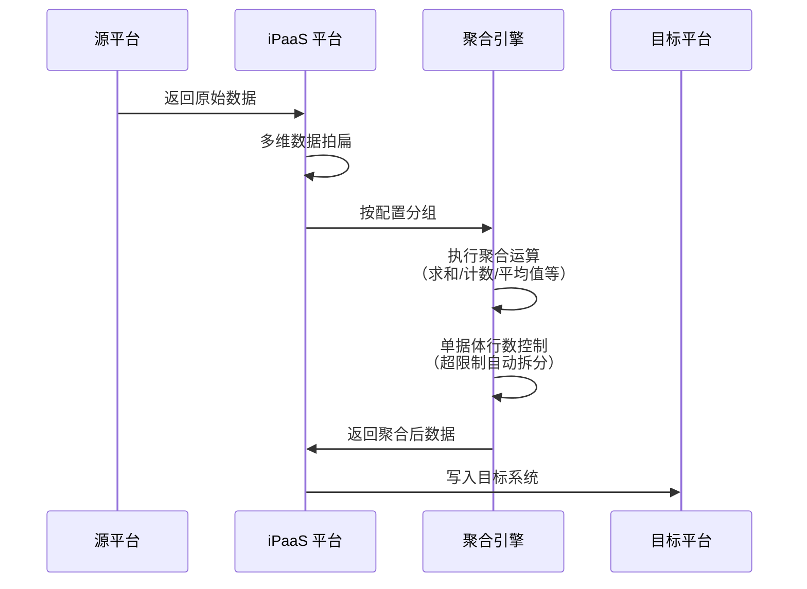

# 数据聚合写入

数据聚合写入是一种高级数据处理功能，用于在将源数据写入目标系统前，对数据进行分组汇总运算。通过配置聚合规则，你可以实现按指定字段分组后对数值字段进行求和、计数、平均值等统计运算，或将明细数据按条件合并，从而大幅减少写入目标系统的数据量，提升集成效率。

> [!NOTE]
> 数据聚合功能适用于处理海量单据场景，如电商订单汇总、库存明细合并、财务凭证汇总等业务场景。

## 适用场景

| 场景类型 | 业务描述 | 聚合策略 |
| -------- | -------- | -------- |
| **订单汇总** | 将同一店铺、同一仓库的多笔订单按商品规格合并 | 按店铺 + 仓库 + SKU 分组，数量/金额求和 |
| **库存合并** | 合并同一批次、同一库位的多条库存记录 | 按批次 + 库位分组，数量累加 |
| **财务汇总** | 按科目、期间汇总明细凭证 | 按科目编码 + 会计期间分组，金额求和 |
| **出入库汇总** | 合并同一单据类型的多条明细 | 按单据类型 + 物料编码分组，数量/金额汇总 |

## 工作原理



数据聚合的核心流程包括：

1. **数据拍扁**：将嵌套的多维数据结构转换为二维平面结构
2. **分组运算**：按照配置的分组字段将数据归类
3. **聚合计算**：对分组内的数据执行指定的聚合函数
4. **行数控制**：当聚合后的单据体行数超过限制时自动拆分为多条记录

## 前置条件：数据拍扁

在进行数据聚合之前，需要先将源数据从嵌套结构转换为平面结构。轻易云 iPaaS 平台支持在**源平台配置**中对多维数据进行拍扁处理。

### 配置数据拍扁

在源平台配置的**数据拍扁**区域，配置需要展开的数组字段：

```json
{
  "flattenConfig": {
    "enabled": true,
    "arrayFields": ["details", "items"],
    "preserveParent": true
  }
}
```

配置参数说明：

| 参数 | 类型 | 必填 | 说明 |
| ---- | ---- | ---- | ---- |
| `enabled` | boolean | ✅ | 是否启用数据拍扁 |
| `arrayFields` | array | ✅ | 需要展开为平面的数组字段名列表 |
| `preserveParent` | boolean | — | 是否保留父级字段（默认 `true`） |

> [!TIP]
> 拍扁后的数据会将数组中的每条记录与父级字段组合成独立行，便于后续的分组聚合运算。

## 配置聚合规则

在目标平台配置中，通过 `groupCalculate` 参数启用数据聚合功能。

### 完整配置示例

```json
{
  "groupCalculate": {
    "headerGroup": ["shop_no", "stock_no"],
    "bodyGroup": ["details_spec"],
    "bodyName": "details",
    "targetBodyName": "FEntity",
    "bodyMaxLine": 50,
    "calculate": {
      "details_num": "$sum",
      "details_amount": "$sum"
    }
  }
}
```

### 参数详解

#### 表头分组字段（headerGroup）

| 属性 | 说明 |
| ---- | ---- |
| **参数名** | `headerGroup` |
| **类型** | `string[]` |
| **必填** | 条件必填（与 `bodyGroup` 至少填一个） |
| **说明** | 定义表头级别的分组字段，相同值的记录会被合并到同一单据 |

配置示例：

```json
{
  "headerGroup": ["shop_no", "stock_no", "warehouse_code"]
}
```

上述配置表示：将具有相同店铺编码、仓库编码的数据合并为一张单据。

#### 表体分组字段（bodyGroup）

| 属性 | 说明 |
| ---- | ---- |
| **参数名** | `bodyGroup` |
| **类型** | `string[]` |
| **必填** | 条件必填（与 `headerGroup` 至少填一个） |
| **说明** | 定义表体明细级别的分组字段，相同值的明细行会被合并 |

配置示例：

```json
{
  "bodyGroup": ["details_spec", "details_sku"]
}
```

上述配置表示：在同一单据内，将规格编码和 SKU 相同的明细行合并。

#### 聚合后表体名称（bodyName）

| 属性 | 说明 |
| ---- | ---- |
| **参数名** | `bodyName` |
| **类型** | `string` |
| **必填** | ✅ |
| **说明** | 指定聚合后的表体数据存放的数组键名 |

配置示例：

```json
{
  "bodyName": "details"
}
```

#### 目标单据体名称（targetBodyName）

| 属性 | 说明 |
| ---- | ---- |
| **参数名** | `targetBodyName` |
| **类型** | `string` |
| **必填** | — |
| **默认值** | 与 `bodyName` 相同 |
| **说明** | 指定目标系统的单据体字段名，用于行数超限时拆分单据体 |

当聚合后的表体行数超过 `bodyMaxLine` 限制时，系统会自动拆分为多个单据，`targetBodyName` 用于指定需要拆分的单据体字段。

#### 单据体最大行数（bodyMaxLine）

| 属性 | 说明 |
| ---- | ---- |
| **参数名** | `bodyMaxLine` |
| **类型** | `number` |
| **必填** | — |
| **默认值** | `null`（不限制） |
| **说明** | 限制聚合后每个单据体的最大行数，超过则自动拆分 |

配置示例：

```json
{
  "bodyMaxLine": 50
}
```

> [!IMPORTANT]
> 设置合理的 `bodyMaxLine` 可以防止因单据体过大导致目标系统写入失败。例如金蝶云星空单据体通常限制在 1000 行以内，建议设置为 500 左右。

#### 聚合计算规则（calculate）

| 属性 | 说明 |
| ---- | ---- |
| **参数名** | `calculate` |
| **类型** | `object` |
| **必填** | ✅ |
| **说明** | 定义需要执行聚合计算的字段及其聚合方式 |

配置示例：

```json
{
  "calculate": {
    "details_num": "$sum",
    "details_amount": "$sum",
    "details_price": "$avg",
    "max_discount": "$max"
  }
}
```

## 支持的聚合函数

轻易云 iPaaS 平台支持以下 MongoDB 风格的聚合表达式：

| 表达式 | 描述 | 适用数据类型 |
| ------ | ---- | ------------ |
| `$sum` | 计算总和 | 数值型 |
| `$avg` | 计算平均值 | 数值型 |
| `$min` | 获取最小值 | 数值型、日期型、字符串 |
| `$max` | 获取最大值 | 数值型、日期型、字符串 |
| `$push` | 将值加入数组（允许重复） | 任意类型 |
| `$addToSet` | 将值加入数组（去重） | 任意类型 |
| `$first` | 获取分组内第一条记录的值 | 任意类型 |
| `$last` | 获取分组内最后一条记录的值 | 任意类型 |

### 函数使用示例

```json
{
  "calculate": {
    "qty": "$sum",
    "amount": "$sum",
    "avg_price": "$avg",
    "first_create_time": "$first",
    "last_update_time": "$last",
    "sku_list": "$addToSet",
    "all_items": "$push"
  }
}
```

> [!TIP]
> - `$sum` 和 `$avg` 仅适用于数值型字段
> - `$addToSet` 会自动去重，适合收集不重复的属性值列表
> - `$first` 和 `$last` 依赖于数据的原始排序，如需特定顺序请先配置排序规则

## 完整配置示例

### 场景：电商订单汇总至 ERP

假设需要将电商平台的多笔销售订单按店铺 + 仓库 + 商品规格合并后写入 ERP 系统。

#### 原始数据结构

```json
{
  "shop_no": "SH001",
  "stock_no": "WH001",
  "outer_no": "SO20240301001",
  "details": [
    {
      "details_spec": "SKU001",
      "details_num": 10,
      "details_amount": 1000
    },
    {
      "details_spec": "SKU002",
      "details_num": 5,
      "details_amount": 500
    }
  ]
}
```

#### 目标平台配置

```json
{
  "api": "sales_order.create",
  "type": "CREATE",
  "method": "POST",
  "groupCalculate": {
    "headerGroup": ["shop_no", "stock_no"],
    "bodyGroup": ["details_spec"],
    "bodyName": "details",
    "targetBodyName": "FEntity",
    "bodyMaxLine": 50,
    "calculate": {
      "details_num": "$sum",
      "details_amount": "$sum"
    }
  },
  "mapping": {
    "FBillTypeID": "{{shop_no}}_SO",
    "FStockOrgId": "{{stock_no}}",
    "FEntity": "{{details}}"
  }
}
```

#### 聚合后的数据映射

聚合完成后，数据格式会发生变化。在配置目标平台字段映射时，需要注意：

| 原始字段路径 | 聚合后字段路径 | 说明 |
| ------------ | -------------- | ---- |
| `{{details.details_num}}` | `{{details.details_num}}` | 聚合后的数量 |
| `{{details.details_amount}}` | `{{details.details_amount}}` | 聚合后的金额 |
| `{{details.details_spec}}` | `{{details.details_spec}}` | 分组字段保留原值 |

> [!WARNING]
> 聚合后的数据会丢失未参与分组且未配置聚合函数的字段。如果需要保留其他字段，请将其加入 `bodyGroup` 或使用 `$first` / `$last` 聚合函数。

## 最佳实践

### 1. 合理设计分组策略

| 建议 | 说明 |
| ---- | ---- |
| 分组粒度适中 | 分组过细失去聚合意义，过粗可能导致单据过大 |
| 优先使用业务主键 | 如店铺编码、仓库编码、物料编码等稳定字段 |
| 避免使用易变字段 | 如时间戳、流水号等几乎不会重复的字段不适合作为分组键 |

### 2. 性能优化建议

| 优化项 | 建议 |
| ------ | ---- |
| 设置行数限制 | 始终设置 `bodyMaxLine` 防止单据过大 |
| 控制源数据量 | 单次聚合的数据量建议在 10 万行以内 |
| 合理使用索引 | 确保 MongoDB 查询已建立合适的索引 |

### 3. 数据一致性保障

> [!CAUTION]
> 数据聚合会改变原始数据的粒度，可能导致以下问题：
> - 明细追溯困难：聚合后无法还原原始单据明细
> - 时间精度丢失：如需保留时间信息，建议使用 `$first` 或 `$last`
> - 统计误差：涉及金额计算时注意四舍五入规则

建议方案：
- 关键业务保留原始明细日志
- 使用 `externalCode` 字段建立聚合前后数据关联
- 对账时使用相同的聚合规则重新计算

## 常见问题

### Q: 聚合后数据没有变化？

排查步骤：

1. 检查 `headerGroup` 和 `bodyGroup` 字段名是否正确
2. 确认源数据已正确拍扁
3. 验证分组字段的值是否有差异（建议使用 `$addToSet` 查看分组键值分布）
4. 检查聚合引擎日志确认运算执行

### Q: 如何保留未聚合字段？

对于不需要参与聚合但需要保留的字段，可使用 `$first` 或 `$last`：

```json
{
  "calculate": {
    "qty": "$sum",
    "amount": "$sum",
    "unit": "$first",
    "currency": "$first"
  }
}
```

### Q: 单据体行数超限后如何拆分？

当聚合后的表体行数超过 `bodyMaxLine` 时，系统会自动：

1. 保持表头信息不变
2. 将超出的明细行拆分到新的单据
3. 生成多张单据分别写入目标系统

如需控制拆分行为，可调整 `bodyMaxLine` 参数。

### Q: 聚合函数支持嵌套运算吗？

目前不支持直接嵌套运算。如需复杂计算，建议：

1. 先使用基础聚合函数（如 `$sum`）计算中间结果
2. 在数据映射阶段使用自定义函数进行二次计算

示例：计算含税金额 = 金额 × (1 + 税率)

```json
{
  "calculate": {
    "details_amount": "$sum",
    "tax_rate": "$first"
  }
}
```

然后在映射中使用自定义函数：

```sql
_function {{details_amount}} * (1 + {{tax_rate}})
```

## 相关文档

- [多维数据拍扁](../guide/source-platform-config#数据拍扁) — 了解源数据拍扁配置
- [数据映射](../guide/data-mapping) — 字段映射规则详解
- [自定义函数](./custom-scripts) — 使用 `_function` 实现复杂计算
- [批量数据处理](./batch-processing) — 大规模数据处理最佳实践
- [目标平台配置](../guide/target-platform-config) — 详细的目标端配置指南
