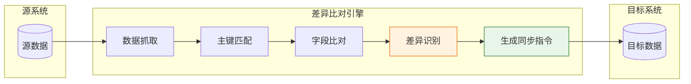
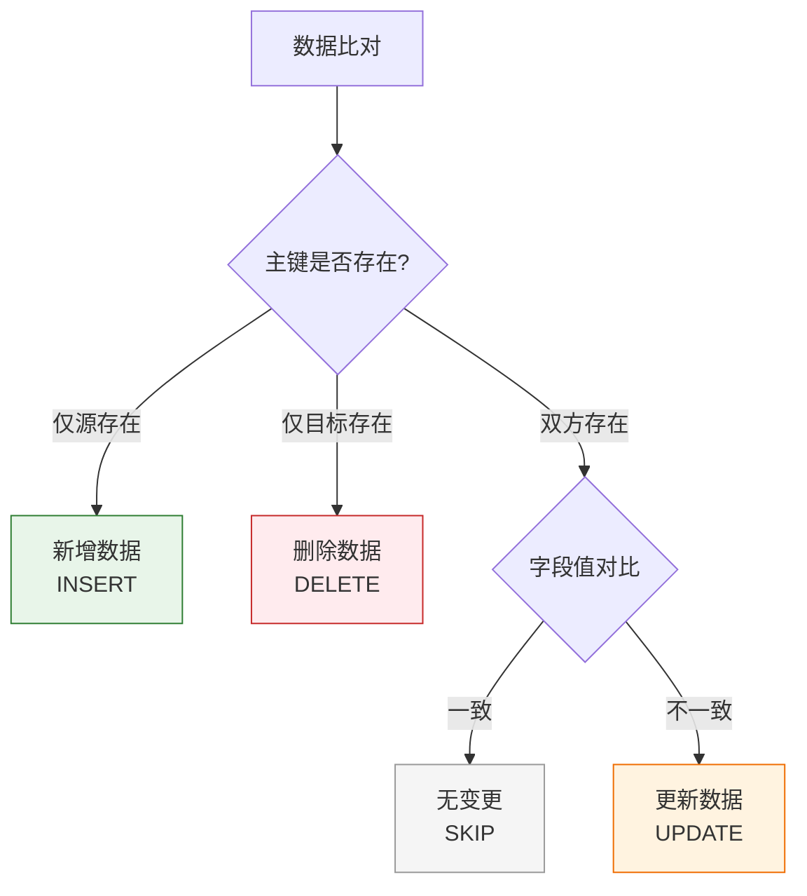
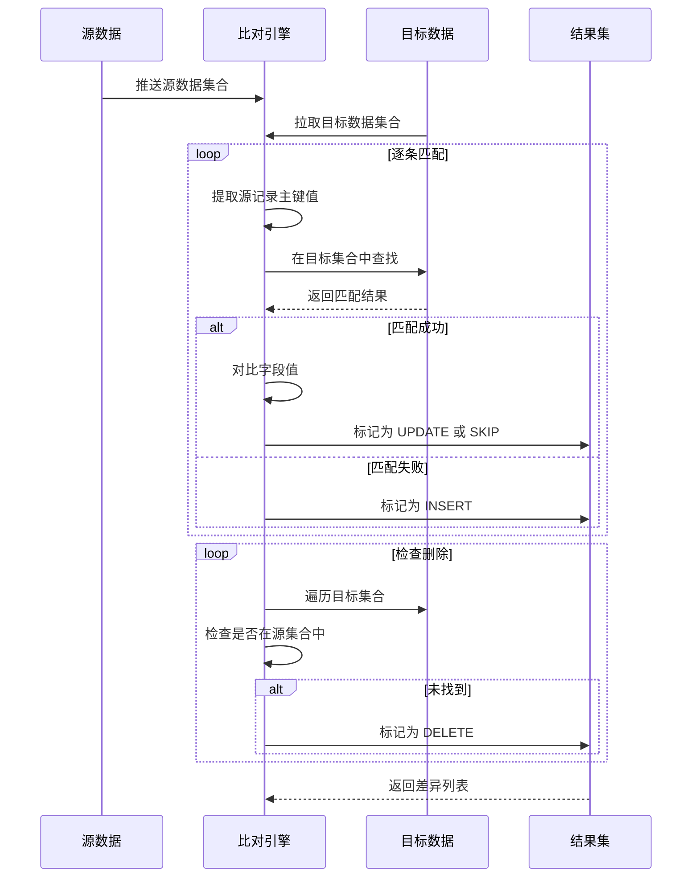
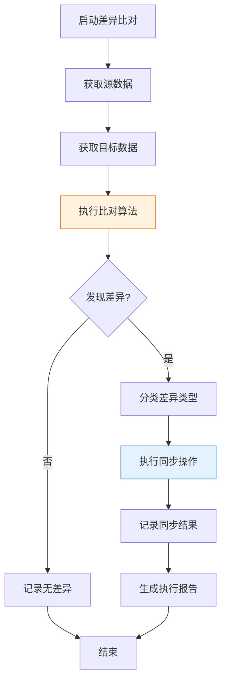
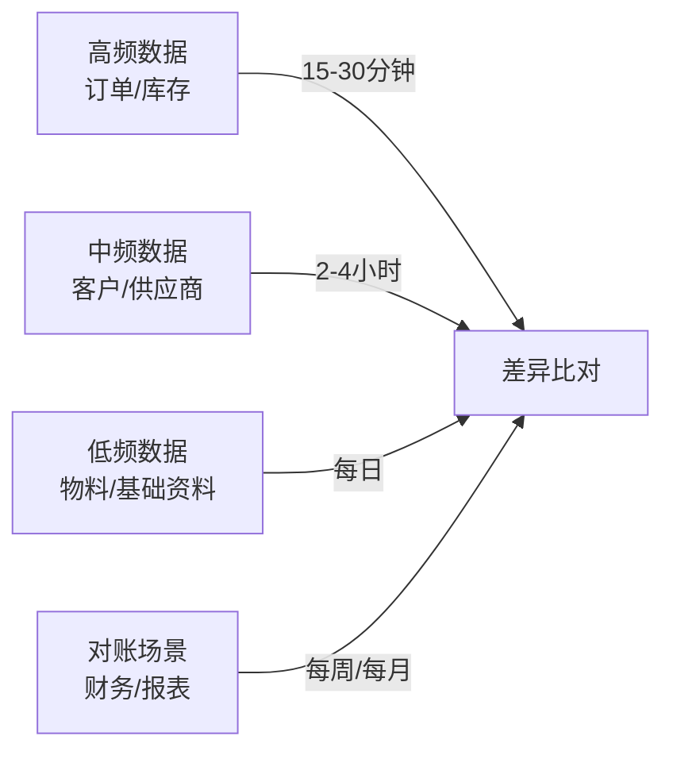
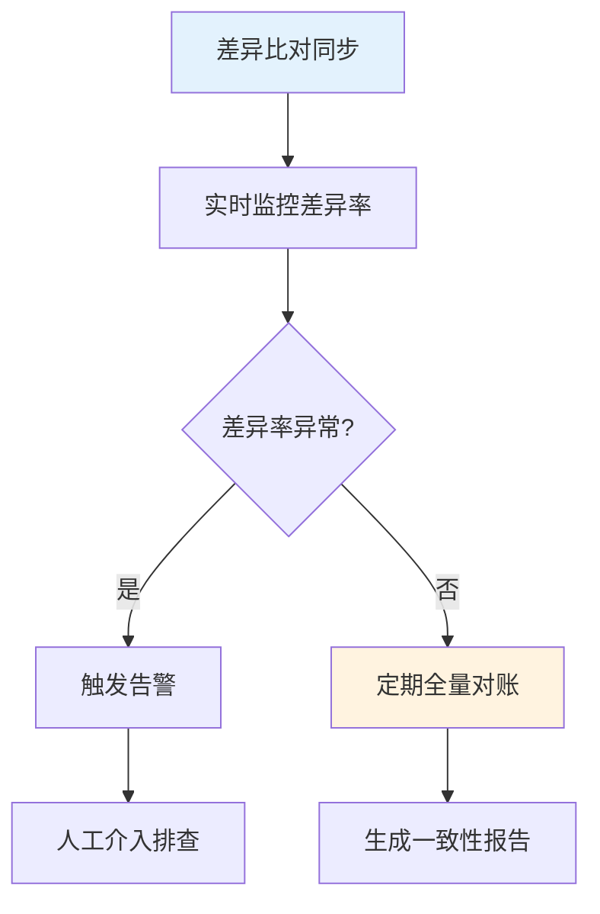

# 数据差异比对同步

数据差异比对同步是轻易云 iPaaS 平台提供的一种高级数据集成能力，通过智能比对源系统与目标系统的数据差异，仅同步发生变更的数据记录。这种同步模式特别适用于无法通过时间戳实现增量同步、或需要精确识别新增、修改、删除操作的复杂业务场景，帮助企业实现高效、精准的数据集成。

> [!NOTE]
> 差异比对同步功能属于**专业版（PRO）**特性，需要开启专业版套餐后方可使用。

## 适用场景

| 场景 | 说明 | 典型业务 |
| ---- | ---- | -------- |
| **无时间戳字段** | 源系统不提供修改时间字段，无法使用常规增量同步 | 历史 ERP 系统、老旧数据库 |
| **删除同步** | 需要识别并同步源系统的删除操作 | 客户资料清理、商品下架 |
| **双向同步** | 两个系统间需要保持数据双向一致 | 多系统主数据同步 |
| **数据修复** | 定期全量比对修复增量同步遗漏 | 月末数据对账、差异修复 |
| **跨系统对账** | 对比两个独立系统的数据一致性 | 库存对账、财务对账 |

## 核心概念

### 什么是差异比对同步



差异比对同步的核心工作流程：

1. **数据抓取**：从源系统和目标系统分别获取需要比对的数据集
2. **主键匹配**：根据配置的主键字段进行记录匹配
3. **字段比对**：对比匹配记录的字段值差异
4. **差异识别**：识别新增、修改、删除三种类型的变更
5. **同步执行**：根据差异类型执行相应的同步操作

### 差异类型说明



| 差异类型 | 标识 | 处理动作 | 适用场景 |
| -------- | ---- | -------- | -------- |
| **新增** | `INSERT` | 在目标系统创建新记录 | 源系统新增数据 |
| **更新** | `UPDATE` | 更新目标系统对应记录 | 源系统修改数据 |
| **删除** | `DELETE` | 删除目标系统对应记录 | 源系统删除数据 |
| **无变更** | `SKIP` | 跳过处理 | 数据未发生变化 |

## 配置方法

### 步骤一：启用差异比对模式

在集成方案的**源平台配置**中，启用差异比对模式：

```json
{
  "api": "material.query",
  "type": "QUERY",
  "method": "POST",
  "diffMode": {
    "enabled": true,
    "compareTarget": "target_platform",
    "keyField": "material_code",
    "compareFields": ["name", "spec", "price", "stock_qty", "status"],
    "trackDelete": true,
    "batchSize": 500
  }
}
```

### 步骤二：配置主键匹配规则

主键字段用于唯一标识一条记录，是差异比对的基础：

```json
{
  "diffMode": {
    "keyField": "material_code",
    "keyMapping": {
      "source": "material_code",
      "target": "FNumber"
    }
  }
}
```

#### 单字段主键配置

当使用单个字段作为主键时：

```json
{
  "diffMode": {
    "keyField": "order_no"
  }
}
```

#### 复合主键配置

当需要使用多个字段组合唯一标识记录时：

```json
{
  "diffMode": {
    "keyField": ["order_no", "line_no"],
    "keyMapping": {
      "source": ["order_no", "line_no"],
      "target": ["FBillNo", "FSeq"]
    }
  }
}
```

> [!IMPORTANT]
> 复合主键最多支持 3 个字段组合，字段顺序必须一一对应。

### 步骤三：配置比对字段

指定参与比对的字段列表，未指定的字段将被忽略：

```json
{
  "diffMode": {
    "compareFields": [
      "material_name",
      "specification",
      "unit_price",
      "inventory_qty"
    ],
    "fieldMapping": {
      "material_name": "FName",
      "specification": "FSpecification",
      "unit_price": "FPrice",
      "inventory_qty": "FQty"
    }
  }
}
```

> [!TIP]
> 不配置 `compareFields` 时，默认比对除主键外的所有字段。建议显式配置以提升性能和明确性。

### 步骤四：配置差异处理策略

#### 新增数据处理

```json
{
  "diffMode": {
    "onInsert": {
      "action": "create",
      "targetApi": "material.create",
      "transform": {
        "FNumber": "{{material_code}}",
        "FName": "{{material_name}}",
        "FSpecification": "{{specification}}"
      }
    }
  }
}
```

#### 更新数据处理

```json
{
  "diffMode": {
    "onUpdate": {
      "action": "update",
      "targetApi": "material.update",
      "matchField": "FMaterialId",
      "transform": {
        "FPrice": "{{unit_price}}",
        "FQty": "{{inventory_qty}}"
      }
    }
  }
}
```

#### 删除数据处理

```json
{
  "diffMode": {
    "trackDelete": true,
    "onDelete": {
      "action": "delete",
      "targetApi": "material.delete",
      "matchField": "FMaterialId",
      "confirmRequired": false
    }
  }
}
```

## 主键匹配规则详解

### 匹配算法说明



### 主键字段要求

| 要求 | 说明 | 建议 |
| ---- | ---- | ---- |
| **唯一性** | 主键值在数据集中必须唯一 | 使用业务唯一编码或系统 ID |
| **稳定性** | 主键值不应随时间变化 | 避免使用可能修改的字段 |
| **非空性** | 主键字段不允许为空值 | 在查询条件中排除空值记录 |
| **可比性** | 源与目标的主键类型应兼容 | 统一为字符串或数值类型 |

### 常见主键映射示例

| 业务场景 | 源系统主键 | 目标系统主键 | 配置示例 |
| -------- | ---------- | ------------ | -------- |
| 物料同步 | `material_code` | `FNumber` | `"keyField": "material_code"` |
| 订单同步 | `order_id` | `FBillNo` | `"keyField": "order_id"` |
| 客户同步 | `customer_code` | `FCustomerID` | `"keyField": "customer_code"` |
| 订单分录 | `order_id` + `line_no` | `FBillNo` + `FEntryID` | `"keyField": ["order_id", "line_no"]` |

## 差异处理策略

### 策略一：全量覆盖策略

适用于目标系统数据需要完全与源系统保持一致的场景：

```json
{
  "diffMode": {
    "strategy": "full_replace",
    "trackDelete": true,
    "onInsert": { "action": "create" },
    "onUpdate": { "action": "update" },
    "onDelete": { "action": "delete" }
  }
}
```

**特点**：
- 新增 → 创建记录
- 更新 → 更新记录
- 删除 → 删除记录
- 结果：目标系统数据与源系统完全一致

### 策略二：增量追加策略

适用于仅需将源系统数据同步到目标系统，不处理删除的场景：

```json
{
  "diffMode": {
    "strategy": "incremental_append",
    "trackDelete": false,
    "onInsert": { "action": "create" },
    "onUpdate": { "action": "update" }
  }
}
```

**特点**：
- 新增 → 创建记录
- 更新 → 更新记录
- 删除 → 忽略
- 结果：目标系统包含源系统所有历史数据

### 策略三：标记删除策略

适用于不物理删除，而是通过状态字段标记删除的场景：

```json
{
  "diffMode": {
    "strategy": "soft_delete",
    "trackDelete": true,
    "onInsert": { "action": "create" },
    "onUpdate": { "action": "update" },
    "onDelete": {
      "action": "update",
      "transform": {
        "FStatus": "Deleted",
        "FDeleteTime": "{{CURRENT_TIME}}"
      }
    }
  }
}
```

**特点**：
- 新增 → 创建记录
- 更新 → 更新记录
- 删除 → 更新状态为"已删除"
- 结果：保留历史数据，支持数据恢复

### 策略四：自定义处理策略

针对复杂业务场景，可使用自定义脚本实现差异化处理：

```json
{
  "diffMode": {
    "strategy": "custom",
    "customHandler": {
      "onInsert": "_function {{material_type}} === 'raw' ? 'create' : 'pending_review'",
      "onUpdate": "_function {{price_change_rate}} > 0.1 ? 'notify_manager' : 'update'",
      "onDelete": "_function {{has_transaction}} ? 'disable' : 'delete'"
    }
  }
}
```

## 完整配置示例

### 示例一：物料主数据双向同步

```json
{
  "source": {
    "api": "material.query",
    "type": "QUERY",
    "method": "POST",
    "params": {
      "status": "active"
    },
    "diffMode": {
      "enabled": true,
      "keyField": "material_code",
      "compareFields": ["name", "spec", "category", "unit", "is_active"],
      "trackDelete": true,
      "batchSize": 1000
    }
  },
  "target": {
    "api": "material.sync",
    "type": "WRITE",
    "method": "POST",
    "diffActions": {
      "onInsert": {
        "api": "material.create",
        "mapping": {
          "FNumber": "{{material_code}}",
          "FName": "{{name}}",
          "FSpecification": "{{spec}}",
          "FCategory": "{{category}}",
          "FUnit": "{{unit}}",
          "FIsActive": "{{is_active}}"
        }
      },
      "onUpdate": {
        "api": "material.update",
        "matchField": "FNumber",
        "mapping": {
          "FName": "{{name}}",
          "FSpecification": "{{spec}}",
          "FCategory": "{{category}}",
          "FUnit": "{{unit}}",
          "FIsActive": "{{is_active}}"
        }
      },
      "onDelete": {
        "api": "material.delete",
        "matchField": "FNumber",
        "softDelete": false
      }
    }
  }
}
```

### 示例二：库存数据定时对账

```json
{
  "source": {
    "api": "inventory.query",
    "type": "QUERY",
    "method": "POST",
    "diffMode": {
      "enabled": true,
      "keyField": ["warehouse_code", "material_code"],
      "compareFields": ["qty", "available_qty", "locked_qty"],
      "trackDelete": false,
      "tolerance": {
        "qty": 0.001,
        "available_qty": 0.001
      }
    }
  },
  "target": {
    "diffOnlyReport": true,
    "reportConfig": {
      "notifyEmail": "admin@company.com",
      "includeUnchanged": false
    }
  }
}
```

> [!NOTE]
> 此示例配置为仅生成差异报告，不执行实际的同步操作，适用于对账场景。

## 高级特性

### 数值容差配置

对于浮点数比对，可配置容差范围避免精度问题导致的误判：

```json
{
  "diffMode": {
    "tolerance": {
      "price": 0.01,
      "amount": 0.001,
      "qty": 0.0001
    }
  }
}
```

### 忽略字段配置

指定不参与比对的字段：

```json
{
  "diffMode": {
    "compareFields": "*",
    "ignoreFields": ["create_time", "update_time", "sync_flag", "remark"]
  }
}
```

### 条件过滤

对差异处理增加条件判断：

```json
{
  "diffMode": {
    "onUpdate": {
      "condition": "{{status}} !== 'frozen'",
      "action": "update"
    }
  }
}
```

## 执行与监控

### 执行流程



### 监控指标

| 指标 | 说明 | 告警阈值建议 |
| ---- | ---- | ------------ |
| **比对耗时** | 完成数据比对的总时间 | > 30 分钟 |
| **差异率** | 差异记录数 / 总记录数 | > 10% |
| **同步成功率** | 成功同步数 / 差异数 | < 95% |
| **新增数** | 检测到的 INSERT 数量 | 根据业务设定 |
| **更新数** | 检测到的 UPDATE 数量 | 根据业务设定 |
| **删除数** | 检测到的 DELETE 数量 | 根据业务设定 |

### 查看比对报告

执行完成后，可在**数据与队列管理**中查看详细的比对报告：

1. 进入**集成方案** → 选择对应方案
2. 点击**执行历史**标签
3. 查看**差异比对报告**
4. 可导出 CSV 格式的差异明细

## 最佳实践

### 1. 合理设置执行周期



### 2. 主键选择建议

| 数据类型 | 推荐主键 | 说明 |
| -------- | -------- | ---- |
| 主数据 | 业务编码 | 如物料编码、客户编码 |
| 交易数据 | 系统 ID | 如订单 ID、流水号 |
| 分录数据 | 组合主键 | 单据号 + 行号 |
| 配置数据 | 配置项编码 | 如参数编码、字典编码 |

### 3. 性能优化

> [!TIP]
> - **分批处理**：设置合理的 `batchSize`（建议 500-2000 条），避免内存溢出
> - **增量范围**：即使使用差异比对，也建议配合时间范围限制，减少数据量
> - **索引优化**：确保主键字段在源系统和目标系统都有索引
> - **并发控制**：根据目标系统承受能力设置并发数

### 4. 数据一致性保障



## 常见问题

### Q: 差异比对和增量同步有什么区别？

| 维度 | 差异比对同步 | 增量同步 |
| ---- | ------------ | -------- |
| 依赖条件 | 无特殊要求 | 需源系统有时间戳字段 |
| 识别删除 | ✅ 可以识别 | ❌ 通常不能 |
| 存储开销 | 高（需缓存快照） | 低（仅记录时间戳） |
| 执行耗时 | 较长（需全量比对） | 较短（仅查询变更） |
| 适用频率 | 中低频（小时/天级） | 高频（分钟级） |
| 数据一致性 | 更高 | 依赖时间戳准确性 |

### Q: 首次启用差异比对需要注意什么？

首次启用时建议：

1. **历史数据处理**：首次执行会将所有数据视为新增，建议在业务低峰期执行
2. **快照初始化**：系统会自动创建首次快照，耗时与数据量成正比
3. **测试验证**：先在测试环境验证比对逻辑，确认主键匹配正确
4. **分批启用**：对于超大数据量，建议按数据范围分批启用

### Q: 如何处理比对过程中的数据变更？

差异比对采用**快照隔离**机制：

- 比对开始时锁定源数据和目标数据的快照
- 比对过程中源系统的变更不会反映到本次比对
- 下次执行时会捕获这些变更

> [!WARNING]
> 对于实时性要求极高的场景，建议配合 CDC 实时同步使用，差异比对作为兜底校验。

### Q: 主键冲突如何处理？

当主键在数据集中不唯一时：

1. 系统会记录冲突警告
2. 默认保留第一条记录，忽略后续重复
3. 可在配置中设置 `onDuplicate: "error"` 使任务失败，便于排查

```json
{
  "diffMode": {
    "onDuplicate": "error"
  }
}
```

### Q: 可以比对嵌套结构的数据吗？

支持嵌套结构的比对，需配置字段路径：

```json
{
  "diffMode": {
    "compareFields": [
      "header.order_type",
      "header.order_date",
      "details.qty",
      "details.price"
    ]
  }
}
```

## 相关文档

- [集成策略模式](./integration-strategy) — 了解差异比对与其他同步策略的组合使用
- [CDC 实时同步](./cdc-realtime) — 实现秒级数据同步
- [批量数据处理](./batch-processing) — 大规模数据同步性能优化
- [数据与队列管理](../guide/data-queue-management) — 查看同步结果和差异报告
- [监控告警](../guide/monitoring-alerts) — 配置同步异常告警
- [调试器](../guide/debugger) — 验证比对逻辑和结果
