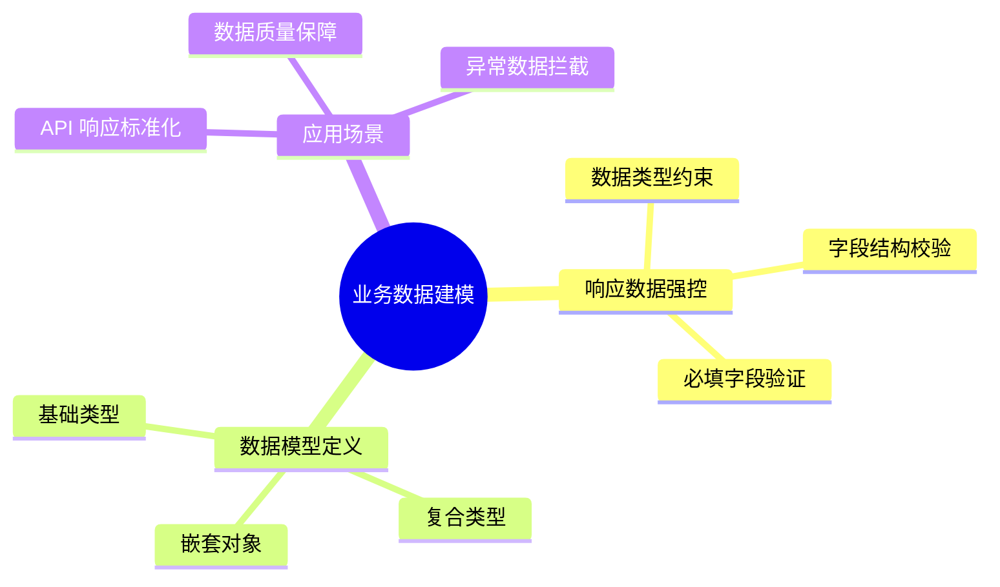
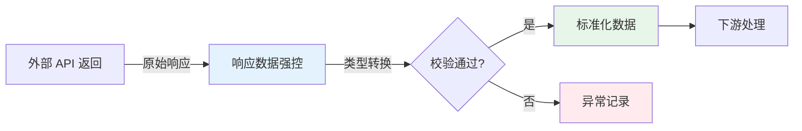
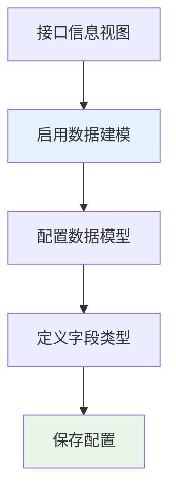
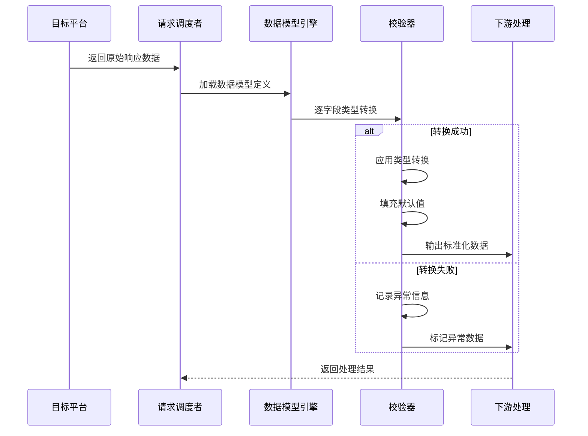

# 业务数据建模（响应数据强控模式）

业务数据建模通过响应数据强控模式（Response Schema Control）对 API 响应数据进行结构约束和类型校验，确保数据在传输过程中符合预期的业务规则。通过定义严格的数据模型，平台能够自动校验和转换响应数据的类型，防止因数据类型不匹配导致的下游处理错误。

> [!NOTE]
> 响应数据强控模式主要应用于**请求调度者**组件，用于规范目标平台返回的响应数据结构。启用后，平台将强制要求响应数据符合预定义的数据模型，未通过校验的数据将被标记为异常。

## 功能概述



### 核心能力

| 能力 | 说明 | 价值 |
| ---- | ---- | ---- |
| **类型强制转换** | 自动将响应数据转换为预定义类型 | 消除类型不一致导致的解析错误 |
| **结构校验** | 验证响应数据是否符合定义的字段结构 | 确保数据完整性 |
| **默认值填充** | 对缺失字段自动填充默认值 | 增强数据鲁棒性 |
| **异常标记** | 不符合模型的数据被标记为异常 | 便于问题定位和处理 |

## 使用场景

### 场景一：API 响应标准化

当对接的外部系统返回的数据类型不统一时（如数字字段时而返回字符串、时而返回数值），通过数据建模强制统一数据类型，简化下游处理逻辑。



### 场景二：数据质量保障

在金融、电商等对数据准确性要求较高的场景中，通过严格的数据模型约束，确保金额、数量等关键字段的数据类型正确，防止因类型错误导致的计算偏差。

### 场景三：异常数据拦截

通过定义严格的字段结构，自动识别和拦截不符合预期的响应数据，避免脏数据流入下游系统。

## 配置方法

### 步骤一：进入接口信息视图

1. 登录轻易云 iPaaS 平台，进入目标集成方案的编辑页面
2. 在方案编排界面中找到**请求调度者**组件
3. 点击进入**接口信息视图**配置面板

### 步骤二：启用数据建模

在接口信息视图中找到**启用数据建模**开关，将其开启：



> [!TIP]
> 启用数据建模后，系统会强制要求配置至少一个字段的数据模型。如果不需要强控，建议保持关闭状态以提升性能。

### 步骤三：定义数据模型

在数据建模配置区域，定义响应数据的字段结构：

| 配置项 | 说明 | 示例值 |
| ------ | ---- | ------ |
| 字段名 | 响应数据中的字段标识 | `order_id`、`amount`、`is_paid` |
| 数据类型 | 字段的目标类型 | `string`、`integer`、`float`、`boolean`、`array`、`object` |
| 必填 | 该字段是否必须存在 | `true` / `false` |
| 默认值 | 字段缺失时的填充值 | 根据类型而定 |
| 描述 | 字段的业务说明 | 订单编号、订单金额等 |

#### 基础类型定义示例

```json
{
  "schema": {
    "type": "object",
    "properties": {
      "order_id": {
        "type": "string",
        "required": true,
        "description": "订单唯一标识"
      },
      "amount": {
        "type": "float",
        "required": true,
        "default": 0.0,
        "description": "订单金额"
      },
      "quantity": {
        "type": "integer",
        "required": false,
        "default": 0,
        "description": "商品数量"
      },
      "is_paid": {
        "type": "boolean",
        "required": true,
        "default": false,
        "description": "是否已支付"
      }
    }
  }
}
```

#### 嵌套对象类型定义

对于包含嵌套结构的响应数据：

```json
{
  "schema": {
    "type": "object",
    "properties": {
      "order_id": {
        "type": "string",
        "required": true
      },
      "customer": {
        "type": "object",
        "required": true,
        "properties": {
          "customer_id": {
            "type": "string",
            "required": true
          },
          "customer_name": {
            "type": "string",
            "required": false,
            "default": "未知客户"
          }
        }
      },
      "items": {
        "type": "array",
        "required": true,
        "items": {
          "type": "object",
          "properties": {
            "sku_id": {
              "type": "string",
              "required": true
            },
            "price": {
              "type": "float",
              "required": true
            },
            "qty": {
              "type": "integer",
              "required": true
            }
          }
        }
      }
    }
  }
}
```

## 数据类型说明

### 支持的数据类型

| 类型 | 说明 | 转换规则 | 示例 |
| ---- | ---- | -------- | ---- |
| `string` | 字符串类型 | 调用 `toString()` 方法转换 | `"123"`、`"true"` |
| `integer` | 整数类型 | 使用 `parseInt()` 转换，舍弃小数 | `100`、`-50` |
| `float` | 浮点类型 | 使用 `parseFloat()` 转换 | `123.45`、`-0.01` |
| `boolean` | 布尔类型 | 真值：`true`、`1`、`"true"`、`"yes"`；假值：`false`、`0`、`"false"`、`"no"` | `true`、`false` |
| `array` | 数组类型 | 非数组类型将被包装为单元素数组 | `[1, 2, 3]` |
| `object` | 对象类型 | 原始类型无法转换，将标记为异常 | `{"key": "value"}` |

### 类型转换示例

```mermaid
flowchart TD
    subgraph "原始响应数据"
        A1[{"count": "100",<br/>"price": "99.99",<br/>"is_valid": "1"}]
    end

    subgraph "强控转换后"
        B1[{"count": 100,<br/>"price": 99.99,<br/>"is_valid": true}]
    end

    A1 -->|类型转换| B1

    style B1 fill:#e8f5e9
```

> [!WARNING]
> 当类型转换失败时（如将 `"abc"` 转换为 `integer`），该字段将被标记为异常值，根据配置可能触发异常处理流程。

## 响应数据强控模式的工作原理



### 处理流程说明

1. **接收响应**：请求调度者接收到目标平台的原始响应数据
2. **模型匹配**：根据配置的字段映射规则，提取需要强控的字段
3. **类型转换**：按照定义的数据类型进行强制转换
4. **默认值填充**：对缺失的字段填充配置的默认值
5. **校验结果**：验证必填字段是否存在，标记异常数据
6. **输出数据**：将处理后的标准化数据传递给下游处理环节

## 最佳实践

### 1. 渐进式启用

建议先在测试环境验证数据建模配置，确认无误后再应用到生产环境：


### 2. 合理设置默认值

为每个字段配置合理的默认值，避免因字段缺失导致的数据处理中断：

| 字段类型 | 推荐默认值 | 适用场景 |
| -------- | ---------- | -------- |
| `string` | `""` 或 `"N/A"` | 可选文本字段 |
| `integer` | `0` 或 `-1` | 可选计数或 ID 字段 |
| `float` | `0.0` | 可选金额或数值字段 |
| `boolean` | `false` | 可选状态标记 |

### 3. 与异常处理机制配合

结合[异常处理机制](./error-handling)配置，对校验失败的数据进行妥善处理：

```json
{
  "errorHandling": {
    "schemaValidationFailed": {
      "action": "log_and_continue",
      "alert": true,
      "fallbackValue": null
    }
  }
}
```

### 4. 性能考量

| 因素 | 影响 | 建议 |
| ---- | ---- | ---- |
| 字段数量 | 字段越多，校验耗时越长 | 仅对关键字段启用强控 |
| 嵌套层级 | 深层嵌套增加解析开销 | 嵌套层级不超过 3 层 |
| 数组大小 | 大数组逐项校验耗时 | 对超大数组考虑抽样校验 |

> [!TIP]
> 对于数据量极大的场景，建议仅在调试阶段启用强控，生产环境关闭以提升性能。

## 常见问题

### Q: 启用数据建模后，未定义的字段会被如何处理？

未在模型中定义的字段将保持原始值和类型，不会进行类型转换。建议启用**严格模式**（如支持）来拒绝包含未定义字段的响应：

```json
{
  "schema": {
    "type": "object",
    "strict": true,
    "properties": {
      // 只保留已定义的字段
    }
  }
}
```

### Q: 如何处理动态字段（字段名不固定）？

对于动态字段名的情况，可以使用通配符或额外属性配置：

```json
{
  "schema": {
    "type": "object",
    "additionalProperties": {
      "type": "string"
    },
    "properties": {
      "fixed_field": {
        "type": "string"
      }
    }
  }
}
```

上述配置表示：除 `fixed_field` 外，其他所有字段都将被转换为字符串类型。

### Q: 日期时间类型如何定义？

平台将日期时间统一作为 `string` 类型处理，建议使用格式化表达式进行标准化：

```json
{
  "create_time": {
    "type": "string",
    "format": "datetime",
    "pattern": "yyyy-MM-dd HH:mm:ss"
  }
}
```

### Q: 数据建模与数据映射有什么区别？

| 维度 | 数据建模 | 数据映射 |
| ---- | -------- | -------- |
| **作用阶段** | 响应数据接收后 | 数据转换环节 |
| **主要功能** | 类型约束与校验 | 字段对应与转换 |
| **处理对象** | 原始响应数据 | 已解析的业务数据 |
| **使用场景** | 确保输入数据质量 | 实现字段对应关系 |

### Q: 如何调试数据建模配置？

1. 使用平台的[调试器](../guide/debugger)功能，查看原始响应与转换后的对比
2. 在数据模型配置中暂时关闭**严格校验**，观察哪些字段转换失败
3. 查看[集成日志](../guide/log-management)中的详细转换记录

## 相关文档

- [数据映射](../guide/data-mapping) — 字段映射的基础概念与配置方法
- [异常处理机制](./error-handling) — 数据校验失败的处理策略
- [使用调试器](../guide/debugger) — 调试数据建模效果的工具指南
- [集成策略模式](./integration-strategy) — 不同策略模式下的数据处理方式
