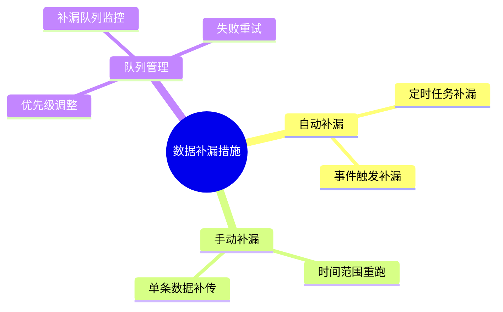
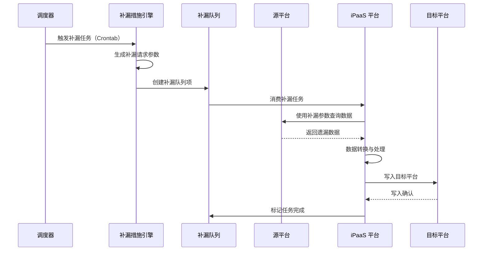
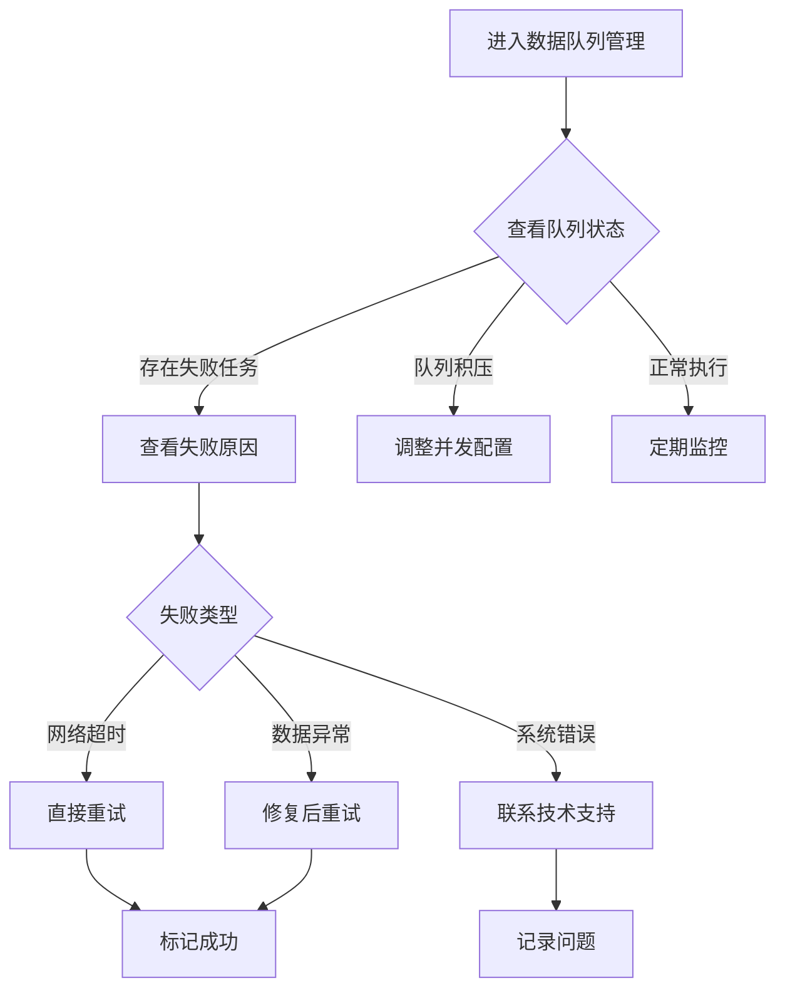
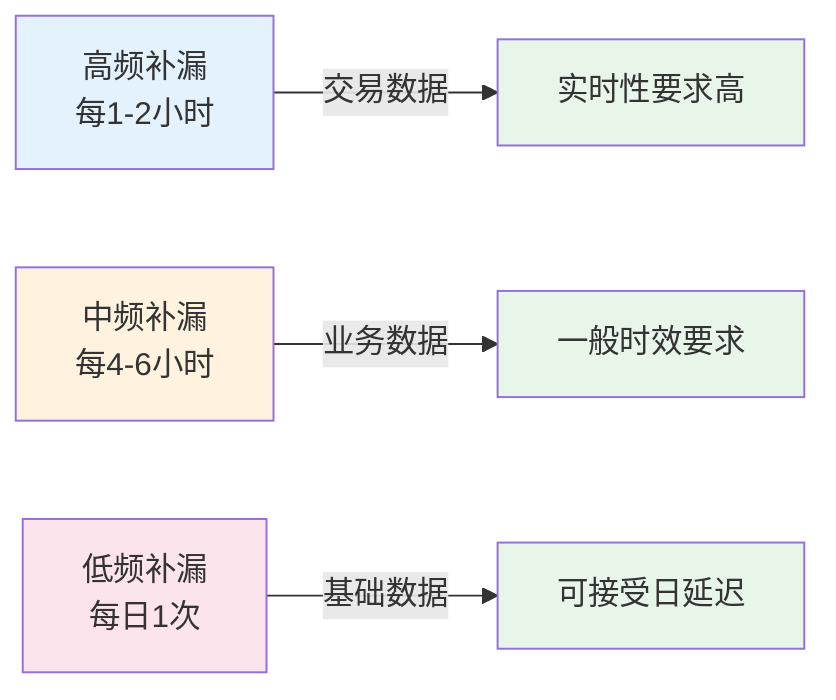
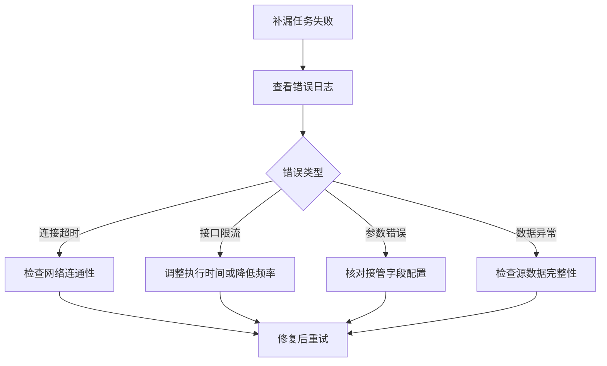

# 数据补漏措施

数据补漏措施是轻易云 iPaaS 平台提供的数据可靠性保障机制，用于在系统异常、网络中断或定时任务漏执行等场景下，自动或手动补充遗漏的数据。通过配置补漏策略，系统能够周期性生成补传请求队列，确保数据的完整性和一致性。

> [!NOTE]
> 数据补漏措施通常在**请求调度者（Request Dispatcher）**中配置，作为源平台数据获取的兜底保障机制。

## 补漏措施概览



### 适用场景

| 场景类型 | 描述 | 推荐补漏方式 |
| -------- | ---- | ------------ |
| **定时任务漏执行** | 由于系统维护或异常导致定时同步未触发 | 定时任务补漏 |
| **数据时间窗口遗漏** | 源系统数据写入延迟，超过同步时间窗口 | 时间范围重跑 |
| **网络中断恢复** | 临时网络故障导致部分数据获取失败 | 自动队列补漏 |
| **历史数据修复** | 发现某时间段数据不完整需要重新同步 | 手动时间范围补传 |
| **异常数据补偿** | 特定条件下的数据需要重新处理 | 条件触发补漏 |

## 补漏措施工作原理



### 核心概念

**接管字段（TakeOver Request）**

补漏措施通过配置接管字段来覆盖原请求调度者的参数。当补漏任务执行时，系统使用接管字段中定义的值替代原始请求参数，从而实现对特定时间范围或条件的数据查询。

**补漏周期（Crontab）**

使用标准 Cron 表达式定义补漏任务的执行周期。系统将按照设定的时间间隔自动触发补漏检查。

## 配置补漏措施

### 基础配置结构

在源平台配置中添加 `omissionRemedy` 字段：

```json
{
  "omissionRemedy": {
    "crontab": "2 */2 * * *",
    "adapter": "\\Adapter\\GuanYiERP\\GuanYiERPQueryAdapter",
    "takeOverRequest": [
      {
        "field": "start_date",
        "label": "修改时间开始段",
        "type": "string",
        "is_required": true,
        "describe": null,
        "value": "{{DAYS_AGO_2|datetime}}"
      },
      {
        "field": "end_date",
        "label": "修改时间结束段",
        "type": "string",
        "is_required": true,
        "value": "{{DAYS_AGO_1|datetime}}"
      }
    ]
  }
}
```

### 配置参数说明

| 参数 | 类型 | 必填 | 说明 |
| ---- | ---- | ---- | ---- |
| `crontab` | string | ✅ | 补漏任务的 Cron 表达式，定义执行周期 |
| `adapter` | string | — | 补漏专用的适配器类路径，默认使用源平台适配器 |
| `takeOverRequest` | array | ✅ | 接管字段数组，定义补漏时的请求参数 |

### 接管字段配置

每个接管字段支持以下属性：

| 属性 | 类型 | 必填 | 说明 |
| ---- | ---- | ---- | ---- |
| `field` | string | ✅ | 字段名称，需与标准请求参数中的字段对应 |
| `label` | string | — | 字段显示标签 |
| `type` | string | ✅ | 字段类型：`string`、`number`、`boolean` |
| `is_required` | boolean | — | 是否必填，默认 `false` |
| `describe` | string | — | 字段描述说明 |
| `value` | any | — | 字段值，支持变量和函数表达式 |

> [!TIP]
> 接管字段的值支持使用平台内置变量（如 `{{DAYS_AGO_2}}`）和函数表达式（如 `_function {{CURRENT_TIME}} - 86400000`）。

### Cron 表达式配置示例

| 表达式 | 含义 | 适用场景 |
| ------ | ---- | -------- |
| `0 */6 * * *` | 每 6 小时执行一次 | 高频数据补漏 |
| `0 2 * * *` | 每天凌晨 2 点执行 | 日级别数据兜底 |
| `0 3 * * 1` | 每周一凌晨 3 点执行 | 周级别数据校验 |
| `2 */2 * * *` | 每 2 小时的第 2 分钟执行 | 分散系统负载 |

## 补漏方式详解

### 方式一：定时自动补漏

系统按照配置的 Cron 表达式周期性执行补漏任务，自动查询并补充遗漏数据。

#### 配置示例：按修改时间补漏

```json
{
  "omissionRemedy": {
    "crontab": "0 */4 * * *",
    "takeOverRequest": [
      {
        "field": "modified_begin",
        "type": "string",
        "value": "{{DAYS_AGO_1|datetime}}"
      },
      {
        "field": "modified_end",
        "type": "string",
        "value": "{{CURRENT_TIME|datetime}}"
      }
    ]
  }
}
```

**工作原理**：
- 每 4 小时执行一次补漏任务
- 自动查询过去 24 小时内修改的数据
- 将遗漏的数据补充同步到目标平台

#### 配置示例：带时间偏移的补漏

```json
{
  "omissionRemedy": {
    "crontab": "5 * * * *",
    "takeOverRequest": [
      {
        "field": "start_time",
        "type": "string",
        "value": "_function FORMAT_DATE({{CURRENT_TIME}} - 7200000, 'yyyy-MM-dd HH:mm:ss')"
      },
      {
        "field": "end_time",
        "type": "string",
        "value": "_function FORMAT_DATE({{CURRENT_TIME}} - 3600000, 'yyyy-MM-dd HH:mm:ss')"
      }
    ]
  }
}
```

**工作原理**：
- 每小时的第 5 分钟执行
- 查询 2 小时前到 1 小时前的数据（预留 1 小时缓冲避免数据写入延迟）

### 方式二：时间范围重跑

当发现特定时间段的数据遗漏时，可以手动触发时间范围重跑，重新同步该时间段的所有数据。

#### 操作步骤

1. **进入数据队列管理**
   - 登录轻易云 iPaaS 平台
   - 进入**集成方案** → **数据与队列管理**

2. **创建重跑任务**
   - 点击**新建重跑任务**
   - 选择需要重跑的集成方案
   - 设置时间范围（开始时间、结束时间）

3. **配置重跑参数**
   - 选择是否覆盖已有数据
   - 设置重跑优先级
   - 确认重跑的数据筛选条件

4. **执行重跑**
   - 点击**提交重跑任务**
   - 在队列监控中查看执行进度

#### 重跑任务配置示例

```json
{
  "rerunTask": {
    "schemeId": "order_sync_001",
    "timeRange": {
      "start": "2026-03-01 00:00:00",
      "end": "2026-03-10 23:59:59"
    },
    "options": {
      "overwriteExisting": true,
      "priority": "high",
      "batchSize": 100
    }
  }
}
```

> [!WARNING]
> 时间范围重跑可能影响目标系统的数据状态，建议在业务低峰期执行，并提前确认重跑数据的影响范围。

### 方式三：数据队列补漏工具

平台提供可视化的数据队列补漏工具，用于管理和监控补漏队列的执行情况。

#### 队列状态说明

| 状态 | 说明 | 处理方式 |
| ---- | ---- | -------- |
| **待处理** | 补漏任务已创建，等待执行 | 无需处理，系统自动调度 |
| **处理中** | 正在执行数据查询与同步 | 监控进度，关注执行时长 |
| **成功** | 补漏任务已完成 | 核对数据完整性 |
| **失败** | 执行过程中发生错误 | 查看错误日志，排查原因后重试 |
| **已取消** | 手动取消或超时终止 | 如需补漏，重新创建任务 |

#### 补漏队列管理操作



#### 批量重试失败任务

1. 在**补漏队列**页面筛选状态为**失败**的任务
2. 勾选需要重试的任务（支持全选）
3. 点击**批量重试**按钮
4. 确认重试参数后提交

> [!TIP]
> 建议设置失败任务自动重试策略，如：失败后 5 分钟自动重试，最多重试 3 次。

## 高级配置技巧

### 使用自定义适配器

当补漏需要特殊的查询逻辑时，可配置专用的适配器：

```json
{
  "omissionRemedy": {
    "crontab": "0 3 * * *",
    "adapter": "\\Adapter\\Custom\\OmissionRemedyAdapter",
    "takeOverRequest": [
      {
        "field": "query_mode",
        "type": "string",
        "value": "omission_only"
      }
    ]
  }
}
```

### 多条件组合补漏

配置多个接管字段实现复杂条件的补漏：

```json
{
  "omissionRemedy": {
    "crontab": "0 */6 * * *",
    "takeOverRequest": [
      {
        "field": "start_date",
        "type": "string",
        "value": "{{DAYS_AGO_1|datetime}}"
      },
      {
        "field": "status",
        "type": "string",
        "value": "pending,processing"
      },
      {
        "field": "is_omission_query",
        "type": "boolean",
        "value": true
      }
    ]
  }
}
```

### 动态时间窗口

使用函数表达式实现动态时间窗口计算：

```json
{
  "omissionRemedy": {
    "crontab": "10 * * * *",
    "takeOverRequest": [
      {
        "field": "start_time",
        "type": "string",
        "value": "_function FROM_UNIXTIME(UNIX_TIMESTAMP() - 3600, '%Y-%m-%d %H:%i:%s')"
      }
    ]
  }
}
```

## 最佳实践

### 1. 补漏周期设计



| 数据类型 | 建议补漏周期 | 说明 |
| -------- | ------------ | ---- |
| 订单交易数据 | 每 1-2 小时 | 高频变更，对实时性要求高 |
| 库存数据 | 每 2-4 小时 | 重要业务数据，需及时同步 |
| 客户档案 | 每天 1 次 | 变更频率低，日级同步即可 |
| 商品主数据 | 每天 1-2 次 | 基础数据，允许一定延迟 |

### 2. 时间偏移策略

为避免数据写入延迟导致的遗漏，建议设置合理的时间偏移：

```json
{
  "takeOverRequest": [
    {
      "field": "start_time",
      "value": "_function {{LAST_SYNC_TIME}} - 600000"
    },
    {
      "field": "end_time",
      "value": "_function {{CURRENT_TIME}} - 300000"
    }
  ]
}
```

- **起始时间偏移**：往回推 10 分钟，覆盖可能遗漏的数据
- **结束时间偏移**：往前推 5 分钟，避免查询到正在写入的不完整数据

### 3. 监控与告警

建议对以下指标配置监控告警：

| 监控项 | 告警阈值 | 处理建议 |
| ------ | -------- | -------- |
| 补漏队列积压数 | > 100 条 | 检查系统性能，适当增加并发 |
| 补漏任务失败率 | > 5% | 排查失败原因，修复后重试 |
| 单次补漏数据量 | > 10 万条 | 评估补漏范围是否合理 |
| 补漏执行时长 | > 30 分钟 | 优化查询条件或分批处理 |

### 4. 与主流程的协调

> [!IMPORTANT]
> 补漏措施不应与主同步流程产生冲突，建议：
> - 补漏查询的时间范围与主流程错开
> - 使用不同的请求标识区分补漏数据
> - 目标平台支持幂等写入，避免重复数据

## 常见问题

### Q: 补漏措施和主定时任务会重复获取数据吗？

会存在一定重叠，这是设计上的预期行为。为避免数据重复：

1. **使用时间戳过滤**：源平台 API 支持按时间戳查询时，确保时间范围不重叠
2. **目标平台幂等写入**：配置目标平台的写入模式为 `upsert`，根据唯一键去重
3. **数据状态标记**：在补漏参数中添加特定标记，目标平台可根据标记做特殊处理

### Q: 如何验证补漏措施是否生效？

验证步骤：

1. **查看补漏队列**：检查是否有定时生成的补漏任务
2. **对比数据量**：比较源平台与目标平台的数据条数
3. **抽样核对**：抽取特定时间段的数据进行逐条核对
4. **查看执行日志**：检查补漏任务的执行记录和结果

### Q: 补漏任务执行失败如何处理？

排查流程：



### Q: 可以配置多个补漏措施吗？

一个集成方案只能配置一个 `omissionRemedy`，但可以通过以下方式实现多策略：

1. **在适配器中实现多逻辑**：自定义适配器根据参数执行不同的补漏逻辑
2. **使用条件表达式**：在接管字段值中使用条件判断
3. **创建多个集成方案**：针对不同补漏场景创建独立的方案

### Q: 补漏措施对系统性能有什么影响？

| 影响项 | 说明 | 优化建议 |
| ------ | ---- | -------- |
| 源平台查询压力 | 额外的 API 调用 | 分散执行时间，避开业务高峰 |
| 目标平台写入压力 | 重复数据写入 | 开启幂等写入，减少无效操作 |
| 平台队列资源 | 补漏任务占用队列 | 合理设置并发数，监控队列深度 |
| 存储开销 | 补漏日志记录 | 定期清理历史日志 |

## 相关文档

- [数据与队列管理](../guide/data-queue-management) — 补漏队列的监控与管理
- [源平台配置](../guide/source-platform-config) — 详细的源端配置指南
- [目标平台配置](../guide/target-platform-config) — 目标端配置与幂等写入设置
- [集成策略模式](./integration-strategy) — 了解不同同步策略的组合应用
- [异常处理机制](./error-handling) — 同步失败的容错与恢复策略
- [监控告警](../guide/monitoring-alerts) — 配置补漏任务的监控告警

---

> [!TIP]
> 建议在生产环境启用补漏措施前，先在测试环境验证配置效果，确保补漏逻辑正确且不会影响正常业务流程。
