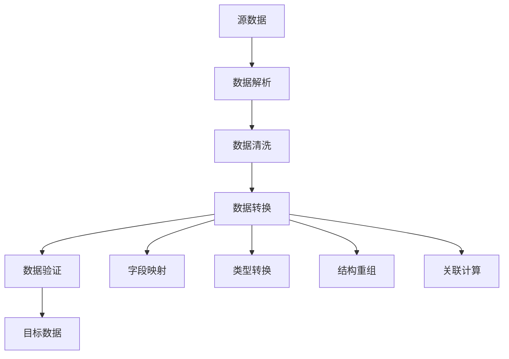
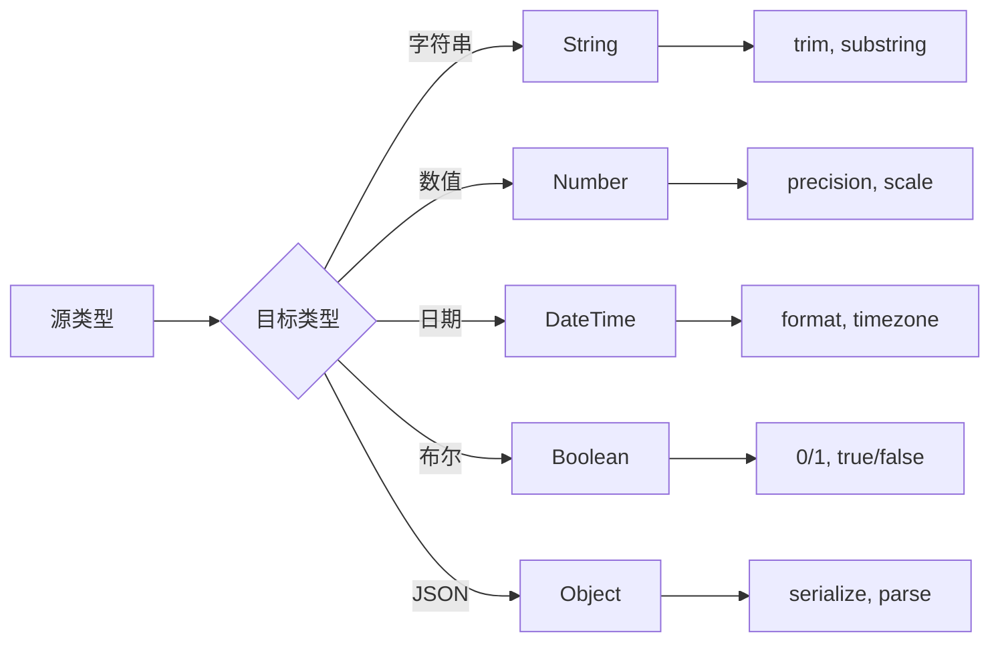
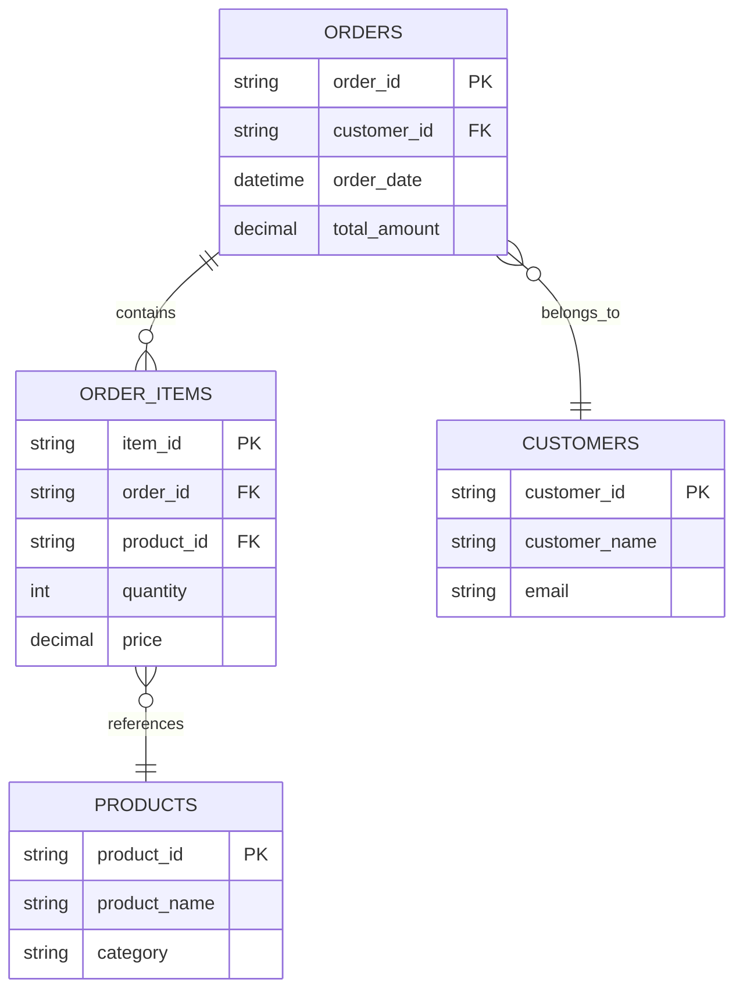
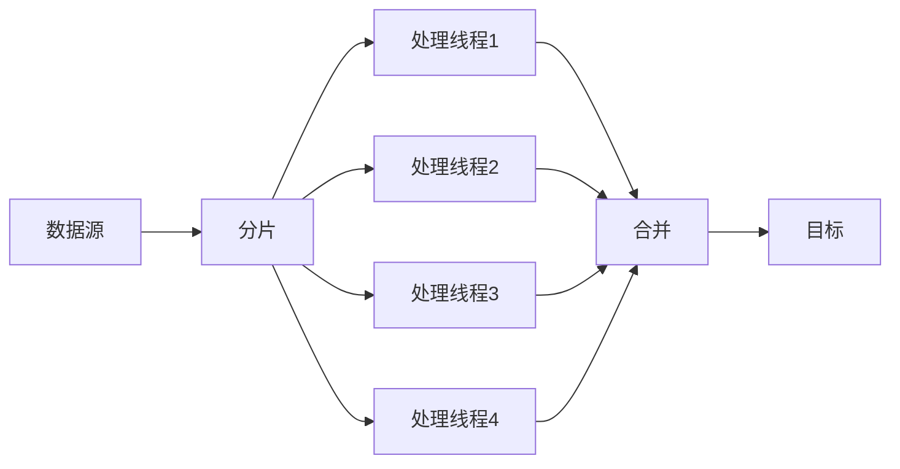

# 高级数据转换

轻易云 DataHub 提供了强大的数据转换能力，支持复杂数据结构的处理、嵌套数据转换以及多表关联转换。本文档详细介绍这些高级转换技巧。

## 概述

数据转换是数据集成流程中的核心环节，负责将源系统的数据格式转换为目标系统所需的格式。高级数据转换功能能够处理各种复杂场景，包括嵌套 JSON、XML 结构、多表关联等。



## 复杂数据结构处理

### 嵌套 JSON 处理

轻易云 DataHub 支持多级嵌套 JSON 数据的解析与转换。

#### 示例：电商订单数据结构

```json
{
  "order_id": "ORD-2024-001",
  "customer": {
    "id": "CUST-12345",
    "name": "张三",
    "contact": {
      "phone": "13800138000",
      "email": "zhangsan@example.com"
    }
  },
  "items": [
    {
      "sku": "SKU-001",
      "name": "商品A",
      "price": 99.99,
      "quantity": 2
    },
    {
      "sku": "SKU-002",
      "name": "商品B",
      "price": 199.99,
      "quantity": 1
    }
  ],
  "shipping": {
    "address": {
      "province": "广东省",
      "city": "深圳市",
      "district": "南山区"
    },
    "method": "顺丰速运"
  }
}
```

#### 使用 JSONPath 提取嵌套字段

```javascript
// 配置字段映射
const fieldMapping = {
  "order_number": "$.order_id",
  "customer_name": "$.customer.name",
  "customer_phone": "$.customer.contact.phone",
  "customer_email": "$.customer.contact.email",
  "total_amount": "$.items[*].price",  // 提取所有价格
  "shipping_city": "$.shipping.address.city"
};

// 数组展开配置
const arrayExpansion = {
  "source_path": "$.items",
  "target_prefix": "item_",
  "fields": ["sku", "name", "price", "quantity"]
};
```

### XML 结构处理

对于 XML 格式的数据，轻易云 DataHub 提供了 XPath 支持。

```xml
<?xml version="1.0" encoding="UTF-8"?>
<Invoice>
  <Header>
    <InvoiceNo>INV-2024-001</InvoiceNo>
    <Date>2024-01-15</Date>
    <Customer>
      <Code>CUST-001</Code>
      <Name>示例公司</Name>
    </Customer>
  </Header>
  <Lines>
    <Line>
      <ItemCode>ITEM-001</ItemCode>
      <Description>产品描述A</Description>
      <Quantity>10</Quantity>
      <UnitPrice>50.00</UnitPrice>
    </Line>
    <Line>
      <ItemCode>ITEM-002</ItemCode>
      <Description>产品描述B</Description>
      <Quantity>5</Quantity>
      <UnitPrice>100.00</UnitPrice>
    </Line>
  </Lines>
</Invoice>
```

```javascript
// XPath 映射配置
const xmlMapping = {
  "invoice_number": "/Invoice/Header/InvoiceNo",
  "invoice_date": "/Invoice/Header/Date",
  "customer_code": "/Invoice/Header/Customer/Code",
  "line_items": {
    "xpath": "/Invoice/Line/Line",
    "fields": {
      "item_code": "ItemCode",
      "description": "Description",
      "quantity": "Quantity",
      "unit_price": "UnitPrice"
    }
  }
};
```

## 数据转换策略

### 字段映射策略对比

| 策略类型 | 适用场景 | 复杂度 | 性能 | 灵活性 |
|---------|---------|-------|------|-------|
| 直接映射 | 字段名称一致 | 低 | 高 | 低 |
| 表达式映射 | 需要计算或格式化 | 中 | 中 | 中 |
| 脚本映射 | 复杂业务逻辑 | 高 | 低 | 高 |
| 字典映射 | 枚举值转换 | 低 | 高 | 中 |
| 关联映射 | 需要外部数据 | 中 | 低 | 高 |

### 类型转换规则



#### 常用类型转换配置

```yaml
# 类型转换配置示例
transformations:
  - source_field: "price"
    target_field: "unit_price"
    source_type: "string"
    target_type: "decimal"
    config:
      precision: 10
      scale: 2
      
  - source_field: "created_at"
    target_field: "create_time"
    source_type: "string"
    target_type: "datetime"
    config:
      source_format: "yyyy-MM-dd HH:mm:ss"
      target_format: "ISO8601"
      timezone: "Asia/Shanghai"
      
  - source_field: "is_active"
    target_field: "status"
    source_type: "boolean"
    target_type: "string"
    config:
      mapping:
        true: "active"
        false: "inactive"
```

## 嵌套数据转换

### 扁平化转换

将嵌套结构扁平化为关系型表结构。

```javascript
// 输入：嵌套 JSON
const nestedData = {
  "user": {
    "id": 1,
    "profile": {
      "name": "张三",
      "age": 28
    },
    "address": {
      "city": "北京",
      "zip": "100000"
    }
  }
};

// 输出：扁平化结构
const flatData = {
  "user_id": 1,
  "user_profile_name": "张三",
  "user_profile_age": 28,
  "user_address_city": "北京",
  "user_address_zip": "100000"
};
```

### 反扁平化转换

将扁平结构转换为嵌套结构。

```javascript
// 配置反扁平化规则
const unflattenConfig = {
  "separator": "_",
  "preserveArrays": true,
  "structure": {
    "user": {
      "id": "user_id",
      "profile": {
        "name": "user_profile_name",
        "age": "user_profile_age"
      }
    }
  }
};
```

### 数组处理策略

| 策略 | 描述 | 适用场景 |
|-----|------|---------|
| 展开 | 将数组元素展开为多行 | 一对多关系 |
| 聚合 | 将数组聚合为字符串 | 简单列表展示 |
| JSON 存储 | 将数组作为 JSON 字符串存储 | 复杂对象数组 |
| 提取首元素 | 只取数组第一个元素 | 单值需求 |

```javascript
// 数组展开示例
const arrayConfig = {
  "field": "items",
  "strategy": "explode",
  "child_mappings": {
    "sku": "product_code",
    "name": "product_name",
    "price": "unit_price"
  }
};

// 聚合示例
const aggregateConfig = {
  "field": "tags",
  "strategy": "join",
  "delimiter": ",",
  "target_field": "tag_list"
};
```

## 多表关联转换

### 关联类型



### 关联转换配置

```yaml
# 多表关联转换配置
join_transform:
  primary_table: "orders"
  joins:
    - type: "left"
      table: "customers"
      on: "orders.customer_id = customers.customer_id"
      fields:
        - source: "customer_name"
          target: "customer_name"
        - source: "email"
          target: "customer_email"
          
    - type: "inner"
      table: "order_items"
      on: "orders.order_id = order_items.order_id"
      fields:
        - source: "product_id"
          target: "product_id"
        - source: "quantity"
          target: "qty"
          
    - type: "left"
      table: "products"
      on: "order_items.product_id = products.product_id"
      fields:
        - source: "product_name"
          target: "product_name"
        - source: "category"
          target: "product_category"
```

### 复杂关联场景

#### 多级关联

```javascript
// 多级关联查询转换
const multiLevelJoin = {
  "baseQuery": "SELECT * FROM orders",
  "hierarchy": [
    {
      "level": 1,
      "entity": "customer",
      "relation": "many-to-one",
      "joinKey": "customer_id",
      "fields": ["name", "type", "region"]
    },
    {
      "level": 2,
      "entity": "region_manager",
      "parent": "customer",
      "relation": "many-to-one",
      "joinKey": "region_code",
      "fields": ["manager_name", "contact"]
    }
  ]
};
```

#### 自关联处理

```sql
-- 员工层级结构（自关联）
WITH RECURSIVE employee_hierarchy AS (
  SELECT 
    employee_id,
    employee_name,
    manager_id,
    0 as level,
    CAST(employee_name AS VARCHAR(500)) as path
  FROM employees
  WHERE manager_id IS NULL
  
  UNION ALL
  
  SELECT 
    e.employee_id,
    e.employee_name,
    e.manager_id,
    eh.level + 1,
    CAST(eh.path + ' > ' + e.employee_name AS VARCHAR(500))
  FROM employees e
  INNER JOIN employee_hierarchy eh ON e.manager_id = eh.employee_id
)
SELECT * FROM employee_hierarchy;
```

## 转换函数库

### 内置转换函数

| 函数类别 | 函数名 | 功能描述 | 示例 |
|---------|-------|---------|------|
| 字符串 | `concat` | 字符串拼接 | `concat(first_name, ' ', last_name)` |
| 字符串 | `substring` | 子字符串提取 | `substring(phone, 1, 3)` |
| 字符串 | `trim` | 去除空白字符 | `trim(name)` |
| 数值 | `round` | 四舍五入 | `round(price, 2)` |
| 数值 | `abs` | 绝对值 | `abs(difference)` |
| 日期 | `formatDate` | 日期格式化 | `formatDate(created, 'yyyy-MM-dd')` |
| 日期 | `dateDiff` | 日期差值 | `dateDiff(end, start, 'days')` |
| 条件 | `if` | 条件判断 | `if(status=1, 'active', 'inactive')` |
| 条件 | `coalesce` | 取第一个非空值 | `coalesce(nickname, username)` |

### 自定义转换函数

```javascript
// 注册自定义转换函数
DataHub.registerFunction('chineseAmount', (value) => {
  const digits = ['零', '壹', '贰', '叁', '肆', '伍', '陆', '柒', '捌', '玖'];
  const units = ['', '拾', '佰', '仟', '万', '拾', '佰', '仟', '亿'];
  
  // 实现金额大写转换逻辑
  let result = '';
  const str = value.toString();
  
  for (let i = 0; i < str.length; i++) {
    const digit = parseInt(str[i]);
    const unit = units[str.length - 1 - i];
    result += digits[digit] + unit;
  }
  
  return result + '元整';
});

// 使用自定义函数
const config = {
  "field": "amount",
  "transform": "chineseAmount",
  "target_field": "amount_cn"
};
```

## 性能优化建议

### 大数据量转换策略

> [!TIP]
> 处理大数据量时，建议使用流式处理而非全量加载到内存。

```javascript
// 流式处理配置
const streamConfig = {
  "mode": "streaming",
  "batchSize": 1000,
  "bufferSize": 5000,
  "parallelism": 4,
  "transform": {
    "type": "pipeline",
    "stages": [
      { "name": "parse", "workers": 2 },
      { "name": "transform", "workers": 4 },
      { "name": "validate", "workers": 2 },
      { "name": "output", "workers": 2 }
    ]
  }
};
```

### 缓存优化

```javascript
// 查找表缓存配置
const lookupCache = {
  "enabled": true,
  "type": "memory",  // memory, redis
  "ttl": 3600,  // 缓存时间（秒）
  "maxSize": 10000,  // 最大条目数
  "tables": [
    { "name": "customers", "key": "customer_id" },
    { "name": "products", "key": "sku" }
  ]
};
```

> [!NOTE]
> 对于频繁使用的查找表，建议启用缓存以减少数据库查询次数。

### 并行处理



## 最佳实践

### 1. 转换规则组织

```yaml
# 按业务模块组织转换规则
transform_rules:
  customer_module:
    - rule_id: "cust_001"
      description: "客户信息标准化"
      priority: 1
      conditions:
        - "source_system = 'CRM'"
      mappings:
        # 映射规则
        
  order_module:
    - rule_id: "ord_001"
      description: "订单数据转换"
      priority: 2
      dependencies:
        - "cust_001"
```

### 2. 错误处理策略

```javascript
const errorHandling = {
  "onTransformError": "continue",  // continue, stop, skip
  "errorLog": {
    "enabled": true,
    "level": "error",
    "fields": ["record_id", "field", "error_message"]
  },
  "fallback": {
    "enabled": true,
    "defaultValue": null,
    "notify": true
  }
};
```

### 3. 版本管理

> [!WARNING]
> 修改生产环境的转换规则前，务必创建版本备份。

```yaml
version_control:
  current_version: "v2.3.1"
  changelog:
    - version: "v2.3.1"
      date: "2024-01-15"
      changes:
        - "新增价格格式化规则"
        - "修复日期解析异常"
    - version: "v2.3.0"
      date: "2024-01-01"
      changes:
        - "支持多级嵌套数组"
```

## 常见问题

| 问题 | 原因 | 解决方案 |
|-----|------|---------|
| 转换速度慢 | 数据量大、复杂计算 | 启用并行处理、优化查询 |
| 内存溢出 | 全量加载大数据 | 使用流式处理、分批处理 |
| 关联数据缺失 | 外键数据不存在 | 使用 LEFT JOIN、设置默认值 |
| 类型转换失败 | 数据格式不一致 | 添加数据清洗步骤、使用容错转换 |
| 循环依赖 | 转换规则配置错误 | 检查依赖关系、调整执行顺序 |

通过以上高级数据转换技术，您可以处理各种复杂的数据集成场景，实现高效、灵活的数据转换流程。
