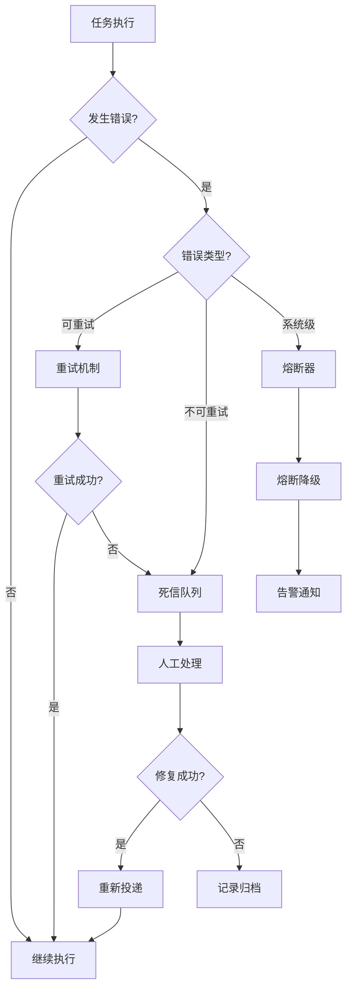
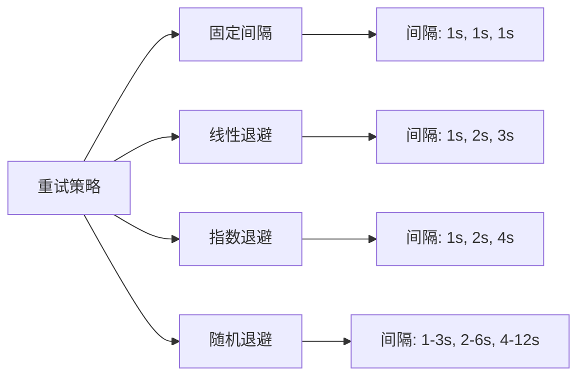
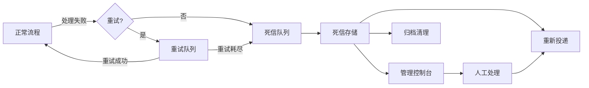
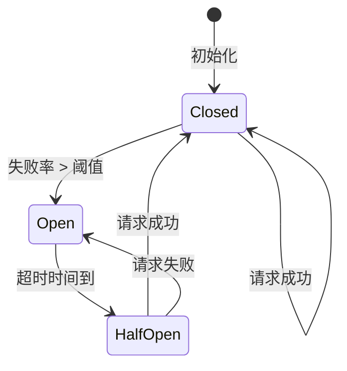
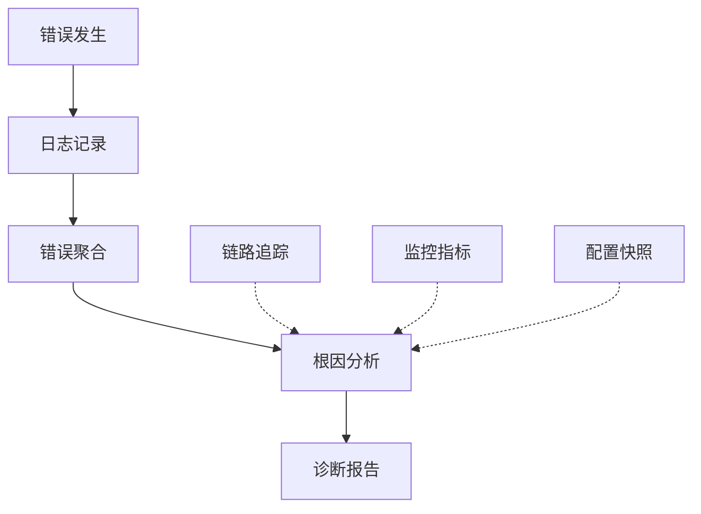

# 异常处理机制

轻易云 DataHub 提供了完善的异常处理机制，确保数据集成任务在遇到错误时能够优雅地处理并恢复。本文档详细介绍异常分类、重试策略、死信队列、熔断降级和错误告警等核心功能。

## 概述

在数据集成过程中，由于网络波动、数据源异常、格式错误等各种原因，错误不可避免。完善的异常处理机制能够：

- 确保数据不丢失
- 最小化错误影响范围
- 提供清晰的错误诊断信息
- 支持自动恢复和人工干预



## 异常分类和处理

### 异常类型体系

| 异常类型 | 说明 | 是否可重试 | 处理策略 |
|---------|------|-----------|---------|
| 网络异常 | 连接超时、连接中断 | 是 | 指数退避重试 |
| 数据源异常 | 数据库宕机、服务不可用 | 是 | 有限重试 + 告警 |
| 数据格式异常 | JSON 解析失败、类型不匹配 | 否 | 记录到死信队列 |
| 业务规则异常 | 违反约束、校验失败 | 否 | 死信队列 + 人工处理 |
| 权限异常 | 认证失败、无权访问 | 否 | 立即停止 + 告警 |
| 资源异常 | 内存不足、磁盘满 | 视情况 | 降速/暂停 + 告警 |
| 配置异常 | 配置错误、参数缺失 | 否 | 立即停止 |

### 异常处理流程

```javascript
// 异常分类处理示例
class ExceptionHandler {
  async handle(error, context) {
    const errorType = this.classifyError(error);
    
    switch (errorType) {
      case 'NETWORK_ERROR':
        return await this.handleNetworkError(error, context);
        
      case 'DATA_FORMAT_ERROR':
        return await this.handleDataError(error, context);
        
      case 'PERMISSION_ERROR':
        return await this.handlePermissionError(error, context);
        
      case 'RESOURCE_ERROR':
        return await this.handleResourceError(error, context);
        
      default:
        return await this.handleUnknownError(error, context);
    }
  }
  
  classifyError(error) {
    if (error.code === 'ECONNRESET' || error.code === 'ETIMEDOUT') {
      return 'NETWORK_ERROR';
    }
    if (error.name === 'SyntaxError' || error.name === 'TypeError') {
      return 'DATA_FORMAT_ERROR';
    }
    if (error.code === 403 || error.code === 401) {
      return 'PERMISSION_ERROR';
    }
    // ... 更多分类
    return 'UNKNOWN';
  }
}
```

### 全局异常捕获

```javascript
// DataHub 全局异常处理器配置
const errorHandlingConfig = {
  // 全局异常处理器
  globalExceptionHandler: {
    enabled: true,
    // 是否吞没异常（继续执行）
    swallow: false,
    // 异常日志级别
    logLevel: 'error'
  },
  
  // 阶段级异常处理
  stageExceptionHandlers: {
    extract: {
      onError: 'retry',  // retry, skip, stop
      maxRetries: 3
    },
    transform: {
      onError: 'skip',  // 单条记录失败跳过
      errorLog: true
    },
    load: {
      onError: 'batch_retry',  // 批次级重试
      batchRetrySize: 100
    }
  }
};
```

## 重试策略配置

### 重试策略类型



### 配置示例

```yaml
# 重试策略配置
retry_policy:
  # 默认策略
  default:
    strategy: "exponential_backoff"
    max_retries: 3
    base_delay_ms: 1000
    max_delay_ms: 30000
    multiplier: 2
    jitter: true  # 添加随机抖动
    
  # 特定错误类型的策略
  by_error_type:
    network_error:
      strategy: "exponential_backoff"
      max_retries: 5
      base_delay_ms: 1000
      
    database_error:
      strategy: "linear_backoff"
      max_retries: 3
      base_delay_ms: 2000
      increment_ms: 2000
      
    rate_limit_error:
      strategy: "fixed_delay"
      max_retries: 10
      delay_ms: 60000  # 等待 1 分钟
```

### 指数退避实现

```javascript
class ExponentialBackoffRetry {
  constructor(config) {
    this.maxRetries = config.maxRetries || 3;
    this.baseDelay = config.baseDelayMs || 1000;
    this.maxDelay = config.maxDelayMs || 30000;
    this.multiplier = config.multiplier || 2;
    this.jitter = config.jitter !== false;
  }
  
  async execute(operation, context) {
    let lastError;
    
    for (let attempt = 0; attempt <= this.maxRetries; attempt++) {
      try {
        return await operation();
      } catch (error) {
        lastError = error;
        
        // 判断是否需要重试
        if (attempt < this.maxRetries && this.isRetryable(error)) {
          const delay = this.calculateDelay(attempt);
          context.logger.warn(`操作失败，${delay}ms 后第 ${attempt + 1} 次重试`, {
            error: error.message,
            attempt: attempt + 1
          });
          await this.sleep(delay);
        } else {
          break;
        }
      }
    }
    
    throw lastError;
  }
  
  calculateDelay(attempt) {
    // 指数计算
    let delay = this.baseDelay * Math.pow(this.multiplier, attempt);
    
    // 限制最大延迟
    delay = Math.min(delay, this.maxDelay);
    
    // 添加随机抖动（避免惊群效应）
    if (this.jitter) {
      delay = delay * (0.5 + Math.random() * 0.5);
    }
    
    return Math.floor(delay);
  }
  
  isRetryable(error) {
    const retryableCodes = [
      'ECONNRESET', 'ECONNREFUSED', 'ETIMEDOUT',
      'ENOTFOUND', 'EPIPE', 'EAI_AGAIN'
    ];
    return retryableCodes.includes(error.code);
  }
  
  sleep(ms) {
    return new Promise(resolve => setTimeout(resolve, ms));
  }
}
```

## 死信队列

### 死信队列架构



### 死信队列配置

```yaml
# 死信队列配置
dead_letter_queue:
  # 启用死信队列
  enabled: true
  
  # 存储方式
  storage:
    type: "database"  # database, kafka, file
    table: "dead_letter_messages"
    retention_days: 30
    
  # 进入死信队列的条件
  conditions:
    - max_retries_exceeded
    - unretryable_error
    - manual_rejection
    
  # 消息格式
  message_format:
    include:
      - original_data
      - error_info
      - context_info
      - processing_history
      
  # 重投递配置
  redelivery:
    enabled: true
    max_attempts: 3
    # 支持的修复后重投递
    manual_redelivery: true
```

### 死信消息结构

```json
{
  "id": "dlq_msg_001",
  "created_at": "2024-01-15T10:30:00Z",
  "original_message": {
    "source": "orders",
    "data": { /* 原始数据 */ }
  },
  "error_info": {
    "type": "DATA_VALIDATION_ERROR",
    "message": "字段 'amount' 必须为数值类型",
    "code": "E1001",
    "stack_trace": "..."
  },
  "context": {
    "job_id": "job_123",
    "task_id": "task_456",
    "stage": "transform",
    "timestamp": "2024-01-15T10:29:58Z"
  },
  "processing_history": [
    {
      "attempt": 1,
      "timestamp": "2024-01-15T10:29:50Z",
      "error": "连接超时",
      "action": "retry"
    },
    {
      "attempt": 2,
      "timestamp": "2024-01-15T10:29:55Z",
      "error": "数据格式错误",
      "action": "dead_letter"
    }
  ],
  "status": "pending",
  "retry_count": 0
}
```

## 熔断降级

### 熔断器原理



| 状态 | 说明 | 行为 |
|-----|------|------|
| Closed | 关闭状态 | 正常处理请求，监控失败率 |
| Open | 熔断状态 | 拒绝请求，快速失败 |
| Half-Open | 半开状态 | 允许少量请求测试恢复情况 |

### 熔断器配置

```yaml
# 熔断器配置
circuit_breaker:
  enabled: true
  
  # 触发熔断的条件
  failure_threshold: 50  # 失败率百分比阈值
  slow_call_threshold: 80  # 慢调用率百分比阈值
  
  # 统计窗口
  sliding_window:
    type: "count"  # count, time
    size: 100  # 最近 100 次调用
    
  # 等待时间（熔断后多久进入半开状态）
  wait_duration_in_open_state: 60000  # 60 秒
  
  # 半开状态配置
  permitted_calls_in_half_open: 5  # 允许 5 个测试请求
  
  # 慢调用定义
  slow_call:
    enabled: true
    threshold_ms: 5000  # 超过 5 秒视为慢调用
    
  # 降级策略
  fallback:
    enabled: true
    strategy: "return_default"  # return_default, use_cache, skip
    default_value: null
```

### 熔断器实现

```javascript
class CircuitBreaker {
  constructor(config) {
    this.failureThreshold = config.failureThreshold || 50;
    this.waitDuration = config.waitDurationInOpenState || 60000;
    this.permittedCallsInHalfOpen = config.permittedCallsInHalfOpen || 5;
    
    this.state = 'CLOSED';
    this.failureCount = 0;
    this.successCount = 0;
    this.lastFailureTime = null;
    this.halfOpenCalls = 0;
  }
  
  async execute(operation, fallback) {
    if (this.state === 'OPEN') {
      if (Date.now() - this.lastFailureTime > this.waitDuration) {
        this.state = 'HALF_OPEN';
        this.halfOpenCalls = 0;
      } else {
        return await fallback();
      }
    }
    
    if (this.state === 'HALF_OPEN' && this.halfOpenCalls >= this.permittedCallsInHalfOpen) {
      return await fallback();
    }
    
    if (this.state === 'HALF_OPEN') {
      this.halfOpenCalls++;
    }
    
    try {
      const result = await operation();
      this.onSuccess();
      return result;
    } catch (error) {
      this.onFailure();
      throw error;
    }
  }
  
  onSuccess() {
    this.failureCount = 0;
    this.successCount++;
    
    if (this.state === 'HALF_OPEN') {
      this.state = 'CLOSED';
      this.halfOpenCalls = 0;
    }
  }
  
  onFailure() {
    this.failureCount++;
    this.lastFailureTime = Date.now();
    
    const failureRate = (this.failureCount / (this.failureCount + this.successCount)) * 100;
    
    if (failureRate >= this.failureThreshold) {
      this.state = 'OPEN';
    }
  }
}
```

## 错误告警

### 告警级别体系

| 级别 | 说明 | 响应时间要求 | 通知渠道 |
|-----|------|------------|---------|
| P0 - 紧急 | 系统完全不可用 | 立即 | 电话 + 短信 + 邮件 |
| P1 - 严重 | 核心功能受损 | 5 分钟 | 短信 + 邮件 |
| P2 - 一般 | 部分功能异常 | 30 分钟 | 邮件 |
| P3 - 提示 | 非关键问题 | 无需处理 | 系统内通知 |

### 告警配置

```yaml
# 告警配置
alerts:
  # 告警渠道
  channels:
    email:
      enabled: true
      smtp:
        host: "smtp.example.com"
        port: 587
        username: "${SMTP_USER}"
        password: "${SMTP_PASS}"
      recipients:
        - "ops@example.com"
        - "dba@example.com"
        
    sms:
      enabled: true
      provider: "aliyun"
      access_key: "${SMS_ACCESS_KEY}"
      secret: "${SMS_SECRET}"
      templates:
        p0: "SMS_123456"  # 紧急告警模板
        p1: "SMS_123457"  # 严重告警模板
      phone_numbers:
        - "13800138000"
        
    webhook:
      enabled: true
      url: "https://hooks.slack.com/services/xxx"
      headers:
        Authorization: "Bearer ${WEBHOOK_TOKEN}"
        
  # 告警规则
  rules:
    - name: "任务连续失败"
      condition: "job.failures >= 3 in 10m"
      level: "p1"
      channels: ["email", "sms"]
      
    - name: "数据延迟过高"
      condition: "lag_seconds > 300"
      level: "p1"
      channels: ["email", "sms"]
      
    - name: "死信队列堆积"
      condition: "dead_letter_queue.size > 1000"
      level: "p2"
      channels: ["email"]
      
    - name: "系统异常"
      condition: "system.error_rate > 1%"
      level: "p0"
      channels: ["email", "sms", "webhook"]
      
  # 告警抑制
  suppression:
    # 同一规则告警间隔
    cooldown_minutes: 30
    # 批量聚合窗口
    aggregation_window: 5
```

### 告警消息模板

```javascript
// 告警消息生成
function generateAlertMessage(alert) {
  const templates = {
    p0: {
      subject: "🚨 【紧急】DataHub 系统异常",
      body: `
【告警级别】P0 - 紧急
【告警时间】${alert.timestamp}
【告警规则】${alert.ruleName}
【触发条件】${alert.condition}
【影响范围】${alert.scope}

【错误详情】
${alert.details}

【建议操作】
1. 立即检查系统状态
2. 查看错误日志
3. 必要时执行回滚

【相关链接】
- 管理控制台: ${alert.consoleUrl}
- 错误日志: ${alert.logUrl}
      `
    },
    
    p1: {
      subject: "⚠️ 【严重】DataHub 任务异常",
      body: `
【告警级别】P1 - 严重
【告警时间】${alert.timestamp}
【任务名称】${alert.jobName}
【任务 ID】${alert.jobId}
【失败次数】${alert.failureCount}

【最近错误】
${alert.lastError}

【处理建议】
请检查任务配置和数据源状态。
      `
    }
  };
  
  return templates[alert.level];
}
```

## 错误日志与诊断

### 结构化日志

```json
{
  "timestamp": "2024-01-15T10:30:00.123Z",
  "level": "ERROR",
  "logger": "DataHub.Extract",
  "message": "数据库连接失败",
  "context": {
    "job_id": "job_12345",
    "task_id": "task_67890",
    "stage": "extract",
    "connector": "mysql",
    "table": "orders"
  },
  "error": {
    "type": "ConnectionError",
    "code": "ECONNREFUSED",
    "message": "连接被拒绝",
    "stack_trace": "..."
  },
  "metrics": {
    "retry_count": 3,
    "duration_ms": 5000
  },
  "trace_id": "trace_abc123",
  "span_id": "span_def456"
}
```

### 错误诊断工具



## 最佳实践

> [!TIP]
> 1. 对所有外部调用配置适当的超时和重试机制
> 2. 区分可重试错误和不可重试错误，避免无效重试
> 3. 启用死信队列，确保错误数据不丢失
> 4. 配置熔断器保护下游系统免受级联故障影响
> 5. 建立分级告警机制，确保关键问题及时响应
> 6. 记录完整的错误上下文，便于问题诊断
> 7. 定期分析错误日志，发现系统性问题

通过以上异常处理机制，您可以构建健壮、可靠的数据集成系统，最大程度地减少错误对业务的影响。
