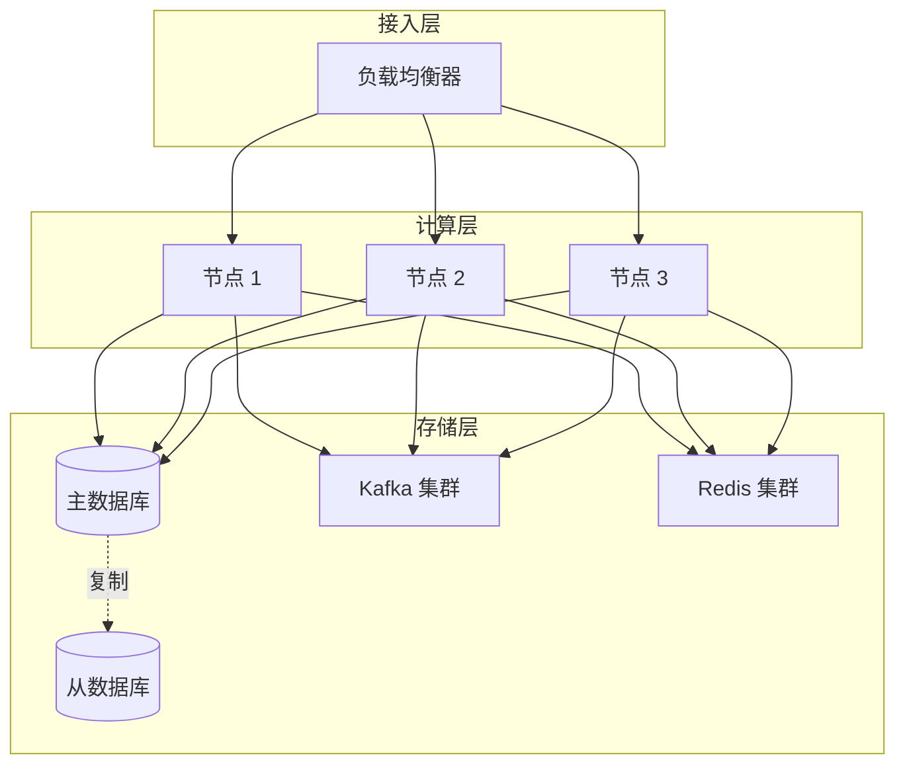
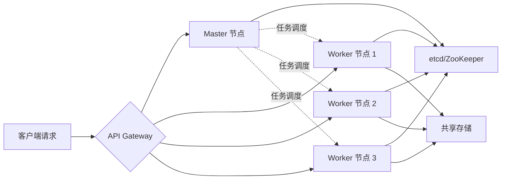
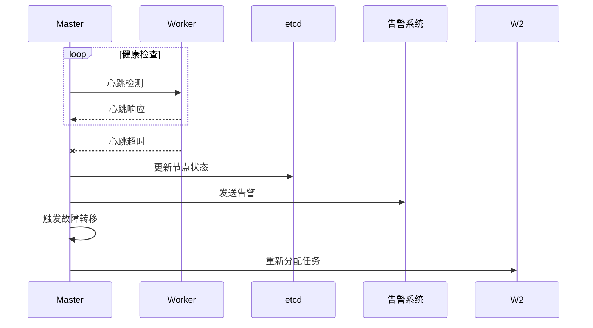
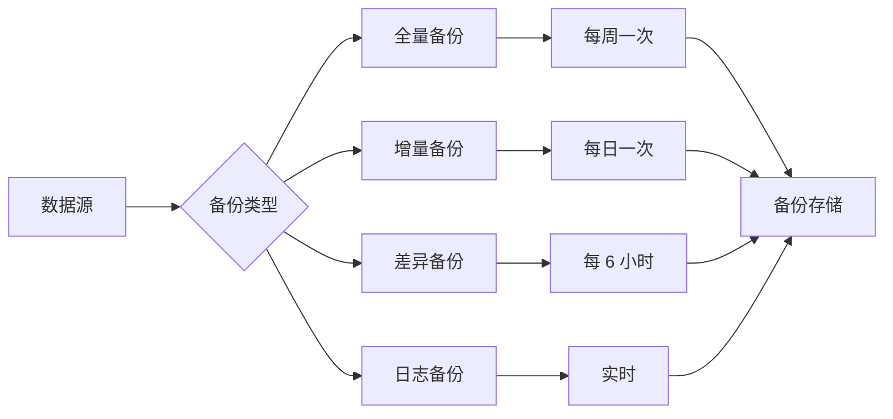
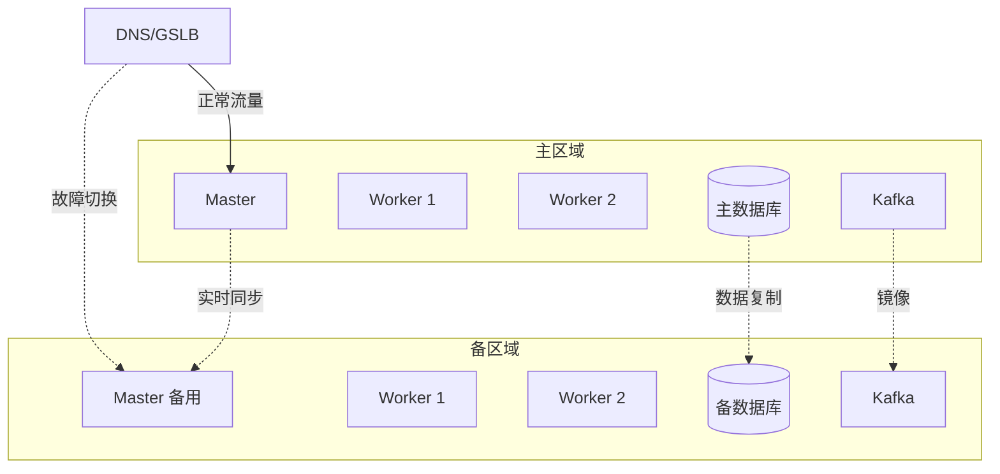

# 高可用配置

轻易云 DataHub 提供了完善的高可用解决方案，确保数据集成服务在各种故障场景下持续可用。本文档详细介绍高可用架构、故障转移、负载均衡、数据备份和灾难恢复等内容。

## 概述

高可用性（High Availability，HA）是指系统在面对硬件故障、软件错误、网络中断等各种异常情况下，仍能持续提供服务的能力。轻易云 DataHub 通过多层次的冗余设计和自动故障恢复机制，实现 99.99% 以上的可用性目标。



## 高可用架构

### 1. 架构分层设计

| 层级 | 组件 | 冗余策略 | 故障恢复时间 |
|-----|------|---------|------------|
| 接入层 | 负载均衡器 | 主备模式 | < 30s |
| 计算层 | DataHub 节点 | 多活集群 | 自动切换 |
| 存储层 | 数据库 | 主从复制 | < 60s |
| 消息层 | Kafka | 多副本 | 自动恢复 |
| 缓存层 | Redis | 哨兵/集群 | < 10s |

### 2. DataHub 集群架构



### 3. 节点角色说明

| 角色 | 数量 | 职责 | 故障影响 |
|-----|------|------|---------|
| Master | 2（主备） | 任务调度、元数据管理 | 备节点接管 |
| Worker | 3+ | 任务执行 | 任务重分配到其他节点 |
| etcd | 3/5 | 分布式协调 | 需多数节点存活 |

## 故障转移

### 1. 故障检测机制



### 2. 自动故障转移配置

```yaml
# 故障转移配置
failover:
  enabled: true
  
  # 健康检查
  health_check:
    interval: 10          # 检查间隔（秒）
    timeout: 5            # 超时时间（秒）
    failure_threshold: 3  # 失败阈值
    
  # 故障转移策略
  strategy:
    master_failure:
      action: "elect_new_master"  # 选举新主节点
      timeout: 30
      
    worker_failure:
      action: "reschedule_tasks"  # 重新调度任务
      grace_period: 60  # 优雅停机等待时间
      
    storage_failure:
      action: "switch_to_replica"  # 切换到副本
      delay: 5
      
  # 脑裂保护
  split_brain_protection:
    enabled: true
    min_nodes: 2  # 最小决策节点数
```

### 3. 任务级故障恢复

```javascript
// 任务故障恢复配置
const taskRecovery = {
  // 检查点机制
  checkpoint: {
    enabled: true,
    interval: 30000,  // 30 秒
    storage: "distributed"
  },
  
  // 故障恢复策略
  on_failure: {
    action: "restart",  // restart, resume, failover
    max_restarts: 3,
    restart_delay: 10,
    
    // 恢复点选择
    resume_from: "last_checkpoint"  // last_checkpoint, beginning
  },
  
  // 状态持久化
  state_persistence: {
    enabled: true,
    backend: "redis",
    ttl: 86400  // 24 小时
  }
};
```

## 负载均衡

### 1. 负载均衡策略

| 策略 | 说明 | 适用场景 |
|-----|------|---------|
| 轮询（Round Robin） | 依次分配到各节点 | 节点性能均衡 |
| 权重（Weighted） | 按权重比例分配 | 节点性能不均 |
| 最少连接（Least Connections） | 分配到连接数最少的节点 | 长连接场景 |
| 一致性哈希（Consistent Hash） | 相同 key 路由到相同节点 | 有状态服务 |
| 资源感知（Resource Aware） | 基于 CPU/内存使用率 | 动态负载 |

### 2. DataHub 负载均衡配置

```yaml
# 负载均衡配置
load_balancer:
  # 策略
  strategy: "least_connections"
  
  # 会话保持
  session_affinity:
    enabled: false
    cookie_name: "DATAHUB_SESSION"
    ttl: 3600
    
  # 健康检查
  health_check:
    path: "/health"
    interval: 10
    timeout: 5
    unhealthy_threshold: 3
    healthy_threshold: 2
    
  # 熔断配置
  circuit_breaker:
    enabled: true
    failure_threshold: 50
    reset_timeout: 30
    
  # 慢启动
  slow_start:
    enabled: true
    duration: 60
```

### 3. 任务调度负载均衡

```javascript
// 任务调度器
class TaskScheduler {
  scheduleTask(task) {
    // 获取可用节点
    const availableNodes = this.getAvailableNodes();
    
    // 计算节点负载
    const nodeLoads = availableNodes.map(node => ({
      node,
      load: this.calculateLoad(node),
      taskCount: node.runningTasks.length
    }));
    
    // 选择负载最低的节点
    const selectedNode = nodeLoads.reduce((min, current) => 
      current.load < min.load ? current : min
    );
    
    // 分配任务
    return this.assignTask(task, selectedNode.node);
  }
  
  calculateLoad(node) {
    // 综合 CPU、内存、任务数计算负载
    const cpuWeight = 0.4;
    const memoryWeight = 0.3;
    const taskWeight = 0.3;
    
    return (
      node.cpuUsage * cpuWeight +
      node.memoryUsage * memoryWeight +
      (node.runningTasks.length / node.capacity) * taskWeight
    );
  }
}
```

## 数据备份

### 1. 备份策略



| 备份类型 | 频率 | 保留周期 | 恢复时间 | 存储空间 |
|---------|------|---------|---------|---------|
| 全量备份 | 每周 | 4 周 | 长 | 大 |
| 增量备份 | 每日 | 7 天 | 中 | 小 |
| 差异备份 | 每 6 小时 | 3 天 | 中 | 中 |
| 日志备份 | 实时 | 24 小时 | 短 | 小 |

### 2. DataHub 元数据备份

```yaml
# 元数据备份配置
metadata_backup:
  enabled: true
  
  # 备份内容
  include:
    - job_definitions      # 任务定义
    - connection_configs   # 连接配置
    - transformation_rules # 转换规则
    - execution_history    # 执行历史
    - audit_logs          # 审计日志
    
  # 备份策略
  schedule:
    full_backup:
      cron: "0 2 * * 0"  # 每周日凌晨 2 点
      retention: 4       # 保留 4 份
      
    incremental_backup:
      cron: "0 */6 * * *"  # 每 6 小时
      retention: 12        # 保留 12 份
      
  # 存储配置
  storage:
    type: "s3"  # s3, azure_blob, gcs, nfs
    s3:
      bucket: "datahub-backups"
      region: "cn-north-1"
      encryption: "AES256"
```

### 3. 任务状态备份

```javascript
// 任务状态备份
class TaskStateBackup {
  async backupTaskState(taskId) {
    const state = await this.getTaskState(taskId);
    
    const backup = {
      taskId,
      timestamp: new Date().toISOString(),
      version: 1,
      data: {
        progress: state.progress,
        checkpoint: state.checkpoint,
        statistics: state.statistics,
        metadata: state.metadata
      }
    };
    
    // 加密存储
    const encrypted = await this.encrypt(backup);
    
    // 存储到分布式存储
    await this.storage.put(
      `backups/tasks/${taskId}/${backup.timestamp}`,
      encrypted
    );
    
    return backup;
  }
  
  async restoreTaskState(taskId, timestamp) {
    const key = `backups/tasks/${taskId}/${timestamp}`;
    const encrypted = await this.storage.get(key);
    
    const backup = await this.decrypt(encrypted);
    
    await this.setTaskState(taskId, backup.data);
    
    return backup;
  }
}
```

## 灾难恢复

### 1. 灾难恢复等级

| 等级 | RTO（恢复时间目标） | RPO（恢复点目标） | 适用场景 |
|-----|------------------|------------------|---------|
| 青铜级 | < 4 小时 | < 24 小时 | 开发测试环境 |
| 白银级 | < 1 小时 | < 1 小时 | 一般业务系统 |
| 黄金级 | < 15 分钟 | < 5 分钟 | 重要业务系统 |
| 白金级 | < 5 分钟 | < 1 分钟 | 核心业务系统 |

### 2. 跨地域容灾架构



### 3. 灾难恢复预案

```yaml
# 灾难恢复配置
disaster_recovery:
  # 容灾等级
  tier: "gold"  # bronze, silver, gold, platinum
  
  # RTO/RPO 目标
  objectives:
    rto_minutes: 15
    rpo_minutes: 5
    
  # 备用区域
  standby_region:
    enabled: true
    region: "cn-north-2"
    sync_mode: "async"  # sync, async
    
  # 自动故障切换
  auto_failover:
    enabled: true
    
    # 触发条件
    triggers:
      - type: "health_check_failure"
        threshold: 3
        duration: 300  # 5 分钟
        
      - type: "error_rate"
        threshold: 50  # 50%
        duration: 180  # 3 分钟
        
    # 切换前检查
    pre_checks:
      - standby_health
      - data_lag_acceptable
      - resource_available
      
  # 切换流程
  failover_procedure:
    1: "停止主区域写入"
    2: "确认数据同步完成"
    3: "提升备区域为主"
    4: "更新 DNS 记录"
    5: "通知客户端重连"
    6: "启动监控和验证"
```

### 4. 灾难恢复演练

```yaml
# 演练配置
dr_drill:
  schedule:
    frequency: "monthly"  # weekly, monthly, quarterly
    day: "saturday"
    time: "02:00"
    
  scope:
    - component_failover     # 组件故障切换
    - node_failover          # 节点故障切换
    - region_failover        # 区域故障切换
    - data_recovery          # 数据恢复
    
  validation:
    check_data_integrity: true
    check_service_availability: true
    check_rto_compliance: true
    
  notification:
    before_drill: 86400  # 提前 24 小时通知
    after_drill: true    # 演练后通知
```

## 监控与告警

### 1. 高可用监控指标

| 指标 | 说明 | 告警阈值 |
|-----|------|---------|
| node_availability | 节点可用率 | < 99.9% |
| failover_count | 故障切换次数 | > 0 |
| failover_duration | 故障切换耗时 | > 60s |
| replication_lag | 数据复制延迟 | > 10s |
| backup_success_rate | 备份成功率 | < 100% |
| dr_sync_status | 灾备同步状态 | unhealthy |

### 2. 高可用告警配置

```yaml
# 高可用告警
alerts:
  ha:
    - name: "node_down"
      condition: "node_status = 'down'"
      severity: "critical"
      auto_resolve: false
      
    - name: "failover_occurred"
      condition: "failover_count > 0"
      severity: "warning"
      notification:
        channels: ["email", "sms"]
        
    - name: "replication_lag_high"
      condition: "replication_lag > 10s"
      severity: "warning"
      threshold:
        warning: 10
        critical: 60
        
    - name: "backup_failed"
      condition: "backup_status = 'failed'"
      severity: "critical"
```

## 最佳实践

> [!TIP]
> 1. 至少部署 3 个 Worker 节点，确保单点故障不影响服务
> 2. 启用自动故障转移，减少人工干预时间
> 3. 定期进行灾难恢复演练，验证预案有效性
> 4. 备份数据异地存储，防止区域性灾难
> 5. 监控复制延迟，确保 RPO 目标达成
> 6. 使用 etcd 集群（3 或 5 节点），保证分布式协调可靠性
> 7. 配置合理的健康检查参数，避免误判

通过以上高可用配置和最佳实践，您可以构建企业级的数据集成服务，确保业务的连续性和数据的可靠性。
