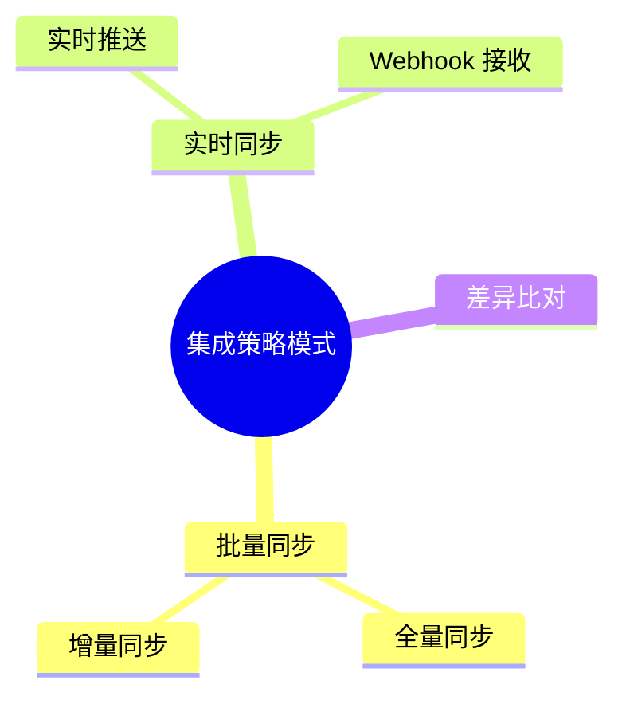
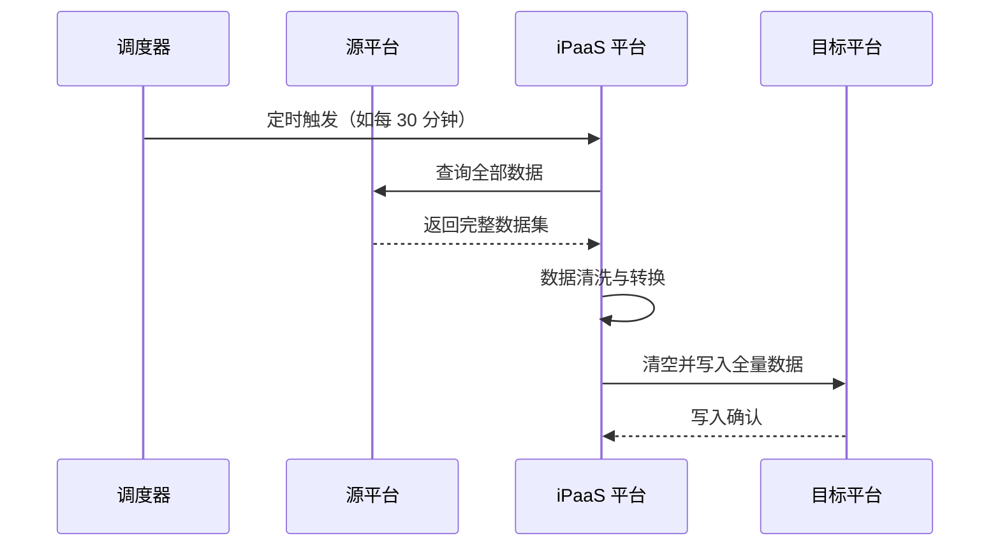
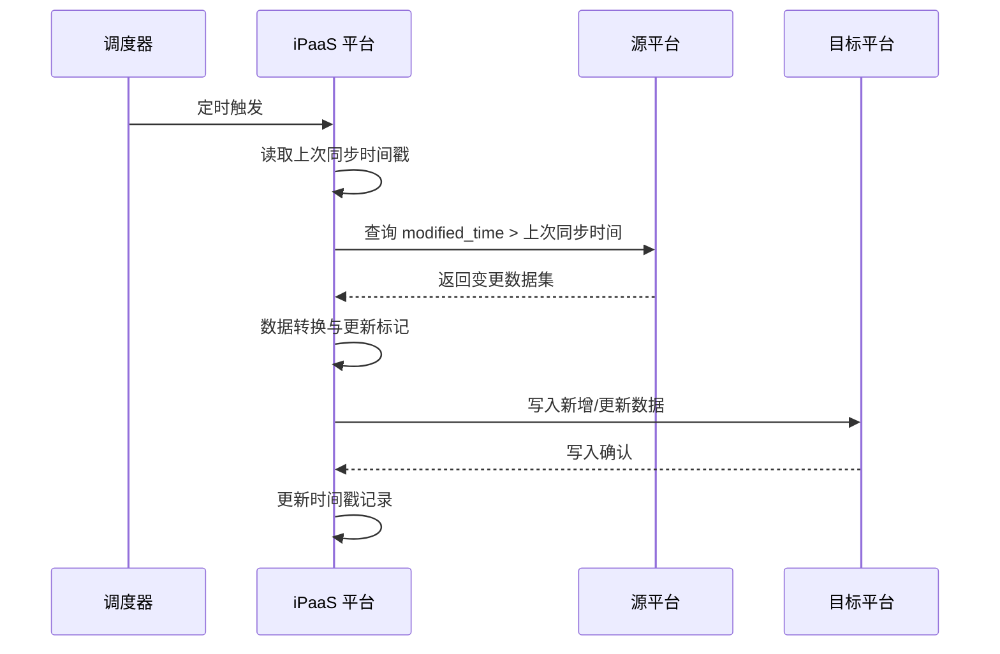
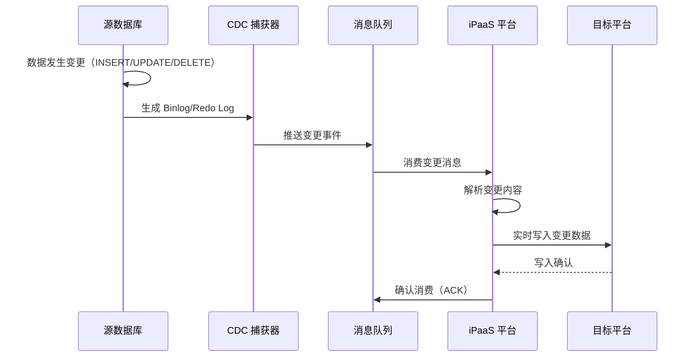
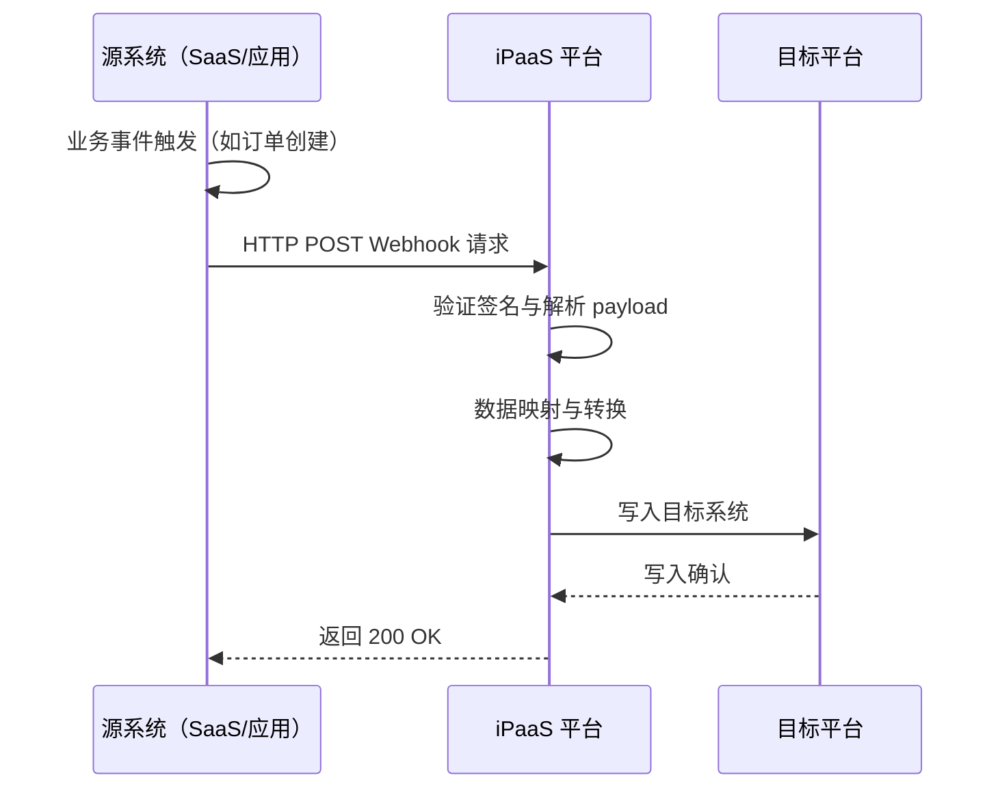
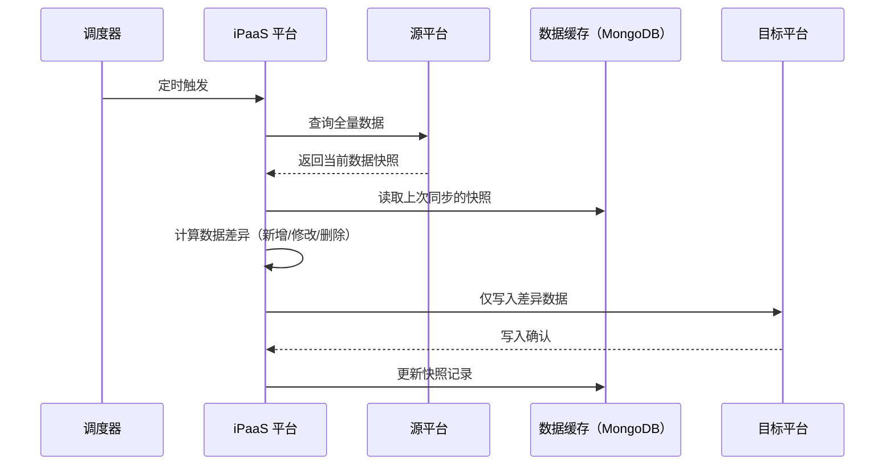
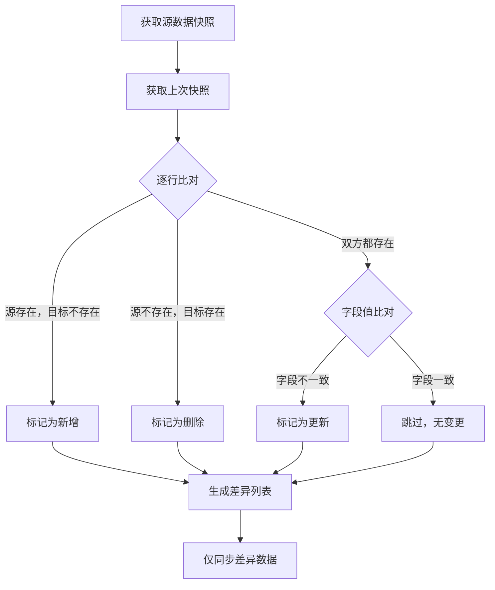
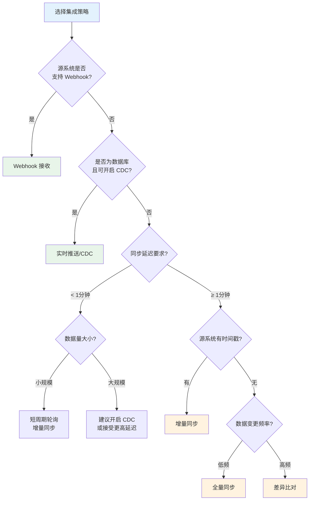
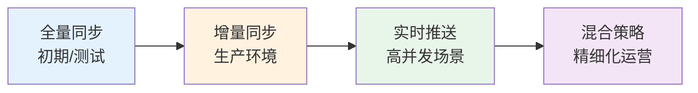

# 集成策略模式

集成策略模式定义了数据在源平台与目标平台之间的流转方式，包括数据何时读取、何时写入以及触发机制。轻易云 iPaaS 平台提供五种核心集成策略模式，涵盖从传统批量同步到实时事件驱动的全场景需求，帮助你根据业务特点选择最合适的数据集成方案。

> [!NOTE]
> 策略模式在集成方案的**源平台配置**和**目标平台配置**中分别设置，两者可自由组合形成更复杂的集成策略。

## 策略模式概览



| 策略模式 | 核心特点 | 延迟 | 适用数据量 | 复杂度 |
| -------- | -------- | ---- | ---------- | ------ |
| **全量同步** | 每次同步全部数据 | 分钟级 | 中小规模 | ⭐⭐ |
| **增量同步** | 仅同步变更数据 | 分钟级 | 大规模 | ⭐⭐⭐ |
| **实时推送** | 数据变更即时推送 | 秒级/毫秒级 | 中等规模 | ⭐⭐⭐⭐ |
| **Webhook 接收** | 被动接收推送事件 | 秒级 | 不确定 | ⭐⭐⭐ |
| **差异比对** | 智能识别差异并同步 | 分钟级 | 大规模 | ⭐⭐⭐⭐ |

## 全量同步

全量同步模式每次执行时从源平台拉取全部符合条件的数据，并完整写入目标平台。适用于数据量不大、需要定期刷新全量的场景。

### 工作原理



### 配置方法

在源平台配置中，设置查询条件获取全部数据（不限制时间范围）：

```json
{
  "api": "purchasein.query",
  "type": "QUERY",
  "method": "POST",
  "params": {
    "status": "confirmed"
  }
}
```

在目标平台配置中，根据需要选择写入策略：

```json
{
  "api": "purchasein.create",
  "type": "CREATE",
  "method": "POST",
  "writeMode": "upsert"
}
```

### 适用场景

| 场景 | 说明 |
| ---- | ---- |
| **基础数据同步** | 物料档案、客户档案等配置类数据，变更频率低 |
| **历史数据迁移** | 首次上线时的全量数据初始化 |
| **数据核对场景** | 需要定期全量对账的场景 |
| **中小数据量** | 单次同步数据量在 10 万条以内 |

### 限制与注意事项

> [!WARNING]
> - 全量同步会占用较多源平台 API 调用配额，频繁执行可能导致接口限流
> - 目标平台需支持幂等写入（如 `upsert` 模式），避免数据重复
> - 数据量过大时可能导致内存溢出，建议配合分页参数使用

## 增量同步

增量同步模式仅同步自上次执行以来发生变化的数据。通过时间戳、状态标记或增量 ID 等机制识别新增和变更数据，大幅提升同步效率。

### 工作原理



### 配置方法

使用平台内置变量 `{{LAST_SYNC_TIME}}` 实现增量查询：

```json
{
  "api": "purchasein.query",
  "type": "QUERY",
  "method": "POST",
  "params": {
    "start_time": "{{LAST_SYNC_TIME}}",
    "status": "confirmed"
  }
}
```

> [!TIP]
> `{{LAST_SYNC_TIME}}` 是平台保留变量，自动记录上次成功执行的时间戳（毫秒级）。首次执行时，系统会使用方案创建时间作为默认值。

### 时间偏移配置

为防止网络延迟导致的数据遗漏，建议在时间条件上增加缓冲：

```json
{
  "params": {
    "start_time": "_function {{LAST_SYNC_TIME}} - 600000",
    "end_time": "_function {{CURRENT_TIME}} - 60000"
  }
}
```

上述配置表示：
- 查询起始时间：上次同步时间往前推 10 分钟（600000 毫秒）
- 查询截止时间：当前时间往前推 1 分钟（60000 毫秒）

### 适用场景

| 场景 | 说明 |
| ---- | ---- |
| **交易数据同步** | 订单、出入库单据等高频变更的业务数据 |
| **日志数据同步** | 操作日志、审计日志等追加型数据 |
| **大规模数据** | 百万级甚至千万级数据量的场景 |
| **降低 API 消耗** | 需要严格控制源平台接口调用次数 |

### 限制与注意事项

> [!CAUTION]
> - 源平台必须提供可靠的时间戳字段或自增 ID 字段
> - 删除操作通常无法通过增量同步捕获，需要配合全量同步定期清理
> - 时间精度问题可能导致边界数据遗漏，务必设置合理的时间偏移量

## 实时推送

实时推送模式基于 CDC（Change Data Capture）或消息队列技术，在源数据发生变化时立即触发同步流程，实现秒级甚至毫秒级的数据同步延迟。

### 工作原理



### 配置方法

#### 方式一：CDC 实时同步（数据库源）

在源平台配置中选择 CDC 连接器，配置数据库连接与监控表：

```json
{
  "connector": "mysql-cdc",
  "config": {
    "host": "db.example.com",
    "port": 3306,
    "database": "erp_db",
    "tables": "orders,order_items",
    "serverId": 1001
  }
}
```

> [!IMPORTANT]
> 使用 CDC 模式需要数据库开启 Binlog（MySQL）或逻辑复制（PostgreSQL），且需要数据库账户具备相应权限。

#### 方式二：消息队列实时消费

配置 Kafka 或 RabbitMQ 作为数据源：

```json
{
  "connector": "kafka",
  "config": {
    "brokers": "kafka1:9092,kafka2:9092",
    "topic": "order-events",
    "consumerGroup": "ipaas-order-sync",
    "format": "json"
  }
}
```

### 适用场景

| 场景 | 说明 |
| ---- | ---- |
| **库存实时扣减** | 电商场景下库存变动需立即同步至各销售渠道 |
| **订单状态流转** | 订单付款、发货等状态变更需实时通知下游系统 |
| **资金账户变动** | 支付、退款等金融场景的数据一致性要求 |
| **实时监控大屏** | 业务数据实时展示，延迟要求在秒级以内 |

### 限制与注意事项

> [!WARNING]
> - CDC 模式对数据库性能有一定影响，高并发场景需评估负载
> - 实时推送对网络稳定性要求较高，需配置断点续传和重试机制
> - 数据乱序问题：并发场景下变更事件可能乱序到达，需设计幂等处理逻辑

## Webhook 接收

Webhook 接收模式是一种被动式的集成策略，平台作为 HTTP 服务端接收来自源系统的推送通知，适用于源系统支持主动推送的场景（如 SaaS 应用、支付平台等）。

### 工作原理



### 配置方法

#### 步骤一：创建 Webhook 端点

在源平台配置中选择 Webhook 类型：

```json
{
  "type": "WEBHOOK",
  "endpoint": "/webhook/order-events",
  "method": "POST",
  "auth": {
    "type": "hmac",
    "header": "X-Signature",
    "secret": "{{WEBHOOK_SECRET}}"
  }
}
```

#### 步骤二：配置签名验证（可选但推荐）

```json
{
  "auth": {
    "type": "hmac",
    "algorithm": "sha256",
    "header": "X-Signature",
    "secret": "your-webhook-secret",
    "template": "timestamp={{timestamp}}&body={{rawBody}}"
  }
}
```

#### 步骤三：在源系统配置 Webhook 回调

将生成的 Webhook URL（如 `https://api.qeasy.cloud/webhook/order-events`）配置到源系统的 webhook 设置中。

> [!TIP]
> 平台支持为每个集成方案生成独立的 Webhook 端点，实现不同业务的事件隔离处理。

### 适用场景

| 场景 | 说明 |
| ---- | ---- |
| **SaaS 应用集成** | 钉钉、企业微信、金蝶云等支持 webhook 的应用 |
| **支付回调处理** | 支付宝、微信支付等支付结果通知 |
| **电商平台** | 淘宝、京东、拼多多等平台的订单推送 |
| **低延迟要求** | 需要即时响应外部系统事件 |

### 限制与注意事项

> [!CAUTION]
> - Webhook 接收存在数据丢失风险（如网络故障时），建议源系统支持重试机制
> - 需配置合理的请求超时时间和并发限制，防止瞬时流量洪峰
> - 务必启用签名验证，防止伪造请求攻击
> - 建议记录原始请求日志，便于问题追溯和数据补漏

## 差异比对

差异比对模式通过比较源数据与目标数据的差异，仅同步发生变化的部分。适用于无法使用时间戳增量、且数据量较大的场景，是一种智能化的全量比对方案。

### 工作原理



### 配置方法

启用差异比对需要在源平台配置中添加 `diffMode` 参数：

```json
{
  "api": "material.query",
  "type": "QUERY",
  "method": "POST",
  "diffMode": {
    "enabled": true,
    "keyField": "material_code",
    "compareFields": ["name", "spec", "price", "stock_qty"],
    "trackDelete": true
  }
}
```

配置参数说明：

| 参数 | 类型 | 必填 | 说明 |
| ---- | ---- | ---- | ---- |
| `enabled` | boolean | ✅ | 是否启用差异比对模式 |
| `keyField` | string | ✅ | 唯一标识字段，用于匹配源与目标记录 |
| `compareFields` | array | — | 参与比对的字段列表，不指定则比对全部 |
| `trackDelete` | boolean | — | 是否追踪删除操作（默认 `false`） |

### 比对算法说明



### 适用场景

| 场景 | 说明 |
| ---- | ---- |
| **无时间戳字段** | 源系统不提供修改时间字段，无法实现增量同步 |
| **历史遗留系统** | 老旧系统 API 能力有限，仅支持全量查询 |
| **数据一致性校验** | 需要定期比对两侧数据一致性的场景 |
| **补偿同步** | 作为增量同步的补偿机制，定期全量比对修复 |

### 限制与注意事项

> [!WARNING]
> - 差异比对需要缓存上次同步的全量数据，会增加存储开销
> - 大数据量场景下比对过程可能耗时较长，建议设置合理的执行周期（如每天一次）
> - 删除追踪依赖上次快照的完整性，首次启用时无法识别历史删除
> - 对数据一致性要求极高的场景，建议结合数据补漏机制使用

## 策略模式组合

在实际业务中，源端与目标端的策略可以自由组合，形成更复杂的集成策略。以下是常见的组合模式：

### 组合策略对照表

| 读取策略 | 写入策略 | 组合名称 | 典型应用场景 |
| -------- | -------- | -------- | ------------ |
| 定时异步（全量） | 定时异步（全量） | 定时全量同步 | 基础数据定期刷新 |
| 定时异步（增量） | 定时异步（增量） | 定时增量同步 | 交易数据批量同步 |
| 定时异步（增量） | 实时同步 | 批量转实时 | 批量读取后即时写入 |
| 事件触发（CDC） | 实时同步 | 全链路实时 | 库存、订单实时同步 |
| 事件触发（Webhook） | 实时同步 | 事件驱动 | SaaS 应用联动 |
| 事件触发 | 事件触发 | 链式触发 | 多方案级联执行 |
| 任意读取 | 空操作 | 测试/归档 | 仅读取不写入 |

### 链式触发配置示例

当需要多个方案按顺序执行时，可使用事件触发模式实现方案链：

```json
// 方案 A：读取订单
{
  "source": {
    "type": "WEBHOOK",
    "endpoint": "/webhook/orders"
  },
  "target": {
    "type": "EVENT",
    "eventName": "order_received",
    "writeMode": "trigger_next"
  }
}

// 方案 B：处理库存扣减（被方案 A 触发）
{
  "source": {
    "type": "EVENT",
    "listenEvent": "order_received"
  },
  "target": {
    "api": "inventory.deduct",
    "type": "UPDATE"
  }
}
```

## 策略选择决策树



## 最佳实践

### 1. 渐进式策略演进

建议根据业务发展逐步升级集成策略：



### 2. 数据一致性保障

| 策略模式 | 一致性风险 | 建议措施 |
| -------- | ---------- | -------- |
| 全量同步 | 低 | 使用幂等写入，定期全量覆盖 |
| 增量同步 | 中 | 设置合理的时间偏移，配合定期全量比对 |
| 实时推送 | 低 | 启用消息持久化，配置死信队列 |
| Webhook | 高 | 记录原始日志，实现幂等处理与重试机制 |
| 差异比对 | 低 | 配置删除追踪，定期全量校验 |

### 3. 性能优化建议

> [!TIP]
> - **批量写入**：即使是实时模式，也建议设置微批量（micro-batch）写入，减少 API 调用次数
> - **并发控制**：根据目标系统容量限制并发数，避免触发限流
> - **失败隔离**：单条记录失败不应影响批次中其他记录的处理
> - **监控告警**：对同步延迟、失败率等关键指标配置告警

## 常见问题

### Q: 增量同步和差异比对有什么区别？

| 维度 | 增量同步 | 差异比对 |
| ---- | ---- | ---- |
| 依赖条件 | 源系统时间戳字段 | 无特殊要求 |
| 存储开销 | 低（仅记录时间戳） | 高（需缓存全量快照） |
| 识别删除 | 通常不能 | 可以（开启 `trackDelete`） |
| 适用规模 | 大规模数据 | 中等规模数据 |
| 执行频率 | 高频（分钟级） | 低频（小时/天级） |

### Q: 实时推送模式下数据乱序如何处理？

建议采用以下策略保证数据最终一致性：

1. **版本号机制**：使用数据版本号或时间戳，写入时做 CAS（Compare-And-Swap）判断
2. **消息序号**：在消息中携带序号，接收端缓存并排序后处理
3. **业务幂等**：确保同一操作多次执行结果一致，接受乱序但最终正确

### Q: Webhook 接收失败如何排查？

排查步骤：

1. 检查平台**集成日志**，确认是否收到请求及返回状态码
2. 验证 Webhook URL 配置是否正确，网络是否可达
3. 检查签名验证配置，确认密钥和算法与源系统一致
4. 查看源系统的重试日志，确认失败原因

### Q: 能否同时使用多种策略？

可以。常见的混合策略包括：

- **增量 + 全量**：增量同步为主，每天凌晨执行一次全量同步兜底
- **CDC + Webhook**：数据库 CDC 同步业务数据，Webhook 接收外部事件通知
- **双写模式**：关键数据同时写入多个目标，保证高可用

## 相关文档

- [CDC 实时同步](./cdc-realtime) — 深入了解 CDC 技术原理与配置
- [批量数据处理](./batch-processing) — 大规模数据同步性能优化
- [异常处理机制](./error-handling) — 同步失败的重试与恢复策略
- [源平台配置](../guide/source-platform-config) — 详细的源端配置指南
- [目标平台配置](../guide/target-platform-config) — 详细的目标端配置指南
- [调试器](../guide/debugger) — 验证同步策略效果的调试工具
