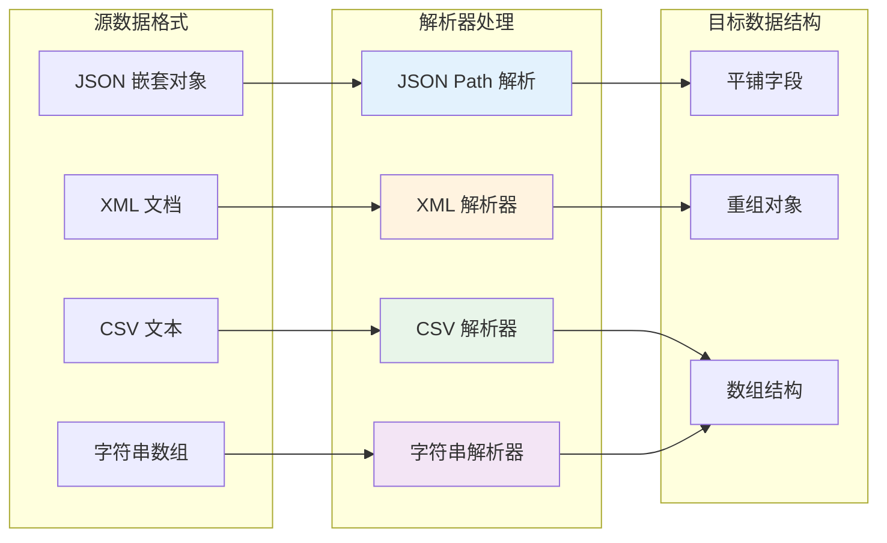
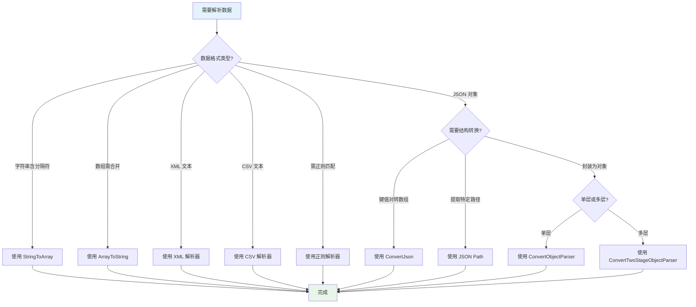

# 解析器的应用

解析器是轻易云 iPaaS 平台提供的数据转换组件，用于在数据集成过程中对复杂格式的数据进行提取、转换和重组。通过内置的多种解析器，你可以轻松处理 JSON、XML、CSV 等常见数据格式，以及应对金蝶、用友、泛微等特定系统的特殊数据格式需求，无需编写复杂代码即可完成数据结构的灵活转换。

---

## 解析器概述

在系统对接过程中，不同系统返回的数据格式往往存在差异。源系统可能返回嵌套的 JSON 对象、XML 文档、CSV 文本，或者特定厂商的专有格式。解析器功能提供了一套完整的解决方案，帮助你将这些数据转换为符合目标系统要求的格式。



### 解析器的分类

| 解析器类型 | 适用场景 | 典型应用 |
|-----------|---------|---------|
| **字符串解析器** | 字符串与数组之间的相互转换 | 逗号分隔的字段拆分、数组合并 |
| **JSON 解析器** | JSON 格式数据的提取与转换 | 嵌套对象扁平化、键值对重组 |
| **对象封装解析器** | 将简单值封装为复杂对象结构 | 金蝶 FNumber 格式、多层嵌套对象 |
| **特殊格式解析器** | 特定系统的专有格式处理 | 泛微 E9、K3wise、黑湖等 |

### 解析器与值格式化的区别

| 特性 | 解析器 | 值格式化 |
|------|--------|---------|
| **处理对象** | 复杂数据结构（对象、数组） | 简单值（字符串、数值、日期） |
| **转换能力** | 结构重组、嵌套处理 | 格式转换、精度控制 |
| **使用场景** | 数据结构转换 | 数据展示优化 |

> [!TIP]
> 对于简单的格式转换（如日期格式、金额千分位），请使用[值格式化](../guide/value-formatting)；对于复杂的数据结构转换，请使用解析器。

---

## 字符串解析器

字符串解析器用于处理字符串与数组之间的转换，适用于处理逗号分隔的文本、多值字段等场景。

### StringToArray：字符串转数组

将指定分隔符分隔的字符串转换为数组结构。

**功能说明**：
- 当输入字符串为空或仅包含空白字符时，返回空数组
- 使用指定分隔符（如逗号）将字符串分割为数组元素

**配置参数**：

| 参数 | 类型 | 必填 | 说明 |
|------|------|------|------|
| `name` | string | ✅ | 固定值为 `StringToArray` |
| `params` | string | ✅ | 分隔符，如 `,`、`|`、`;` 等 |

**配置示例**：

```json
{
  "name": "StringToArray",
  "params": ","
}
```

**数据转换效果**：

| 源数据 | 转换结果 |
|--------|---------|
| `"priuserdefnvc1,priuserdefnvc2"` | `["priuserdefnvc1", "priuserdefnvc2"]` |
| `"A|B|C"`（配合 `params": "\|"`） | `["A", "B", "C"]` |

**应用场景**：
- 处理多选字段的值（如标签、分类）
- 拆分逗号分隔的物料编码列表
- 解析 CSV 格式的简单文本字段

---

### ArrayToString：数组转字符串

将数组中的元素按照指定分隔符连接成一个字符串。

**功能说明**：
- 使用 `implode` 方式将数组合并为字符串
- 支持自定义分隔符

**配置参数**：

| 参数 | 类型 | 必填 | 说明 |
|------|------|------|------|
| `name` | string | ✅ | 固定值为 `ArrayToString` |
| `params` | string | ✅ | 分隔符，如 `,`、`|` 等 |

**配置示例**：

```json
{
  "name": "ArrayToString",
  "params": ","
}
```

**数据转换效果**：

| 源数据 | 转换结果 |
|--------|---------|
| `["test1", "test2", "test3"]` | `"test1,test2,test3"` |
| `["P001", "P002", "P003"]`（配合 `params": "\|"`） | `"P001\|P002\|P003"` |

**应用场景**：
- 将多值字段合并为单一文本存储
- 生成逗号分隔的查询条件
- 构建特定格式的标识字符串

---

## JSON 解析器

JSON 解析器用于处理 JSON 格式数据的提取、转换和重组，支持嵌套对象扁平化、键值对转换等操作。

### ConvertJson：JSON 键值对转换

将对象格式的键值对转换为标准的数组结构，便于后续的数据映射处理。

**功能说明**：
- 移除输入字符串中的所有换行符
- 将对象键值对转换为包含 `Key` 和 `Value` 属性的数组

**配置参数**：

| 参数 | 类型 | 必填 | 说明 |
|------|------|------|------|
| `name` | string | ✅ | 固定值为 `ConvertJson` |

**配置示例**：

```json
{
  "name": "ConvertJson"
}
```

**数据转换效果**：

**源数据**：
```json
{
  "FName": {
    "1033": "2037",
    "2052": "2037"
  }
}
```

**转换结果**：
```json
{
  "FName": [
    {
      "Key": 1033,
      "Value": "2037"
    },
    {
      "Key": 2052,
      "Value": "2037"
    }
  ]
}
```

**应用场景**：
- 处理多语言字段（键为语言代码，值为翻译内容）
- 转换动态属性字段
- 处理金蝶等系统的辅助属性数据

---

## 对象封装解析器

对象封装解析器用于将简单值封装为特定结构的对象，以适应不同系统对数据格式的要求。

### ConvertObjectParser：单层对象封装

将简单值封装为包含指定属性名的对象结构。

**功能说明**：
- 将源字段值封装为以 `params` 值为属性名的对象
- 常用于适配金蝶云星空的 `FNumber` 格式

**配置参数**：

| 参数 | 类型 | 必填 | 说明 |
|------|------|------|------|
| `name` | string | ✅ | 固定值为 `ConvertObjectParser` |
| `params` | string | ✅ | 对象属性名，如 `FNUMBER`、`FName` 等 |

**配置示例**：

```json
{
  "name": "ConvertObjectParser",
  "params": "FNUMBER"
}
```

**数据转换效果**：

**源数据**：
```json
{
  "FNUMBER": "FKDLX04_SYS"
}
```

**转换结果**：
```json
{
  "FBillTypeID": {
    "FNUMBER": "FKDLX04_SYS"
  }
}
```

> [!NOTE]
> 输出对象的属性名（如 `FBillTypeID`）由目标字段配置决定，`params` 仅指定内部属性名。

**应用场景**：
- 金蝶云星空的基础资料字段封装（如单据类型、组织、物料等）
- 将简单值转换为嵌套对象格式

---

### ConvertTwoStageObjectParser：多层对象封装

将数据封装为多层嵌套的对象结构，支持两级属性名配置。

**功能说明**：
- 构建两层嵌套的对象结构
- 第一级属性名由 `params1` 指定
- 第二级属性名由 `params2` 指定

**配置参数**：

| 参数 | 类型 | 必填 | 说明 |
|------|------|------|------|
| `name` | string | ✅ | 固定值为 `ConvertTwoStageObjectParser` |
| `params1` | string | ✅ | 第一层对象属性名 |
| `params2` | string | ✅ | 第二层对象属性名 |

**配置示例**：

```json
{
  "name": "ConvertTwoStageObjectParser",
  "params1": "value",
  "params2": "phone"
}
```

**数据转换效果**：

假设源字段为手机号 `13800000000`，目标字段为 `_widget_1432728651499`：

**转换结果**：
```json
{
  "_widget_1432728651499": {
    "value": {
      "phone": "13800000000"
    }
  }
}
```

**应用场景**：
- 简道云、氚云等低代码平台的特定字段格式
- 需要多级嵌套的 API 接口数据格式

---

## 特殊格式解析器

特殊格式解析器用于处理特定系统（如金蝶 K3wise、黑湖、泛微等）的专有数据格式。

### K3WiseHeiHuCustomParser：K3wise / 黑湖格式

将数据转换为金蝶 K3wise 或黑湖小工单所需的特殊格式。

**功能说明**：
- 将键值对转换为包含 `keyName` 和 `keyValue` 的数组对象
- 适配 K3wise 自定义字段和黑湖自定义属性格式

**配置参数**：

| 参数 | 类型 | 必填 | 说明 |
|------|------|------|------|
| `name` | string | ✅ | 固定值为 `K3WiseHeiHuCustomParser` |
| `params` | string | ✅ | 源字段名称，作为 `keyName` 的值 |

**配置示例**：

```json
{
  "name": "K3WiseHeiHuCustomParser",
  "params": "物料短代码"
}
```

**数据转换效果**：

**源数据**：
```json
{
  "物料短代码": "6030130021"
}
```

**转换结果**：
```json
{
  "materialCustomFields": [
    {
      "keyName": "物料短代码",
      "keyValue": "6030130021"
    }
  ]
}
```

**应用场景**：
- 金蝶 K3wise 自定义字段对接
- 黑湖小工单的自定义属性传递
- 动态属性的标准化处理

---

### workflowRequestTableFields：泛微 E9 格式

将数据转换为泛微 E9 工作流接口所需的特殊字段格式。

**功能说明**：
- 将简单字段值转换为包含字段元信息的对象
- 适配泛微 E9 的 `workflowRequestTableFields` 格式要求

**配置参数**：

| 参数 | 类型 | 必填 | 说明 |
|------|------|------|------|
| `name` | string | ✅ | 固定值为 `workflowRequestTableFields` |
| `view` | boolean | — | 字段是否可见，默认 `true` |
| `edit` | boolean | — | 字段是否可编辑，默认 `true` |
| `fieldId` | string | ✅ | 泛微系统中的字段 ID |

**配置示例**：

```json
{
  "name": "workflowRequestTableFields",
  "view": true,
  "edit": true,
  "fieldId": "12258"
}
```

**数据转换效果**：

**源数据**：
```json
{
  "wldwlx": "BD_Supplier"
}
```

**转换结果**：
```json
{
  "fieldName": "wldwlx",
  "fieldValue": "BD_Supplier",
  "view": true,
  "edit": true,
  "fieldId": "12258"
}
```

**应用场景**：
- 泛微 E9 工作流表单数据对接
- 流程审批数据的字段格式转换
- 主表和明细表字段的标准化处理

---

## 通用格式解析器

通用格式解析器用于处理常见的数据交换格式，包括 JSON Path 提取、XML 解析、CSV 解析和正则表达式匹配。

### JSON Path 解析器

使用 JSON Path 表达式从复杂的 JSON 结构中提取特定数据。

**功能说明**：
- 支持标准 JSON Path 语法（如 `$.store.book[0].title`）
- 支持通配符和过滤器表达式
- 可提取单个值或数组集合

**配置参数**：

| 参数 | 类型 | 必填 | 说明 |
|------|------|------|------|
| `type` | string | ✅ | 固定值为 `jsonpath` |
| `expression` | string | ✅ | JSON Path 表达式 |
| `extractAll` | boolean | — | 是否提取所有匹配项，默认 `false` |

**配置示例**：

```json
{
  "type": "jsonpath",
  "expression": "$.data.items[*].productCode",
  "extractAll": true
}
```

**JSON Path 语法参考**：

| 表达式 | 说明 | 示例结果 |
|--------|------|---------|
| `$.name` | 提取根对象的 name 属性 | 单个值 |
| `$.items[0]` | 提取数组的第一个元素 | 对象或值 |
| `$.items[*].id` | 提取数组所有元素的 id | 数组 |
| `$..price` | 递归提取所有 price 属性 | 数组 |
| `$.items[?(@.status=='active')]` | 过滤数组元素 | 符合条件的对象数组 |

**数据转换效果**：

**源数据**：
```json
{
  "data": {
    "items": [
      {"productCode": "P001", "price": 100},
      {"productCode": "P002", "price": 200}
    ]
  }
}
```

**配置**：`expression: "$.data.items[*].productCode"`

**转换结果**：`["P001", "P002"]`

---

### XML 解析器

解析 XML 格式的数据，提取指定路径或属性的值。

**功能说明**：
- 使用 XPath 表达式定位 XML 节点
- 支持提取节点文本、属性值
- 支持命名空间处理

**配置参数**：

| 参数 | 类型 | 必填 | 说明 |
|------|------|------|------|
| `type` | string | ✅ | 固定值为 `xml` |
| `xpath` | string | ✅ | XPath 表达式 |
| `attribute` | string | — | 要提取的属性名，为空时提取节点文本 |
| `namespace` | object | — | 命名空间前缀映射 |

**配置示例**：

```json
{
  "type": "xml",
  "xpath": "/root/items/item",
  "attribute": "id"
}
```

**XPath 语法参考**：

| 表达式 | 说明 |
|--------|------|
| `/root/item` | 绝对路径，选择 root 下的 item 子节点 |
| `//item` | 递归选择所有 item 节点 |
| `/root/item[@status='active']` | 带条件的节点选择 |
| `/root/item/@id` | 选择 item 节点的 id 属性 |

---

### CSV 解析器

将 CSV 格式的文本数据解析为结构化数组。

**功能说明**：
- 支持自定义分隔符（逗号、分号、制表符等）
- 支持引号包裹的字段值
- 支持首行作为标题行

**配置参数**：

| 参数 | 类型 | 必填 | 说明 |
|------|------|------|------|
| `type` | string | ✅ | 固定值为 `csv` |
| `delimiter` | string | — | 分隔符，默认 `,` |
| `hasHeader` | boolean | — | 首行是否为标题行，默认 `true` |
| `skipEmptyLines` | boolean | — | 是否跳过空行，默认 `true` |

**配置示例**：

```json
{
  "type": "csv",
  "delimiter": ",",
  "hasHeader": true,
  "skipEmptyLines": true
}
```

**数据转换效果**：

**源数据**：
```csv
name,code,price
Product A,P001,100
Product B,P002,200
```

**转换结果**：
```json
[
  {"name": "Product A", "code": "P001", "price": "100"},
  {"name": "Product B", "code": "P002", "price": "200"}
]
```

---

### 正则解析器

使用正则表达式从文本中提取匹配内容。

**功能说明**：
- 支持标准正则表达式语法
- 支持捕获组提取
- 支持全局匹配（提取所有匹配项）

**配置参数**：

| 参数 | 类型 | 必填 | 说明 |
|------|------|------|------|
| `type` | string | ✅ | 固定值为 `regex` |
| `pattern` | string | ✅ | 正则表达式模式 |
| `flags` | string | — | 匹配标志，如 `g`、`i`、`m` |
| `group` | number | — | 提取的捕获组序号，默认 `0`（完整匹配） |

**配置示例**：

```json
{
  "type": "regex",
  "pattern": "订单号[：:]\\s*(\\w+)",
  "flags": "i",
  "group": 1
}
```

**数据转换效果**：

**源数据**：`"订单号: SO20240315001，客户: 张三"`

**配置**：`pattern: "订单号[：:]\\s*(\\w+)"`，`group: 1`

**转换结果**：`"SO20240315001"`

**常用正则模式参考**：

| 场景 | 正则表达式 | 说明 |
|------|-----------|------|
| 提取手机号 | `1[3-9]\d{9}` | 匹配中国大陆手机号 |
| 提取邮箱 | `[\w.-]+@[\w.-]+\.\w+` | 匹配邮箱地址 |
| 提取订单号 | `SO\d{11}` | 匹配 SO 开头的 13 位订单号 |
| 提取日期 | `\d{4}-\d{2}-\d{2}` | 匹配 YYYY-MM-DD 格式日期 |

---

## 解析器配置方式

### 在目标平台配置中使用

解析器通常在集成方案的**目标平台配置**中通过源码视图进行配置：

```json
{
  "api": "saveData",
  "type": "WRITE",
  "method": "POST",
  "request": {
    "billType": {
      "parser": {
        "name": "ConvertObjectParser",
        "params": "FNUMBER"
      },
      "mapping": "bill_type_code"
    }
  }
}
```

### 解析器配置结构

| 属性 | 类型 | 说明 |
|------|------|------|
| `parser` | object | 解析器配置对象 |
| `parser.name` | string | 解析器名称 |
| `parser.params` | string | 主要参数 |
| `parser.params1` | string | 第一层参数（多层解析器） |
| `parser.params2` | string | 第二层参数（多层解析器） |
| `mapping` | string | 源字段映射路径 |

### 多解析器链式调用

支持配置多个解析器按顺序执行，以 `,` 分隔：

```json
{
  "parser": "StringToArray,ArrayUnique",
  "params": ","
}
```

---

## 综合示例

### 示例一：金蝶云星空基础资料封装

将供应商编码封装为金蝶云星空所需的 `FSupplierId` 对象格式：

```json
{
  "request": {
    "FSupplierId": {
      "parser": {
        "name": "ConvertObjectParser",
        "params": "FNumber"
      },
      "mapping": "supplier_code"
    }
  }
}
```

**转换效果**：
- 源值：`"SUP001"`
- 结果：`{"FSupplierId": {"FNumber": "SUP001"}}`

### 示例二：多值字段拆分处理

将逗号分隔的物料类别字符串拆分为数组，并分别写入明细行：

```json
{
  "request": {
    "FEntity": {
      "parser": {
        "name": "StringToArray",
        "params": ","
      },
      "mapping": "categories",
      "itemMapping": {
        "FCategoryCode": "{{item}}"
      }
    }
  }
}
```

### 示例三：泛微 E9 工作流表单对接

配置泛微 E9 工作流的主表字段：

```json
{
  "request": {
    "mainFields": [
      {
        "fieldName": "sqr",
        "parser": {
          "name": "workflowRequestTableFields",
          "view": true,
          "edit": false,
          "fieldId": "1"
        },
        "mapping": "applicant"
      },
      {
        "fieldName": "sqbm",
        "parser": {
          "name": "workflowRequestTableFields",
          "view": true,
          "edit": false,
          "fieldId": "2"
        },
        "mapping": "apply_dept"
      }
    ]
  }
}
```

### 示例四：JSON Path 提取嵌套数据

从复杂的 API 响应中提取商品列表：

```json
{
  "response": {
    "products": {
      "parser": {
        "type": "jsonpath",
        "expression": "$.result.data.list[*]",
        "extractAll": true
      }
    }
  }
}
```

---

## 最佳实践

### 解析器选择决策树



### 性能优化建议

1. **优先使用简单解析器**：对于简单的字符串拆分，使用 `StringToArray` 而非正则解析器
2. **避免过度嵌套**：过多的解析器层级会增加处理时间和内存消耗
3. **缓存解析结果**：对于不频繁变化的数据，考虑使用静态映射表替代复杂解析

### 常见问题排查

| 问题现象 | 可能原因 | 解决方案 |
|---------|---------|---------|
| 解析结果为空 | 源数据格式不符合预期 | 使用调试器查看原始数据格式 |
| 数组解析失败 | 分隔符不匹配 | 检查 `params` 参数与实际分隔符是否一致 |
| JSON 转换异常 | 源数据包含非法字符 | 先进行数据清洗，移除换行符等特殊字符 |
| 对象封装错误 | `params` 属性名错误 | 确认目标系统要求的属性名（如 `FNUMBER` vs `FNumber`） |
| 泛微字段不显示 | `fieldId` 配置错误 | 核对泛微后台的字段 ID 配置 |

### 调试技巧

1. **使用调试器单步验证**：在[调试器](../guide/debugger)中查看解析前后的数据对比
2. **分段测试复杂解析**：将多步解析拆分为独立步骤，逐步验证
3. **查看原始响应**：在[数据管理](../guide/data-queue-management)页面检查源平台返回的原始数据结构

---

## 相关文档

- [数据映射](../guide/data-mapping) — 了解字段映射的基础用法
- [值格式化](../guide/value-formatting) — 学习简单值的格式化转换
- [自定义脚本](./custom-scripts) — 处理解析器无法覆盖的复杂场景
- [调试器使用指南](../guide/debugger) — 排查解析器配置问题
- [源平台配置](../guide/source-platform-config) — 配置数据获取参数
- [目标平台配置](../guide/target-platform-config) — 配置数据写入规则
