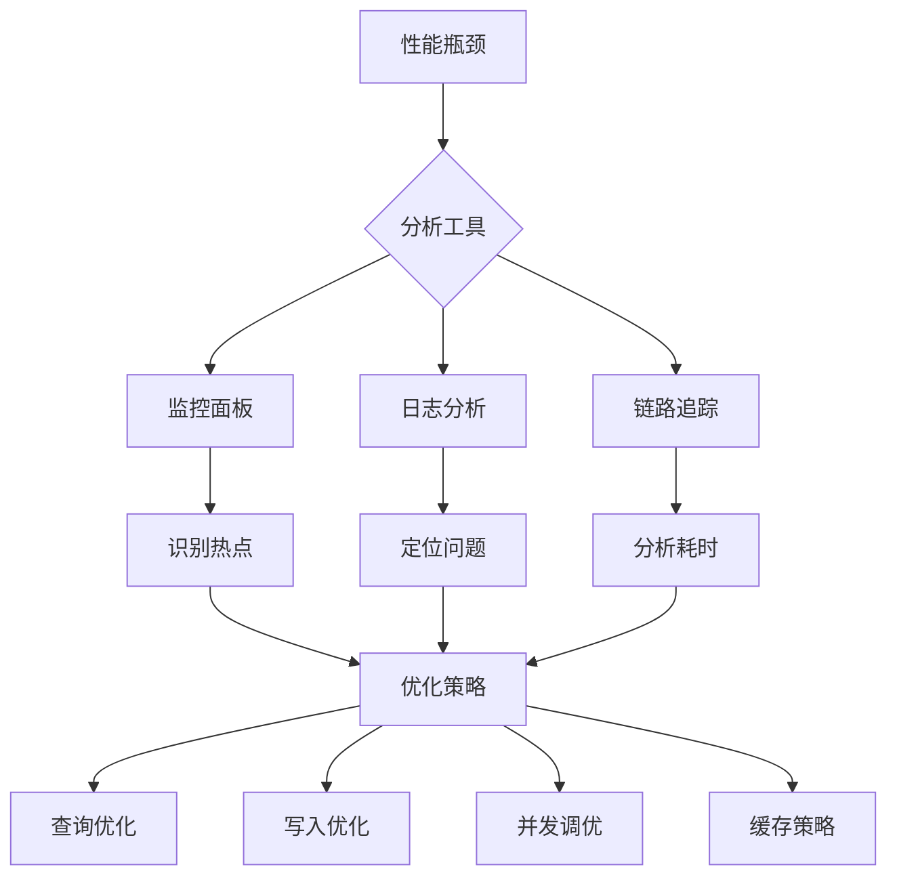
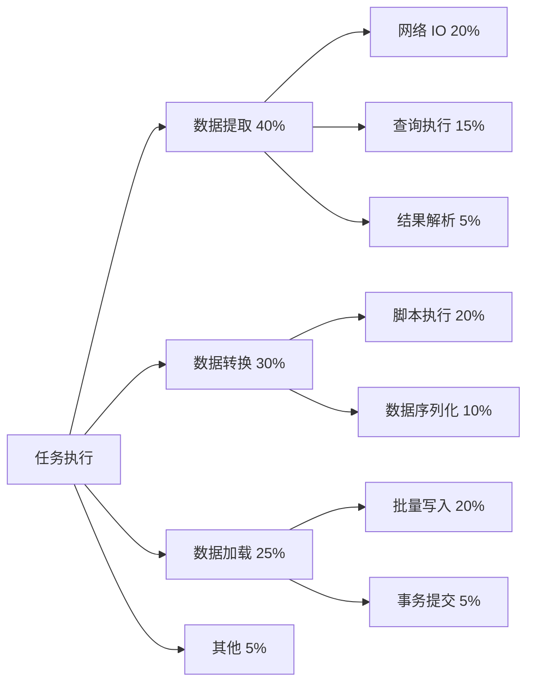
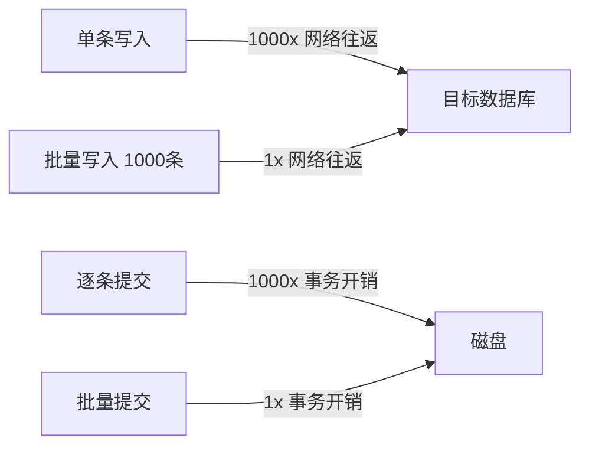
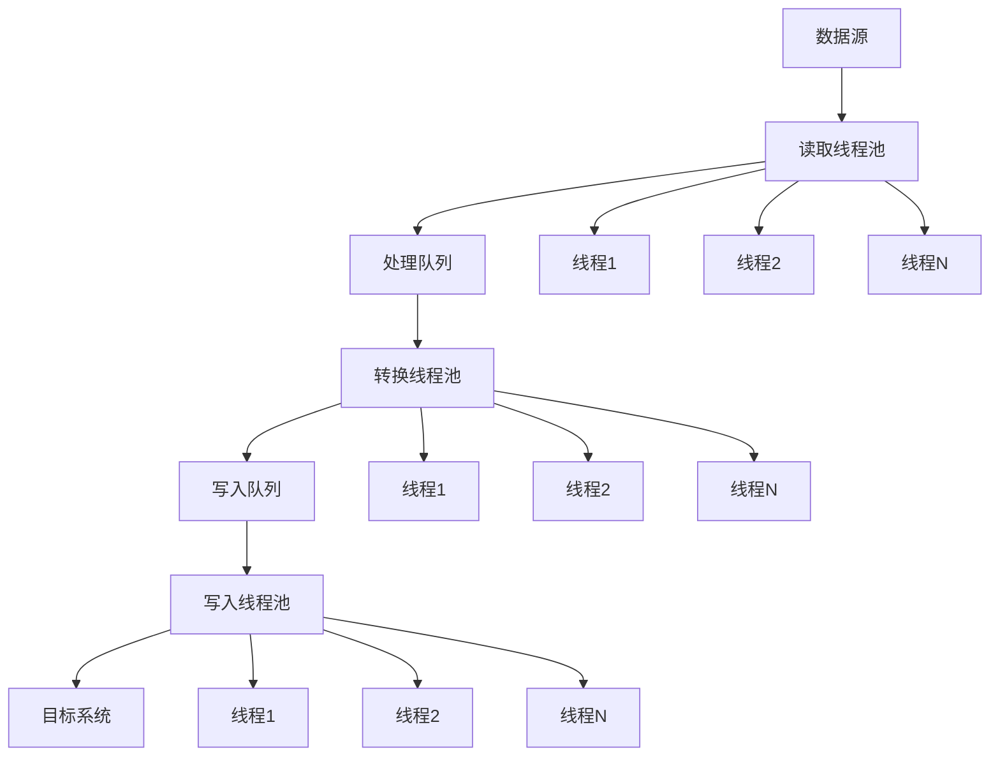
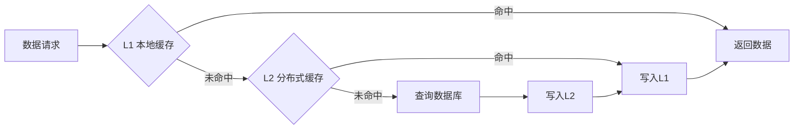

# 性能优化

轻易云 DataHub 提供了多种性能优化手段，帮助用户提升数据集成效率。本文档详细介绍性能分析工具、查询优化、写入优化、并发控制和缓存策略等内容。

## 概述

性能优化是数据集成项目成功的关键因素之一。通过系统化的性能分析和针对性的优化措施，可以显著提升数据处理效率，降低资源消耗。



## 性能分析工具

### 1. 内置监控指标

轻易云 DataHub 提供了丰富的内置监控指标：

| 指标类别 | 指标名称 | 说明 | 推荐阈值 |
|---------|---------|------|---------|
| 吞吐量 | records_per_second | 每秒处理记录数 | > 10,000 |
| 吞吐量 | bytes_per_second | 每秒处理数据量 | > 10 MB |
| 延迟 | processing_latency_ms | 处理延迟 | < 1000 ms |
| 延迟 | end_to_end_latency_ms | 端到端延迟 | < 5000 ms |
| 资源 | cpu_usage_percent | CPU 使用率 | < 80% |
| 资源 | memory_usage_mb | 内存使用 | < 80% |
| 资源 | active_connections | 活跃连接数 | < 池大小 |
| 错误 | error_rate_percent | 错误率 | < 1% |
| 队列 | queue_depth | 队列深度 | < 10000 |

### 2. 性能剖析配置

```yaml
# 性能剖析配置
profiling:
  enabled: true
  
  # 采样率（0-1）
  sample_rate: 0.1
  
  # 剖析维度
  dimensions:
    - stage_timing      # 各阶段耗时
    - memory_usage      # 内存使用
    - io_operations     # IO 操作
    - lock_contention   # 锁竞争
    - gc_activity       # GC 活动
    
  # 输出方式
  output:
    format: "json"  # json, flamegraph
    destination: "file"
    path: "/var/log/datahub/profiles/"
    retention_days: 7
```

### 3. 火焰图分析



### 4. 慢查询分析

```javascript
// 慢查询日志分析配置
const slowQueryConfig = {
  enabled: true,
  threshold_ms: 1000,  // 超过 1 秒记录
  
  // 分析维度
  analysis: {
    explain: true,      // 执行计划分析
    index_suggestion: true,  // 索引建议
    statistics: true    // 统计信息
  },
  
  // 报告生成
  reporting: {
    top_n: 20,          // 最慢的 20 条
    daily_summary: true // 每日汇总
  }
};
```

## 查询优化

### 1. 索引优化

```sql
-- 查询优化前的执行计划
EXPLAIN SELECT * FROM orders 
WHERE created_at > '2024-01-01' 
  AND status = 'completed'
ORDER BY amount DESC;

-- 优化建议：创建复合索引
CREATE INDEX idx_orders_created_status_amount 
ON orders(created_at, status, amount);

-- 覆盖索引（避免回表）
CREATE INDEX idx_orders_covering 
ON orders(customer_id, order_date, total_amount)
INCLUDE (status, shipping_address);
```

### 2. 查询重写技巧

| 低效写法 | 优化写法 | 优化效果 |
|---------|---------|---------|
| `SELECT *` | `SELECT 具体字段` | 减少 IO |
| `IN (子查询)` | `EXISTS` 或 `JOIN` | 避免物化 |
| `OR` 条件 | `UNION ALL` | 使用索引 |
| `NOT IN` | `LEFT JOIN + IS NULL` | 更好的执行计划 |
| `LIMIT 1000000, 10` | 游标分页 | 避免深分页 |

```sql
-- 优化前：OR 条件导致索引失效
SELECT * FROM orders 
WHERE customer_id = 'C001' OR customer_id = 'C002';

-- 优化后：使用 UNION ALL
SELECT * FROM orders WHERE customer_id = 'C001'
UNION ALL
SELECT * FROM orders WHERE customer_id = 'C002';

-- 优化前：深分页
SELECT * FROM orders 
ORDER BY order_id 
LIMIT 1000000, 1000;

-- 优化后：游标分页
SELECT * FROM orders 
WHERE order_id > 'last_seen_id'
ORDER BY order_id 
LIMIT 1000;
```

### 3. 分区表优化

```sql
-- 创建分区表
CREATE TABLE orders (
    order_id VARCHAR(32),
    customer_id VARCHAR(32),
    order_date DATE,
    amount DECIMAL(18,2),
    PRIMARY KEY (order_id, order_date)
) PARTITION BY RANGE (YEAR(order_date) * 100 + MONTH(order_date)) (
    PARTITION p202401 VALUES LESS THAN (202402),
    PARTITION p202402 VALUES LESS THAN (202403),
    PARTITION p202403 VALUES LESS THAN (202404),
    PARTITION p_future VALUES LESS THAN MAXVALUE
);

-- 分区裁剪查询
SELECT * FROM orders 
WHERE order_date >= '2024-01-01' 
  AND order_date < '2024-02-01';
-- 仅扫描 p202401 分区
```

## 写入优化

### 1. 批量写入策略



| 写入方式 | 吞吐量（条/秒） | CPU 占用 | 适用场景 |
|---------|--------------|---------|---------|
| 单条写入 | 100 | 高 | 实时性要求极高 |
| 批量 100 条 | 2,000 | 中 | 平衡方案 |
| 批量 1000 条 | 10,000 | 低 | 批处理任务 |
| COPY/LOAD | 50,000+ | 低 | 大数据导入 |

### 2. 数据库特定优化

#### MySQL 写入优化

```sql
-- 禁用唯一性检查（大量导入时）
SET unique_checks = 0;
SET foreign_key_checks = 0;

-- 使用 LOAD DATA
LOAD DATA LOCAL INFILE '/path/to/data.csv'
INTO TABLE orders
FIELDS TERMINATED BY ','
LINES TERMINATED BY '\n'
(order_id, customer_id, amount);

-- 恢复检查
SET unique_checks = 1;
SET foreign_key_checks = 1;
```

#### PostgreSQL 写入优化

```sql
-- 使用 COPY 命令
COPY orders (order_id, customer_id, amount)
FROM '/path/to/data.csv'
WITH (FORMAT csv, HEADER true);

-- 批量插入优化
INSERT INTO orders (order_id, customer_id, amount) VALUES
  ('1', 'C001', 100),
  ('2', 'C002', 200)
ON CONFLICT (order_id) DO NOTHING;

-- 使用 UNLOGGED 表（临时数据）
CREATE UNLOGGED TABLE temp_orders (LIKE orders);
```

### 3. 写入缓冲配置

```yaml
# DataHub 写入缓冲配置
write_buffer:
  enabled: true
  
  # 缓冲区大小
  buffer_size:
    records: 1000      # 记录数
    bytes: 10485760    # 10MB
    time_ms: 5000      # 5秒
    
  # 触发条件（满足任一即触发）
  flush_trigger:
    - buffer_full
    - time_elapsed
    - manual_flush
    
  # 并发写入
  parallelism: 4
  
  # 背压控制
  backpressure:
    enabled: true
    max_pending_buffers: 10
```

## 并发控制

### 1. 并行度配置



```yaml
# 并发配置
concurrency:
  # 读取并行度
  extract:
    parallelism: 4
    queue_size: 1000
    
  # 转换并行度
  transform:
    parallelism: 8
    queue_size: 2000
    
  # 写入并行度
  load:
    parallelism: 4
    queue_size: 1000
    
  # 连接池配置
  connection_pool:
    min_size: 5
    max_size: 20
    acquire_timeout: 30000
```

### 2. 并行度建议

| 场景 | 读取并行度 | 转换并行度 | 写入并行度 | 说明 |
|-----|-----------|-----------|-----------|------|
| CPU 密集型 | 2-4 | 8-16 | 2-4 | 转换逻辑复杂 |
| IO 密集型 | 8-16 | 4-8 | 8-16 | 网络/磁盘瓶颈 |
| 内存受限 | 2 | 4 | 2 | 避免 OOM |
| 大数据量 | 4-8 | 8-16 | 4-8 | 平衡吞吐和资源 |

### 3. 背压机制

```javascript
// 背压控制实现
class BackpressureController {
  constructor(config) {
    this.maxQueueSize = config.maxQueueSize;
    this.highWatermark = config.highWatermark || 0.8;
    this.lowWatermark = config.lowWatermark || 0.3;
    this.paused = false;
  }
  
  checkPressure(queueSize) {
    const ratio = queueSize / this.maxQueueSize;
    
    if (ratio > this.highWatermark && !this.paused) {
      this.paused = true;
      this.emit('pause');
      console.warn(`队列压力过高: ${(ratio * 100).toFixed(1)}%，暂停读取`);
    } else if (ratio < this.lowWatermark && this.paused) {
      this.paused = false;
      this.emit('resume');
      console.info(`队列压力恢复: ${(ratio * 100).toFixed(1)}%，恢复读取`);
    }
    
    return this.paused;
  }
}
```

## 缓存策略

### 1. 多级缓存架构



| 缓存层级 | 存储介质 | 延迟 | 容量 | 适用数据 |
|---------|---------|------|------|---------|
| L1 | 本地内存 | < 1μs | 小 | 热点配置 |
| L2 | Redis | ~1ms | 中 | 查找表 |
| L3 | 本地磁盘 | ~10ms | 大 | 离线数据 |

### 2. 缓存配置

```yaml
# DataHub 缓存配置
cache:
  enabled: true
  
  # 本地缓存
  local:
    enabled: true
    max_size: 10000
    ttl_seconds: 300
    
  # 分布式缓存
  distributed:
    enabled: true
    type: "redis"
    hosts:
      - "redis1:6379"
      - "redis2:6379"
    ttl_seconds: 3600
    
  # 缓存策略
  strategy:
    # 查找表缓存
    lookup_tables:
      - name: "customers"
        key_field: "customer_id"
        ttl: 1800
      - name: "products"
        key_field: "sku"
        ttl: 3600
        
    # 写入缓存
    write_buffer:
      enabled: true
      batch_size: 100
      flush_interval: 5000
```

### 3. 缓存预热

```javascript
// 缓存预热实现
class CacheWarmer {
  async warmUp(tables) {
    for (const table of tables) {
      console.log(`预热缓存: ${table.name}`);
      
      const records = await this.db.query(
        `SELECT ${table.cacheFields.join(',')} FROM ${table.name}`
      );
      
      const cacheData = {};
      for (const record of records) {
        cacheData[record[table.keyField]] = record;
      }
      
      await this.cache.setMany(
        table.name,
        cacheData,
        table.ttl
      );
      
      console.log(`缓存预热完成: ${table.name}, ${records.length} 条记录`);
    }
  }
}

// 使用示例
const warmer = new CacheWarmer();
await warmer.warmUp([
  { name: 'customers', keyField: 'id', cacheFields: ['id', 'name', 'type'], ttl: 1800 },
  { name: 'products', keyField: 'sku', cacheFields: ['sku', 'name', 'price'], ttl: 3600 }
]);
```

## JVM/运行时优化

### 1. 内存配置

```bash
# JVM 内存配置（适用于 Java 运行环境）
-Xms4g -Xmx4g           # 堆内存
-XX:MetaspaceSize=256m  # 元空间
-XX:MaxMetaspaceSize=512m

# GC 配置
-XX:+UseG1GC
-XX:MaxGCPauseMillis=200
-XX:G1HeapRegionSize=16m

# Node.js 内存配置（适用于 JavaScript 环境）
--max-old-space-size=4096
--optimize-for-size
```

### 2. 垃圾回收优化

```yaml
# GC 监控和优化
gc_optimization:
  # GC 日志
  logging:
    enabled: true
    path: "/var/log/datahub/gc.log"
    
  # GC 告警阈值
  thresholds:
    pause_time_ms: 500
    frequency_per_minute: 10
    
  # 自动调优
  auto_tune:
    enabled: true
    target_pause_ms: 200
```

## 性能测试基准

| 测试场景 | 数据量 | 源类型 | 目标类型 | 预期吞吐 | 实际吞吐 |
|---------|-------|-------|---------|---------|---------|
| 简单 ETL | 1000万 | MySQL | PostgreSQL | 5,000/s | 8,000/s |
| 复杂转换 | 1000万 | Oracle | MySQL | 1,000/s | 1,500/s |
| 大字段处理 | 100GB | MongoDB | Elasticsearch | 50MB/s | 80MB/s |
| 实时同步 | 持续 | MySQL CDC | Kafka | 10,000/s | 15,000/s |

## 最佳实践

> [!TIP]
> 1. 使用监控工具持续观察系统性能指标
> 2. 基于火焰图识别真正的性能热点
> 3. 批量操作优先于单条操作
> 4. 合理配置并发度，避免资源竞争
> 5. 利用缓存减少重复查询
> 6. 定期进行性能基准测试
> 7. 关注 GC 活动，避免长时间停顿

通过以上性能优化技术和策略，您可以充分发挥轻易云 DataHub 的处理能力，构建高效、稳定的数据集成管道。
