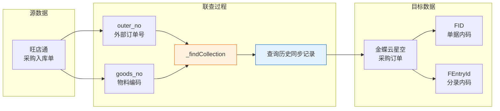
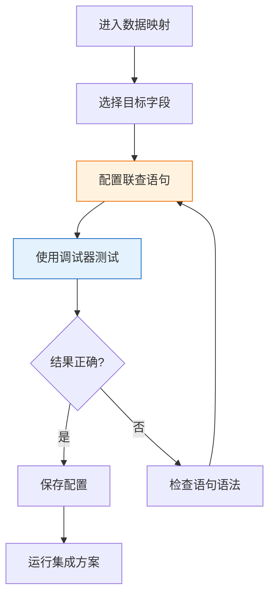

# 联查关系型数据

联查关系型数据是轻易云 iPaaS 平台提供的一种跨方案数据查询能力，允许你在集成流程中从其他同步方案（关系型数据库）中查询关联数据，实现数据间的关联补全与转换。通过 `_findCollection` 函数，你可以轻松实现类似 SQL JOIN 的查询效果，满足复杂的业务集成场景需求。

> [!NOTE]
> 联查功能适用于需要从历史同步数据、主数据或其他业务单据中获取关联信息的场景。例如：根据订单号查询历史订单的 FID、根据物料编码查询物料主数据等。

## 适用场景

| 场景 | 说明 | 示例 |
| ---- | ---- | ---- |
| **单据关联** | 下游单据需要关联上游单据的主键 | 入库单关联采购订单，需要获取订单的 FID 和分录 ID |
| **主数据补全** | 根据编码查询主数据详情 | 根据物料编码查询物料的保质期管理属性 |
| **数据验证** | 验证数据是否已存在于目标系统 | 检查客户是否已同步至 ERP |
| **字段映射转换** | 将源系统编码转换为目标系统编码 | 根据店铺编码查询对应的 ERP 组织编码 |

## 核心概念

### 什么是联查



联查本质上是从**已同步的历史数据**中检索关联记录，而非直接查询源系统的数据库。这保证了：

1. **数据一致性**：查询的是已成功同步至平台的数据
2. **性能优化**：避免频繁调用源系统接口
3. **跨系统关联**：即使源系统不支持直接查询，也能通过平台实现关联

## 基本语法

### 语法结构

```sql
_findCollection find {目标字段} from {方案ID} where {条件字段1}={{变量1}} {条件字段2}={{变量2}} ...
```

### 语法元素说明

| 元素 | 说明 | 必填 | 示例 |
| ---- | ---- | ---- | ---- |
| `_findCollection` | 声明使用联查函数 | ✅ | — |
| `find` | 关键字，声明要查询的字段 | ✅ | — |
| `目标字段` | 需要返回的字段名 | ✅ | `FID`、`FPOOrderEntry_FEntryId` |
| `from` | 关键字，声明数据来源 | ✅ | — |
| `方案ID` | 目标同步方案的唯一标识（UUID） | ✅ | `8e620793-bebb-3167-95a4-9030368e5262` |
| `where` | 关键字，声明查询条件 | ✅ | — |
| `条件表达式` | 字段与变量的匹配条件 | ✅ | `FBillNo={{outer_no}}` |

### 语法规则

> [!IMPORTANT]
> 联查语法对格式要求严格，请务必遵守以下规则：
> 
> 1. **空格分隔**：每个关键字之间必须使用**单个英文空格**分隔
> 2. **条件关系**：多个条件之间默认为 **AND** 关系
> 3. **变量引用**：使用 `{{变量名}}` 格式引用上下文变量
> 4. **单行格式**：除嵌套场景外，整个语句应写在一行内

### 基础示例

以下示例演示如何在旺店通采购入库单同步至金蝶时，关联查询对应的采购订单信息：

```sql
_findCollection find FPOOrderEntry_FEntryId from 8e620793-bebb-3167-95a4-9030368e5262 where FBillNo={{outer_no}} FMaterialId_FNumber={{details_list.goods_no}}
```

**场景说明**：
- 旺店通采购入库单只包含外部订单号（`outer_no`）和物料编码（`goods_no`）
- 金蝶采购入库单关联采购订单时需要订单的 **FID** 和 **分录 FEntryId**
- 通过联查从「采购订单同步方案」中定位原始订单的 ID 信息

**条件解析**：
- `FBillNo={{outer_no}}`：根据外部订单号匹配采购订单
- `FMaterialId_FNumber={{details_list.goods_no}}`：根据物料编码匹配分录行

## 获取方案 ID

使用联查功能前，你需要获取目标同步方案的 ID：

1. 进入**集成方案**管理页面
2. 找到需要联查的目标方案
3. 点击方案名称进入详情页
4. 从浏览器地址栏或方案信息中复制 UUID

```text
https://www.qeasy.cloud/integration/{方案ID}
```

> [!TIP]
> 方案 ID 是一个 36 位的 UUID 格式字符串，例如：`8e620793-bebb-3167-95a4-9030368e5262`

## 变量引用

### 支持的变量类型

| 变量类型 | 引用方式 | 说明 |
| -------- | -------- | ---- |
| 主表字段 | `{{field_name}}` | 单据主表中的字段值 |
| 子表字段 | `{{details_list.field_name}}` | 明细行数组中的字段 |
| 系统变量 | `{{LAST_SYNC_TIME}}` | 上次同步时间戳 |
| 全局参数 | `{{GLOBAL_PARAM}}` | 集成方案中定义的全局参数 |

### 子表字段引用

当处理明细行数据时，需要引用子表字段作为查询条件：

```sql
_findCollection find FEntryID from a1b2c3d4-e5f6-7890-abcd-ef1234567890 where FMaterialNo={{details_list.material_code}} FOrderNo={{order_no}}
```

> [!NOTE]
> 在明细行上下文中使用联查时，系统会自动对每一行执行查询，并将结果映射到对应行的目标字段。

## 嵌套使用与自定义函数组合

### 与 `_function` 组合

`_findCollection` 可以与 `_function` 自定义函数组合使用，实现更复杂的业务逻辑：

```sql
_function case _findCollection find FIsKFPeriod from 66da8241-98f4-39f9-8fee-cac02e30e532 where FNumber={{details_list.goods_no}} _endFind when '1' then '{{details_list.batch_validTime}}' else '' end
```

**场景说明**：
- 查询物料是否启用保质期管理（`FIsKFPeriod` 字段）
- 如果启用（值为 `'1'`），则返回批次有效期
- 如果未启用，则返回空字符串

### 嵌套语法规则

当在 `_function` 中嵌套使用 `_findCollection` 时，需要使用 `_endFind` 标记联查语句的结束：

| 场景 | 语法结构 |
| ---- | -------- |
| 独立使用 | `_findCollection find ... from ... where ...` |
| 嵌套使用 | `_function ... _findCollection find ... from ... where ... _endFind ... end` |

> [!WARNING]
> 嵌套使用时，联查语句前后必须添加 `_endFind` 作为结束标记，否则解析会失败。

### 嵌套示例：条件判断

**需求**：根据物料属性动态设置生产日期

```sql
_function case _findCollection find FIsKFPeriod from 66da8241-98f4-39f9-8fee-cac02e30e532 where FNumber={{details_list.goods_no}} _endFind when '1' then '{{details_list.batch_validTime}}' else '' end
```

**格式化展示**（实际使用时需写在一行）：

```sql
_function case 
  _findCollection find FIsKFPeriod 
    from 66da8241-98f4-39f9-8fee-cac02e30e532 
    where FNumber={{details_list.goods_no}} 
  _endFind 
  when '1' then '{{details_list.batch_validTime}}' 
  else '' 
end
```

> [!CAUTION]
> 上述格式化展示仅为便于理解，**实际配置时必须写成一行**，不能包含换行符或缩进。

## 实际应用示例

### 示例一：采购入库单关联采购订单

**业务场景**：将旺店通采购入库单同步至金蝶云星空，需要关联原始采购订单。

**配置步骤**：

1. 在目标平台（金蝶）的数据映射中，找到需要填充 FID 的字段
2. 在字段映射值中配置联查语句：

```sql
_findCollection find FID from 8e620793-bebb-3167-95a4-9030368e5262 where FBillNo={{outer_no}}
```

3. 对于分录 ID 字段，配置：

```sql
_findCollection find FPOOrderEntry_FEntryId from 8e620793-bebb-3167-95a4-9030368e5262 where FBillNo={{outer_no}} FMaterialId_FNumber={{details_list.goods_no}}
```

### 示例二：查询物料保质期属性

**业务场景**：根据物料编码查询是否启用保质期管理，动态设置生产日期字段。

```sql
_function case _findCollection find FIsKFPeriod from 66da8241-98f4-39f9-8fee-cac02e30e532 where FNumber={{details_list.item_code}} _endFind when '1' then '{{details_list.batch_validTime}}' else '' end
```

### 示例三：多条件精确匹配

**业务场景**：根据订单号、行号和物料编码精确定位分录 ID。

```sql
_findCollection find FEntryId from 9f730824-c9g5-40g0-bcde-gh2345678901 where FBillNo={{order_no}} FSeq={{details_list.seq}} FMaterialNo={{details_list.material_code}}
```

## 配置步骤

在集成方案中配置联查的完整步骤：

1. **进入数据映射**
   - 打开目标集成方案的编辑页面
   - 进入**数据映射**配置环节

2. **选择目标字段**
   - 找到需要通过联查赋值的目标字段（如金蝶的 FID）
   - 点击该字段的映射值配置区域

3. **配置联查语句**
   - 选择**自定义**或**表达式**模式
   - 输入 `_findCollection` 联查语句
   - 确保使用正确的方案 ID 和字段名

4. **验证与测试**
   - 使用**调试器**运行测试
   - 检查联查返回结果是否符合预期
   - 验证空值处理逻辑（未匹配时的默认值）



## 最佳实践

### 1. 确保数据同步顺序

联查依赖于目标方案的历史数据，因此：

- 确保被查询的方案**已先运行**并完成数据同步
- 对于上下游依赖关系明显的场景，使用**方案间触发**机制控制执行顺序
- 避免在首次全量同步时使用联查（历史数据可能不完整）

### 2. 处理查询不到数据的情况

当联查条件不匹配时，函数返回空值。建议：

- 在目标字段配置**默认值**，避免空值导致写入失败
- 结合 `_function` 实现空值判断和兜底逻辑
- 对于关键字段，配置**异常处理**策略

```sql
_function IFNULL(_findCollection find FID from xxx where FBillNo={{order_no}}, '0')
```

### 3. 优化查询性能

| 优化建议 | 说明 |
| -------- | ---- |
| 减少条件数量 | 只使用必要的查询条件，条件越多查询越慢 |
| 确保索引字段 | 优先使用单据编号、ID 等已索引字段作为条件 |
| 避免大表全查 | 对于数据量大的方案，增加更多限定条件 |

### 4. 调试技巧

- 使用**数据与队列管理**查看同步后的数据详情
- 在调试器中观察联查前后的字段值变化
- 临时将联查结果映射到测试字段，验证查询正确性

## 常见问题

### Q: 联查返回空值是什么原因？

可能原因及排查方法：

1. **方案 ID 错误**：确认 UUID 正确无误，注意区分大小写
2. **条件不匹配**：检查字段名和变量值是否正确
3. **数据未同步**：确认被查询的方案已运行并产生了同步记录
4. **语法错误**：检查空格和关键字拼写

### Q: 联查支持 OR 条件吗？

目前 `_findCollection` 仅支持 AND 关系的条件组合。如需实现 OR 逻辑，建议：

- 使用多个字段分别配置联查
- 结合 `_function` 的 `CASE WHEN` 实现条件分支

### Q: 可以联查多个字段吗？

每次 `_findCollection` 调用只能返回一个字段值。如需获取多个字段：

- 为目标对象中的每个字段单独配置联查
- 或使用多次联查将结果存储到不同变量

### Q: 联查有性能限制吗？

- 单次集成任务中联查次数过多可能影响性能
- 建议在单个方案中联查调用不超过 1000 次/批次
- 大数据量场景考虑使用**批量处理**模式

### Q: 联查和数据映射有什么区别？

| 特性 | 数据映射 | 联查 |
| ---- | -------- | ---- |
| 数据来源 | 源平台接口返回 | 其他同步方案的历史数据 |
| 实时性 | 实时获取 | 依赖历史同步结果 |
| 使用场景 | 字段直接对应 | 需要关联其他单据/主数据 |
| 配置位置 | 源平台字段 → 目标字段 | 目标字段的表达式配置 |

## 相关文档

- [自定义脚本](./custom-scripts) — 了解更多 `_function` 函数的用法
- [高级查询条件引擎](./advanced-query) — 学习数据过滤技巧
- [数据与队列管理](../guide/data-queue-management) — 查看和管理同步数据
- [调试器](../guide/debugger) — 调试联查配置
- [数据映射](../guide/data-mapping) — 基础字段映射指南
