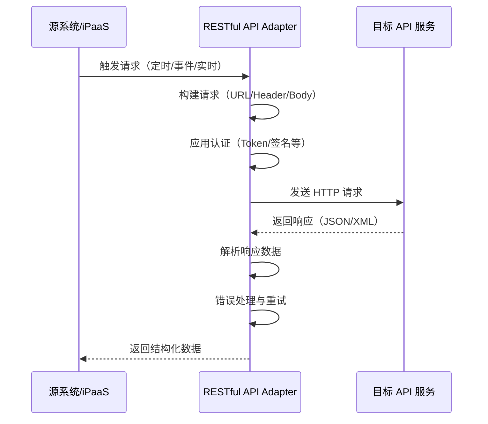

# RESTful API Adapter 使用指南

RESTful API Adapter 是轻易云 iPaaS 平台提供的通用 HTTP API 连接器，用于对接各类 RESTful 风格的 Web 服务。通过灵活配置 API 端点、认证方式、请求模板和响应解析规则，你可以快速实现与第三方系统的数据互通，无需编写代码即可完成复杂的 API 集成场景。

> [!NOTE]
> RESTful API Adapter 适用于对接标准 RESTful API，如企业内部系统、SaaS 服务、云厂商 API 等。如果目标系统已有专用连接器，建议优先使用专用连接器以获得更好的体验。

## 适用场景

| 场景类型 | 业务描述 | 典型应用 |
| -------- | -------- | -------- |
| **数据拉取** | 从外部 API 获取数据并同步到内部系统 | 定时抓取订单、库存、商品信息 |
| **数据推送** | 将内部系统数据推送到外部 API | 订单下发、库存同步、状态回传 |
| **双向同步** | 实现两个系统间的数据双向互通 | ERP 与电商平台数据同步 |
| **实时查询** | 按需实时调用 API 查询数据 | 物流轨迹查询、实名认证验证 |
| **批量处理** | 大批量数据的批量读写操作 | 批量导入商品、批量更新库存 |

## 工作原理



RESTful API Adapter 的核心工作流程包括：

1. **请求构建**：根据配置的模板生成请求 URL、Headers 和 Body
2. **认证处理**：自动处理各类认证方式（API Key、OAuth 2.0、签名等）
3. **数据发送**：执行 HTTP 请求并处理超时、重试等逻辑
4. **响应解析**：将返回的 JSON/XML 解析为结构化数据
5. **错误处理**：根据配置进行重试或异常上报

## 前置条件

使用 RESTful API Adapter 前，请确保已具备以下条件：

1. **API 文档**：拥有目标系统的完整 API 文档，包括接口地址、请求方法、参数说明、响应格式等
2. **访问权限**：已获得目标 API 的访问凭证（API Key、App Secret、Token 等）
3. **网络连通**：轻易云 iPaaS 平台能够访问目标 API 的服务地址

> [!TIP]
> 建议先在 Postman 或类似工具中验证 API 调用成功，再配置到 iPaaS 平台。

## 创建 RESTful API 连接器

### 步骤一：进入连接器管理

1. 登录轻易云 iPaaS 控制台
2. 进入**集成平台** → **连接器管理**
3. 点击右上角**新建连接器**
4. 在连接器类型列表中选择**RESTful API**

### 步骤二：配置基础信息

| 参数 | 必填 | 说明 |
| ---- | ---- | ---- |
| 连接器名称 | ✅ | 用于标识此连接器，如「金蝶云星空 API」 |
| 连接器编码 | ✅ | 唯一标识符，建议使用英文和下划线 |
| 描述 | — | 连接器的用途说明 |
| 基础 URL | ✅ | API 的根地址，如 `https://api.example.com/v1` |

### 步骤三：配置认证方式

RESTful API Adapter 支持多种认证方式：

#### 1. API Key 认证

适用于通过 Header 或 Query 参数传递 API Key 的场景。

```json
{
  "authType": "apiKey",
  "apiKey": {
    "key": "X-API-Key",
    "value": "{{API_KEY}}",
    "in": "header"
  }
}
```

| 参数 | 说明 |
| ---- | ---- |
| `key` | API Key 的参数名 |
| `value` | API Key 的值，支持使用变量如 `{{API_KEY}}` |
| `in` | 传递位置：`header`（请求头）或 `query`（URL 参数） |

#### 2. Basic Auth 认证

适用于用户名/密码的 HTTP Basic 认证。

```json
{
  "authType": "basic",
  "basic": {
    "username": "{{USERNAME}}",
    "password": "{{PASSWORD}}"
  }
}
```

#### 3. Bearer Token 认证

适用于 OAuth 2.0 或 JWT Token 认证。

```json
{
  "authType": "bearer",
  "bearer": {
    "token": "{{ACCESS_TOKEN}}"
  }
}
```

#### 4. OAuth 2.0 认证

适用于需要动态获取 Access Token 的 OAuth 2.0 场景。

```json
{
  "authType": "oauth2",
  "oauth2": {
    "grantType": "client_credentials",
    "tokenUrl": "https://auth.example.com/oauth/token",
    "clientId": "{{CLIENT_ID}}",
    "clientSecret": "{{CLIENT_SECRET}}",
    "scope": "read write"
  }
}
```

#### 5. 自定义签名认证

适用于需要特殊签名算法的场景（如阿里云、腾讯云等）。

```json
{
  "authType": "signature",
  "signature": {
    "algorithm": "hmac-sha256",
    "secret": "{{APP_SECRET}}",
    "params": ["timestamp", "nonce", "appId"]
  }
}
```

### 步骤四：配置连接测试

配置完成后，建议进行连接测试以验证配置正确：

1. 在连接器配置页面找到**连接测试**区域
2. 选择一个测试接口（通常是简单的查询接口，如获取用户信息）
3. 填写测试参数
4. 点击**测试连接**
5. 查看返回结果确认配置成功

> [!TIP]
> 连接测试成功后，系统会自动保存配置并生成连接器实例，可在集成方案中使用。

## API 端点配置

### 端点基础配置

在集成方案中使用 RESTful API Adapter 时，需要配置具体的 API 端点：

| 参数 | 必填 | 说明 | 示例 |
| ---- | ---- | ---- | ---- |
| `api` | ✅ | API 端点路径 | `/orders/list` |
| `method` | ✅ | HTTP 方法 | `GET`、`POST`、`PUT`、`DELETE` |
| `type` | ✅ | 操作类型 | `QUERY`（查询）、`CREATE`（创建）、`UPDATE`（更新）、`DELETE`（删除） |

### 完整配置示例

```json
{
  "api": "/api/orders",
  "method": "POST",
  "type": "QUERY",
  "headers": {
    "Content-Type": "application/json",
    "X-Request-ID": "{{$uuid}}"
  },
  "queryParams": {
    "page": "{{PAGE_NO}}",
    "limit": "{{PAGE_SIZE}}"
  },
  "body": {
    "startTime": "{{START_TIME}}",
    "endTime": "{{END_TIME}}",
    "status": ["PAID", "SHIPPED"]
  }
}
```

## 请求体模板

### 模板语法

RESTful API Adapter 使用双大括号 `{{}}` 作为变量占位符，支持以下变量类型：

| 变量类型 | 语法 | 说明 |
| -------- | ---- | ---- |
| 字段值 | `{{fieldName}}` | 源数据字段值 |
| 系统变量 | `{{$timestamp}}` | 当前时间戳 |
| 系统变量 | `{{$uuid}}` | 生成 UUID |
| 系统变量 | `{{$date}}` | 当前日期（YYYY-MM-DD） |
| 系统变量 | `{{$datetime}}` | 当前时间（YYYY-MM-DD HH:mm:ss） |
| 自定义变量 | `{{VAR_NAME}}` | 方案中定义的变量 |

### GET 请求配置

GET 请求通常用于查询数据，参数通过 URL Query 传递：

```json
{
  "api": "/api/products",
  "method": "GET",
  "type": "QUERY",
  "queryParams": {
    "page": "{{PAGE_NO}}",
    "size": "{{PAGE_SIZE}}",
    "category": "{{CATEGORY_ID}}",
    "updated_after": "{{LAST_SYNC_TIME}}"
  }
}
```

### POST 请求配置

POST 请求通常用于创建数据或复杂查询，参数通过 Request Body 传递：

```json
{
  "api": "/api/orders/search",
  "method": "POST",
  "type": "QUERY",
  "headers": {
    "Content-Type": "application/json"
  },
  "body": {
    "filter": {
      "startDate": "{{START_DATE}}",
      "endDate": "{{END_DATE}}",
      "status": ["CONFIRMED", "PAID"]
    },
    "pagination": {
      "page": "{{PAGE_NO}}",
      "pageSize": "{{PAGE_SIZE}}"
    }
  }
}
```

### 动态数组处理

当需要处理数组类型的动态数据时，使用以下语法：

```json
{
  "api": "/api/batch/create",
  "method": "POST",
  "type": "CREATE",
  "body": {
    "orderNo": "{{ORDER_NO}}",
    "items": "{{details_list}}",
    "totalAmount": "{{TOTAL_AMOUNT}}"
  }
}
```

> [!NOTE]
> `{{details_list}}` 表示将 `details_list` 数组整体映射到 `items` 字段。

### 条件渲染

支持使用 `_function` 实现条件渲染：

```json
{
  "body": {
    "orderType": "{{ORDER_TYPE}}",
    "amount": "{{AMOUNT}}",
    "discount": "_function {{AMOUNT}} > 1000 ? {{AMOUNT}} * 0.95 : {{AMOUNT}}",
    "priority": "_function '{{STATUS}}' === 'URGENT' ? 'HIGH' : 'NORMAL'"
  }
}
```

## 响应解析规则

### 基础解析配置

RESTful API Adapter 会自动解析 JSON 响应，你可以通过配置指定数据提取路径：

```json
{
  "responseParser": {
    "dataPath": "data.list",
    "totalPath": "data.total",
    "pagePath": "data.page",
    "successCode": "200",
    "codePath": "code",
    "messagePath": "message"
  }
}
```

| 参数 | 说明 |
| ---- | ---- |
| `dataPath` | 业务数据在响应中的路径，使用点号分隔 |
| `totalPath` | 总记录数路径（用于分页场景） |
| `pagePath` | 当前页码路径（用于分页场景） |
| `successCode` | 表示成功的状态码 |
| `codePath` | 响应码字段路径 |
| `messagePath` | 响应消息字段路径 |

### 响应示例映射

假设 API 返回以下响应结构：

```json
{
  "code": 200,
  "message": "success",
  "data": {
    "total": 150,
    "page": 1,
    "pageSize": 20,
    "list": [
      {
        "orderId": "ORD001",
        "amount": 199.99,
        "status": "PAID"
      }
    ]
  }
}
```

对应的解析配置：

```json
{
  "responseParser": {
    "dataPath": "data.list",
    "totalPath": "data.total",
    "pagePath": "data.page"
  }
}
```

### 错误码处理

配置错误码映射以实现精细化错误处理：

```json
{
  "errorHandler": {
    "retryableCodes": ["500", "502", "503", "429"],
    "ignoreCodes": ["404"],
    "maxRetries": 3,
    "retryInterval": 1000
  }
}
```

| 参数 | 说明 |
| ---- | ---- |
| `retryableCodes` | 需要重试的错误码列表 |
| `ignoreCodes` | 可忽略的错误码（如记录不存在） |
| `maxRetries` | 最大重试次数 |
| `retryInterval` | 重试间隔（毫秒） |

## 常见 REST API 对接场景

### 场景一：GET 分页拉取

适用于从第三方系统分页拉取数据的场景，如定时同步订单、商品等。

#### 配置示例

```json
{
  "api": "/api/orders",
  "method": "GET",
  "type": "QUERY",
  "queryParams": {
    "page": "{{PAGE_NO}}",
    "size": "{{PAGE_SIZE}}",
    "startTime": "{{START_TIME}}",
    "endTime": "{{END_TIME}}"
  },
  "responseParser": {
    "dataPath": "data.list",
    "totalPath": "data.total",
    "pagePath": "data.pageNo"
  },
  "pagination": {
    "type": "offset",
    "pageParam": "page",
    "sizeParam": "size",
    "defaultPage": 1,
    "defaultSize": 100
  }
}
```

#### 分页模式对比

| 分页类型 | 适用场景 | 参数示例 |
| -------- | -------- | -------- |
| `offset` | 基于页码的分页 | `?page=1&size=20` |
| `cursor` | 基于游标的分页 | `?cursor=xxx&limit=20` |
| `timestamp` | 基于时间戳的分页 | `?since=1704067200` |

#### Cursor 分页配置

```json
{
  "pagination": {
    "type": "cursor",
    "cursorParam": "cursor",
    "sizeParam": "limit",
    "cursorPath": "data.nextCursor",
    "defaultSize": 50
  }
}
```

### 场景二：POST 批量写入

适用于将数据批量推送到第三方系统的场景，如批量创建订单、批量更新库存等。

#### 单条写入配置

```json
{
  "api": "/api/orders",
  "method": "POST",
  "type": "CREATE",
  "headers": {
    "Content-Type": "application/json"
  },
  "body": {
    "orderNo": "{{ORDER_NO}}",
    "customer": {
      "name": "{{CUSTOMER_NAME}}",
      "phone": "{{CUSTOMER_PHONE}}"
    },
    "items": "{{ITEMS_LIST}}",
    "totalAmount": "{{TOTAL_AMOUNT}}",
    "remark": "{{REMARK}}"
  },
  "responseParser": {
    "dataPath": "data",
    "successCode": "200"
  }
}
```

#### 批量写入配置

```json
{
  "api": "/api/orders/batch",
  "method": "POST",
  "type": "CREATE",
  "batchConfig": {
    "enabled": true,
    "batchSize": 100,
    "bodyWrapper": {
      "orders": "{{batch_data}}"
    }
  },
  "responseParser": {
    "dataPath": "data.results"
  }
}
```

| 参数 | 说明 |
| ---- | ---- |
| `enabled` | 是否启用批量模式 |
| `batchSize` | 每批包含的记录数 |
| `bodyWrapper` | 批量数据的包装结构 |

### 场景三：数据更新同步

适用于更新第三方系统数据的场景。

```json
{
  "api": "/api/orders/{{ORDER_ID}}",
  "method": "PUT",
  "type": "UPDATE",
  "headers": {
    "Content-Type": "application/json"
  },
  "body": {
    "status": "{{NEW_STATUS}}",
    "trackingNo": "{{TRACKING_NO}}",
    "updateTime": "{{$datetime}}"
  }
}
```

> [!NOTE]
> 请求 URL 中的 `{{ORDER_ID}}` 会被动态替换为实际值。

### 场景四：关联查询

适用于需要先查询主数据，再查询明细数据的场景。

```json
{
  "api": "/api/orders/{{ORDER_ID}}/items",
  "method": "GET",
  "type": "QUERY",
  "dependsOn": {
    "field": "ORDER_ID",
    "source": "main_query"
  },
  "responseParser": {
    "dataPath": "data.items"
  }
}
```

### 场景五：Webhook 接收

适用于接收第三方系统推送数据的场景。

在目标平台配置中：

```json
{
  "api": "/webhook/incoming",
  "method": "POST",
  "type": "CREATE",
  "headers": {
    "X-Signature": "{{SIGNATURE}}"
  },
  "body": "{{raw_body}}",
  "responseParser": {
    "dataPath": "",
    "successResponse": {
      "code": 200,
      "message": "success"
    }
  }
}
```

## 高级配置

### 超时与重试

```json
{
  "timeout": {
    "connect": 5000,
    "read": 30000
  },
  "retry": {
    "maxAttempts": 3,
    "backoffMultiplier": 2,
    "retryableStatusCodes": [408, 429, 500, 502, 503, 504]
  }
}
```

### 请求转换

使用 `_function` 对请求数据进行预处理：

```json
{
  "body": {
    "timestamp": "_function Math.floor(Date.now() / 1000)",
    "sign": "_function md5({{APP_KEY}} + {{timestamp}} + {{APP_SECRET}})",
    "data": "{{REQUEST_DATA}}"
  }
}
```

### 响应转换

使用 `transform` 对响应数据进行后处理：

```json
{
  "responseParser": {
    "dataPath": "data.list",
    "transform": {
      "orderId": "{{id}}",
      "orderNo": "{{order_number}}",
      "totalAmount": "_function {{amount}} / 100",
      "createdAt": "{{create_time}}"
    }
  }
}
```

## 完整集成示例

### 电商订单同步到 ERP

以下是一个完整的电商订单同步配置示例：

#### 源平台配置（电商平台）

```json
{
  "api": "/api/orders/list",
  "method": "GET",
  "type": "QUERY",
  "queryParams": {
    "startTime": "{{LAST_SYNC_TIME}}",
    "endTime": "{{CURRENT_TIME}}",
    "page": "{{PAGE_NO}}",
    "pageSize": "{{PAGE_SIZE}}"
  },
  "responseParser": {
    "dataPath": "data.orders",
    "totalPath": "data.total"
  }
}
```

#### 目标平台配置（ERP 系统）

```json
{
  "api": "/api/salesOrder/create",
  "method": "POST",
  "type": "CREATE",
  "headers": {
    "Content-Type": "application/json"
  },
  "body": {
    "billNo": "{{order_no}}",
    "billDate": "{{created_at}}",
    "customerCode": "{{buyer_id}}",
    "totalAmount": "{{total_amount}}",
    "remark": "{{remark}}",
    "entries": "{{items_list}}"
  },
  "responseParser": {
    "dataPath": "data",
    "successCode": "200"
  },
  "writeBack": {
    "enabled": true,
    "field": "ERP_BILL_NO",
    "sourcePath": "data.billNo"
  }
}
```

#### 数据映射

| 源字段 | 目标字段 | 转换规则 |
| ------ | -------- | -------- |
| `order_no` | `billNo` | 直接映射 |
| `total_amount` | `totalAmount` | 直接映射 |
| `buyer_name` | `customerName` | 直接映射 |
| `items_list` | `entries` | 数组映射 |
| `created_at` | `billDate` | 日期格式转换 |

## 调试与排错

### 常用调试方法

1. **查看请求日志**
   - 在方案运行日志中查看完整的请求 URL、Headers 和 Body
   - 检查变量替换是否正确

2. **测试模式**
   - 使用**调试器**功能单步执行
   - 查看每个节点的输入输出数据

3. **响应分析**
   - 检查 HTTP 状态码
   - 验证响应数据结构
   - 确认解析路径配置正确

### 常见问题排查

| 问题 | 可能原因 | 解决方法 |
| ---- | -------- | -------- |
| 连接超时 | 网络不通或 API 响应慢 | 检查网络连通性，调整 `timeout.read` |
| 401 未授权 | 认证信息错误 | 检查 API Key、Token 是否正确 |
| 404 未找到 | API 路径错误 | 核对 `api` 路径和基础 URL |
| 数据解析失败 | `dataPath` 配置错误 | 检查响应结构，调整解析路径 |
| 变量未替换 | 变量名拼写错误 | 核对变量名大小写和拼写 |
| 中文乱码 | 编码问题 | 确保请求头包含 `Content-Type: application/json; charset=utf-8` |

### 日志分析

在平台日志中查看 RESTful API 调用详情：

```json
[2024-03-15 10:23:45] [INFO] 发起请求: POST https://api.example.com/orders
[2024-03-15 10:23:45] [DEBUG] 请求头: {"Content-Type":"application/json","X-API-Key":"***"}
[2024-03-15 10:23:45] [DEBUG] 请求体: {"orderNo":"SO20240315001",...}
[2024-03-15 10:23:46] [INFO] 响应状态: 200 OK
[2024-03-15 10:23:46] [DEBUG] 响应体: {"code":200,"data":{"orderId":"12345"}}
[2024-03-15 10:23:46] [INFO] 数据解析成功，提取到 1 条记录
```

## 最佳实践

### 1. 安全建议

| 建议 | 说明 |
| ---- | ---- |
| 使用 HTTPS | 始终使用 HTTPS 协议保护数据传输 |
| 敏感信息加密 | API Key、Secret 等使用平台变量存储 |
| 最小权限原则 | 申请 API 权限时只申请必要的权限范围 |
| 定期轮换凭证 | 定期更新 API Key 和 Token |

### 2. 性能优化

| 建议 | 说明 |
| ---- | ---- |
| 合理设置分页大小 | 根据 API 限制和数据量设置合适的 `pageSize` |
| 启用批量模式 | 批量写入时启用 `batchConfig` 减少 API 调用次数 |
| 配置重试策略 | 针对偶发失败配置合理的重试机制 |
| 使用增量同步 | 通过时间戳等字段实现增量数据拉取 |

### 3. 可靠性保障

| 建议 | 说明 |
| ---- | ---- |
| 设置超时时间 | 避免长时间等待导致任务卡住 |
| 处理错误响应 | 配置完善的错误码处理和重试策略 |
| 数据校验 | 在写入前验证必填字段和数据格式 |
| 日志记录 | 开启详细日志便于问题排查 |

## 相关文档

- [自定义函数](./custom-functions) — 了解 `_function` 表达式的更多用法
- [数据映射](../guide/data-mapping) — 字段映射规则详解
- [异常处理机制](./error-handling) — 容错设计与异常恢复
- [目标平台配置](../guide/target-platform-config) — 详细的目标端配置指南
- [开发者指南](../developer/guide) — 自定义连接器开发指南

---

> [!TIP]
> 如需对接特定系统的 RESTful API，可参考连接器市场是否有现成的专用连接器。专用连接器通常提供更完善的特性和更好的使用体验。
