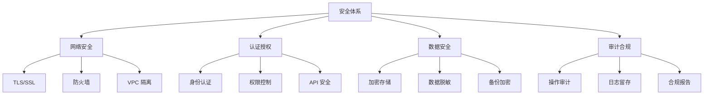
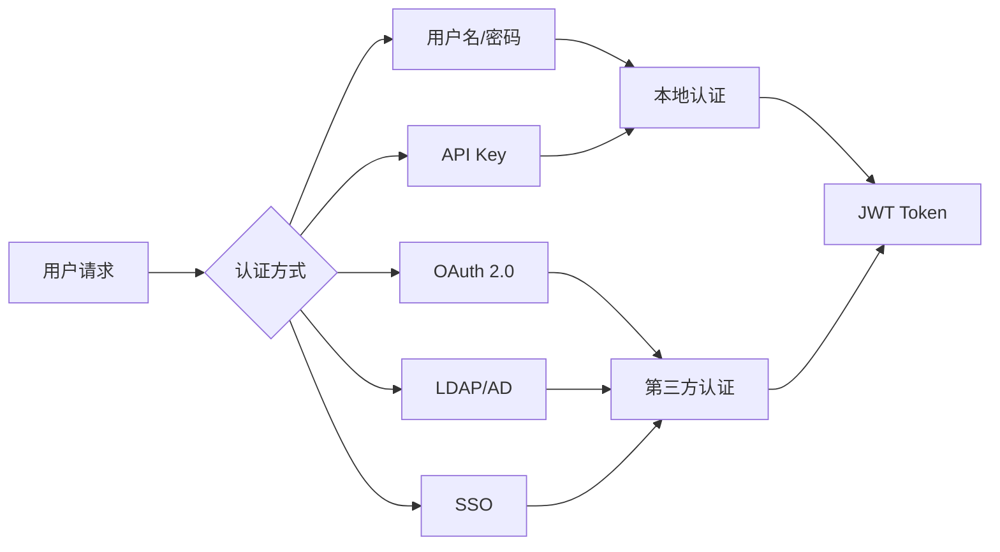

# 安全策略

轻易云 DataHub 提供了全方位的安全保护机制，确保数据在传输、存储和处理过程中的安全性。本文档详细介绍数据安全、传输加密、访问控制、审计日志和合规要求等内容。

## 概述

数据安全是数据集成平台的核心要求。轻易云 DataHub 采用纵深防御策略，从网络、应用、数据等多个层面构建安全防护体系。



## 数据安全

### 1. 数据分类分级

| 数据级别 | 定义 | 保护要求 | 示例 |
|---------|------|---------|------|
| L1 - 公开 | 可公开访问 | 基础保护 | 产品目录 |
| L2 - 内部 | 企业内部使用 | 访问控制 | 业务报表 |
| L3 - 机密 | 敏感业务数据 | 加密存储 | 订单数据 |
| L4 - 高度机密 | 核心商业数据 | 严格管控 | 财务数据、PII |

### 2. 数据加密

#### 静态数据加密

```yaml
# 静态加密配置
encryption_at_rest:
  enabled: true
  
  # 加密算法
  algorithm: "AES-256-GCM"
  
  # 密钥管理
  key_management:
    provider: "kms"  # kms, hsm, internal
    kms:
      type: "aliyun"  # aliyun, aws, azure
      region: "cn-hangzhou"
      key_id: "${KMS_KEY_ID}"
      
  # 加密范围
  scope:
    - connection_passwords    # 连接密码
    - job_configurations      # 任务配置
    - audit_logs             # 审计日志
    - cache_data             # 缓存数据
    
  # 字段级加密
  field_encryption:
    enabled: true
    fields:
      - table: "customers"
        columns: ["phone", "email", "id_card"]
      - table: "orders"
        columns: ["credit_card"]
```

#### 传输加密配置

```yaml
# TLS 配置
tls:
  enabled: true
  
  # 最低 TLS 版本
  min_version: "TLSv1.2"
  
  # 证书配置
  certificates:
    mode: "custom"  # custom, auto
    cert_path: "/etc/datahub/certs/server.crt"
    key_path: "/etc/datahub/certs/server.key"
    ca_path: "/etc/datahub/certs/ca.crt"
    
  # 密码套件
  cipher_suites:
    - "TLS_ECDHE_RSA_WITH_AES_256_GCM_SHA384"
    - "TLS_ECDHE_RSA_WITH_AES_128_GCM_SHA256"
    
  # HSTS
  hsts:
    enabled: true
    max_age: 31536000
    include_subdomains: true
```

### 3. 数据脱敏

```javascript
// 数据脱敏配置
const dataMasking = {
  enabled: true,
  
  // 脱敏规则
  rules: [
    {
      name: "phone_masking",
      pattern: "phone",
      method: "partial",  // partial, hash, replace
      config: {
        show_first: 3,
        show_last: 4,
        mask_char: "*"
      }
      // 138****8888
    },
    {
      name: "id_card_masking",
      pattern: "id_card",
      method: "partial",
      config: {
        show_first: 4,
        show_last: 4
      }
      // 1101***********1234
    },
    {
      name: "email_masking",
      pattern: "email",
      method: "regex",
      config: {
        regex: "(^.{2}).*(@.*$)",
        replacement: "$1***$2"
      }
      // zh***@example.com
    },
    {
      name: "bank_card_masking",
      pattern: "bank_card",
      method: "hash",
      config: {
        algorithm: "sha256",
        salt: "${SALT}"
      }
    }
  ],
  
  // 脱敏场景
  scenarios: {
    log_output: ["phone_masking", "email_masking"],
    api_response: ["phone_masking", "id_card_masking"],
    display_ui: ["phone_masking", "email_masking", "bank_card_masking"]
  }
};
```

## 传输加密

### 1. 连接器加密配置

| 数据源类型 | 加密协议 | 端口 | 证书验证 |
|-----------|---------|------|---------|
| MySQL | SSL/TLS | 3306 | 推荐开启 |
| PostgreSQL | SSL/TLS | 5432 | 推荐开启 |
| MongoDB | TLS | 27017 | 必须开启 |
| Kafka | SSL/SASL_SSL | 9093 | 推荐开启 |
| Elasticsearch | HTTPS | 9200 | 必须开启 |
| Redis | TLS | 6380 | 推荐开启 |

### 2. 数据库 SSL 连接示例

```yaml
# MySQL SSL 连接
connections:
  mysql_production:
    type: "mysql"
    host: "db.example.com"
    port: 3306
    ssl:
      enabled: true
      mode: "verify_ca"  # disable, prefer, require, verify_ca, verify_identity
      ca: "/certs/mysql-ca.pem"
      cert: "/certs/mysql-client-cert.pem"
      key: "/certs/mysql-client-key.pem"
      
# PostgreSQL SSL 连接
  postgresql_production:
    type: "postgresql"
    host: "pg.example.com"
    port: 5432
    ssl:
      enabled: true
      mode: "require"
      root_cert: "/certs/pg-root.crt"
```

### 3. API 安全传输

```yaml
# API 安全配置
api_security:
  # 强制 HTTPS
  enforce_https: true
  
  # 请求签名
  request_signing:
    enabled: true
    algorithm: "HMAC-SHA256"
    header: "X-Signature"
    timestamp_header: "X-Timestamp"
    timestamp_tolerance: 300  # 5 分钟时间窗口
    
  # 限流配置
  rate_limiting:
    enabled: true
    strategy: "token_bucket"
    default_limit: 1000  # 每分钟请求数
    
  # CORS 配置
  cors:
    enabled: true
    allowed_origins: ["https://app.example.com"]
    allowed_methods: ["GET", "POST", "PUT", "DELETE"]
    allowed_headers: ["Content-Type", "Authorization"]
    max_age: 3600
```

## 访问控制

### 1. 身份认证



| 认证方式 | 适用场景 | 安全级别 | 配置复杂度 |
|---------|---------|---------|-----------|
| 本地用户 | 小型部署 | 中 | 低 |
| API Key | 服务间调用 | 中 | 低 |
| OAuth 2.0 | 第三方集成 | 高 | 中 |
| LDAP/AD | 企业环境 | 高 | 中 |
| SSO | 统一认证 | 高 | 高 |

### 2. 权限模型

```yaml
# RBAC 权限配置
rbac:
  enabled: true
  
  # 角色定义
  roles:
    - name: "super_admin"
      description: "超级管理员"
      permissions: ["*"]
      
    - name: "admin"
      description: "管理员"
      permissions:
        - "job:*"
        - "connection:*"
        - "user:read"
        - "audit:read"
        - "config:read"
        
    - name: "developer"
      description: "开发者"
      permissions:
        - "job:read"
        - "job:create"
        - "job:update"
        - "job:execute"
        - "connection:read"
        
    - name: "viewer"
      description: "只读用户"
      permissions:
        - "job:read"
        - "connection:read"
        - "dashboard:read"
        
  # 资源级权限
  resource_permissions:
    enabled: true
    scope: ["job", "connection", "dataset"]
    
  # 数据级权限
  data_permissions:
    enabled: true
    row_level_security: true
    column_level_security: true
```

### 3. 细粒度权限控制

```javascript
// 权限检查中间件
const permissionCheck = (requiredPermission) => {
  return async (req, res, next) => {
    const user = req.user;
    const resource = req.params;
    
    // 检查用户权限
    const hasPermission = await checkPermission(
      user,
      requiredPermission,
      resource
    );
    
    if (!hasPermission) {
      return res.status(403).json({
        error: "Forbidden",
        message: "无权访问此资源"
      });
    }
    
    // 检查数据权限（行级安全）
    const dataFilter = await getDataFilter(user, resource);
    req.dataFilter = dataFilter;
    
    next();
  };
};

// 行级安全示例
const rowLevelSecurity = {
  table: "orders",
  rules: [
    {
      name: "sales_own_region",
      condition: "region = ${user.region}",
      roles: ["sales"]
    },
    {
      name: "manager_all_regions",
      condition: "1=1",
      roles: ["manager"]
    }
  ]
};
```

## 审计日志

### 1. 审计事件类型

| 事件类型 | 说明 | 记录内容 |
|---------|------|---------|
| AUTH | 认证事件 | 登录/登出、认证失败 |
| ACCESS | 访问事件 | 资源访问、API 调用 |
| DATA | 数据操作 | 增删改查、导入导出 |
| CONFIG | 配置变更 | 任务修改、连接变更 |
| ADMIN | 管理操作 | 用户管理、权限变更 |
| SYSTEM | 系统事件 | 启动/停止、故障恢复 |

### 2. 审计日志配置

```yaml
# 审计日志配置
audit_log:
  enabled: true
  
  # 日志级别
  level: "info"  # debug, info, warn, error
  
  # 记录内容
  fields:
    - timestamp
    - event_type
    - user_id
    - user_name
    - client_ip
    - action
    - resource_type
    - resource_id
    - result
    - error_message
    - request_id
    - session_id
    
  # 敏感操作
  sensitive_operations:
    - connection.password_change
    - user.permission_change
    - job.delete
    - data.export
    - config.security_change
    
  # 存储配置
  storage:
    type: "database"  # database, file, elasticsearch
    database:
      table: "audit_logs"
      retention_days: 365
      partition_by: "month"
      
  # 实时告警
  alerting:
    enabled: true
    rules:
      - name: "multiple_login_failures"
        condition: "event_type = 'AUTH' AND result = 'failure'"
        threshold: 5
        window: 300  # 5 分钟
        
      - name: "privilege_escalation"
        condition: "event_type = 'ADMIN' AND action = 'permission_grant'"
        severity: "high"
```

### 3. 审计日志示例

```json
{
  "timestamp": "2024-01-15T10:30:00.123Z",
  "event_type": "DATA",
  "severity": "INFO",
  "user": {
    "id": "user_001",
    "name": "张三",
    "role": "developer"
  },
  "client": {
    "ip": "192.168.1.100",
    "user_agent": "Mozilla/5.0...",
    "session_id": "sess_abc123"
  },
  "action": {
    "type": "EXPORT",
    "resource_type": "job",
    "resource_id": "job_001",
    "details": {
      "export_format": "CSV",
      "record_count": 10000,
      "destination": "s3://bucket/export.csv"
    }
  },
  "result": "SUCCESS",
  "performance": {
    "duration_ms": 5000,
    "bytes_transferred": 1024000
  },
  "trace_id": "trace_xyz789",
  "compliance_tags": ["export_control", "data_classification_L3"]
}
```

## 合规要求

### 1. 合规标准支持

| 标准/法规 | 适用范围 | DataHub 支持 |
|---------|---------|-------------|
| 网络安全等级保护 | 中国 | 等级保护 2.0/3.0 |
| GDPR | 欧盟 | 数据主体权利、数据处理记录 |
| 个人信息保护法 | 中国 | 数据最小化、目的限制 |
| ISO 27001 | 国际 | 信息安全管理体系 |
| SOC 2 | 美国 | 安全性、可用性、保密性 |
| HIPAA | 美国医疗 | 受保护健康信息 |

### 2. 等保合规配置

```yaml
# 等级保护配置
compliance:
  framework: "mlps_2.0"  # 网络安全等级保护 2.0
  level: 3  # 保护等级
  
  # 身份鉴别
  identity:
    password_policy:
      min_length: 8
      complexity: "high"
      expiration_days: 90
      history_count: 5
      
    mfa:
      enabled: true
      methods: ["totp", "sms"]
      required_for: ["admin", "super_admin"]
      
  # 访问控制
  access_control:
    session_timeout: 1800  # 30 分钟
    concurrent_session_limit: 3
    ip_whitelist: []  # 可选
    
  # 安全审计
  audit:
    coverage: 100  # 审计覆盖率
    tamper_proof: true  # 防篡改
    retention_days: 180
    
  # 数据安全
  data_security:
    classification: true
    encryption_required: ["L3", "L4"]
    backup_required: true
    
  # 入侵防范
  intrusion_prevention:
    sql_injection_protection: true
    xss_protection: true
    brute_force_protection: true
```

### 3. GDPR 合规功能

```yaml
# GDPR 配置
gdpr:
  enabled: true
  
  # 数据主体权利
  data_subject_rights:
    # 访问权
    right_to_access:
      enabled: true
      response_time_days: 30
      
    # 更正权
    right_to_rectification:
      enabled: true
      
    # 删除权（被遗忘权）
    right_to_erasure:
      enabled: true
      cascade_delete: true
      
    # 可携带权
    right_to_portability:
      enabled: true
      formats: ["json", "csv", "xml"]
      
  # 数据处理记录
  processing_records:
    enabled: true
    fields:
      - purpose
      - data_categories
      - recipient_categories
      - retention_period
      - security_measures
      
  # 数据保护影响评估
  dpia:
    enabled: true
    triggers:
      - high_risk_processing
      - systematic_monitoring
      - large_scale_sensitive_data
```

### 4. 合规报告生成

```javascript
// 合规报告生成器
class ComplianceReporter {
  async generateReport(standard, period) {
    const report = {
      standard,
      period,
      generated_at: new Date().toISOString(),
      sections: []
    };
    
    // 身份鉴别报告
    report.sections.push(await this.generateIdentitySection(period));
    
    // 访问控制报告
    report.sections.push(await this.generateAccessControlSection(period));
    
    // 安全审计报告
    report.sections.push(await this.generateAuditSection(period));
    
    // 数据安全报告
    report.sections.push(await this.generateDataSecuritySection(period));
    
    // 漏洞和事件报告
    report.sections.push(await this.generateIncidentSection(period));
    
    return report;
  }
  
  async generateAuditSection(period) {
    const logs = await this.auditLog.query({
      start: period.start,
      end: period.end
    });
    
    return {
      title: "安全审计",
      summary: {
        total_events: logs.length,
        login_events: logs.filter(l => l.event_type === 'AUTH').length,
        failed_logins: logs.filter(l => l.result === 'failure').length,
        data_access: logs.filter(l => l.event_type === 'DATA').length
      },
      findings: this.analyzeFindings(logs)
    };
  }
}
```

## 安全最佳实践

### 1. 部署安全

> [!IMPORTANT]
> 1. 使用专用网络（VPC）部署，限制公网访问
> 2. 数据库和缓存服务不直接暴露公网
> 3. 启用所有连接器的 TLS 加密
> 4. 定期更新系统和依赖组件
> 5. 禁用默认账户和不必要的服务

```yaml
# 安全配置清单
security_checklist:
  deployment:
    - vpc_isolation: true
    - security_groups_configured: true
    - public_access_minimized: true
    - waf_enabled: true
    - ddos_protection: true
    
  authentication:
    - strong_password_policy: true
    - mfa_enabled: true
    - session_timeout_configured: true
    - api_key_rotation: true
    
  encryption:
    - tls_1.2_minimum: true
    - data_at_rest_encrypted: true
    - key_rotation_enabled: true
    - certificate_validity_monitored: true
    
  monitoring:
    - audit_logging_enabled: true
    - suspicious_activity_alerts: true
    - log_retention_compliant: true
    - regular_security_scans: true
```

### 2. 数据安全清单

| 检查项 | 要求 | 验证方法 |
|-------|------|---------|
| 敏感数据加密 | 必须 | 配置审查 |
| 密钥安全存储 | 必须使用 KMS | 配置审查 |
| 数据脱敏 | 生产环境必须 | 代码审查 |
| 访问日志完整 | 100% 覆盖 | 日志审计 |
| 数据备份加密 | 必须 | 配置审查 |
| 数据传输加密 | TLS 1.2+ | 网络抓包 |

通过以上安全策略和最佳实践，您可以确保轻易云 DataHub 满足企业级的安全要求，保护数据资产的安全性和合规性。
