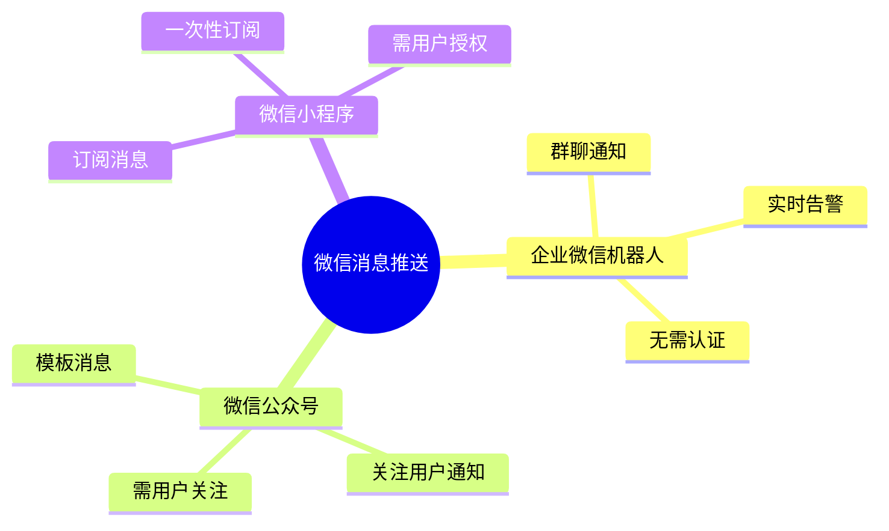
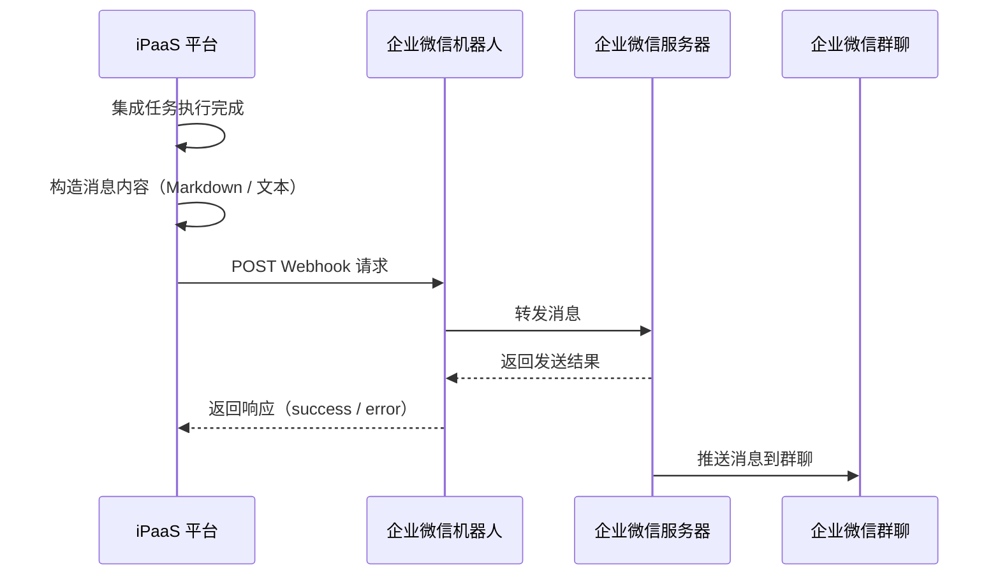
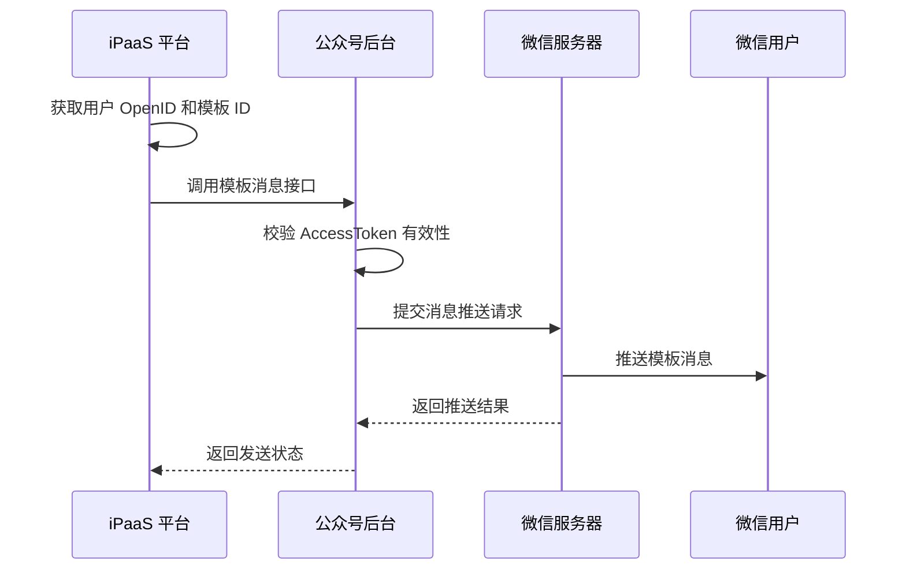
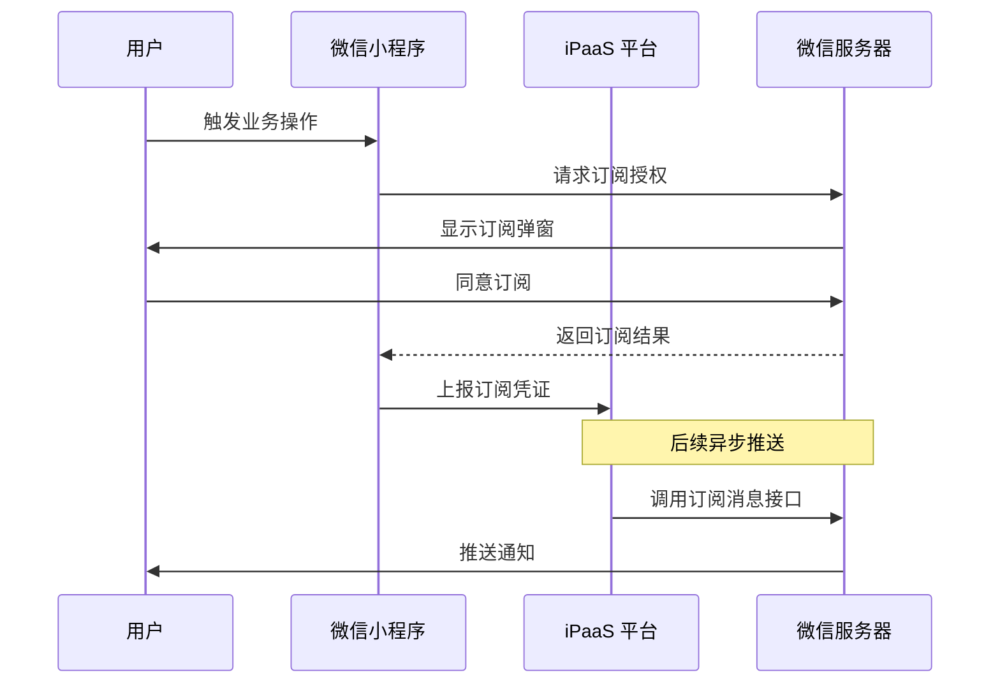
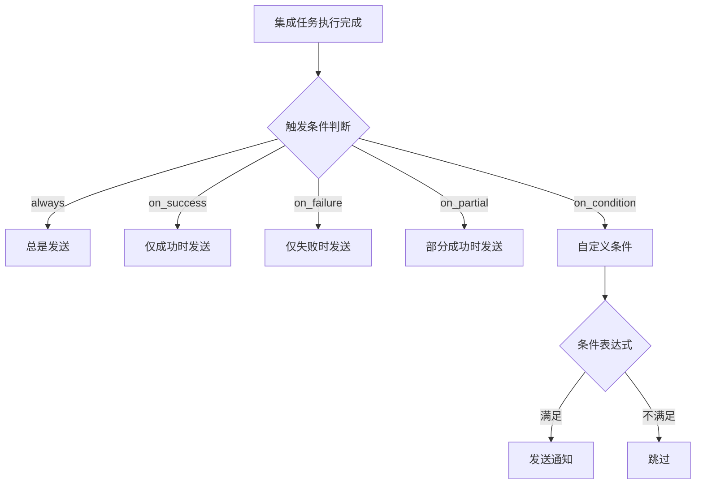
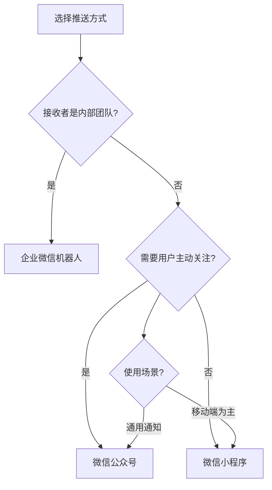

# 推送微信集成消息配置

本文介绍如何在轻易云 iPaaS 集成流程中配置微信消息推送功能，实现集成结果通知、异常告警和业务提醒。支持企业微信机器人、微信公众号、微信小程序三种推送方式，帮助你及时掌握集成任务执行状态。

> [!NOTE]
> 微信消息推送作为集成流程的**后置处理动作**，在数据同步完成后自动触发。你可以在单个集成方案中配置多个推送渠道，实现多渠道同时通知。

## 微信推送方式概览

轻易云 iPaaS 平台支持以下三种微信消息推送方式：



| 推送方式 | 适用场景 | 消息触达 | 配置复杂度 | 延迟 |
| -------- | -------- | -------- | ---------- | ---- |
| **企业微信机器人** | 内部团队通知、运维告警 | 群聊成员 | ⭐⭐ | 秒级 |
| **微信公众号** | 业务通知、状态提醒 | 关注用户 | ⭐⭐⭐ | 秒级 |
| **微信小程序** | 移动端提醒、待办通知 | 授权用户 | ⭐⭐⭐⭐ | 秒级 |

## 企业微信机器人推送

企业微信机器人是最简单、最常用的推送方式，适用于团队内部的通知和告警场景。通过配置群聊机器人的 Webhook 地址，即可实现消息自动推送。

### 工作原理



### 配置步骤

#### 步骤一：创建企业微信群机器人

1. 在企业微信中打开目标群聊，点击右上角**群设置**
2. 选择**添加群机器人** → **新创建一个机器人**
3. 填写机器人名称（如「轻易云通知」），上传头像
4. 复制生成的 **Webhook 地址**，格式如下：

```text
https://qyapi.weixin.qq.com/cgi-bin/webhook/send?key=xxxxxxxx-xxxx-xxxx-xxxx-xxxxxxxxxxxx
```

> [!IMPORTANT]
> Webhook 密钥（key 参数）是调用机器人的唯一凭证，请妥善保管。如密钥泄露，可在群设置中重置。

#### 步骤二：配置集成方案推送

在轻易云平台的集成方案编辑器中，进入**目标平台配置**或**后置处理**环节，添加微信推送节点：

```json
{
  "type": "NOTIFICATION",
  "channel": "wecom_bot",
  "config": {
    "webhookUrl": "https://qyapi.weixin.qq.com/cgi-bin/webhook/send?key=YOUR_KEY",
    "msgType": "markdown",
    "content": {
      "title": "集成任务执行通知",
      "body": "**任务名称**: {{TASK_NAME}}\n**执行时间**: {{EXEC_TIME}}\n**处理数量**: {{RECORD_COUNT}} 条\n**执行结果**: {{STATUS}}"
    }
  },
  "triggerCondition": "always"
}
```

#### 步骤三：测试推送功能

1. 点击**测试连接**验证 Webhook 地址有效性
2. 执行一次手动同步，检查群聊是否收到通知
3. 如未收到，查看**集成日志**中的推送记录排查问题

### 消息模板变量

企业微信机器人支持以下内置变量，在消息内容中自动替换：

| 变量名 | 说明 | 示例值 |
| ------ | ---- | ------ |
| `{{TASK_NAME}}` | 集成方案名称 | 订单同步-金蝶到旺店通 |
| `{{EXEC_TIME}}` | 执行时间 | 2026-03-13 14:30:25 |
| `{{RECORD_COUNT}}` | 处理记录数 | 156 |
| `{{SUCCESS_COUNT}}` | 成功数量 | 150 |
| `{{FAIL_COUNT}}` | 失败数量 | 6 |
| `{{STATUS}}` | 执行状态 | 成功 / 部分成功 / 失败 |
| `{{DURATION}}` | 执行耗时 | 12.5s |
| `{{ERROR_MSG}}` | 错误信息（失败时） | 连接超时 |

### 消息格式示例

#### 文本消息

```json
{
  "msgtype": "text",
  "text": {
    "content": "【轻易云通知】订单同步完成\n成功：150 条\n失败：6 条\n耗时：12.5 秒",
    "mentioned_list": ["@all"]
  }
}
```

#### Markdown 消息（推荐）

```json
{
  "msgtype": "markdown",
  "markdown": {
    "content": "**集成任务执行报告**\n>任务：<font color='info'>订单同步</font>\n>时间：2026-03-13 14:30:25\n>结果：<font color='info'>✅ 成功</font>\n>数量：处理 <font color='info'>156</font> 条，成功 <font color='info'>150</font> 条"
  }
}
```

支持的颜色标签：
- `<font color='info'>绿色</font>` — 成功、正常状态
- `<font color='warning'>橙色</font>` — 警告、注意
- `<font color='comment'>灰色</font>` — 注释、辅助信息

> [!TIP]
> 推荐使用 Markdown 格式，支持更丰富的排版和颜色标注，便于快速识别关键信息。

## 微信公众号模板消息

微信公众号模板消息适用于向已关注公众号的用户推送业务通知，如订单状态变更、审批提醒等。

### 工作原理



### 前置条件

1. 拥有已认证的**服务号**（订阅号不支持模板消息）
2. 在公众号后台申请并获取**模板 ID**
3. 获取目标用户的 **OpenID**（需用户关注公众号）

### 配置步骤

#### 步骤一：公众号后台配置

1. 登录[微信公众平台](https://mp.weixin.qq.com/)
2. 进入**广告与服务** → **模板消息**（或**订阅通知**）
3. 从模板库中选择合适的模板，或申请自定义模板
4. 记录**模板 ID**（如：`xxxxxxxxxxxxxxxxxxxxxxxxxxxxxxxx`）

#### 步骤二：获取开发者凭证

在**设置与开发** → **基本配置**中获取：

| 参数 | 说明 | 获取位置 |
| ---- | ---- | -------- |
| `appId` | 公众号应用 ID | 基本配置 → 开发者 ID |
| `appSecret` | 应用密钥 | 基本配置 → 开发者密码 |

#### 步骤三：配置集成方案

```json
{
  "type": "NOTIFICATION",
  "channel": "wechat_mp",
  "config": {
    "appId": "wx_xxxxxxxxxxxxxxxx",
    "appSecret": "{{WECHAT_MP_SECRET}}",
    "templateId": "xxxxxxxxxxxxxxxxxxxxxxxxxxxxxxxx",
    "url": "https://your-domain.com/detail?id={{RECORD_ID}}",
    "data": {
      "first": {
        "value": "订单同步完成通知",
        "color": "#173177"
      },
      "keyword1": {
        "value": "{{ORDER_NO}}",
        "color": "#173177"
      },
      "keyword2": {
        "value": "{{SYNC_STATUS}}",
        "color": "{{STATUS_COLOR}}"
      },
      "keyword3": {
        "value": "{{SYNC_TIME}}",
        "color": "#173177"
      },
      "remark": {
        "value": "点击查看同步详情",
        "color": "#888888"
      }
    }
  },
  "triggerCondition": "on_success"
}
```

### 模板消息数据结构

微信模板消息采用固定格式，需要按模板定义的字段填充数据：

```json
{
  "touser": "用户 OpenID",
  "template_id": "模板 ID",
  "url": "点击跳转链接",
  "data": {
    "first": { "value": "标题", "color": "#173177" },
    "keyword1": { "value": "字段 1 值", "color": "#173177" },
    "keyword2": { "value": "字段 2 值", "color": "#173177" },
    "remark": { "value": "备注", "color": "#888888" }
  }
}
```

> [!WARNING]
> 模板消息有严格的格式要求，字段名称必须与申请的模板一致。颜色值使用十六进制格式（如 `#173177`）。

### 获取用户 OpenID

OpenID 是微信用户的唯一标识，获取方式：

1. **网页授权**：引导用户访问授权页面，授权后获取
2. **事件推送**：用户关注公众号时，通过事件消息获取
3. **批量获取**：通过用户标签管理接口批量查询

网页授权获取 OpenID 示例：

```text
https://open.weixin.qq.com/connect/oauth2/authorize?
  appid=YOUR_APPID&
  redirect_uri=ENCODED_REDIRECT_URI&
  response_type=code&
  scope=snsapi_base&
  state=STATE#wechat_redirect
```

## 微信小程序订阅消息

微信小程序订阅消息适用于向小程序用户推送一次性或长期订阅的通知，适合移动端业务场景。

### 订阅类型

| 类型 | 说明 | 使用限制 |
| ---- | ---- | -------- |
| **一次性订阅** | 用户授权后发送一次 | 每次发送都需用户授权 |
| **长期订阅** | 用户一次授权，长期可用 | 仅限政务、医疗、交通等特定类目 |

### 工作原理



### 配置步骤

#### 步骤一：小程序后台配置

1. 登录[微信小程序后台](https://mp.weixin.qq.com/)
2. 进入**功能** → **订阅消息**
3. 选用公共模板或申请自定义模板
4. 记录**模板 ID** 和模板字段定义

#### 步骤二：小程序端订阅授权

在小程序代码中触发订阅授权：

```javascript
// 小程序端代码
wx.requestSubscribeMessage({
  tmplIds: ['TEMPLATE_ID_1', 'TEMPLATE_ID_2'],
  success: (res) => {
    if (res['TEMPLATE_ID_1'] === 'accept') {
      // 用户同意订阅，上报服务端
      wx.request({
        url: 'https://your-api.com/subscribe',
        method: 'POST',
        data: {
          templateId: 'TEMPLATE_ID_1',
          openId: getApp().globalData.openId
        }
      });
    }
  }
});
```

#### 步骤三：配置 iPaaS 推送

```json
{
  "type": "NOTIFICATION",
  "channel": "wechat_miniapp",
  "config": {
    "appId": "wx_xxxxxxxxxxxxxxxx",
    "appSecret": "{{WECHAT_MINI_SECRET}}",
    "templateId": "xxxxxxxxxxxxxxxxxxxxxxxxxxxxxxxx",
    "page": "pages/notification/detail?id={{RECORD_ID}}",
    "miniprogramState": "formal",
    "lang": "zh_CN",
    "data": {
      "thing1": { "value": "订单同步任务" },
      "time2": { "value": "{{SYNC_TIME}}" },
      "thing3": { "value": "{{SYNC_RESULT}}" },
      "character_string4": { "value": "{{ORDER_COUNT}}" }
    }
  },
  "triggerCondition": "on_complete"
}
```

### 模板字段类型对照

订阅消息的字段有特定类型限制：

| 类型标识 | 说明 | 示例 | 长度限制 |
| -------- | ---- | ---- | -------- |
| `thing` | 事物 | 订单同步完成 | ≤ 20 字符 |
| `number` | 数字 | 156 | ≤ 32 字符 |
| `letter` | 字母 | SUCCESS | ≤ 32 字符 |
| `symbol` | 符号 | + | ≤ 5 字符 |
| `character_string` | 字符串 | SN20240313001 | ≤ 32 字符 |
| `time` | 时间 | 2026年3月13日 14:30 | 格式固定 |
| `date` | 日期 | 2026年3月13日 | 格式固定 |
| `amount` | 金额 | 199.99 元 | ≤ 32 字符 |
| `phone_number` | 电话 | 13800138000 | ≤ 32 字符 |
| `car_number` | 车牌 | 粤 B12345 | ≤ 32 字符 |

> [!CAUTION]
> 订阅消息内容必须严格符合字段类型定义，超出长度限制或格式不符将导致发送失败。

## 触发条件配置

微信推送支持配置不同的触发条件，灵活控制通知时机：



### 触发条件类型

| 条件值 | 说明 |
| ------ | ---- |
| `always` | 每次执行完成都发送 |
| `on_success` | 仅执行成功时发送 |
| `on_failure` | 仅执行失败时发送 |
| `on_partial` | 部分成功（有成功有失败）时发送 |
| `on_condition` | 自定义条件表达式 |

### 自定义条件示例

```json
{
  "triggerCondition": "on_condition",
  "condition": {
    "expression": "{{FAIL_COUNT}} > 10 || {{DURATION}} > 300",
    "description": "失败数超过 10 条或执行超过 5 分钟时告警"
  }
}
```

支持的条件运算符：

| 运算符 | 说明 | 示例 |
| ------ | ---- | ---- |
| `>` | 大于 | `{{FAIL_COUNT}} > 5` |
| `<` | 小于 | `{{SUCCESS_RATE}} < 0.95` |
| `==` | 等于 | `{{STATUS}} == '失败'` |
| `!=` | 不等于 | `{{STATUS}} != '成功'` |
| `&&` | 逻辑与 | `A > 5 && B < 10` |
| `\|\|` | 逻辑或 | `A > 5 \|\| B > 10` |

## 高级配置

### 消息聚合

对于高频执行的集成任务，可启用消息聚合功能，避免频繁推送：

```json
{
  "type": "NOTIFICATION",
  "channel": "wecom_bot",
  "config": {
    "webhookUrl": "https://qyapi.weixin.qq.com/cgi-bin/webhook/send?key=xxx",
    "aggregation": {
      "enabled": true,
      "windowMinutes": 30,
      "maxMessages": 10,
      "summaryTemplate": "过去 30 分钟共执行 {{EXEC_COUNT}} 次，成功 {{SUCCESS_COUNT}} 次，失败 {{FAIL_COUNT}} 次"
    }
  }
}
```

### 失败重试

推送失败时自动重试，提高消息到达率：

```json
{
  "retryPolicy": {
    "maxRetries": 3,
    "retryInterval": 5000,
    "exponentialBackoff": true
  }
}
```

### 多渠道备份

配置主备渠道，主渠道失败时自动切换：

```json
{
  "type": "NOTIFICATION",
  "channels": [
    {
      "channel": "wecom_bot",
      "priority": 1,
      "config": { }
    },
    {
      "channel": "wechat_mp",
      "priority": 2,
      "config": { },
      "fallback": true
    }
  ]
}
```

## 最佳实践

### 1. 选择合适的推送方式



### 2. 消息内容设计建议

| 建议 | 说明 |
| ---- | ---- |
| **简洁明了** | 突出关键信息，避免冗长描述 |
| **分类标识** | 使用 emoji 或标签区分消息类型（🟢 成功 / 🔴 失败） |
| **可操作** | 提供跳转链接，方便快速处理 |
| **去重合并** | 高频任务启用聚合，避免消息轰炸 |

### 3. 安全注意事项

> [!WARNING]
> - **密钥保护**：将 Webhook 密钥、AppSecret 等敏感信息存储在平台变量中，不要硬编码在配置里
> - **IP 白名单**：在微信后台配置服务器 IP 白名单，限制调用来源
> - **频率控制**：遵守微信接口调用频率限制，避免被封禁
> - **签名验证**：Webhook 接收场景务必验证消息签名

## 常见问题

### Q: 企业微信机器人推送失败，如何排查？

排查步骤：

1. **检查 Webhook 地址** — 确认 key 参数正确，未过期或被重置
2. **查看网络连通性** — 从服务器测试能否访问 `qyapi.weixin.qq.com`
3. **检查消息格式** — 确认 JSON 格式正确，字段完整
4. **查看响应信息** — 微信会返回具体错误码，对照下表排查：

| 错误码 | 含义 | 解决方法 |
| ------ | ---- | -------- |
| 0 | 成功 | — |
| 93000 | 无效的请求 | 检查 JSON 格式 |
| 93001 | 无效的 key | 确认 Webhook key 正确 |
| 93002 | 消息过大 | 压缩消息内容 |
| 93003 | 发送频率限制 | 降低推送频率 |

### Q: 微信公众号模板消息收不到？

可能原因及解决方法：

1. **用户未关注公众号** — 模板消息只能发送给关注用户
2. **模板 ID 错误** — 确认使用的模板 ID 与后台一致
3. **AccessToken 过期** — 平台会自动刷新，如持续失败请检查 AppSecret
4. **用户拒收消息** — 用户可能在公众号设置中关闭接收

### Q: 小程序订阅消息提示「用户未授权」？

一次性订阅消息需要用户先授权，解决方法：

1. 在小程序业务逻辑中添加订阅授权引导
2. 使用 `wx.requestSubscribeMessage` 主动触发授权弹窗
3. 将用户授权记录保存到数据库，推送前检查授权状态

### Q: 如何避免消息被屏蔽或进入垃圾箱？

1. **内容合规** — 避免使用敏感词、营销性过强的内容
2. **频率控制** — 单用户每日推送不超过微信限制（服务号 4 条/天）
3. **质量监控** — 关注消息送达率和用户投诉率
4. **提供退订** — 在消息中提供关闭通知的方式

### Q: 可以@指定成员吗？

企业微信机器人支持在消息中 @成员：

```json
{
  "msgtype": "text",
  "text": {
    "content": "紧急告警：订单同步失败",
    "mentioned_list": ["UserID1", "UserID2"],
    "mentioned_mobile_list": ["13800138000"]
  }
}
```

> [!NOTE]
> `@all` 可以 @所有人，但需要机器人有相应权限。使用手机号 @时，该手机号必须已在企业微信中注册。

## 相关文档

- [监控告警](../guide/monitoring-alerts) — 集成任务监控与告警配置
- [日志管理](../guide/log-management) — 查看推送日志与排查问题
- [自定义函数](./custom-functions) — 编写自定义消息处理逻辑
- [企业微信连接器](../connectors/oa/wecom) — 企业微信深度集成
- [监控告警](../guide/monitoring-alerts) — 查看通知与告警能力的通用说明

## 更新日志

| 版本 | 日期 | 更新内容 |
| ---- | ---- | -------- |
| v3.5.0 | 2026-03-01 | 新增小程序订阅消息支持 |
| v3.4.0 | 2026-01-15 | 新增消息聚合与多渠道备份功能 |
| v3.3.0 | 2025-11-20 | 新增微信公众号模板消息 |
| v3.2.0 | 2025-09-10 | 初始版本，支持企业微信机器人 |
