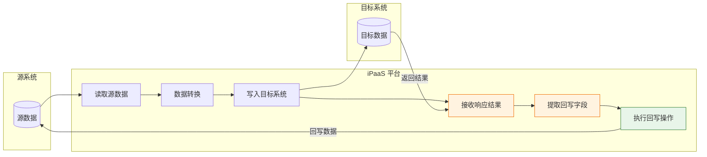
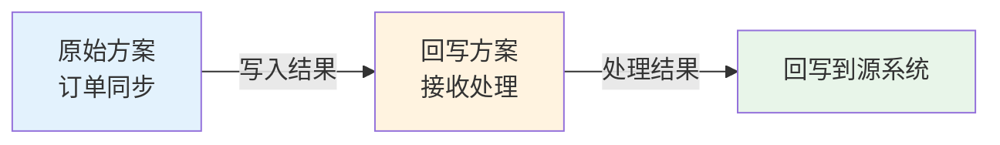
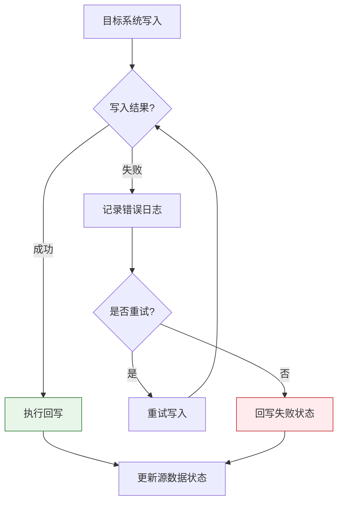
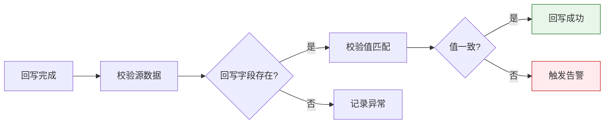
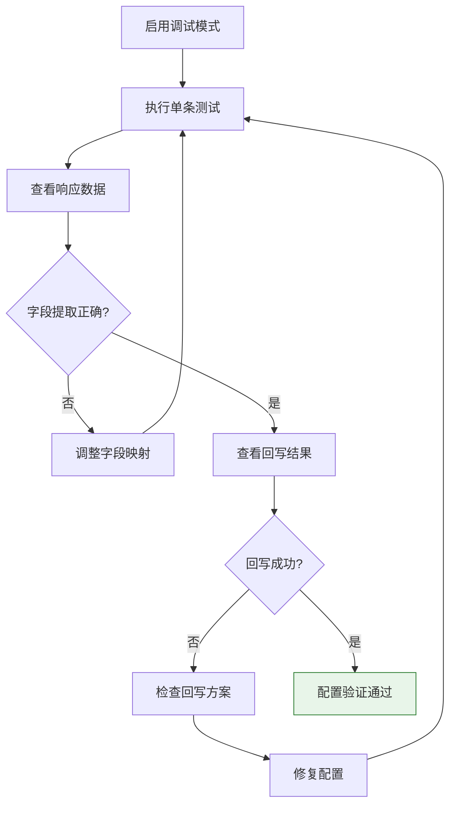

# 目标写入结果回写原始数据

目标写入结果回写是轻易云 iPaaS 平台提供的一种高级数据集成能力，用于将目标系统写入操作返回的结果（如新生成的单据 ID、单据编号、状态码等）自动回写到源系统或指定接收端。这一机制确保了数据在跨系统流转过程中的完整性和可追溯性，特别适用于订单号回写、状态同步、上下游单据关联等业务场景。

> [!NOTE]
> 回写功能与[链式触发方案](./chain-trigger)配合使用，可实现更复杂的多系统联动业务流程。

## 适用场景

| 场景 | 说明 | 典型业务 |
| ---- | ---- | -------- |
| **订单号回写** | 将下游系统生成的订单号回写到上游系统 | ERP 订单同步到电商平台后回写平台订单号 |
| **状态同步** | 将目标系统的处理状态回写到源系统 | 支付成功后回写支付状态、发货后回写物流状态 |
| **ID 映射** | 建立源系统与目标系统的 ID 映射关系 | 客户编码映射、物料编码映射 |
| **单据关联** | 将生成的关联单据信息回写 | 采购订单生成入库单后回写入库单号 |
| **错误反馈** | 将写入失败的错误信息回写 | 数据校验失败回写错误原因 |

## 核心概念

### 回写机制原理



### 回写数据流向

```mermaid
sequenceDiagram
    participant Source as 源系统
    participant iPaaS as iPaaS 平台
    participant Target as 目标系统
    participant Callback as 回写目标

    iPaaS->>Source: 1. 查询源数据
    Source-->>iPaaS: 返回数据
    
    iPaaS->>iPaaS: 2. 数据转换处理
    
    iPaaS->>Target: 3. 写入目标系统
    Target-->>iPaaS: 4. 返回写入结果<br/>（ID / Number / Status）
    
    iPaaS->>iPaaS: 5. 提取回写字段
    
    alt 回写到源系统
        iPaaS->>Source: 6a. 回写结果到源数据
    else 回写到新方案
        iPaaS->>Callback: 6b. 触发回写方案
    end
    
    style iPaaS fill:#e3f2fd
    style Callback fill:#e8f5e9
```

## 配置方法

### 方式一：回写到源数据管理

在目标平台配置中定义 `primaryWriteback` 参数，将目标系统的响应结果回写到当前数据管理（源数据）。

#### 步骤一：配置目标平台响应回写参数

在方案的目标平台配置中，添加 `primaryWriteback` 参数定义：

```json
{
  "target": {
    "api": "purchaseorder.create",
    "type": "WRITE",
    "method": "POST",
    "response": [
      {
        "field": "primaryWriteback",
        "label": "回写参数",
        "type": "object",
        "is_required": false,
        "describe": "配置响应结果回写字段",
        "children": [
          {
            "field": "id",
            "label": "单据ID",
            "type": "string",
            "is_required": false,
            "describe": "目标系统生成的单据ID",
            "value": "{{Id}}",
            "parent": "primaryWriteback"
          },
          {
            "field": "number",
            "label": "单据编号",
            "type": "string",
            "is_required": false,
            "describe": "目标系统生成的单据编号",
            "value": "{{Number}}",
            "parent": "primaryWriteback"
          },
          {
            "field": "status",
            "label": "处理状态",
            "type": "string",
            "is_required": false,
            "describe": "目标系统返回的处理状态",
            "value": "{{Status}}",
            "parent": "primaryWriteback"
          }
        ],
        "value": null
      }
    ]
  }
}
```

#### 步骤二：配置响应字段映射

根据目标系统实际返回的数据结构，配置字段映射：

| 参数 | 类型 | 必填 | 说明 |
| ---- | ---- | ---- | ---- |
| `field` | string | ✅ | 回写字段标识符 |
| `label` | string | ✅ | 字段显示名称 |
| `type` | string | ✅ | 字段类型：`string`、`number`、`boolean` |
| `value` | string | ✅ | 从响应数据中提取的字段路径，使用 `{{}}` 语法 |
| `parent` | string | ✅ | 固定值为 `primaryWriteback` |

#### 步骤三：查看回写结果

配置成功后，当数据写入目标系统并返回响应时，系统会自动将配置的字段值回写到数据管理中。回写后的数据可以在数据详情中查看：

```json
{
  "id": "原始数据ID",
  "source_data": {
    // 原始源数据
  },
  "primaryWriteback": {
    "id": "KINGDEE_PO_001",
    "number": "CG202503130001",
    "status": "success"
  }
}
```

### 方式二：回写到新方案

当需要将回写结果传递给另一个集成方案处理时，可以通过 `callBackStrategy` 配置实现方案间的数据传递。

#### 步骤一：创建接收回写的方案

1. 新建一个集成方案作为回写接收端
2. 方案平台选择**轻易云集成平台**
3. 接口选择**空操作**（或根据实际需求选择其他接口）



#### 步骤二：获取方案 ID

方案创建完成后，从顶部地址栏或方案详情中获取方案 ID：

```text
https://www.qeasy.cloud/datahub/plan/{strategyId}
```

> [!IMPORTANT]
> 回写方案创建后，需要确保已配置源平台的 ID 和 Number 字段映射，以便正确接收回写数据。

#### 步骤三：配置原方案的回写策略

在需要回写数据的方案（原方案）目标平台配置中，添加 `callBackStrategy` 子对象：

```json
{
  "target": {
    "api": "customer.create",
    "type": "WRITE",
    "method": "POST",
    "response": [
      {
        "field": "primaryWriteback",
        "label": "回写参数",
        "type": "object",
        "children": [
          {
            "field": "id",
            "label": "客户ID",
            "type": "string",
            "value": "{{Id}}",
            "parent": "primaryWriteback"
          },
          {
            "field": "number",
            "label": "客户编码",
            "type": "string",
            "value": "{{Number}}",
            "parent": "primaryWriteback"
          }
        ]
      }
    ]
  },
  "callBackStrategy": {
    "strategyId": "b008d61b-2b91-3c0b-8c91-64c893bd6c7c",
    "FCUSTID": "{{FCUSTID}}",
    "FCustTypeId_FNumber": "{{FCustTypeId_FNumber}}",
    "FNumber": "{{primaryWriteback.Number}}",
    "FId": "{{primaryWriteback.Id}}"
  }
}
```

#### callBackStrategy 参数说明

| 参数 | 类型 | 必填 | 说明 |
| ---- | ---- | ---- | ---- |
| `strategyId` | string | ✅ | 接收回写数据的方案 ID |
| 自定义字段 | string | — | 需要传递给回写方案的其他字段 |
| `primaryWriteback.xxx` | string | — | 引用目标系统返回的结果字段 |

> [!WARNING]
> 取值时需要使用 `{{primaryWriteback.xxx}}` 格式引用目标系统返回的结果，其中 `xxx` 对应 `primaryWriteback` 中配置的子字段名。

## 完整配置示例

### 示例一：采购订单号回写

场景：将金蝶云星空生成的采购订单号回写到源系统的电商订单中。

```json
{
  "source": {
    "api": "oms.order.query",
    "type": "QUERY",
    "method": "POST",
    "params": {
      "status": "confirmed"
    }
  },
  "target": {
    "api": "purchaseorder.create",
    "type": "WRITE",
    "method": "POST",
    "mapping": {
      "FBillType": "{{order_type}}",
      "FBusinessType": "{{business_type}}",
      "FSupplierId": "{{supplier_code}}"
    },
    "response": [
      {
        "field": "primaryWriteback",
        "label": "回写参数",
        "type": "object",
        "children": [
          {
            "field": "id",
            "label": "采购订单ID",
            "type": "string",
            "value": "{{Id}}",
            "parent": "primaryWriteback"
          },
          {
            "field": "number",
            "label": "采购订单编号",
            "type": "string",
            "value": "{{BillNo}}",
            "parent": "primaryWriteback"
          },
          {
            "field": "date",
            "label": "创建日期",
            "type": "string",
            "value": "{{CreateDate}}",
            "parent": "primaryWriteback"
          }
        ]
      }
    ]
  }
}
```

### 示例二：跨方案状态同步

场景：销售订单同步到 ERP 后，将 ERP 生成的单据信息回写并通过新方案通知 WMS 系统。

**方案 A（销售订单同步）配置：**

```json
{
  "source": {
    "api": "crm.order.query",
    "type": "QUERY",
    "method": "POST"
  },
  "target": {
    "api": "saleorder.create",
    "type": "WRITE",
    "method": "POST",
    "response": [
      {
        "field": "primaryWriteback",
        "label": "回写参数",
        "type": "object",
        "children": [
          {
            "field": "erpOrderId",
            "label": "ERP订单ID",
            "type": "string",
            "value": "{{Id}}",
            "parent": "primaryWriteback"
          },
          {
            "field": "erpOrderNo",
            "label": "ERP订单编号",
            "type": "string",
            "value": "{{BillNo}}",
            "parent": "primaryWriteback"
          }
        ]
      }
    ]
  },
  "callBackStrategy": {
    "strategyId": "wms-notify-scheme-id",
    "crmOrderId": "{{order_id}}",
    "crmOrderNo": "{{order_no}}",
    "erpOrderId": "{{primaryWriteback.erpOrderId}}",
    "erpOrderNo": "{{primaryWriteback.erpOrderNo}}",
    "customerCode": "{{customer_code}}"
  }
}
```

**方案 B（WMS 通知）配置：**

```json
{
  "source": {
    "api": "easyyun.platform.receive",
    "type": "RECEIVE",
    "method": "POST"
  },
  "target": {
    "api": "wms.inbound.notify",
    "type": "WRITE",
    "method": "POST",
    "mapping": {
      "sourceOrderId": "{{crmOrderId}}",
      "sourceOrderNo": "{{crmOrderNo}}",
      "erpOrderId": "{{erpOrderId}}",
      "erpOrderNo": "{{erpOrderNo}}",
      "customerCode": "{{customerCode}}"
    }
  }
}
```

## 高级用法

### 条件回写

根据目标系统的返回结果决定是否执行回写：

```json
{
  "callBackStrategy": {
    "strategyId": "callback-scheme-id",
    "condition": "{{primaryWriteback.status}} === 'success'",
    "successId": "{{primaryWriteback.id}}",
    "successNo": "{{primaryWriteback.number}}"
  }
}
```

### 多字段组合回写

将多个响应字段组合后回写：

```json
{
  "callBackStrategy": {
    "strategyId": "callback-scheme-id",
    "combinedInfo": "单据{{primaryWriteback.number}}于{{primaryWriteback.date}}创建成功，ID:{{primaryWriteback.id}}"
  }
}
```

### 错误信息回写

将写入失败的错误信息回写到源系统：

```json
{
  "target": {
    "response": [
      {
        "field": "primaryWriteback",
        "label": "回写参数",
        "type": "object",
        "children": [
          {
            "field": "writeStatus",
            "label": "写入状态",
            "type": "string",
            "value": "{{_response.status}}",
            "parent": "primaryWriteback"
          },
          {
            "field": "errorMsg",
            "label": "错误信息",
            "type": "string",
            "value": "{{_response.error.message}}",
            "parent": "primaryWriteback"
          },
          {
            "field": "errorCode",
            "label": "错误码",
            "type": "string",
            "value": "{{_response.error.code}}",
            "parent": "primaryWriteback"
          }
        ]
      }
    ]
  }
}
```

## 最佳实践

### 1. 字段命名规范

建议采用统一的回写字段命名规范：

```json
{system}_{entity}_{field}

示例：
- kingdee_po_id          // 金蝶采购订单ID
- kingdee_po_number      // 金蝶采购订单编号
- wms_inbound_status     // WMS入库状态
```

### 2. 回写时机控制



### 3. 幂等性设计

确保回写操作具备幂等性，防止重复执行导致数据异常：

```json
{
  "callBackStrategy": {
    "strategyId": "callback-scheme-id",
    "idempotent": {
      "enabled": true,
      "keyField": "source_id",
      "expireTime": 86400
    }
  }
}
```

### 4. 数据一致性校验



## 常见问题

### Q: 目标系统没有返回需要的字段怎么办？

部分系统创建单据后仅返回 ID，不返回完整信息。此时可以：

1. **配置二次查询**：在回写方案中根据返回的 ID 查询完整信息
2. **使用组合字段**：如单据编号可基于规则在平台端生成

```json
{
  "callBackStrategy": {
    "strategyId": "query-detail-scheme",
    "id": "{{primaryWriteback.id}}",
    "needQuery": true
  }
}
```

### Q: 如何查看回写是否成功？

在**数据与队列管理**中查看数据详情：

1. 进入**集成方案** → **数据管理**
2. 找到对应数据记录，点击**详情**
3. 查看 `primaryWriteback` 字段是否存在且值正确
4. 如配置了 `callBackStrategy`，可在回写方案的执行日志中查看接收情况

### Q: 回写方案执行失败会影响原方案吗？

默认情况下，回写方案执行失败不会影响原方案的执行状态。但可以通过配置实现错误传递：

```json
{
  "callBackStrategy": {
    "strategyId": "callback-scheme-id",
    "propagateError": true,
    "onFailure": "mark_source_failed"
  }
}
```

### Q: 支持批量回写吗？

支持。当批量写入目标系统时，响应结果应为数组格式：

```json
{
  "target": {
    "response": [
      {
        "field": "primaryWriteback",
        "label": "回写参数",
        "type": "array",
        "itemMapping": {
          "id": "{{Id}}",
          "number": "{{Number}}"
        }
      }
    ]
  }
}
```

> [!TIP]
> 批量回写时，确保响应数组的顺序与写入数据的顺序一致，以便正确匹配回写。

### Q: 如何调试回写配置？

1. **使用调试器**：在方案编辑页面启用调试模式，查看完整的请求/响应数据
2. **查看日志**：在**集成日志**中查看回写相关的详细日志
3. **测试数据**：使用单条测试数据验证回写逻辑



## 相关文档

- [链式触发方案](./chain-trigger) — 实现方案间的自动触发与数据传递
- [集成策略模式](./integration-strategy) — 了解不同的集成策略组合
- [数据映射](../guide/data-mapping) — 详细的数据字段映射配置
- [目标平台配置](../guide/target-platform-config) — 目标系统写入配置详解
- [数据与队列管理](../guide/data-queue-management) — 查看和管理同步数据
