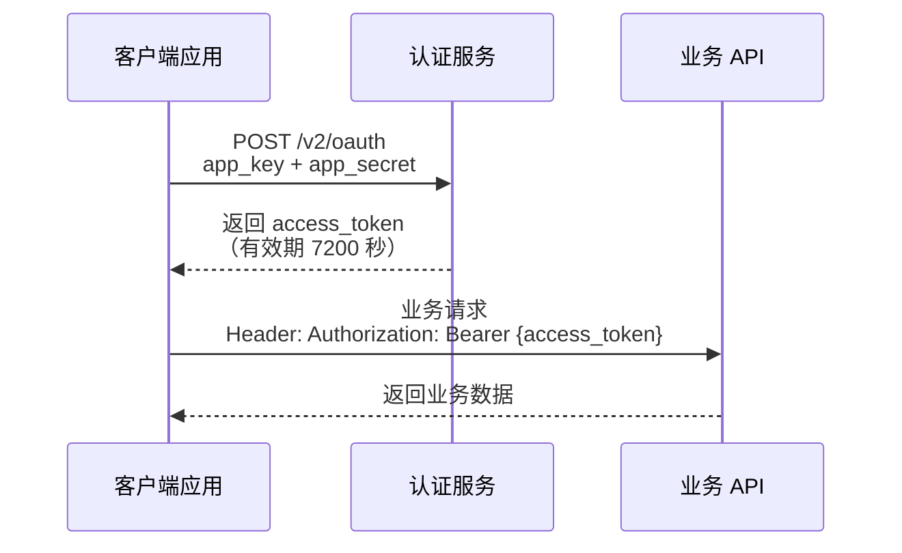

# API 参考

本文档面向外部开发者，提供轻易云 iPaaS 开放 API 的完整参考指南。通过本章节，您可以了解如何调用平台接口实现数据写入、查询、调度触发等功能，以及与轻易云 iPaaS 进行深度集成所需的全部技术信息。

## 概述

轻易云 iPaaS 提供 RESTful 风格的开放 API，采用 HTTPS 协议通信，支持外部系统与集成平台进行双向数据交换。开发者可以通过 API 实现以下核心能力：

- **数据写入**：向指定集成方案推送数据
- **数据查询**：从集成方案中检索数据列表或详情
- **调度触发**：激活源平台或目标平台的调度者执行任务
- **链路追踪**：查询数据在源平台和目标平台的完整处理链路

> [!NOTE]
> 本章节文档适用于具备 HTTP/HTTPS 协议基础和 RESTful API 调用经验的开发者。如需了解平台的基本使用方法，请先阅读[快速开始](../quick-start/introduction)章节。

## 接口规范

### 通信协议

| 项目 | 规范 |
|------|------|
| 协议 | HTTPS |
| 编码 | UTF-8 |
| 请求方式 | POST、GET |
| 请求头 | `Content-Type: application/json` |
| 字符支持 | 半角、中文、英文、数字、基本标点符号 |

### 访问限制

- **频率限制**：每分钟 60 次请求
- **超限处理**：请求过于频繁时，需等待 5 分钟后重新调用
- **超时设置**：建议设置请求超时时间为 30 秒

## 认证方式

轻易云 iPaaS API 采用 **Access Token** 认证机制，所有业务接口调用前需先获取有效的访问令牌。

### 认证流程



### 获取 Access Token

| 项目 | 说明 |
|------|------|
| 请求地址 | `https://{host}/v2/oauth` |
| 请求方式 | POST |
| 认证要求 | 无需 Token |

**请求参数：**

| 参数 | 类型 | 必填 | 说明 |
|------|------|------|------|
| `app_key` | string | ✅ | 应用授权的 12 位字符串 |
| `app_secret` | string | ✅ | 应用授权密钥的 20 位字符串 |

**请求示例：**

```bash
curl -X POST "https://api.qeasy.cloud/v2/oauth" \
  -H "Content-Type: application/json" \
  -d '{
    "app_key": "012345678911",
    "app_secret": "11111111115555555555"
  }'
```

**响应示例：**

```json
{
  "success": true,
  "code": 0,
  "message": "success",
  "content": {
    "access_token": "PSJthMmsVmc62d4c8528567be9b92435f0266cde05",
    "expires_in": 7200
  }
}
```

> [!IMPORTANT]
> Access Token 有效期为 7200 秒（2 小时），过期后需重新获取。建议客户端实现 Token 缓存机制，在 Token 即将过期前刷新。

### 应用授权管理

在调用 API 之前，您需要在轻易云 iPaaS 控制台中创建应用授权：

1. 登录轻易云 iPaaS 控制台
2. 进入**API 网关** → **应用授权**页面
3. 点击**新增应用授权**
4. 填写应用名称、选择授权范围、设置 IP 白名单（可选）
5. 保存后获取 `app_key` 和 `app_secret`

> [!WARNING]
> `app_secret` 仅在创建时显示一次，请妥善保管。如遗失，需重新生成密钥对。

## 核心接口列表

### 数据写入类

| 接口 | 方法 | 路径 | 说明 |
|------|------|------|------|
| 写入数据 | POST | `/v2/open-api/business/{scheme_id}/store` | 向集成方案写入数据 |
| 写入并调度 | POST | `/v2/open-api/business/{scheme_id}/store-dispatch` | 写入数据并立即触发目标调度 |

### 数据查询类

| 接口 | 方法 | 路径 | 说明 |
|------|------|------|------|
| 查询列表 | POST | `/v2/open-api/business/{scheme_id}/query` | 分页查询集成方案数据 |
| 查询链路 | POST | `/v2/open-api/business/{scheme_id}/data-link` | 查询数据完整处理链路 |
| 查询单条 | GET | `/v2/open-api/business/{scheme_id}/find-one/{id}` | 根据主键查询单条数据 |

### 调度触发类

| 接口 | 方法 | 路径 | 说明 |
|------|------|------|------|
| 触发源调度 | GET | `/v2/open-api/business/{scheme_id}/dispatch-source` | 激活源平台调度者 |
| 触发目标调度 | GET | `/v2/open-api/business/{scheme_id}/dispatch-target` | 激活目标平台调度者 |

> [!TIP]
> 完整接口文档请参考 [接口列表](./endpoints) 章节，包含详细的请求参数、响应格式和错误码说明。

## OpenAPI 规范

轻易云 iPaaS API 遵循 OpenAPI 3.0 规范，您可以通过以下方式获取 OpenAPI 文档：

- **在线文档**：访问 [https://api.qeasy.cloud/openapi.json](https://api.qeasy.cloud/openapi.json) 获取完整 OpenAPI 定义
- **Swagger UI**：使用 [Swagger UI](https://api.qeasy.cloud/swagger-ui.html) 进行在线接口调试
- **Postman 集合**：导入 OpenAPI 定义生成 Postman 测试集合

### 代码生成

基于 OpenAPI 规范，您可以使用以下工具生成客户端 SDK：

| 语言 | 工具 | 命令示例 |
|------|------|----------|
| Java | OpenAPI Generator | `openapi-generator-cli generate -i openapi.json -g java` |
| Python | OpenAPI Generator | `openapi-generator-cli generate -i openapi.json -g python` |
| TypeScript | OpenAPI Generator | `openapi-generator-cli generate -i openapi.json -g typescript-axios` |
| Go | OpenAPI Generator | `openapi-generator-cli generate -i openapi.json -g go` |

## SDK 列表

为方便开发者快速接入，轻易云 iPaaS 提供以下官方 SDK：

### 官方 SDK

| 语言 | 包名 | 安装命令 | 源码仓库 |
|------|------|----------|----------|
| Java | `qeasy-ipaas-sdk` | Maven: `com.qeasy:qeasy-ipaas-sdk:1.0.0` | [GitHub](https://github.com/qeasy/qeasy-ipaas-java-sdk) |
| Python | `qeasy-ipaas` | `pip install qeasy-ipaas` | [GitHub](https://github.com/qeasy/qeasy-ipaas-python-sdk) |
| PHP | `qeasy/ipaas-sdk` | `composer require qeasy/ipaas-sdk` | [GitHub](https://github.com/qeasy/qeasy-ipaas-php-sdk) |
| Node.js | `@qeasy/ipaas-sdk` | `npm install @qeasy/ipaas-sdk` | [GitHub](https://github.com/qeasy/qeasy-ipaas-node-sdk) |
| Go | `github.com/qeasy/ipaas-sdk-go` | `go get github.com/qeasy/ipaas-sdk-go` | [GitHub](https://github.com/qeasy/qeasy-ipaas-go-sdk) |

### SDK 使用示例（Java）

```java
import com.qeasy.ipaas.QeasyClient;
import com.qeasy.ipaas.auth.Credentials;
import com.qeasy.ipaas.model.DataRequest;

public class Example {
    public static void main(String[] args) {
        // 初始化客户端
        Credentials credentials = new Credentials("your-app-key", "your-app-secret");
        QeasyClient client = new QeasyClient(credentials);

        // 写入数据
        DataRequest request = DataRequest.builder()
            .schemeId("your-scheme-id")
            .content(dataList)
            .build();
        
        ApiResponse response = client.data().store(request);
        System.out.println(response.getCode());
    }
}
```

### SDK 使用示例（Python）

```python
from qeasy_ipaas import QeasyClient

# 初始化客户端
client = QeasyClient(app_key="your-app-key", app_secret="your-app-secret")

# 查询数据
result = client.data.query(
    scheme_id="your-scheme-id",
    page=1,
    page_size=10,
    begin_at=1613995390,
    end_at=1616414590
)

print(result.content)
```

> [!NOTE]
> 社区贡献的非官方 SDK 可在 [GitHub 组织页面](https://github.com/qeasy) 找到。使用第三方 SDK 时请注意安全审查。

## 安全最佳实践

### 密钥管理

- **禁止硬编码**：不要将 `app_key` 和 `app_secret` 直接写在代码中
- **环境变量**：使用环境变量或配置中心存储敏感信息
- **密钥轮换**：定期更换应用密钥，降低泄露风险
- **最小权限**：为应用授权设置最小必要的权限范围

### 传输安全

- **强制 HTTPS**：所有 API 调用必须使用 HTTPS 协议
- **证书校验**：客户端应校验服务器 SSL 证书
- **敏感信息**：避免在 URL 参数中传递敏感数据

### 访问控制

- **IP 白名单**：在应用授权中配置允许的 IP 地址范围
- **限流监控**：关注接口调用频率，避免触发限流
- **日志审计**：记录 API 调用日志，便于安全审计

## 常见问题

### Q: Access Token 过期如何处理？

当接口返回 `401 Unauthorized` 或错误码 `10001` 时，表示 Access Token 已过期，需要重新调用 `/v2/oauth` 接口获取新的 Token。

### Q: 如何获取方案 ID（scheme_id）？

方案 ID 可在轻易云 iPaaS 控制台的集成方案详情页查看，格式为 UUID（如 `0166a725-2b9a-30e4-91c5-3529176302c4`）。

### Q: 数据主键如何配置？

在集成方案的源平台配置中，需要指定数据主键字段。未配置主键将导致数据写入失败或重复写入。

### Q: 接口返回 429 Too Many Requests？

表示触发限流规则，请降低请求频率（每分钟不超过 60 次），或等待 5 分钟后重试。建议使用指数退避策略进行重试。

## 相关资源

- [认证指南](./authentication) — 详细认证流程与示例
- [接口列表](./endpoints) — 完整 API 端点文档
- [错误码参考](./error-codes) — 错误码与排查指南
- [限流说明](./rate-limiting) — 频率限制与优化建议
- [OpenAPI 文档](./openapi) — OpenAPI 3.0 规范文档

## 获取支持

如在使用 API 过程中遇到问题，可通过以下渠道获取帮助：

- **技术社区**：[https://bbs.qeasy.cloud](https://bbs.qeasy.cloud)
- **工单支持**：登录控制台提交技术支持工单
- **邮件联系**：[support@qeasy.cloud](mailto:support@qeasy.cloud)
