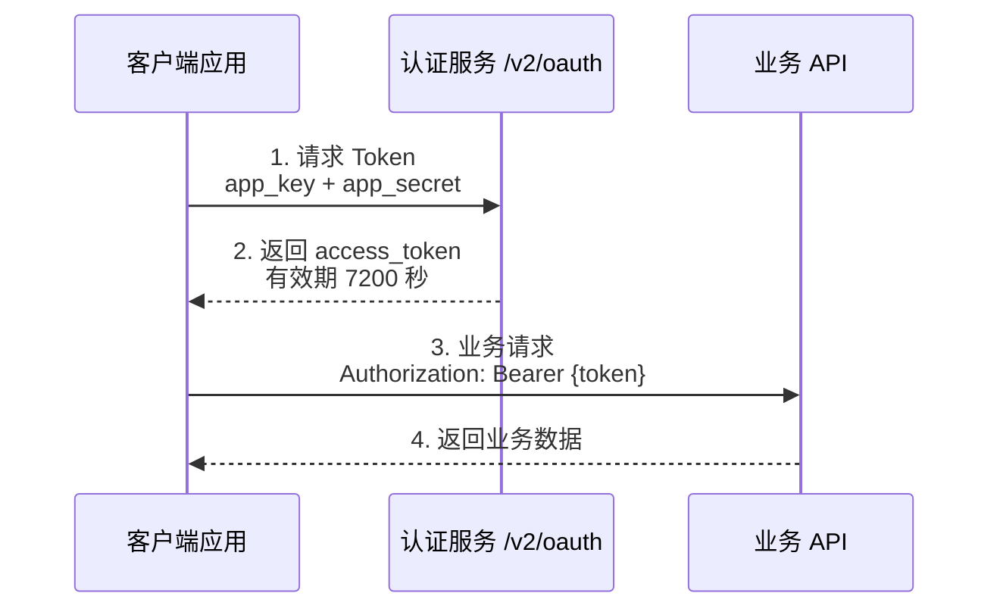
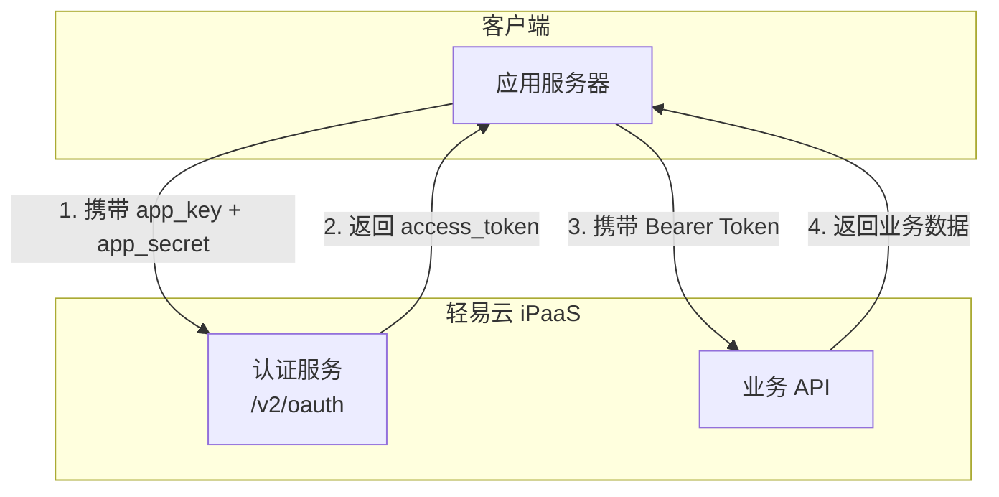

# 认证指南

本文档详细介绍轻易云 iPaaS 开放 API 的认证机制，包括应用授权的创建、API Key 获取、Access Token 申请流程以及 Bearer Token 认证方式。通过本文档，您将了解如何安全地调用轻易云 iPaaS 的开放接口。

## 认证方式概览

轻易云 iPaaS 采用基于 OAuth 2.0 的认证机制，通过 **Access Token（访问令牌）** 进行 API 调用身份验证。



### 认证流程说明

| 步骤 | 操作 | 说明 |
|------|------|------|
| 1 | 创建应用授权 | 在控制台生成 `app_key` 和 `app_secret` |
| 2 | 获取 Access Token | 调用 `/v2/oauth` 接口换取访问令牌 |
| 3 | 调用业务接口 | 在请求头中携带 `Authorization: Bearer {token}` |
| 4 | Token 刷新 | Token 过期前重新获取，确保服务连续性 |

## 创建应用授权

在调用 API 之前，你需要先在轻易云 iPaaS 控制台创建应用授权，获取 `app_key` 和 `app_secret`。

### 操作步骤

1. 登录 [轻易云 iPaaS 控制台](https://console.qeasy.cloud)
2. 进入 **API 网关** → **应用授权** 页面
3. 点击右上角 **新增应用授权**
4. 填写应用授权信息：
   - **应用名称**：自定义，便于识别（如"ERP 同步服务"）
   - **授权范围**：选择该应用可访问的集成方案
   - **IP 白名单**（可选）：限制允许调用的 IP 地址
5. 点击 **保存**，系统将生成 `app_key` 和 `app_secret`

> [!IMPORTANT]
> `app_secret` 仅在创建时显示一次，请立即复制并妥善保管。如遗失，需重新生成密钥对。

### 应用授权信息

创建成功后，你将获得以下信息：

| 字段 | 类型 | 长度 | 说明 |
|------|------|------|------|
| `app_key` | string | 12 位 | 应用标识，用于请求 Token |
| `app_secret` | string | 20 位 | 应用密钥，用于请求 Token |

## 获取 Access Token

获取应用授权后，使用 `app_key` 和 `app_secret` 调用认证接口换取 Access Token。

### 请求信息

| 项目 | 说明 |
|------|------|
| 请求地址 | `https://{host}/v2/oauth` |
| 请求方式 | POST |
| Content-Type | `application/json` |
| 需要认证 | 否 |

### 请求参数

| 参数 | 类型 | 必填 | 说明 |
|------|------|------|------|
| `app_key` | string | ✅ | 应用授权的 12 位标识 |
| `app_secret` | string | ✅ | 应用授权的 20 位密钥 |

### 请求示例

#### cURL

```bash
curl -X POST "https://api.qeasy.cloud/v2/oauth" \
  -H "Content-Type: application/json" \
  -d '{
    "app_key": "012345678911",
    "app_secret": "11111111115555555555"
  }'
```

#### Python

```python
import requests

def get_access_token(app_key, app_secret, host="https://api.qeasy.cloud"):
    """
    获取轻易云 iPaaS Access Token
    
    Args:
        app_key: 应用授权标识
        app_secret: 应用授权密钥
        host: API 域名
    
    Returns:
        dict: 包含 access_token 和 expires_in 的字典
    """
    url = f"{host}/v2/oauth"
    payload = {
        "app_key": app_key,
        "app_secret": app_secret
    }
    headers = {
        "Content-Type": "application/json"
    }
    
    response = requests.post(url, json=payload, headers=headers)
    response.raise_for_status()
    
    result = response.json()
    if result.get("success"):
        return result["content"]
    else:
        raise Exception(f"获取 Token 失败: {result.get('message')}")

# 使用示例
try:
    token_info = get_access_token(
        app_key="012345678911",
        app_secret="11111111115555555555"
    )
    print(f"Access Token: {token_info['access_token']}")
    print(f"过期时间: {token_info['expires_in']} 秒")
except Exception as e:
    print(f"错误: {e}")
```

#### JavaScript

```javascript
async function getAccessToken(appKey, appSecret, host = 'https://api.qeasy.cloud') {
  const url = `${host}/v2/oauth`;
  
  const response = await fetch(url, {
    method: 'POST',
    headers: {
      'Content-Type': 'application/json'
    },
    body: JSON.stringify({
      app_key: appKey,
      app_secret: appSecret
    })
  });
  
  if (!response.ok) {
    throw new Error(`HTTP 错误: ${response.status}`);
  }
  
  const result = await response.json();
  
  if (result.success) {
    return result.content;
  } else {
    throw new Error(`获取 Token 失败: ${result.message}`);
  }
}

// 使用示例
(async () => {
  try {
    const tokenInfo = await getAccessToken(
      '012345678911',
      '11111111115555555555'
    );
    console.log('Access Token:', tokenInfo.access_token);
    console.log('过期时间:', tokenInfo.expires_in, '秒');
  } catch (error) {
    console.error('错误:', error.message);
  }
})();
```

#### Java (OkHttp)

```java
import okhttp3.*;
import com.google.gson.Gson;
import com.google.gson.JsonObject;

public class AuthExample {
    private static final OkHttpClient client = new OkHttpClient();
    private static final Gson gson = new Gson();
    
    public static String getAccessToken(String appKey, String appSecret) throws Exception {
        String url = "https://api.qeasy.cloud/v2/oauth";
        
        // 构建请求体
        JsonObject jsonBody = new JsonObject();
        jsonBody.addProperty("app_key", appKey);
        jsonBody.addProperty("app_secret", appSecret);
        
        RequestBody body = RequestBody.create(
            MediaType.parse("application/json"),
            jsonBody.toString()
        );
        
        Request request = new Request.Builder()
            .url(url)
            .post(body)
            .addHeader("Content-Type", "application/json")
            .build();
        
        try (Response response = client.newCall(request).execute()) {
            if (!response.isSuccessful()) {
                throw new Exception("请求失败: " + response.code());
            }
            
            JsonObject result = gson.fromJson(response.body().string(), JsonObject.class);
            
            if (result.get("success").getAsBoolean()) {
                return result.getAsJsonObject("content")
                    .get("access_token")
                    .getAsString();
            } else {
                throw new Exception("获取 Token 失败: " + result.get("message").getAsString());
            }
        }
    }
    
    public static void main(String[] args) {
        try {
            String token = getAccessToken(
                "012345678911",
                "11111111115555555555"
            );
            System.out.println("Access Token: " + token);
        } catch (Exception e) {
            System.err.println("错误: " + e.getMessage());
        }
    }
}
```

### 响应结果

**成功响应：**

```json
{
  "success": true,
  "code": 0,
  "message": "success",
  "content": {
    "access_token": "PSJthMmsVmc62d4c8528567be9b92435f0266cde05",
    "expires_in": 7200
  }
}
```

**失败响应：**

```json
{
  "success": false,
  "code": 10001,
  "message": "app_key 或 app_secret 错误",
  "content": null
}
```

### 响应字段说明

| 字段 | 类型 | 说明 |
|------|------|------|
| `success` | boolean | 请求是否成功 |
| `code` | integer | 业务状态码，`0` 表示成功 |
| `message` | string | 结果描述信息 |
| `content.access_token` | string | 访问令牌，用于后续 API 调用 |
| `content.expires_in` | integer | Token 有效期，单位为秒（默认 7200 秒，即 2 小时） |

## Bearer Token 认证

获取 Access Token 后，在调用业务接口时，需要在 HTTP 请求头中添加 `Authorization` 字段，格式为 `Bearer {access_token}`。

### 认证格式

```text
Authorization: Bearer {your_access_token}
```

### 完整调用示例

#### cURL

```bash
# 1. 获取 Access Token
TOKEN=$(curl -s -X POST "https://api.qeasy.cloud/v2/oauth" \
  -H "Content-Type: application/json" \
  -d '{
    "app_key": "012345678911",
    "app_secret": "11111111115555555555"
  }' | jq -r '.content.access_token')

# 2. 使用 Token 调用业务接口
curl -X POST "https://api.qeasy.cloud/v2/open-api/business/{scheme_id}/store" \
  -H "Content-Type: application/json" \
  -H "Authorization: Bearer ${TOKEN}" \
  -d '{
    "content": [
      {
        "id": "12345",
        "name": "测试数据",
        "amount": 100.00
      }
    ]
  }'
```

#### Python

```python
import requests
import time

class QeasyClient:
    """轻易云 iPaaS API 客户端"""
    
    def __init__(self, app_key, app_secret, host="https://api.qeasy.cloud"):
        self.app_key = app_key
        self.app_secret = app_secret
        self.host = host
        self.access_token = None
        self.token_expires_at = 0
    
    def _ensure_token(self):
        """确保 Token 有效，过期则自动刷新"""
        if not self.access_token or time.time() >= self.token_expires_at - 60:
            self._refresh_token()
    
    def _refresh_token(self):
        """刷新 Access Token"""
        url = f"{self.host}/v2/oauth"
        response = requests.post(url, json={
            "app_key": self.app_key,
            "app_secret": self.app_secret
        }, headers={"Content-Type": "application/json"})
        
        result = response.json()
        if result.get("success"):
            content = result["content"]
            self.access_token = content["access_token"]
            # 提前 60 秒过期，避免边界问题
            self.token_expires_at = time.time() + content["expires_in"] - 60
        else:
            raise Exception(f"刷新 Token 失败: {result.get('message')}")
    
    def request(self, method, path, **kwargs):
        """发送带认证的 HTTP 请求"""
        self._ensure_token()
        
        url = f"{self.host}{path}"
        headers = kwargs.pop("headers", {})
        headers["Authorization"] = f"Bearer {self.access_token}"
        headers["Content-Type"] = "application/json"
        
        response = requests.request(method, url, headers=headers, **kwargs)
        
        # 处理 Token 过期
        if response.status_code == 401:
            self._refresh_token()
            headers["Authorization"] = f"Bearer {self.access_token}"
            response = requests.request(method, url, headers=headers, **kwargs)
        
        return response
    
    def store_data(self, scheme_id, data):
        """向集成方案写入数据"""
        path = f"/v2/open-api/business/{scheme_id}/store"
        response = self.request("POST", path, json={"content": data})
        return response.json()

# 使用示例
client = QeasyClient(
    app_key="012345678911",
    app_secret="11111111115555555555"
)

# 写入数据
result = client.store_data(
    scheme_id="0166a725-2b9a-30e4-91c5-3529176302c4",
    data=[{
        "id": "12345",
        "name": "测试数据",
        "amount": 100.00
    }]
)
print(result)
```

#### JavaScript

```javascript
class QeasyClient {
  constructor(appKey, appSecret, host = 'https://api.qeasy.cloud') {
    this.appKey = appKey;
    this.appSecret = appSecret;
    this.host = host;
    this.accessToken = null;
    this.tokenExpiresAt = 0;
  }

  async ensureToken() {
    // 提前 60 秒刷新，避免边界问题
    if (!this.accessToken || Date.now() >= this.tokenExpiresAt - 60000) {
      await this.refreshToken();
    }
  }

  async refreshToken() {
    const response = await fetch(`${this.host}/v2/oauth`, {
      method: 'POST',
      headers: { 'Content-Type': 'application/json' },
      body: JSON.stringify({
        app_key: this.appKey,
        app_secret: this.appSecret
      })
    });

    const result = await response.json();
    
    if (result.success) {
      this.accessToken = result.content.access_token;
      // 提前 60 秒过期
      this.tokenExpiresAt = Date.now() + (result.content.expires_in - 60) * 1000;
    } else {
      throw new Error(`刷新 Token 失败: ${result.message}`);
    }
  }

  async request(path, options = {}) {
    await this.ensureToken();

    const url = `${this.host}${path}`;
    const headers = {
      'Content-Type': 'application/json',
      'Authorization': `Bearer ${this.accessToken}`,
      ...options.headers
    };

    let response = await fetch(url, { ...options, headers });

    // 处理 Token 过期
    if (response.status === 401) {
      await this.refreshToken();
      headers.Authorization = `Bearer ${this.accessToken}`;
      response = await fetch(url, { ...options, headers });
    }

    return response;
  }

  async storeData(schemeId, data) {
    const response = await this.request(
      `/v2/open-api/business/${schemeId}/store`,
      {
        method: 'POST',
        body: JSON.stringify({ content: data })
      }
    );
    return response.json();
  }
}

// 使用示例
(async () => {
  const client = new QeasyClient(
    '012345678911',
    '11111111115555555555'
  );

  try {
    const result = await client.storeData(
      '0166a725-2b9a-30e4-91c5-3529176302c4',
      [{
        id: '12345',
        name: '测试数据',
        amount: 100.00
      }]
    );
    console.log('写入结果:', result);
  } catch (error) {
    console.error('错误:', error.message);
  }
})();
```

## OAuth 2.0 接入

轻易云 iPaaS 认证机制基于 OAuth 2.0 的 **Client Credentials** 模式，适用于服务器到服务器的安全通信场景。

### OAuth 2.0 流程



### 标准 OAuth 2.0 参数映射

| OAuth 2.0 标准参数 | 轻易云 iPaaS 参数 | 说明 |
|-------------------|------------------|------|
| `client_id` | `app_key` | 应用标识 |
| `client_secret` | `app_secret` | 应用密钥 |
| `access_token` | `access_token` | 访问令牌 |
| `expires_in` | `expires_in` | 有效期（秒） |
| `token_type` | `Bearer` | 令牌类型 |

### 与标准 OAuth 2.0 的区别

轻易云 iPaaS 的认证实现与传统 OAuth 2.0 有以下区别：

| 特性 | 标准 OAuth 2.0 | 轻易云 iPaaS |
|------|---------------|-------------|
| Token 端点 | 支持多种 grant_type | 仅支持 Client Credentials |
| 请求格式 | `application/x-www-form-urlencoded` | `application/json` |
| 响应格式 | 标准 JSON | 统一包装响应格式 |
| Token 有效期 | 通常 3600 秒 | 7200 秒 |

## Token 管理最佳实践

### 1. 缓存机制

Access Token 有效期为 7200 秒，建议实现客户端缓存，避免频繁请求 Token 接口：

```python
import time
from functools import lru_cache

class TokenManager:
    def __init__(self, app_key, app_secret):
        self.app_key = app_key
        self.app_secret = app_secret
        self._token = None
        self._expires_at = 0
    
    def get_token(self):
        # 提前 5 分钟刷新
        if not self._token or time.time() >= self._expires_at - 300:
            self._refresh()
        return self._token
    
    def _refresh(self):
        # 调用 /v2/oauth 获取新 Token
        token_info = fetch_token(self.app_key, self.app_secret)
        self._token = token_info['access_token']
        self._expires_at = time.time() + token_info['expires_in']
```

### 2. 并发安全

在多线程或分布式环境中，确保只有一个线程执行 Token 刷新：

```python
import threading

class ThreadSafeTokenManager(TokenManager):
    def __init__(self, app_key, app_secret):
        super().__init__(app_key, app_secret)
        self._lock = threading.Lock()
    
    def get_token(self):
        # 双重检查锁定
        if not self._token or time.time() >= self._expires_at - 300:
            with self._lock:
                if not self._token or time.time() >= self._expires_at - 300:
                    self._refresh()
        return self._token
```

### 3. 错误处理

Token 获取失败时的重试策略：

```python
import random
import time

def fetch_token_with_retry(app_key, app_secret, max_retries=3):
    """带重试机制的 Token 获取"""
    for attempt in range(max_retries):
        try:
            return fetch_token(app_key, app_secret)
        except Exception as e:
            if attempt == max_retries - 1:
                raise
            # 指数退避
            wait_time = (2 ** attempt) + random.uniform(0, 1)
            time.sleep(wait_time)
```

## 安全建议

### 密钥管理

- **禁止硬编码**：不要将 `app_key` 和 `app_secret` 直接写在代码中
- **环境变量**：使用环境变量或配置中心存储敏感信息
- **密钥轮换**：定期更换应用密钥，降低泄露风险
- **最小权限**：为应用授权设置最小必要的权限范围

```bash
# 环境变量示例
export QEASY_APP_KEY="012345678911"
export QEASY_APP_SECRET="11111111115555555555"
```

```python
import os

app_key = os.environ.get('QEASY_APP_KEY')
app_secret = os.environ.get('QEASY_APP_SECRET')
```

### 传输安全

- **强制 HTTPS**：所有 API 调用必须使用 HTTPS 协议
- **证书校验**：客户端应校验服务器 SSL 证书，防止中间人攻击
- **敏感信息**：避免在 URL 参数中传递敏感数据

### 访问控制

- **IP 白名单**：在应用授权中配置允许的 IP 地址范围
- **限流监控**：关注接口调用频率，每分钟不超过 60 次
- **日志审计**：记录 API 调用日志，便于安全审计

## 常见问题

### Q: Access Token 过期如何处理？

当接口返回 `401 Unauthorized` 或错误码 `10001` 时，表示 Access Token 已过期，需要重新调用 `/v2/oauth` 接口获取新的 Token。建议实现自动刷新机制，在收到 401 响应时自动重新获取 Token 并重试原请求。

### Q: 可以同时使用多个 Token 吗？

可以。每次调用 `/v2/oauth` 都会生成一个新的有效 Token，旧的 Token 在有效期内仍然可用。但建议每个应用实例只维护一个 Token，避免浪费资源。

### Q: Token 被盗怎么办？

立即在控制台删除对应的应用授权，重新创建新的授权密钥对，并更新所有使用该授权的应用配置。

### Q: 如何获取 `scheme_id`？

方案 ID（scheme_id）可在轻易云 iPaaS 控制台的集成方案详情页查看，格式为 UUID（如 `0166a725-2b9a-30e4-91c5-3529176302c4`）。

### Q: 接口返回 403 Forbidden？

表示 Token 有效但无权访问该资源，可能原因：
- 应用授权的权限范围不包含该集成方案
- IP 白名单限制
- 方案被禁用或删除

### Q: 能否延长 Token 有效期？

暂时不支持自定义 Token 有效期。建议通过定时任务或按需刷新机制管理 Token。

## 相关资源

- [API 概览](./README) — API 使用入门与概述
- [接口列表](./endpoints) — 完整 API 端点文档
- [错误码参考](./error-codes) — 错误码与排查指南
- [限流说明](./rate-limiting) — 频率限制与优化建议
