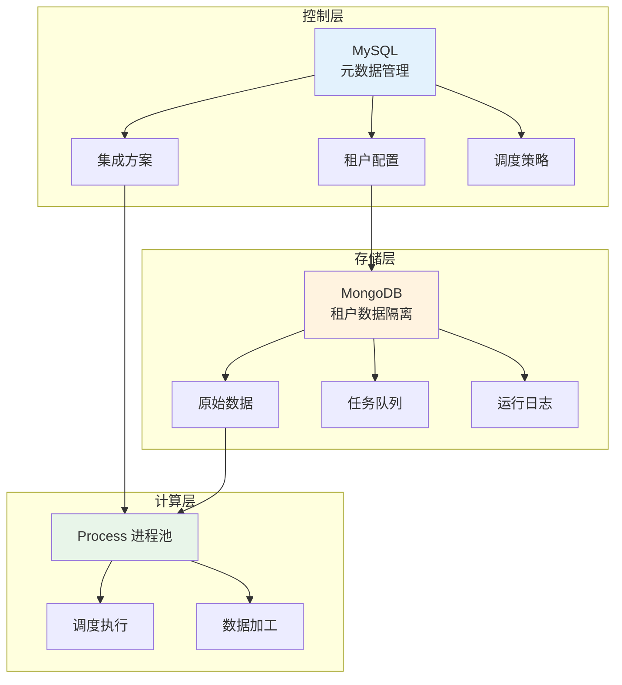

# 平台运维指南（多租户）

本文档面向平台运维管理员，详细介绍轻易云 iPaaS 多租户架构下的运维管理操作，包括存储资源管理、进程资源调度、告警配置、日志导出以及索引优化等内容。通过本指南，您可以有效地管理和维护轻易云集成平台的稳定运行。

> [!IMPORTANT]
> 本指南适用于私有化部署或专属云部署场景。运维管理中心涉及系统核心配置，不推荐直接开放到公网访问。

## 部署架构概览

轻易云 iPaaS 采用多租户分布式架构，核心组件包括控制层（MySQL）、存储层（MongoDB）和计算层（Process 进程资源）。



### 核心组件说明

| 组件 | 技术栈 | 主要职责 |
|------|--------|----------|
| **控制层** | MySQL | 存储租户信息、集成方案配置、连接器配置等元数据 |
| **存储层** | MongoDB | 存储原始数据、请求/写入队列、运行日志等租户业务数据 |
| **计算层** | Docker + PHP | 执行数据调度、加工、转换等计算任务 |

## MongoDB 存储资源管理

存储资源服务器支持横向动态扩容部署，需要一个标准的 MongoDB 数据库服务器作为资源。

### 数据库命名规范

每个租户拥有独立的数据库，命名规则如下：

```text
LESSEE_{{lessee_id}}
```

其中 `lessee_id` 为租户的唯一标识符。

### Collection 命名规则

每个集成方案对应多个 Collection，命名规则如下：

| Collection 名称 | 说明 | 运维建议 |
|-----------------|------|----------|
| `{{strategy_id}}_ADATA` | 集成方案原始数据 | 核心业务数据，长期保留 |
| `{{strategy_id}}_LOG` | 集成方案运行时日志 | 可定期清理 |
| `{{strategy_id}}_SJOB` | 源平台请求队列 | 可定期清理 |
| `{{strategy_id}}_TJOB` | 目标平台写入队列 | 可定期清理 |

> [!NOTE]
> `strategy_id` 为集成方案的唯一标识符（UUID 格式）。

### ADATA Collection 结构

```json
{
    "_id": "62bd042ab575df713f558fc6",
    "id": 29,
    "number": "RK2206290003",
    "content": {...},
    "status": 5,
    "relation_id": null,
    "response": null,
    "response_at": 1656554572.835315,
    "created_at": 1656554538.382423,
    "source_job_id": "62bd042873f92a518b5bc33a",
    "target_job_id": "62bd044c3af350046a4c4fce",
    "callback_id_1": null,
    "callback_id_2": null,
    "result": []
}
```

**字段说明：**

| 字段 | 类型 | 说明 |
|------|------|------|
| `_id` | ObjectId | MongoDB 唯一索引 |
| `id` | integer | 业务主键，唯一索引 |
| `number` | string | 业务编码，用于检索数据 |
| `content` | object | 原始数据 JSON |
| `status` | integer | 数据状态，详见下方枚举 |
| `response` | object | 写入响应数据 |
| `response_at` | float | 写入响应时间戳（含小数位毫秒） |
| `created_at` | float | 创建时间戳（含小数位毫秒） |
| `source_job_id` | string | 来源队列 MongoDB ID |
| `target_job_id` | string | 写入队列 MongoDB ID |

### 数据状态枚举

| 状态值 | 常量 | 说明 |
|--------|------|------|
| `0` | `AWAIT` | 等待中 |
| `1` | `REPEAT` | 重复的 |
| `2` | `FINISHED` | 已完成 |
| `3` | `ERROR` | 错误的 |
| `4` | `FKC` | 未审核 |
| `5` | `QUEUE` | 队列中 |

### SJOB/TJOB Collection 结构

```json
{
    "_id": "62bd04261556053a8b6cf2ba",
    "status": 2,
    "api": "wdt.stockin.order.query",
    "params": {...},
    "ids": [],
    "data_range": null,
    "response": {...},
    "history": [...],
    "created_at": 1656554534.180346,
    "handle_at": 1656554536.602433,
    "retries": 0,
    "active_begin": 1656554536.422649,
    "active_end": 1656554536.59932,
    "active_time": 0.17667102813720703,
    "result": [],
    "dispatch_begin": 1656554534.102552,
    "dispatch_end": 1656554534.180346,
    "dispatch_time": 0.07779407501220703,
    "count": 3
}
```

**字段说明：**

| 字段 | 类型 | 说明 |
|------|------|------|
| `status` | integer | 队列状态枚举 |
| `api` | string | 队列任务 API 名称 |
| `params` | object | 队列任务请求参数 |
| `ids` | array | 关联原始数据 ID 列表 |
| `data_range` | object | 关联原始数据范围（大数据量时使用） |
| `response` | object | 最新的响应数据 |
| `history` | array | 历史执行记录 |
| `created_at` | float | 创建时间戳 |
| `handle_at` | float | 处理时间戳 |
| `retries` | integer | 重试次数 |
| `active_begin` | float | 任务开始激活时间 |
| `active_end` | float | 任务结束激活时间 |
| `active_time` | float | 任务耗时（秒） |
| `dispatch_begin` | float | 调度开始时间 |
| `dispatch_end` | float | 调度结束时间 |
| `dispatch_time` | float | 调度耗时（秒） |
| `count` | integer | 查询到的数据量 |

### 管理存储资源

#### 注册存储资源

1. 登录运维管理中心
2. 进入 **资源管理** → **存储资源管理**
3. 点击 **新增存储资源**
4. 填写 MongoDB 连接信息：
   - **主机地址**：MongoDB 服务器 IP 或域名
   - **端口**：默认 27017
   - **管理员账号**：具有创建数据库权限的账号
   - **管理员密码**：对应密码
5. 点击 **测试连接**，验证通过后保存

#### 资源状态管理

| 状态 | 说明 | 影响 |
|------|------|------|
| **启用** | 正常运行 | 新租户可分配到该资源 |
| **暂停** | 维护状态 | 已有租户不受影响，新租户不再分配 |
| **停用** | 故障或下线 | 该资源上的租户需迁移 |

> [!TIP]
> 当服务器资源即将超负荷时，可将资源状态设为「暂停」，新租户将自动分配到其他可用资源。

#### 租户数据迁移

如需调整租户的存储资源分配：

1. 进入 **租户管理** 页面
2. 搜索目标租户
3. 点击 **编辑**，修改 **存储资源** 选项
4. 保存后系统将自动执行数据迁移

> [!WARNING]
> 存储资源迁移期间，该租户的集成方案将暂停服务，建议在业务低峰期操作。

## Process 进程资源管理

进程资源负责执行数据调度、加工和转换任务。每个租户默认分配一个进程，可根据数据量进行扩容。

### 创建进程资源服务器

通过 Docker 镜像快速创建进程资源服务：

```bash
# 创建 Docker 进程资源实例
docker run -itd --name dh-app-01 \
  -p 9003:8888 \
  -p 9004:80 \
  -p 9005:8000 \
  -v /docker/datahub:/www/wwwroot \
  swr.cn-south-1.myhuaweicloud.com/qeasy-cloud/dh-app:v2

# 启动容器内的对应服务
docker exec {{dockerId}} /www/wwwroot/deploy/service-restart.sh

# 如果该容器同时承担其他角色（如 MySQL、MongoDB、Nginx、Redis）
docker exec {{dockerId}} /www/wwwroot/deploy/service-restart.sh mysqld mongodb nginx redis
```

> [!NOTE]
> - 8888、80 端口非必需开放，但为便于运维，建议开放
> - 8000 端口为进程资源服务主端口，必须开放
> - 将本地的 `/docker/datahub` 映射进去，便于统一更新代码

### 注册进程资源

1. 登录运维管理中心
2. 进入 **资源管理** → **进程资源管理**
3. 点击 **新增进程资源**
4. 填写以下信息：
   - **资源名称**：便于识别的名称（如 `process-node-01`）
   - **服务地址**：`http://{ip}:8000`
   - **最大租户数**：该节点可承载的租户上限
5. 保存后系统自动检测服务状态

### 租户进程管理

#### 查看租户进程

1. 进入 **租户管理** 页面
2. 搜索目标租户
3. 点击 **进程管理** 标签
4. 查看该租户分配的所有进程

#### 创建新进程

当租户数据量庞大，单进程无法满足性能需求时：

1. 在租户进程管理页面点击 **新增进程**
2. 选择进程资源服务器
3. 设置进程模式：
   - **work 工作模式**（默认）：适用于生产环境，代码更新需重启进程生效
   - **listen 监听模式**：适用于开发环境，代码修改立即生效
4. 点击保存，系统将自动创建进程

#### 进程模式对比

| 模式 | 适用场景 | 特点 |
|------|----------|------|
| **work** | 生产环境 | 性能稳定，代码更新需重启 |
| **listen** | 开发环境 | 实时生效，便于调试 |

### 进程重启操作

当适配器代码有更新时，需要重启租户进程：

```bash
# 进入运维管理中心容器
docker exec {{dockerId}} /www/wwwroot/deploy/service-restart.sh
```

或通过运维管理中心界面：

1. 进入 **租户管理** → **进程管理**
2. 选择目标进程
3. 点击 **重启** 按钮

> [!CAUTION]
> 进程重启期间，该租户的所有集成方案将暂停调度，请谨慎操作。

## 索引创建与优化

索引是提升 MongoDB 查询性能的关键手段。通过合理创建索引，可以显著优化数据查询效率和响应速度。

> [!TIP]
> 详细索引创建方法请参考 [MongoDB 高级集成](../developer/mongodb-advanced#创建索引) 文档。

### 索引创建 API

**接口路径**：`createStrategyIndex`

**请求方式**：POST

**请求示例（单字段索引）**：

```json
{
  "strategy_id": "896c5249-35eb-3375-9c1f-78e2af086212",
  "content": {
    "key_1": {
      "key": "content.purchaseMethodName",
      "sort": "1",
      "unique": "true",
      "name": "purchaseMethodName"
    }
  }
}
```

**请求示例（联合索引）**：

```json
{
  "strategy_id": "896c5249-35eb-3375-9c1f-78e2af086212",
  "content": {
    "key1": {
      "key": "content.purchaseMethodName,content.purchaseMethodCode",
      "sort": "1,-1",
      "unique": "false",
      "name": "purchaseMethodName"
    }
  }
}
```

### 参数说明

| 参数 | 类型 | 必填 | 说明 |
|------|------|------|------|
| `strategy_id` | string | 是 | 目标方案的 UUID 标识符 |
| `content` | object | 是 | 索引核心配置对象 |
| `content.key_N` | object | 是 | 单个索引配置 |
| `content.key_N.key` | string | 是 | 索引字段路径，以 `content.` 为前缀，多字段用逗号分隔 |
| `content.key_N.sort` | string | 否 | 排序规则，`1` 升序（默认），`-1` 降序 |
| `content.key_N.unique` | string | 否 | 是否唯一索引，`true` 或省略 |
| `content.key_N.name` | string | 是 | 索引名称 |

### 索引创建注意事项

> [!WARNING]
> 1. **唯一索引约束**：配置 `unique: "true"` 后，平台会校验字段值唯一性，重复数据将被拒绝
> 2. **字段路径规范**：必须以 `content.` 开头，如 `content.FBillNo`
> 3. **排序规则**：仅支持字符串格式的 `"1"` 和 `"-1"`
> 4. **性能影响**：创建索引会消耗系统资源，建议在业务低峰期执行

### 索引优化建议

| 场景 | 建议索引类型 | 示例 |
|------|--------------|------|
| 单字段查询 | 单字段索引 | `{"key": "content.FID", "sort": "1"}` |
| 多字段组合查询 | 联合索引 | `{"key": "content.FDate,content.FBillNo", "sort": "1,-1"}` |
| 时间范围查询 | 单字段降序索引 | `{"key": "content.FCreateTime", "sort": "-1"}` |
| 状态过滤 + 时间排序 | 复合索引 | `{"key": "content.FStatus,content.FModifyTime", "sort": "1,-1"}` |

## MySQL 控制层数据

控制层使用 MySQL 存储系统元数据，以下为核心数据表：

### 核心数据表

| 表名 | 引擎 | 说明 | 运维建议 |
|------|------|------|----------|
| `db_system_setting` | InnoDB | 系统参数表，常驻缓存 | — |
| `dh_connector` | InnoDB | 租户连接器信息表 | — |
| `dh_exchange_strategy` | InnoDB | 集成方案-主表 | — |
| `dh_exchange_strategy_error_jobs` | InnoDB | 集成方案-错误任务记录 | 定期关注并清理 |
| `dh_exchange_strategy_export_jobs` | InnoDB | 集成方案-导出任务记录 | 选择性清理 |
| `dh_exchange_strategy_script` | InnoDB | 集成方案-数据加工脚本 | — |
| `dh_exchange_strategy_source` | InnoDB | 集成方案-源平台配置 | — |
| `dh_exchange_strategy_target` | InnoDB | 集成方案-目标平台配置 | — |
| `dh_exchange_strategy_throwable` | InnoDB | 集成方案-异常抛错记录 | 定期关注并清理 |
| `dh_lessee` | InnoDB | 租户信息 | — |
| `dh_lessee_binding` | InnoDB | 租户绑定微信公众号记录 | — |
| `dh_lessee_binding_wx` | InnoDB | 租户绑定微信公众号记录 | — |
| `dh_lessee_open_oauth` | InnoDB | 租户-开放网关应用授权 | — |
| `dh_lessee_open_oauth_token` | InnoDB | 租户-开放网关应用授权 token | — |
| `dh_lessee_process` | InnoDB | 租户-进程资源 | — |
| `dh_platform` | InnoDB | 已集成平台信息 | — |
| `dh_platform_api` | InnoDB | 已集成平台 API 主表 | — |
| `dh_platform_api_detail` | InnoDB | 已集成平台 API 明细表 | — |
| `dh_platform_throwable` | InnoDB | 平台抛错搜集 | 定期关注并清理 |
| `dh_process_service` | InnoDB | 进程服务器资源 | — |
| `dh_solution_package` | InnoDB | 集成解决方案包 | — |
| `dh_solution_package_detail` | InnoDB | 集成解决方案包明细 | — |
| `dh_storage_space` | InnoDB | 存储服务器资源 | — |
| `failed_jobs` | InnoDB | 失败的任务 | 定期关注并清理 |

> [!TIP]
> 建议定期检查 `dh_exchange_strategy_error_jobs`、`dh_exchange_strategy_throwable`、`dh_platform_throwable` 和 `failed_jobs` 表，清理过期记录以释放存储空间。

### 数据备份策略

| 数据类型 | 备份频率 | 保留周期 | 备份方式 |
|----------|----------|----------|----------|
| MySQL 控制层 | 每日 | 30 天 | 全量备份 + Binlog |
| MongoDB 租户数据 | 每日 | 7 天 | 快照备份 |
| 系统配置 | 实时 | — | 配置中心同步 |

## 日志导出与管理

平台提供完善的日志管理功能，支持运行日志的查询、导出和清理。

### 日志类型

| 日志类型 | 存储位置 | 保留策略 |
|----------|----------|----------|
| **调度日志** | MongoDB `{{strategy_id}}_LOG` | 建议 30 天 |
| **请求队列日志** | MongoDB `{{strategy_id}}_SJOB` | 建议 7 天 |
| **写入队列日志** | MongoDB `{{strategy_id}}_TJOB` | 建议 7 天 |
| **系统日志** | 服务器日志文件 | 建议 7 天 |
| **错误日志** | MySQL `dh_exchange_strategy_throwable` | 建议 90 天 |

### 日志导出操作

1. 登录运维管理中心
2. 进入 **日志管理** → **运行日志**
3. 选择目标租户和集成方案
4. 设置查询条件：
   - **时间范围**：开始时间和结束时间
   - **日志级别**：DEBUG、INFO、WARN、ERROR
   - **任务状态**：成功、失败、进行中
5. 点击 **查询** 查看日志列表
6. 点击 **导出** 按钮，选择导出格式（JSON / CSV）

### 日志清理策略

为避免 MongoDB 存储空间持续增长，建议配置自动清理策略：

```bash
# 清理指定方案的 LOG 集合（保留最近 30 天）
db.getCollection("{{strategy_id}}_LOG").deleteMany({
    "created_at": { $lt: new Date(Date.now() - 30 * 24 * 60 * 60 * 1000) / 1000 }
})

# 清理指定方案的 SJOB 集合（保留最近 7 天）
db.getCollection("{{strategy_id}}_SJOB").deleteMany({
    "created_at": { $lt: new Date(Date.now() - 7 * 24 * 60 * 60 * 1000) / 1000 }
})

# 清理指定方案的 TJOB 集合（保留最近 7 天）
db.getCollection("{{strategy_id}}_TJOB").deleteMany({
    "created_at": { $lt: new Date(Date.now() - 7 * 24 * 60 * 60 * 1000) / 1000 }
})
```

> [!WARNING]
> 执行清理操作前，请确保已完成重要日志的备份。清理操作不可逆。

## 告警配置

平台支持多种告警方式，帮助运维人员及时发现和处理异常情况。

### 告警类型

| 告警类型 | 触发条件 | 建议阈值 |
|----------|----------|----------|
| **任务失败告警** | 集成方案执行失败 | 连续失败 3 次 |
| **数据积压告警** | 队列堆积超过阈值 | SJOB/TJOB 超过 1000 条 |
| **资源使用率告警** | CPU / 内存 / 磁盘超过阈值 | CPU > 80%，内存 > 85%，磁盘 > 85% |
| **服务异常告警** | 进程服务不可用 | 健康检查失败 |
| **API 限流告警** | 接口调用频率过高 | 接近限流阈值 80% |

### 配置告警通知

1. 登录运维管理中心
2. 进入 **监控告警** → **告警配置**
3. 点击 **新增告警规则**
4. 配置告警条件：
   - **告警对象**：选择租户或集成方案
   - **告警指标**：任务失败数 / 队列积压数 / 资源使用率
   - **触发条件**：大于 / 小于 / 等于指定阈值
   - **持续时间**：持续多长时间后触发告警
5. 配置通知方式：
   - **邮件通知**：填写接收邮箱地址
   - **短信通知**：填写接收手机号
   - **Webhook**：配置外部系统回调地址
   - **企业微信/钉钉**：配置群机器人
6. 保存告警规则

### Webhook 告警格式

当告警触发时，平台将向配置的 Webhook 地址发送以下格式的 POST 请求：

```json
{
  "alert_id": "alert_2024031301",
  "alert_type": "task_failure",
  "severity": "high",
  "tenant_id": "tenant_001",
  "tenant_name": "示例租户",
  "strategy_id": "896c5249-35eb-3375-9c1f-78e2af086212",
  "strategy_name": "订单同步方案",
  "message": "集成方案连续失败 3 次",
  "details": {
    "failure_count": 3,
    "last_error": "连接超时"
  },
  "timestamp": 1710307200
}
```

## 数据增长监控

平台提供数据增长监控接口，用于查询方案的数据增长情况。

### 查询方案数据增长

**接口名称**：`CheckStrategyDataGrowth`

**请求参数**：

```json
{
  "strategy_id": "896c5249-35eb-3375-9c1f-78e2af086212",
  "created_at_begin": "1768632623",
  "created_at_end": "",
  "onlyNoGrowth": "true"
}
```

**参数说明**：

| 参数 | 类型 | 必填 | 说明 |
|------|------|------|------|
| `strategy_id` | string | 是 | 方案的 UUID 标识符 |
| `created_at_begin` | string | 否 | 数据创建时间的起始时间戳（秒级） |
| `created_at_end` | string | 否 | 数据创建时间的结束时间戳，空字符串表示无限制 |
| `onlyNoGrowth` | string | 否 | 是否仅查询无增长的数据，`true` 表示只返回未增长的记录 |

## 运维管理中心接口

运维管理中心的所有操作均支持通过 API 调用，便于集成到现有运维体系。

> [!NOTE]
> 详细的接口文档请参考《集成平台运营服务端 API》。

### 接口认证

运维接口使用管理员 Token 进行认证：

```bash
curl -X POST "https://{host}/api/ops/tenant/list" \
  -H "Authorization: Bearer {admin_token}" \
  -H "Content-Type: application/json"
```

### 常用运维接口

| 接口 | 方法 | 路径 | 说明 |
|------|------|------|------|
| 获取租户列表 | GET | `/api/ops/tenant/list` | 查询所有租户信息 |
| 获取租户详情 | GET | `/api/ops/tenant/{id}` | 查询指定租户详情 |
| 修改租户资源 | POST | `/api/ops/tenant/{id}/resource` | 调整租户存储/进程资源 |
| 重启租户进程 | POST | `/api/ops/tenant/{id}/process/restart` | 重启租户所有进程 |
| 获取资源列表 | GET | `/api/ops/resource/list` | 查询存储/进程资源 |
| 创建索引 | POST | `/api/ops/strategy/index` | 为指定方案创建索引 |

## 常见问题

### Q: 如何判断存储资源是否需要扩容？

关注以下指标：
- 磁盘使用率超过 80%
- 单个租户数据量超过 100GB
- 查询响应时间超过 5 秒

当满足以上任一条件时，建议扩容或进行数据归档。

### Q: 进程资源不足如何处理？

1. **横向扩容**：新增进程资源服务器，新租户将自动分配到新节点
2. **纵向扩容**：为现有服务器增加 CPU 和内存
3. **租户分流**：将高负载租户迁移到独立进程

### Q: 如何排查任务调度失败？

排查步骤：
1. 查看 **运维管理中心** → **日志管理** → **错误日志**
2. 检查对应方案的 SJOB/TJOB 集合，确认队列状态
3. 查看进程资源状态，确认进程是否正常运行
4. 检查连接器配置，确认授权是否过期

### Q: 索引创建失败如何处理？

常见原因及解决方法：

| 错误 | 原因 | 解决方法 |
|------|------|----------|
| 索引已存在 | 同名索引已创建 | 先删除旧索引再重建 |
| 索引键值过大 | 索引字段值超过 1024 字节 | 使用哈希索引或缩短字段 |
| 权限不足 | 数据库用户权限不够 | 检查并提升用户权限 |
| 内存不足 | MongoDB 内存不足 | 增加服务器内存或关闭其他操作 |

### Q: 如何备份租户数据？

```bash
# 使用 mongodump 备份指定租户数据库
mongodump --host mongodb.example.com:27017 \
  --username admin \
  --password "your_password" \
  --db LESSEE_{{lessee_id}} \
  --out /backup/mongodb/$(date +%Y%m%d)
```

## 相关资源

- [MongoDB 高级集成](../developer/mongodb-advanced) — MongoDB 高级用法与索引优化
- [监控告警配置](../guide/monitoring-alerts) — 平台监控告警详细配置
- [日志管理](../guide/log-management) — 日志查询与导出操作指南
- [API 概览](./README) — 开放 API 使用入门

## 获取支持

如在使用过程中遇到问题，可通过以下渠道获取帮助：

- **技术社区**：[https://bbs.qeasy.cloud](https://bbs.qeasy.cloud)
- **工单支持**：登录控制台提交技术支持工单
- **邮件联系**：[support@qeasy.cloud](mailto:support@qeasy.cloud)
