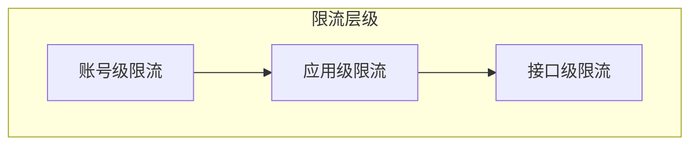

# 限流说明

本文档介绍轻易云 iPaaS API 的限流策略和应对方法。

## 限流概述

为保障服务稳定性，轻易云 iPaaS 对 API 请求进行限流控制。

## 限流级别



### 账号级限流

| 套餐 | 每分钟限制 | 每小时限制 | 每日限制 |
|-----|-----------|-----------|---------|
| 免费试用 | 100 | 1,000 | 10,000 |
| 基础版 | 500 | 5,000 | 50,000 |
| 专业版 S | 1,000 | 10,000 | 100,000 |
| 专业版 M | 2,000 | 20,000 | 200,000 |
| 专业版 L | 5,000 | 50,000 | 500,000 |
| 企业版 | 自定义 | 自定义 | 自定义 |

### 应用级限流

每个应用的默认限流：

| 应用类型 | 每分钟 | 说明 |
|---------|-------|------|
| 默认应用 | 1,000 | 新创建的应用 |
| 已认证应用 | 2,000 | 完成企业认证的应用 |
| 高级应用 | 5,000 | 申请提升的应用 |

### 接口级限流

特定接口可能有额外的限流：

| 接口 | 限流 | 说明 |
|-----|------|------|
| 任务执行 | 100/分钟 | 防止任务堆积 |
| 数据查询 | 500/分钟 | 保护数据库 |
| 批量操作 | 50/分钟 | 控制资源使用 |

## 限流响应

当触发限流时，API 返回 429 状态码：

```http
HTTP/1.1 429 Too Many Requests
Content-Type: application/json
Retry-After: 60
X-RateLimit-Limit: 1000
X-RateLimit-Remaining: 0
X-RateLimit-Reset: 1640995200

{
  "code": 42901,
  "message": "请求过于频繁，请稍后重试",
  "detail": {
    "retryAfter": 60,
    "limit": 1000,
    "resetTime": "2024-01-01T12:00:00Z"
  },
  "requestId": "req_abc123"
}
```

### 响应头说明

| 响应头 | 说明 |
|-------|------|
| Retry-After | 建议等待多少秒后重试 |
| X-RateLimit-Limit | 当前限流上限 |
| X-RateLimit-Remaining | 剩余可用请求数 |
| X-RateLimit-Reset | 限流重置时间戳 |

## 应对策略

### 1. 指数退避重试

```python
import time
import random

def api_call_with_retry(func, max_retries=3):
    for i in range(max_retries):
        try:
            return func()
        except RateLimitError as e:
            if i == max_retries - 1:
                raise
            # 指数退避 + 随机抖动
            wait_time = (2 ** i) + random.uniform(0, 1)
            time.sleep(wait_time)
```

### 2. 请求队列

使用队列平滑请求流量：

```python
from queue import Queue
import threading

class RateLimiter:
    def __init__(self, rate_per_second=10):
        self.queue = Queue()
        self.rate = rate_per_second
        self.thread = threading.Thread(target=self._process)
        self.thread.start()
    
    def add_request(self, request):
        self.queue.put(request)
    
    def _process(self):
        while True:
            request = self.queue.get()
            self._execute(request)
            time.sleep(1 / self.rate)
```

### 3. 批量处理

合并多个操作为一个批量请求：

```python
# 不推荐：多次单个请求
for item in items:
    api.create_record(item)  # 10 次请求

# 推荐：一次批量请求
api.batch_create_records(items)  # 1 次请求
```

### 4. 本地缓存

缓存常用数据，减少 API 调用：

```python
import functools

@functools.lru_cache(maxsize=128)
def get_connector_config(connector_id):
    return api.get_connector(connector_id)
```

## 提升限额

如需提升限流限额，可以：

1. **升级套餐**：升级到更高版本的套餐
2. **申请提升**：联系客服申请临时或永久提升
3. **优化调用**：优化代码，减少不必要的请求

## 最佳实践

### 1. 监控使用量

定期监控 API 使用情况：

```python
# 记录请求统计
request_stats = {
    'total': 0,
    'success': 0,
    'rate_limited': 0,
    'by_endpoint': {}
}
```

### 2. 预留缓冲

不要将限流用满，预留 20% 缓冲：

```python
if remaining < limit * 0.2:
    # 降低请求频率
    time.sleep(0.5)
```

### 3. 异步处理

对于非实时性要求高的操作，使用异步：

```python
# 同步调用（阻塞）
result = api.execute_task(task_id)

# 异步调用（非阻塞）
task = api.execute_task_async(task_id)
while task.status == 'running':
    time.sleep(5)
    task = api.get_task_status(task.id)
```

### 4. 错误处理

完善的限流错误处理：

```python
try:
    response = api.call()
except RateLimitError as e:
    retry_after = e.retry_after
    logger.warning(f"Rate limited, retry after {retry_after}s")
    time.sleep(retry_after)
    response = api.call()  # 重试
```

## 常见问题

**Q: 如何查看当前的限流限额？**

A: 调用任意 API，查看响应头中的 `X-RateLimit-Limit` 字段。

**Q: 限流重置时间是怎么计算的？**

A: 按自然时间窗口计算，如每分钟限流在整分钟时重置。

**Q: 批量操作算几次请求？**

A: 一次 API 调用算一次请求，无论处理多少数据。

**Q: Webhook 调用算在限流内吗？**

A: 不算，Webhook 是平台主动发起的，不计入您的 API 限流。
