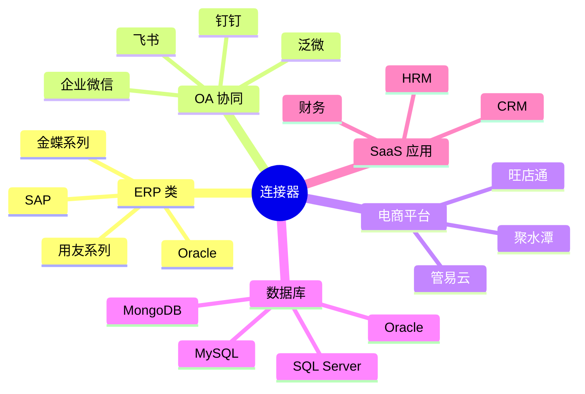

# 连接器

轻易云 iPaaS 提供丰富的预置连接器，支持 500+ 主流企业应用系统。

## 连接器分类

## 目录

### ERP 类
- [ERP 连接器概览](./connectors/erp)
- [金蝶星瀚](./connectors/erp/kingdee-galaxystar)
- [金蝶云星空](./connectors/erp/kingdee-cloud-galaxy)
- [金蝶云苍穹](./connectors/erp/kingdee-cloud-cosmos)
- [金蝶云星辰](./connectors/erp/kingdee-cloud-star)
- [金蝶 KIS](./connectors/erp/kingdee-kis)
- [金蝶 EAS](./connectors/erp/kingdee-eas)
- [金蝶 K3 WISE](./connectors/erp/kingdee-k3wise)
- [用友 NC](./connectors/erp/yonyou-nc)
- [用友 NC Cloud](./connectors/erp/yonyou-nc-cloud)
- [用友 U8+](./connectors/erp/yonyou-u8)
- [用友 U9](./connectors/erp/yonyou-u9)
- [用友 YonSuite](./connectors/erp/yonyou-yonsuite)
- [用友 BIP](./connectors/erp/yonyou-bip)
- [畅捷通](./connectors/erp/chanjet)
- [畅捷通 T+](./connectors/erp/chanjet-tplus)
- [畅捷通好会计](./connectors/erp/chanjet-accounting)
- [Oracle EBS](./connectors/erp/oracle-ebs)

### OA / 协同类
- [OA 连接器概览](./connectors/oa)
- [钉钉](./connectors/oa/dingtalk)
- [飞书](./connectors/oa/feishu)
- [企业微信](./connectors/oa/wecom)
- [泛微 E9](./connectors/oa/fanwei)
- [泛微 e-cology](./connectors/oa/weaver-ecology)
- [泛微 e-office](./connectors/oa/weaver-eoffice)
- [蓝凌 EKP](./connectors/oa/landray)
- [致远 OA](./connectors/oa/seeyon-oa)
- [致远 A8](./connectors/oa/seeyon-a8)
- [道一云](./connectors/oa/daoyiyun)
- [氚云](./connectors/oa/h3yun)
- [简道云](./connectors/oa/jiandaoyun)
- [汇联易](./connectors/oa/huilianyi)

### 电商 / WMS 类
- [电商连接器概览](./connectors/ecommerce)
- [旺店通](./connectors/ecommerce/wangdian)
- [聚水潭](./connectors/ecommerce/jushuitan)
- [万里牛](./connectors/ecommerce/maliniu)
- [管易云](./connectors/ecommerce/guanyi)
- [易仓](./connectors/ecommerce/ecang)
- [快麦](./connectors/ecommerce/kuaimai)
- [网店管家](./connectors/ecommerce/wangdianguanjia)
- [网店精灵](./connectors/ecommerce/wangdianjingling)
- [班牛](./connectors/ecommerce/banniu)

### 数据库类
- [数据库连接器概览](./connectors/database)
- [MySQL](./connectors/database/mysql)
- [PostgreSQL](./connectors/database/postgresql)
- [Oracle](./connectors/database/oracle)
- [SQL Server](./connectors/database/sqlserver)
- [MongoDB](./connectors/database/mongodb)
- [Redis](./connectors/database/redis)
- [Elasticsearch](./connectors/database/elasticsearch)
- [ClickHouse](./connectors/database/clickhouse)
- [Kafka](./connectors/database/kafka)

### CRM / SaaS 类
- [SaaS 连接器概览](./connectors/saas)
- [销帮帮](./connectors/saas/xiaobangbang)
- [纷享销客](./connectors/saas/fenxiangxiaoke)
- [销售易](./connectors/saas/xiaoshouyi)
- [Moka](./connectors/saas/moka)
- [北森](./connectors/saas/beisen)
- [Salesforce](./connectors/saas/salesforce)
- [HubSpot](./connectors/saas/hubspot)
- [WordPress](./connectors/saas/wordpress)
- [管家婆](./connectors/saas/wsgjp)
- [指掌天下](./connectors/saas/zhizhangtianxia)
