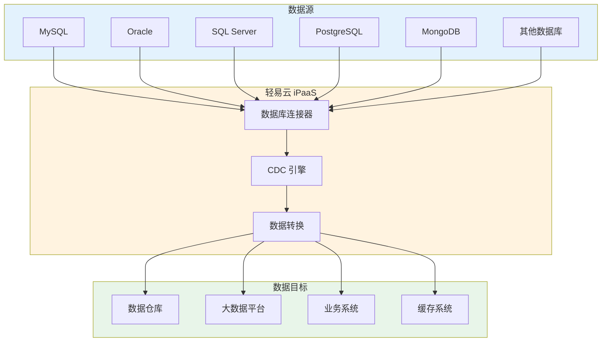
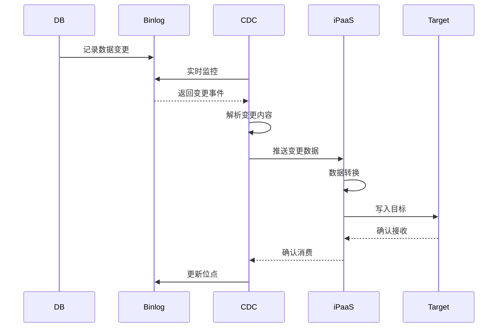
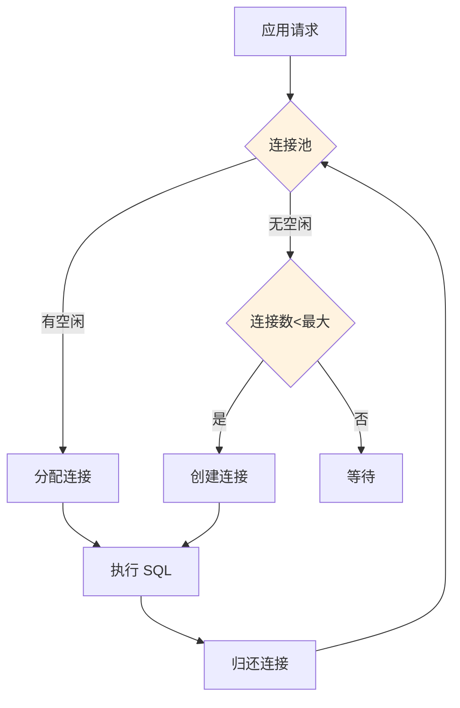
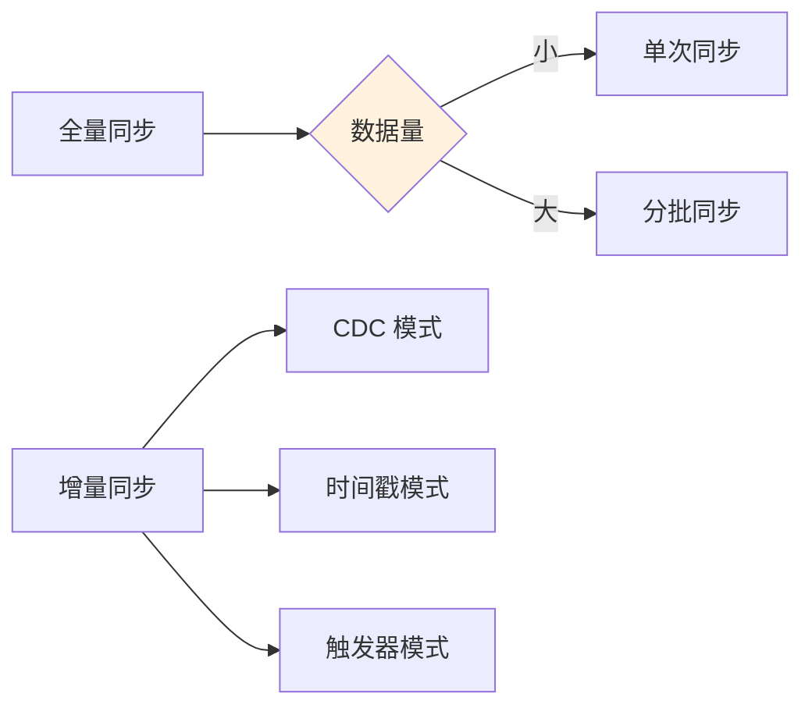

# 数据库类连接器概览

轻易云 iPaaS 平台提供丰富的数据库连接器，支持关系型数据库、NoSQL 数据库、缓存数据库以及大数据存储系统，帮助企业实现异构数据库之间的数据同步和集成。

## 数据库连接器介绍

数据库连接器是轻易云 iPaaS 数据集成能力的基础组件，提供以下核心功能：

- **数据抽取**：支持全量抽取和增量 CDC 抽取
- **数据写入**：支持单条写入和批量写入
- **SQL 查询**：支持自定义 SQL 查询和数据处理
- **实时同步**：基于 CDC 实现近实时的数据变更捕获
- **事务支持**：保证数据一致性和完整性



## 支持的数据库列表

### 关系型数据库

| 数据库 | 连接器标识 | 主要功能 | CDC 支持 |
|-------|-----------|---------|---------|
| [MySQL](./database/mysql) | `mysql` | 查询、写入、CDC | ✅ Binlog |
| [Oracle](./database/oracle) | `oracle` | 查询、写入、CDC | ✅ LogMiner |
| [SQL Server](./database/sqlserver) | `sqlserver` | 查询、写入、CDC | ✅ CT/CDC |
| [PostgreSQL](./database/postgresql) | `postgresql` | 查询、写入、CDC | ✅ 逻辑复制 |
| [ClickHouse](./database/clickhouse) | `clickhouse` | 查询、批量写入 | ❌ |

### NoSQL 数据库

| 数据库 | 连接器标识 | 主要功能 | 适用场景 |
|-------|-----------|---------|---------|
| [MongoDB](./database/mongodb) | `mongodb` | 文档查询、写入 | 文档存储 |
| [Redis](./database/redis) | `redis` | KV 操作、数据结构 | 缓存、队列 |
| [Elasticsearch](./database/elasticsearch) | `elasticsearch` | 搜索、分析 | 全文检索 |

### 消息队列

| 系统 | 连接器标识 | 主要功能 | 适用场景 |
|-----|-----------|---------|---------|
| [Kafka](./database/kafka) | `kafka` | 生产、消费 | 流式处理 |

## CDC 实时同步说明

### 什么是 CDC

CDC（Change Data Capture，变更数据捕获）是一种用于捕获数据库数据变更的技术，可以实现近实时的数据同步。


### CDC 工作原理



### 支持的 CDC 方式

| 数据库 | CDC 方式 | 延迟 | 特点 |
|-------|---------|------|------|
| MySQL | Binlog | 秒级 | 成熟稳定 |
| Oracle | LogMiner | 秒级 | 功能强大 |
| SQL Server | CT/CDC | 秒级 | 原生支持 |
| PostgreSQL | 逻辑复制 | 秒级 | 轻量级 |

### CDC 配置要求

#### MySQL CDC 配置

```ini
[mysqld]
# 开启 Binlog
log-bin=mysql-bin
binlog_format=ROW
server-id=1
expire_logs_days=7
```

#### Oracle CDC 配置

```sql
-- 开启归档日志
ALTER SYSTEM SET LOG_ARCHIVE_DEST_1='LOCATION=/arch' SCOPE=BOTH;
ALTER DATABASE ARCHIVELOG;

-- 开启补充日志
ALTER DATABASE ADD SUPPLEMENTAL LOG DATA;
```

#### PostgreSQL CDC 配置

```ini
# postgresql.conf
wal_level = logical
max_replication_slots = 10
max_wal_senders = 10
```

## 通用配置说明

### 连接配置参数

| 参数名 | 类型 | 必填 | 说明 |
|-------|------|------|------|
| `host` | string | ✅ | 服务器地址 |
| `port` | number | ✅ | 服务端口 |
| `database` | string | ✅ | 数据库名称 |
| `username` | string | ✅ | 用户名 |
| `password` | string | ✅ | 密码 |
| `charset` | string | — | 字符集 |
| `timeout` | number | — | 超时时间 |
| `pool_size` | number | — | 连接池大小 |
| `use_ssl` | boolean | — | 是否使用 SSL |

### 适配器选择

| 适配器名称 | 用途 | 适用场景 |
|-----------|------|---------|
| `QueryAdapter` | 标准查询 | 常规查询 |
| `CDCAdapter` | 实时同步 | 增量数据捕获 |
| `BatchAdapter` | 批量写入 | 大数据量导入 |
| `ExecuteAdapter` | SQL 执行 | DDL/DML 操作 |

### 批量写入配置

```json
{
  "batch": {
    "enabled": true,
    "batchSize": 1000,
    "flushInterval": 5000,
    "maxRetries": 3
  }
}
```

## 最佳实践

### 1. 数据库连接池配置



#### 连接池参数建议

| 参数 | 建议值 | 说明 |
|------|--------|------|
| `min_idle` | 5 | 最小空闲连接 |
| `max_active` | 20 | 最大活跃连接 |
| `max_wait` | 30000 | 最大等待时间 |
| `validation_query` | SELECT 1 | 连接验证 SQL |

### 2. 数据同步策略



### 3. 性能优化建议

| 优化项 | 建议 | 效果 |
|-------|------|------|
| 索引优化 | 确保查询字段有索引 | 提升查询速度 |
| 批量操作 | 使用批量写入 | 减少网络往返 |
| 连接池 | 合理配置连接池 | 减少连接开销 |
| 分页查询 | 大表使用分页 | 避免内存溢出 |
| 异步处理 | 非关键操作异步 | 提升响应速度 |

## 常见问题

### Q: CDC 同步延迟较大怎么办？

排查建议：
1. 检查源数据库 Binlog/日志生成频率
2. 优化网络连接，减少网络延迟
3. 增加消费者线程数
4. 检查目标系统写入性能

```sql
-- MySQL 检查 Binlog 状态
SHOW MASTER STATUS;
SHOW BINLOG EVENTS LIMIT 10;

-- 检查复制延迟
SHOW SLAVE STATUS\G
```

### Q: 如何处理主键冲突？

策略选择：

| 策略 | SQL 语法 | 适用场景 |
|------|---------|---------|
| 忽略 | `INSERT IGNORE` | 允许部分丢失 |
| 更新 | `ON DUPLICATE KEY UPDATE` | 以新数据为准 |
| 替换 | `REPLACE INTO` | 完全替换 |
| 跳过 | 程序判断 | 需人工处理 |

### Q: 大数据量同步如何优化？

优化建议：
1. **分批处理**：每批控制在 1000~10000 条
2. **并行处理**：多线程并发同步
3. **禁用索引**：导入前禁用索引，导入后重建
4. **调整事务**：适当增大事务批次

```sql
-- MySQL 导入优化
SET FOREIGN_KEY_CHECKS = 0;
SET UNIQUE_CHECKS = 0;
-- 执行批量导入
SET FOREIGN_KEY_CHECKS = 1;
SET UNIQUE_CHECKS = 1;
```

## 相关文档

- [MySQL 集成专题](./database/mysql)
- [Oracle 集成专题](./database/oracle)
- [MongoDB 集成专题](./database/mongodb)
- [CDC 实时同步](../advanced/cdc-realtime)
- [数据同步方案](../standard-schemes/data-sync)

> [!IMPORTANT]
> 使用 CDC 功能时，请确保数据库已开启相应日志功能，并授予足够的权限。
