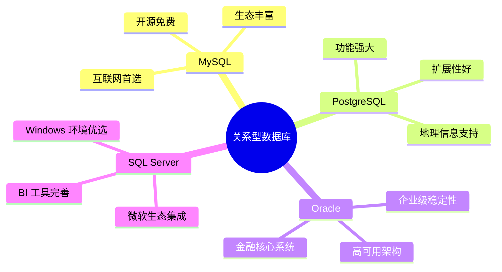
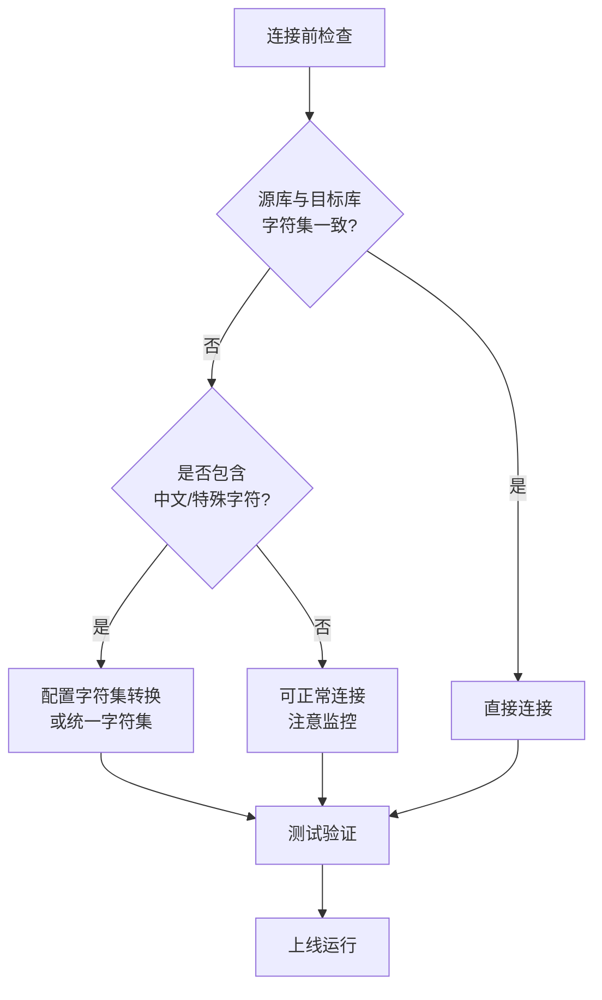
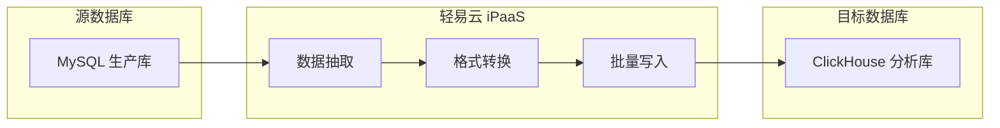
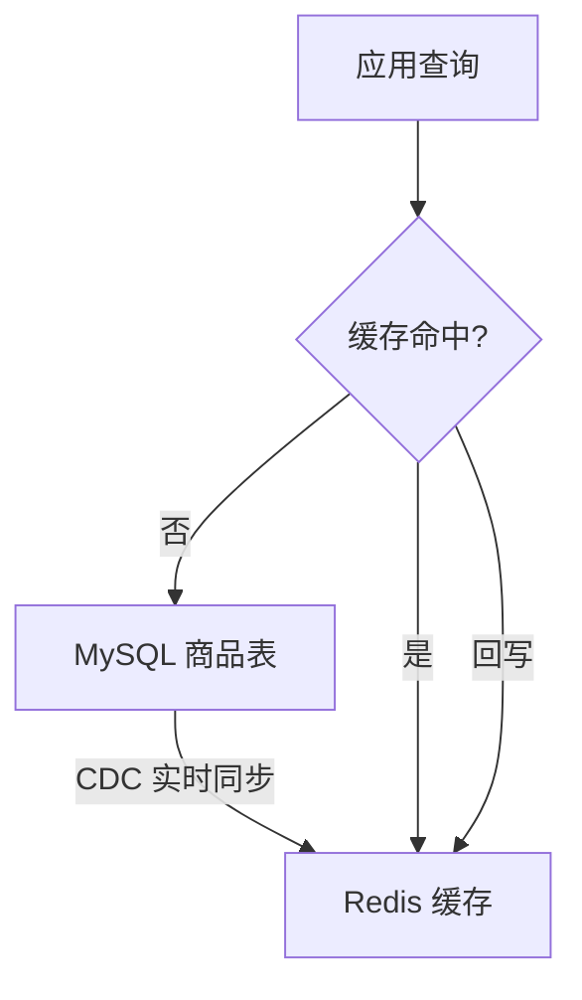
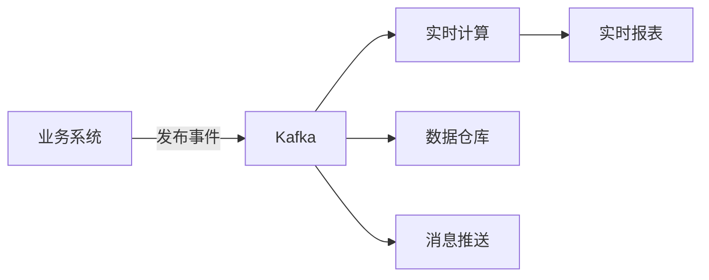
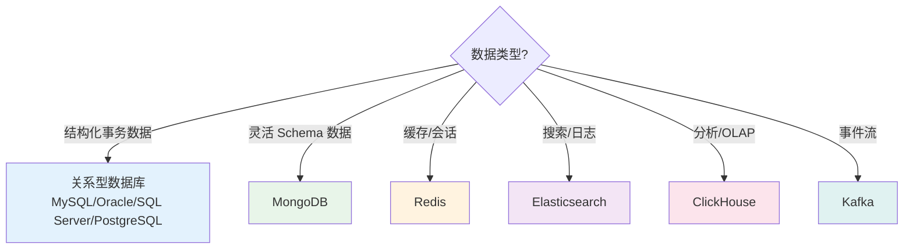

# 数据库类连接器

本文档汇总轻易云 iPaaS 支持的所有数据库连接器，涵盖关系型数据库（MySQL、Oracle、SQL Server、PostgreSQL）、文档型数据库（MongoDB）、缓存数据库（Redis）、搜索引擎（Elasticsearch）、列式存储（ClickHouse）以及消息队列（Kafka）等。通过统一的数据访问层，帮助企业实现异构数据库之间的数据同步、实时 CDC（Change Data Capture，变更数据捕获）捕获、数据仓库 ETL 等场景。

> [!TIP]
> 如需了解连接器的基础使用方法，请先阅读 [配置连接器](../../guide/configure-connector)。

---

## 连接器总览

轻易云 iPaaS 目前支持 **9+** 款数据库连接器，覆盖企业常用的各类数据存储系统。

| 数据库 | 类型 | 连接器 | 适用场景 | 状态 |
|--------|------|--------|----------|------|
| **MySQL** | 关系型 | [MySQL](./mysql) | Web 应用、事务处理 | ✅ 稳定 |
| **PostgreSQL** | 关系型 | [PostgreSQL](./postgresql) | 复杂查询、地理数据 | ✅ 稳定 |
| **Oracle** | 关系型 | [Oracle](./oracle) | 大型企业核心系统 | ✅ 稳定 |
| **SQL Server** | 关系型 | [SQL Server](./sqlserver) | 微软生态企业应用 | ✅ 稳定 |
| **MongoDB** | 文档型 | [MongoDB](./mongodb) | 非结构化数据、大数据 | ✅ 稳定 |
| **Redis** | KV 型 | [Redis](./redis) | 缓存、会话存储 | ✅ 稳定 |
| **Elasticsearch** | 搜索引擎 | [Elasticsearch](./elasticsearch) | 全文检索、日志分析 | ✅ 稳定 |
| **ClickHouse** | 列式存储 | [ClickHouse](./clickhouse) | OLAP 分析、大数据 | ✅ 稳定 |
| **Kafka** | 消息队列 | [Kafka](./kafka) | 流式处理、事件驱动 | ✅ 稳定 |

---

## 数据库分类介绍

### 关系型数据库

关系型数据库是企业核心业务系统的基石，支持 ACID 事务和复杂 SQL 查询。



#### 选型建议

| 场景 | 推荐数据库 | 理由 |
|------|-----------|------|
| 互联网应用、电商 | MySQL | 社区活跃、读写性能优异、主从复制成熟 |
| 复杂业务逻辑、GIS | PostgreSQL | 支持复杂查询、PostGIS 扩展、JSON 原生支持 |
| 金融、电信核心系统 | Oracle | 稳定性极高、RAC 高可用、企业级支持 |
| 微软技术栈企业 | SQL Server | 与 .NET/Azure 深度集成、SSIS/SSAS 生态 |

> [!NOTE]
> 关系型数据库间的数据同步支持全量迁移和增量 CDC 两种模式，CDC 模式需要开启数据库的日志功能（如 MySQL Binlog、Oracle LogMiner）。

---

### NoSQL 数据库

NoSQL 数据库适用于非结构化数据、高并发读写和弹性扩展场景。

#### MongoDB

文档型数据库，以 JSON-like 的 BSON 格式存储数据，适合存储结构多变的数据。

| 特性 | 说明 |
|------|------|
| 数据模型 | 灵活的文档结构，无需预定义 Schema |
| 适用场景 | 内容管理、用户画像、物联网数据 |
| 扩展方式 | 分片集群水平扩展 |
| 事务支持 | 4.0+ 支持多文档 ACID 事务 |

#### Redis

内存键值数据库，提供极高的读写性能，常用于缓存和实时计算。

| 特性 | 说明 |
|------|------|
| 数据类型 | String、Hash、List、Set、Sorted Set |
| 持久化 | RDB 快照、AOF 日志 |
| 适用场景 | 会话缓存、热点数据、分布式锁、排行榜 |
| 部署模式 | 主从、哨兵、Cluster 集群 |

> [!IMPORTANT]
> Redis 作为缓存数据库，数据存储于内存，请确保已对重要数据配置持久化或已通过其他方式备份。

---

### 大数据与分析型数据库

#### Elasticsearch

分布式搜索和分析引擎，基于 Apache Lucene 构建。

| 特性 | 说明 |
|------|------|
| 核心能力 | 全文检索、结构化搜索、聚合分析 |
| 适用场景 | 日志分析、商品搜索、安全分析 |
| 数据写入 | 近实时（Near Real-time） |
| 查询语言 | Query DSL |

#### ClickHouse

开源列式数据库管理系统，专为 OLAP 场景设计。

| 特性 | 说明 |
|------|------|
| 存储模型 | 列式存储，高效压缩 |
| 查询性能 | 单节点每秒处理数亿行 |
| 适用场景 | 数据分析、时序数据、BI 报表 |
| 数据更新 | 支持批量更新，不适合高频单条更新 |

#### Kafka

分布式流处理平台，用于构建实时数据管道和流式应用。

| 特性 | 说明 |
|------|------|
| 核心概念 | Topic、Partition、Consumer Group |
| 适用场景 | 事件流处理、日志收集、流式 ETL |
| 数据保留 | 基于时间或大小的保留策略 |
| 连接器 | Kafka Connect 生态丰富 |

---

## 通用连接注意事项

### 网络要求

在配置数据库连接前，请确保网络环境满足以下条件：

| 检查项 | 要求 | 排查方法 |
|--------|------|----------|
| 网络可达 | 轻易云 iPaaS 需要能够访问数据库的 IP 和端口 | 使用 `telnet host port` 测试连通性 |
| 白名单配置 | 数据库服务器需放行轻易云平台出口 IP | 在数据库防火墙/安全组中添加白名单 |
| 端口开放 | 确保数据库监听端口对外开放 | 检查 `netstat -tlnp` 输出 |
| 超时设置 | 网络超时时间建议 ≥ 30 秒 | 检查数据库和应用层超时配置 |

> [!WARNING]
> 生产环境数据库建议配置 VPN 专线或私有网络连接，避免通过公网直接暴露数据库端口。如需公网访问，请务必配置 IP 白名单和 SSL 加密。

---

### 权限配置

数据库账号应遵循最小权限原则，仅授予必要的操作权限。

#### 通用权限建议

| 操作类型 | 所需权限 | 说明 |
|----------|----------|------|
| 数据读取 | `SELECT` | 读取源表数据 |
| 数据写入 | `INSERT`、`UPDATE`、`DELETE` | 写入目标表 |
| 结构查询 | `SHOW`、`INFORMATION_SCHEMA` | 获取表结构信息 |
| CDC 同步 | 复制权限（因数据库而异） | 读取变更日志 |

#### 各数据库特定权限

**MySQL**

```sql
-- 基础读写权限
GRANT SELECT, INSERT, UPDATE, DELETE ON database_name.* TO 'easypaas_user'@'%';

-- CDC 同步额外需要 REPLICATION 权限
GRANT REPLICATION SLAVE, REPLICATION CLIENT ON *.* TO 'easypaas_user'@'%';
```

**PostgreSQL**

```sql
-- 基础读写权限
GRANT SELECT, INSERT, UPDATE, DELETE ON ALL TABLES IN SCHEMA public TO easypaas_user;

-- CDC 同步需要复制权限
ALTER USER easypaas_user WITH REPLICATION;
```

**Oracle**

```sql
-- 基础读写权限
GRANT CREATE SESSION, SELECT ANY TABLE, INSERT ANY TABLE, UPDATE ANY TABLE, DELETE ANY TABLE TO easypaas_user;

-- CDC 同步需要 LogMiner 权限
GRANT EXECUTE_CATALOG_ROLE, SELECT_CATALOG_ROLE TO easypaas_user;
GRANT FLASHBACK ANY TABLE TO easypaas_user;
```

**SQL Server**

```sql
-- 基础读写权限
GRANT SELECT, INSERT, UPDATE, DELETE ON SCHEMA::dbo TO easypaas_user;

-- CDC 同步需要 sysadmin 固定服务器角色或 db_owner 固定数据库角色
EXEC sp_addrolemember 'db_owner', 'easypaas_user';
```

> [!CAUTION]
> 请勿使用数据库超级管理员账号（如 MySQL 的 root、Oracle 的 SYS）配置连接器。建议创建专用的只读或读写分离账号，并定期轮换密码。

---

### 字符集配置

字符集配置不当会导致中文乱码、特殊符号丢失等问题。

#### 推荐字符集

| 数据库 | 推荐字符集 | 说明 |
|--------|-----------|------|
| MySQL | `utf8mb4` | 支持完整的 Unicode，包括 Emoji |
| PostgreSQL | `UTF8` | 默认即为 UTF-8 |
| Oracle | `AL32UTF8` | Unicode 完整支持 |
| SQL Server | `Chinese_PRC_CI_AS` 或 `UTF-8` | 2019+ 支持 UTF-8 排序规则 |
| MongoDB | 无特殊要求 | 内部使用 BSON/UTF-8 |

#### MySQL 字符集检查

```sql
-- 查看数据库字符集
SHOW VARIABLES LIKE 'character_set_%';

-- 查看表字符集
SHOW TABLE STATUS WHERE Name = 'your_table';

-- 查看列字符集
SHOW FULL COLUMNS FROM your_table;
```

#### 字符集统一建议



> [!TIP]
> 建议在数据库连接字符串中显式指定字符集参数，例如 MySQL：`jdbc:mysql://host:3306/db?useUnicode=true&characterEncoding=utf8mb4`

---

### 连接参数优化

根据数据量和同步频率，建议调整以下连接参数：

| 参数 | 建议值 | 说明 |
|------|--------|------|
| 连接池大小 | 5~20 | 根据并发任务数调整 |
| 连接超时 | 30000 ms | 避免网络抖动导致频繁重连 |
| 读取超时 | 60000 ms | 大表查询需要更长时间 |
| 批量大小 | 1000~5000 | 平衡内存占用和写入效率 |
| 事务隔离级别 | READ_COMMITTED | 兼顾一致性和并发性能 |

---

## 通用集成场景

### 1. 数据库间数据同步

实现异构数据库之间的数据迁移和实时同步。



| 场景 | 源数据库 | 目标数据库 | 同步策略 |
|------|----------|------------|----------|
| 业务数据归档 | MySQL/Oracle | PostgreSQL/MySQL | 定时全量 + 增量 CDC |
| 数据仓库 ETL | 各类关系型 | ClickHouse | 批量抽取、按天分区 |
| 读写分离 | MySQL | MySQL 从库 | 实时 CDC 同步 |
| 异构迁移 | Oracle | PostgreSQL | 全量迁移 + 增量追平 |

### 2. CDC 实时变更捕获

捕获数据库的增删改操作，实现近实时的数据同步。

| 数据库 | CDC 机制 | 延迟 |
|--------|----------|------|
| MySQL | Binlog 解析 | 秒级 |
| PostgreSQL | Logical Decoding | 秒级 |
| Oracle | LogMiner | 秒级 |
| SQL Server | Change Tracking / CDC | 秒级 |
| MongoDB | Change Streams | 秒级 |

> [!IMPORTANT]
> CDC 模式需要数据库开启日志功能，且账号具备相应权限。详情请参考各数据库连接器的 CDC 配置章节。

### 3. 缓存数据刷新

将关系型数据库的数据同步至 Redis，提升应用读取性能。



### 4. 全文检索构建

将数据库数据同步至 Elasticsearch，实现高效的全文搜索。

| 数据源 | 检索场景 |
|--------|----------|
| 商品数据库 | 商品搜索、筛选、排序 |
| 日志数据库 | 日志检索、异常分析 |
| 文档库 | 文档内容全文检索 |

### 5. 流式数据处理

通过 Kafka 构建实时数据管道，实现事件驱动的架构。



---

## 连接器选择指南

### 根据数据类型选择



### 根据场景选择

| 场景 | 推荐方案 | 理由 |
|------|----------|------|
| 电商平台订单同步 | MySQL → MySQL + Redis | 主从复制 + 热点缓存 |
| 用户行为分析 | MySQL → ClickHouse | 列式存储、高效分析 |
| 商品搜索 | MySQL → Elasticsearch | 全文检索、分词支持 |
| 实时风控 | Kafka + Redis | 低延迟事件处理 |
| 物联网数据采集 | MQTT → Kafka → ClickHouse | 高吞吐流式处理 |
| 多租户 SaaS | PostgreSQL | Schema 隔离、JSON 支持 |

---

## 快速开始

### 第一步：创建数据库连接

1. 登录轻易云 iPaaS 控制台
2. 进入 **连接器管理** → **新建连接器**
3. 选择对应的数据库类型（如 MySQL）
4. 填写连接参数：
   - 主机地址和端口
   - 数据库名称
   - 用户名和密码
   - 字符集设置（建议 utf8mb4）
5. 点击 **测试连接** 验证连通性

> [!TIP]
> 生产环境建议配置连接池参数和超时设置，以应对网络波动和高峰流量。

### 第二步：配置集成方案

1. 进入 **集成方案** → **新建方案**
2. 选择源数据库连接器
3. 选择目标数据库连接器
4. 配置数据映射（字段对应关系）
5. 选择同步模式（全量 / 增量 CDC）
6. 设置调度策略与批量参数

### 第三步：测试与上线

1. 使用 **调试模式** 验证数据抽取和写入
2. 检查数据完整性和字符集正确性
3. 开启监控告警，关注同步延迟指标
4. 切换至生产环境运行

---

## 常见问题

### Q: 数据库连接测试失败怎么办？

请按以下顺序排查：

1. **网络连通性**：使用 `telnet host port` 测试是否能连通数据库端口
2. **白名单配置**：确认数据库服务器已放行轻易云平台出口 IP
3. **账号权限**：检查账号密码是否正确，是否具备所需权限
4. **连接参数**：确认数据库名称、端口、字符集等参数正确
5. **数据库状态**：确认数据库服务正常运行，未达最大连接数

### Q: CDC 实时同步如何开启？

不同数据库的 CDC 开启方式：

| 数据库 | 开启方式 |
|--------|----------|
| MySQL | 配置 `binlog_format=ROW`，创建具有 `REPLICATION` 权限的账号 |
| PostgreSQL | 修改 `wal_level=logical`，安装 `pgoutput` 插件 |
| Oracle | 开启归档日志，启用 GoldenGate 或 LogMiner |
| SQL Server | 启用数据库的 Change Tracking 或 CDC 功能 |

### Q: 中文乱码如何解决？

1. 确认数据库字符集为 UTF-8（MySQL 使用 utf8mb4）
2. 在连接字符串中显式指定字符集参数
3. 检查表和列的字符集设置
4. 同步任务中配置字符集转换规则

### Q: 大数据量同步性能如何优化？

1. **批量写入**：调整批量大小参数（建议 1000~5000）
2. **并行处理**：启用多线程并行抽取和写入
3. **分片策略**：按主键或时间字段分片并行处理
4. **增量同步**：使用 CDC 模式替代全量同步
5. **索引优化**：同步期间暂停目标表非必要索引，完成后重建

### Q: 是否支持双向同步？

支持，但需要谨慎处理冲突。建议：

- 明确主从关系，避免双向同时写入同一条数据
- 配置冲突解决策略（如时间戳优先、主库优先）
- 对于关键业务，建议单向同步 + 反向只读查询

---

## 相关资源

- [配置连接器](../../guide/configure-connector) — 连接器基础使用指南
- [CDC 实时同步](../../advanced/cdc-realtime) — CDC 配置与最佳实践
- [自定义连接器开发](../../developer/custom-connector) — 开发自定义数据库连接器
- [MongoDB 高级集成](../../developer/mongodb-advanced) — MongoDB 专项集成指南
- [Kafka 消息中间件集成](../../developer/kafka-integration) — Kafka 流式处理集成
- [数据质量管理](../../guide/data-quality) — 数据对象规范与质量治理参考

---

> [!NOTE]
> 本文档持续更新中，如有疑问请联系轻易云技术支持团队。
