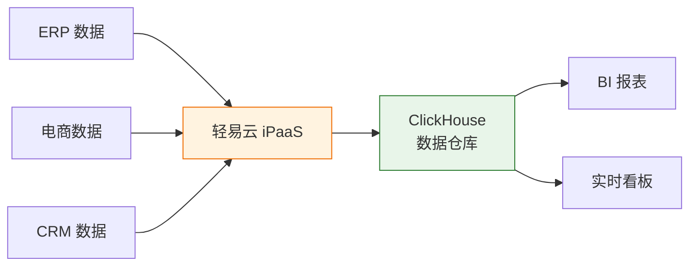

# ClickHouse 集成专题

本文档详细介绍轻易云 iPaaS 平台与 ClickHouse 列式分析数据库的集成配置方法，涵盖连接器配置、写入优化、分析查询以及数据仓库构建场景。

---

## 概述

ClickHouse 是由 Yandex 开源的高性能列式 OLAP（在线分析处理）数据库，以极高的查询速度和数据压缩比著称，广泛应用于实时分析、数据仓库、BI 报表等场景。轻易云 iPaaS 提供专用的 ClickHouse 连接器，支持以下核心能力：

- **数据写入**：支持大批量数据高速写入
- **数据查询**：支持标准 SQL 查询语法
- **数据同步**：支持从 MySQL、PostgreSQL 等关系型数据库实时同步至 ClickHouse
- **ETL 数据加工**：支持在同步过程中进行数据转换和清洗

### 适用版本

| ClickHouse 版本 | 支持状态 | 说明 |
|----------------|----------|------|
| 21.x 及以上 | ✅ 支持 | 基础功能完全支持 |
| 22.x | ✅ 推荐 | 性能优化，推荐版本 |
| 23.x+ | ✅ 推荐 | 最新特性，性能最佳 |

---

## 连接器配置

### 创建连接器

1. 登录轻易云 iPaaS 控制台，进入**连接器管理**页面
2. 点击**新建连接器**，选择**数据库**分类下的 **ClickHouse**
3. 填写连接参数（详见下方参数说明）
4. 点击**测试连接**验证连通性
5. 连接成功后点击**保存**

### 连接参数说明

| 参数名 | 类型 | 必填 | 说明 |
|--------|------|------|------|
| `host` | string | ✅ | ClickHouse 服务器地址 |
| `port` | number | ✅ | HTTP 端口，默认为 `8123`；TCP 端口默认 `9000` |
| `database` | string | ✅ | 数据库名称 |
| `username` | string | ✅ | 连接用户名 |
| `password` | string | ✅ | 连接密码 |
| `protocol` | string | — | 协议类型：`http` 或 `native`，默认 `http` |

#### 连接字符串示例

```json
{
  "host": "clickhouse.example.com",
  "port": 8123,
  "database": "analytics_db",
  "username": "ch_user",
  "password": "your_secure_password",
  "protocol": "http"
}
```

---

## 典型应用场景

### 构建数据仓库

将多源业务数据同步至 ClickHouse，构建企业级数据仓库，支撑实时分析和 BI 报表：



### 写入优化建议

| 优化项 | 建议配置 | 说明 |
|--------|----------|------|
| 批量大小 | 10000~100000 条/批 | ClickHouse 适合大批量写入 |
| 写入频率 | 1~5 分钟/次 | 避免频繁小批量写入 |
| 分区策略 | 按天或按月分区 | 优化查询性能和数据管理 |
| 表引擎 | MergeTree 系列 | 推荐使用 `ReplacingMergeTree` 处理数据更新 |

> [!IMPORTANT]
> ClickHouse 不适合高频小批量写入，建议在轻易云 iPaaS 中配置合理的批量大小和写入间隔。

---

## 常见问题

### Q: 写入时提示 "Too many parts"？

ClickHouse 的 MergeTree 引擎会在后台异步合并数据分片。频繁小批量写入会导致 parts 过多。建议增大批量写入大小（至少 10000 条/批），降低写入频率。

### Q: 如何处理数据更新场景？

ClickHouse 原生不支持 UPDATE 操作。建议使用 `ReplacingMergeTree` 表引擎，通过版本号实现数据去重，或使用 `CollapsingMergeTree` 处理状态变更。

---

## 相关资源

- [数据库类连接器概览](./README) — 查看所有支持的数据库连接器
- [配置连接器](../../guide/configure-connector) — 连接器基础配置指南
- [批量数据处理](../../advanced/batch-processing) — 大数据量处理最佳实践

---

> [!NOTE]
> 本文档持续更新中，如有疑问请联系轻易云技术支持团队。
