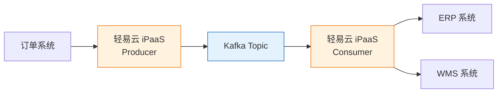

# Kafka 集成专题

本文档详细介绍轻易云 iPaaS 平台与 Apache Kafka 消息中间件的集成配置方法，涵盖连接器配置、生产者/消费者模式、消息格式以及高可靠性保障。

---

## 概述

Apache Kafka 是分布式流处理平台，具备高吞吐、低延迟、高可用的特点，广泛应用于实时数据管道、事件驱动架构、日志收集等场景。轻易云 iPaaS 提供专用的 Kafka 连接器，支持以下核心能力：

- **消息生产**：支持将集成数据发送至指定 Topic
- **消息消费**：支持从 Kafka Topic 实时消费消息并触发集成流程
- **消息格式**：支持 JSON、Avro、Protobuf 等消息格式
- **分区策略**：支持自定义分区键，实现消息有序性
- **安全认证**：支持 SASL/SCRAM、SSL/TLS 认证

### 适用版本

| Kafka 版本 | 支持状态 | 说明 |
|-----------|----------|------|
| Kafka 2.x | ✅ 支持 | 基础功能完全支持 |
| Kafka 3.x | ✅ 推荐 | KRaft 模式支持 |
| Confluent Platform | ✅ 支持 | 商业增强版兼容 |

---

## 连接器配置

### 创建连接器

1. 登录轻易云 iPaaS 控制台，进入**连接器管理**页面
2. 点击**新建连接器**，选择**数据库**分类下的 **Kafka**
3. 填写连接参数（详见下方参数说明）
4. 点击**测试连接**验证连通性
5. 连接成功后点击**保存**

### 连接参数说明

| 参数名 | 类型 | 必填 | 说明 |
|--------|------|------|------|
| `bootstrap_servers` | string | ✅ | Kafka Broker 地址，多个用逗号分隔 |
| `topic` | string | ✅ | 目标 Topic 名称 |
| `group_id` | string | — | 消费者组 ID（消费模式必填） |
| `security_protocol` | string | — | 安全协议：`PLAINTEXT`、`SASL_SSL` 等 |
| `sasl_mechanism` | string | — | SASL 认证机制：`PLAIN`、`SCRAM-SHA-256` 等 |
| `sasl_username` | string | — | SASL 认证用户名 |
| `sasl_password` | string | — | SASL 认证密码 |

#### 连接字符串示例

```json
{
  "bootstrap_servers": "kafka1.example.com:9092,kafka2.example.com:9092",
  "topic": "order-events",
  "group_id": "ipaas-consumer-group",
  "security_protocol": "SASL_SSL",
  "sasl_mechanism": "SCRAM-SHA-256",
  "sasl_username": "kafka_user",
  "sasl_password": "your_secure_password"
}
```

---

## 典型应用场景

### 事件驱动集成

将业务系统的变更事件发布至 Kafka，由下游系统订阅消费，实现松耦合的事件驱动架构：



### 生产者/消费者配置建议

| 配置项 | 生产者建议 | 消费者建议 |
|--------|----------|----------|
| 批量大小 | `batch.size=16384` | — |
| 确认机制 | `acks=all` | — |
| 自动提交 | — | `enable.auto.commit=false` |
| 最大拉取 | — | `max.poll.records=500` |

> [!WARNING]
> 消费者建议关闭自动提交（`auto.commit=false`），在业务处理完成后手动提交 offset，避免消息丢失。

---

## 常见问题

### Q: 消息消费延迟较大？

检查消费者组的 Lag 指标。可能原因包括：消费者处理速度不足、分区分配不均、网络延迟等。建议增加消费者实例数或优化业务处理逻辑。

### Q: 消息顺序如何保证？

Kafka 仅保证单分区内的消息有序。若业务需要全局有序，可将 Topic 分区数设为 1，或通过自定义分区键将同一业务的消息路由至同一分区。

---

## 相关资源

- [数据库类连接器概览](./README) — 查看所有支持的数据库连接器
- [Kafka 消息中间件集成](../../developer/kafka-integration) — Kafka 开发者集成指南
- [CDC 实时同步](../../advanced/cdc-realtime) — 实时数据同步最佳实践

---

> [!NOTE]
> 本文档持续更新中，如有疑问请联系轻易云技术支持团队。
