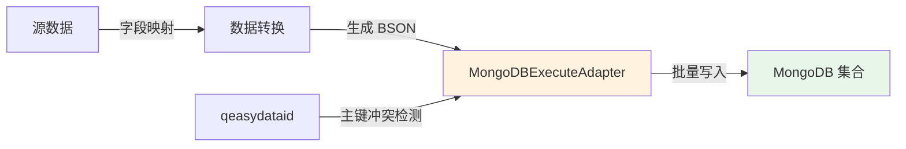
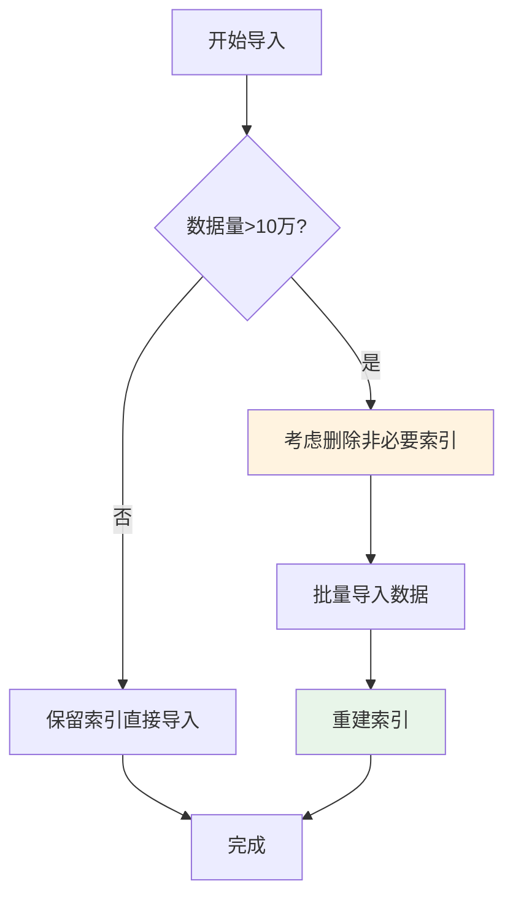

# MongoDB 集成专题

本文档详细介绍轻易云 iPaaS 平台与 MongoDB 文档型数据库的集成配置方法，涵盖连接器配置、连接参数、权限要求、数据写入适配器使用以及性能优化建议。对于高级用法，请参考 [MongoDB 高级集成](../../developer/mongodb-advanced)。

---

## 概述

MongoDB 是业界领先的文档型 NoSQL 数据库，以灵活的 BSON（Binary JSON）格式存储数据，无需预定义 Schema，特别适合存储结构多变、快速增长的数据。轻易云 iPaaS 提供专用的 MongoDB 连接器，支持以下核心能力：

- **数据抽取**：支持全量抽取和基于 Change Streams 的增量同步
- **数据写入**：支持单条写入和批量写入，自动处理数据主键冲突
- **灵活查询**：支持自定义查询条件和投影字段
- **聚合管道**：支持 MongoDB 原生聚合框架进行数据转换
- **索引管理**：支持创建索引以优化查询性能

### 适用版本

| MongoDB 版本 | 支持状态 | 说明 |
|--------------|----------|------|
| MongoDB 4.0 | ✅ 支持 | 基础功能完全支持 |
| MongoDB 4.2 | ✅ 支持 | 事务功能增强 |
| MongoDB 4.4 | ✅ 推荐 | 性能优化，推荐版本 |
| MongoDB 5.0 | ✅ 推荐 | 最新特性，性能最佳 |
| MongoDB 6.0 | ✅ 推荐 | 时序集合、集群同步等新特性 |

> [!NOTE]
> 建议使用 MongoDB 4.4 及以上版本以获得最佳性能和功能支持。

---

## 连接器配置

### 创建连接器

1. 登录轻易云 iPaaS 控制台，进入**连接器管理**页面
2. 点击**新建连接器**，选择**数据库**分类下的 **MongoDB**
3. 填写连接参数（详见下方参数说明）
4. 点击**测试连接**验证连通性
5. 连接成功后点击**保存**

### 连接参数说明

#### 基础连接参数

| 参数名 | 类型 | 必填 | 说明 |
|--------|------|------|------|
| `host` | string | ✅ | MongoDB 服务器地址，如 `localhost` 或 `mongodb.example.com` |
| `port` | number | ✅ | MongoDB 服务端口，默认为 `27017` |
| `database` | string | ✅ | 数据库名称 |
| `username` | string | ✅ | 连接用户名（如启用认证） |
| `password` | string | ✅ | 连接密码（如启用认证） |

#### 高级连接参数

| 参数名 | 类型 | 必填 | 默认值 | 说明 |
|--------|------|------|--------|------|
| `authSource` | string | — | `admin` | 认证数据库，默认为 `admin` |
| `replicaSet` | string | — | — | 副本集名称，连接副本集时必填 |
| `ssl` | boolean | — | `false` | 是否使用 SSL/TLS 加密连接 |
| `connectionTimeout` | number | — | `10000` | 连接超时时间，单位毫秒 |
| `serverSelectionTimeout` | number | — | `30000` | 服务器选择超时时间，单位毫秒 |
| `maxPoolSize` | number | — | `10` | 连接池最大连接数 |
| `minPoolSize` | number | — | `1` | 连接池最小连接数 |

> [!TIP]
> 生产环境建议启用 SSL 加密连接，并配置连接池参数以优化性能。

#### 连接字符串示例

**单节点连接**

```json
{
  "host": "mongodb.example.com",
  "port": 27017,
  "database": "easypaas_db",
  "username": "easypaas_user",
  "password": "your_secure_password",
  "authSource": "admin"
}
```

**副本集连接**

```json
{
  "host": "mongodb-node1.example.com,mongodb-node2.example.com,mongodb-node3.example.com",
  "port": 27017,
  "database": "easypaas_db",
  "username": "easypaas_user",
  "password": "your_secure_password",
  "replicaSet": "rs0",
  "authSource": "admin",
  "ssl": true
}
```

---

## 权限配置

### 最小权限原则

为保障数据库安全，建议创建专用账号并授予最小必要权限。

### 基础读写权限

如需仅进行数据查询和写入操作，执行以下命令授权：

```javascript
// 切换到 admin 数据库
use admin

// 创建专用用户
db.createUser({
  user: "easypaas_user",
  pwd: "your_secure_password",
  roles: [
    { role: "readWrite", db: "easypaas_db" }
  ]
})
```

### Change Streams 权限

如需使用 Change Streams 增量同步功能，需额外授予权限：

```javascript
// 授予 Change Streams 权限
use admin
db.createUser({
  user: "easypaas_cdc_user",
  pwd: "your_secure_password",
  roles: [
    { role: "read", db: "easypaas_db" },
    { role: "readWrite", db: "easypaas_db" },
    { role: "read", db: "local" }  // 读取 oplog 必需
  ]
})
```

### 权限对照表

| 操作类型 | 所需角色 | 适用场景 |
|----------|----------|----------|
| 数据查询 | `read` | 源数据抽取 |
| 数据写入 | `readWrite` | 目标数据写入 |
| 增量同步 | `read` + `read@local` | Change Streams |
| 索引管理 | `dbAdmin` | 创建和管理索引 |

> [!WARNING]
> 请勿使用 `root` 或 `dbOwner` 超级管理员账号配置连接器。建议创建专用账号并限制访问来源 IP。

---

## 适配器选择

### 查询适配器

| 适配器 | 用途 | 适用场景 |
|--------|------|----------|
| `MongoDBQueryAdapter` | 标准文档查询 | 常规数据查询、分页读取 |

### 写入适配器

| 适配器 | 用途 | 适用场景 |
|--------|------|----------|
| `MongoDBExecuteAdapter` | 单条/批量文档写入 | 数据同步、文档插入/更新 |

> [!IMPORTANT]
> MongoDB 写入适配器支持自动处理主键冲突，通过 `qeasydataid` 字段实现幂等写入。

---

## 数据写入配置

### 写入适配器概述

`MongoDBExecuteAdapter` 是专为 MongoDB 数据写入设计的执行适配器，支持以下特性：

- **自动主键处理**：通过 `qeasydataid` 字段实现数据去重和更新
- **批量写入**：支持多条文档批量插入，提升写入性能
- **嵌套文档支持**：原生支持嵌套对象和数组结构
- **灵活数据映射**：支持字段映射和数据转换

### 工作原理



### 配置参数

在集成方案的目标平台配置中，使用以下配置：

| 配置项 | 值 | 说明 |
|--------|-----|------|
| 适配器 | `\Adapter\MongoDB\MongoDBExecuteAdapter` | MongoDB 写入适配器 |
| API 接口 | `execute` | 执行写入操作 |

### 数据格式说明

写入数据需要遵循以下 JSON 格式：

```json
{
  "qeasydataid": "数据主键",
  "collectionName": "目标集合名称",
  "data": {
    "字段1": "值1",
    "字段2": "值2",
    "嵌套对象": {
      "子字段": "子值"
    }
  }
}
```

### 参数说明

| 参数 | 类型 | 必填 | 说明 |
|------|------|------|------|
| `qeasydataid` | string | ✅ | 数据主键，用于幂等性控制。如果存在相同主键，将覆盖原有数据 |
| `collectionName` | string | ✅ | 目标集合（表）名称 |
| `data` | object | ✅ | 实际要写入的文档数据，支持嵌套对象和数组 |

### 配置示例

#### 基础写入配置

```json
{
  "qeasydataid": "0dbee5d9-739f-11ee-ad5c-00155d6396ba",
  "collectionName": "test002555_DATA",
  "data": {
    "brandId": "FCN2023XXXXXXXX",
    "brandName": "品牌名名名",
    "name": "轻易云",
    "secondCateName": "轻易云",
    "shopName": "04",
    "jid": "0d5555"
  }
}
```

#### 带嵌套文档的写入

```json
{
  "qeasydataid": "ORDER-20240318-001",
  "collectionName": "orders",
  "data": {
    "orderNo": "ORD20240318001",
    "customer": {
      "id": "CUST001",
      "name": "张三",
      "phone": "13800138000"
    },
    "items": [
      {
        "productId": "PROD001",
        "productName": "商品A",
        "quantity": 2,
        "price": 99.99
      },
      {
        "productId": "PROD002",
        "productName": "商品B",
        "quantity": 1,
        "price": 199.99
      }
    ],
    "totalAmount": 399.97,
    "status": "completed",
    "createTime": "2024-03-18T10:30:00Z"
  }
}
```

#### 集成方案接口配置

在轻易云平台的集成方案配置界面：

1. **适配器选择**：选择 `MongoDBExecuteAdapter`
2. **API 接口**：填写 `execute`
3. **Request 参数**：配置数据映射，将源字段映射到目标字段
4. **OtherRequest 参数**（可选）：配置批量写入参数

```json
// OtherRequest 配置示例
{
  "batchSize": 1000,
  "ordered": false
}
```

### 批量写入配置

| 参数 | 类型 | 默认值 | 说明 |
|------|------|--------|------|
| `batchSize` | number | `1000` | 每批次写入的文档数量，建议 100~1000 |
| `ordered` | boolean | `false` | 是否有序写入。`false` 时单条失败不影响其他文档 |

> [!TIP]
> 大数据量写入时，建议设置 `ordered: false`，这样单条文档写入失败不会导致整批数据回滚。

---

## 数据映射配置

### 字段映射原则

MongoDB 作为文档型数据库，字段映射具有以下特点：

1. **动态 Schema**：目标集合无需预定义字段，新字段会自动创建
2. **嵌套支持**：支持将源字段映射到嵌套路径，如 `customer.name`
3. **数组处理**：支持将多条记录映射为数组元素
4. **类型自动转换**：平台会自动处理常见的数据类型转换

### 映射示例

| 源字段 | 目标字段 | 说明 |
|--------|----------|------|
| `id` | `qeasydataid` | 主键映射（必需） |
| `order_no` | `data.orderNo` | 订单编号 |
| `customer_name` | `data.customer.name` | 嵌套对象字段 |
| `total` | `data.totalAmount` | 金额字段 |
| `status` | `data.status` | 状态字段 |

### 值格式化

在数据映射时，可以使用值格式化器进行数据转换：

| 格式化器 | 用途 | 示例 |
|----------|------|------|
| `datetime` | 日期时间格式化 | `{{createTime\|datetime}}` |
| `number` | 数值格式化 | `{{amount\|number:2}}` |
| `string` | 字符串转换 | `{{id\|string}}` |

---

## 性能优化

### 写入优化

#### 1. 批量大小调优

| 数据特征 | 建议批量大小 | 说明 |
|----------|--------------|------|
| 小文档（< 1KB） | 1000~5000 | 网络开销占比高，增大批量可提升吞吐 |
| 中等文档（1~10KB） | 500~1000 | 平衡内存和性能 |
| 大文档（> 10KB） | 100~500 | 避免单次写入过大导致超时 |

#### 2. 索引策略

大数据量导入时的索引优化策略：



> [!TIP]
> 对于 MongoDB，建议在写入前创建好必要的索引，特别是 `qeasydataid` 字段的索引，以提升主键冲突检测性能。

#### 3. 创建索引示例

```javascript
// 为 qeasydataid 字段创建唯一索引
db.collectionName.createIndex({ "qeasydataid": 1 }, { unique: true })

// 为常用查询字段创建索引
db.collectionName.createIndex({ "data.status": 1, "data.createTime": -1 })
```

### 网络优化

| 优化项 | 建议配置 | 效果 |
|--------|----------|------|
| 连接池大小 | 5~20 | 减少连接建立开销 |
| 连接超时 | 10000 ms | 快速检测网络异常 |
| 服务器选择超时 | 30000 ms | 副本集切换容错 |
| 压缩传输 | 启用 `compressors=zlib` | 减少网络带宽占用 |

---

## 高级用法

对于更高级的 MongoDB 集成场景，请参考以下文档：

### 接管 Fetch 操作

通过配置 `fetchOverride` 参数，自定义数据读取逻辑，支持：

- 自定义查询条件和投影字段
- 聚合管道查询
- 分页读取大数据量
- 嵌套文档拍扁处理

详情请参考：[MongoDB 高级集成 - 接管 Fetch](../../developer/mongodb-advanced#接管-mongodb-fetch)

### 索引管理

通过适配器动态创建和管理索引：

- 单字段索引
- 复合索引
- 嵌套字段索引
- 索引重建与维护

详情请参考：[MongoDB 高级集成 - 创建索引](../../developer/mongodb-advanced#创建索引)

### Query Operators

使用 MongoDB 丰富的查询操作符构建复杂查询：

- 比较操作符：`$eq`, `$ne`, `$gt`, `$gte`, `$lt`, `$lte`, `$in`, `$nin`
- 逻辑操作符：`$and`, `$or`, `$not`, `$nor`
- 元素操作符：`$exists`, `$type`
- 数组操作符：`$all`, `$elemMatch`, `$size`

详情请参考：[MongoDB 高级集成 - Query Operators](../../developer/mongodb-advanced#query-operators-查询操作符)

---

## 常见问题

### Q: 连接测试失败，提示 "Authentication failed"？

**排查步骤：**

1. 检查用户名和密码是否正确
2. 确认 `authSource` 参数是否正确（默认为 `admin`）
3. 验证用户是否有访问目标数据库的权限

```javascript
// 查看用户信息
use admin
db.getUser("easypaas_user")

// 查看用户权限
db.getUser("easypaas_user").roles
```

### Q: 副本集连接失败？

**解决方案：**

1. 确认 `replicaSet` 参数与副本集名称一致
2. 确保所有节点地址都可访问
3. 检查主节点是否可写

```javascript
// 查看副本集状态
rs.status()
```

### Q: 数据写入后查询不到？

**可能原因与解决：**

| 原因 | 排查方法 | 解决方案 |
|------|----------|----------|
| 写入到错误集合 | 检查 `collectionName` 参数 | 确认集合名称正确 |
| 主键冲突被忽略 | 检查 `qeasydataid` 是否重复 | 确保主键唯一性或使用更新模式 |
| 写入权限不足 | 检查用户权限 | 授予 `readWrite` 权限 |
| 网络超时导致失败 | 查看任务日志 | 增大超时参数，检查网络稳定性 |

### Q: 如何处理 ObjectId 字段？

MongoDB 的 `_id` 字段默认为 ObjectId 类型。在轻易云平台中：

1. **作为源平台**：`_id` 字段会自动转换为字符串格式
2. **作为目标平台**：如需指定 `_id`，使用字符串形式，平台会自动转换

```json
// 写入时指定 _id
{
  "qeasydataid": "custom-id-001",
  "collectionName": "my_collection",
  "data": {
    "_id": "507f1f77bcf86cd799439011",
    "name": "测试文档"
  }
}
```

### Q: 大数据量同步性能如何优化？

1. **批量写入**：调整批量大小参数（建议 500~1000）
2. **预创建索引**：确保 `qeasydataid` 字段有索引
3. **连接池调优**：根据并发任务数调整连接池大小
4. **网络优化**：使用内网连接，启用压缩传输
5. **分片策略**：对于超大数据集，考虑使用 MongoDB 分片集群

### Q: Change Streams 增量同步如何开启？

1. **必要条件**：MongoDB 必须为副本集或分片集群
2. **权限配置**：用户需要 `read` 权限和目标数据库权限，以及 `local` 数据库的 `read` 权限
3. **平台配置**：在源平台配置中选择 CDC 模式，配置监听集合

详情请参考：[MongoDB 高级集成](../../developer/mongodb-advanced)

---

## 相关资源

- [数据库类连接器概览](./README) — 查看所有支持的数据库连接器
- [配置连接器](../../guide/configure-connector) — 连接器基础配置指南
- [MongoDB 高级集成](../../developer/mongodb-advanced) — MongoDB 高级用法（Fetch 接管、索引管理、Query Operators）
- [数据映射](../../guide/data-mapping) — 字段映射配置方法
- [MySQL 集成](./mysql) — 关系型数据库集成指南

---

> [!NOTE]
> 本文档持续更新中，如有疑问请联系轻易云技术支持团队。
