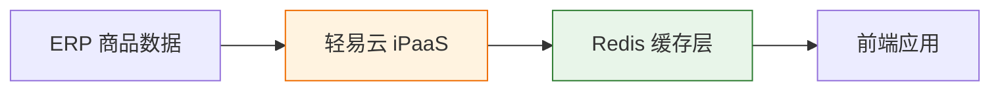

# Redis 集成专题

本文档详细介绍轻易云 iPaaS 平台与 Redis 内存数据库的集成配置方法，涵盖连接器配置、连接参数、数据操作模式以及常见应用场景。

---

## 概述

Redis 是全球领先的开源内存数据结构存储系统，支持字符串、哈希、列表、集合等多种数据结构，广泛应用于缓存加速、会话管理、消息队列、实时排行榜等场景。轻易云 iPaaS 提供专用的 Redis 连接器，支持以下核心能力：

- **数据读取**：支持按 Key 读取、模式匹配批量查询
- **数据写入**：支持单条和批量写入，支持设置过期时间
- **数据结构操作**：支持 String、Hash、List、Set、Sorted Set 等数据类型
- **Pub/Sub 消息**：支持发布/订阅模式的消息通信
- **集群支持**：兼容 Redis Cluster 和 Redis Sentinel 架构

### 适用版本

| Redis 版本 | 支持状态 | 说明 |
|-----------|----------|------|
| Redis 5.x | ✅ 支持 | 基础功能完全支持 |
| Redis 6.x | ✅ 推荐 | 支持 ACL 和 TLS |
| Redis 7.x | ✅ 推荐 | 最新特性，性能最佳 |

---

## 连接器配置

### 创建连接器

1. 登录轻易云 iPaaS 控制台，进入**连接器管理**页面
2. 点击**新建连接器**，选择**数据库**分类下的 **Redis**
3. 填写连接参数（详见下方参数说明）
4. 点击**测试连接**验证连通性
5. 连接成功后点击**保存**

### 连接参数说明

| 参数名 | 类型 | 必填 | 说明 |
|--------|------|------|------|
| `host` | string | ✅ | Redis 服务器地址 |
| `port` | number | ✅ | Redis 服务端口，默认为 `6379` |
| `password` | string | — | 连接密码（如设置了 `requirepass`） |
| `database` | number | — | 数据库编号，默认为 `0`（取值 0~15） |
| `use_ssl` | boolean | — | 是否使用 SSL/TLS 加密连接 |
| `connection_timeout` | number | — | 连接超时时间，单位毫秒，默认 `5000` |

#### 连接字符串示例

```json
{
  "host": "redis.example.com",
  "port": 6379,
  "password": "your_secure_password",
  "database": 0,
  "use_ssl": false,
  "connection_timeout": 5000
}
```

> [!TIP]
> 生产环境建议启用 SSL/TLS 加密连接，并通过内网或专线访问 Redis 服务，避免公网暴露。

---

## 典型应用场景

### 缓存同步

将 ERP/CRM 等系统的热点数据同步至 Redis，加速业务系统查询响应：



### 消息中间件

利用 Redis 的 Pub/Sub 或 Stream 功能，实现系统间的实时消息通知：

| 模式 | 适用场景 | 说明 |
|------|----------|------|
| Pub/Sub | 实时通知、事件广播 | 消息不持久化，适合在线订阅者 |
| Stream | 可靠消息队列 | 消息持久化，支持消费者组 |
| List | 简单队列 | LPUSH/RPOP 实现先进先出 |

---

## 常见问题

### Q: 连接测试失败，提示 "NOAUTH Authentication required"？

确认连接器配置中填写了正确的 `password`。如果 Redis 未设置密码，可留空。

### Q: 如何处理大 Key 写入？

建议将超过 1 MB 的大 Value 拆分为多个小 Key 存储，避免单次操作阻塞 Redis 主线程。

### Q: 是否支持 Redis Cluster？

支持。配置连接器时填写 Cluster 中任一节点的地址，连接器将自动发现集群拓扑。

---

## 相关资源

- [数据库类连接器概览](./README) — 查看所有支持的数据库连接器
- [配置连接器](../../guide/configure-connector) — 连接器基础配置指南
- [MySQL 集成](./mysql) — 关系型数据库集成指南

---

> [!NOTE]
> 本文档持续更新中，如有疑问请联系轻易云技术支持团队。
