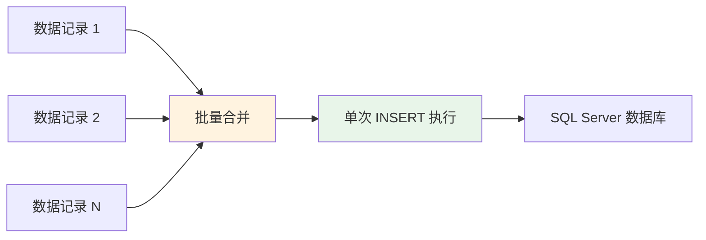
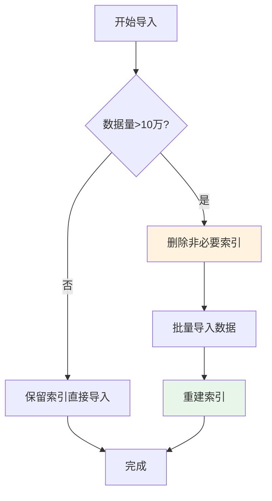

# SQL Server 集成专题

本文档详细介绍轻易云 iPaaS 平台与 SQL Server 数据库的集成配置方法，涵盖驱动安装、连接器配置、权限要求、分页查询配置以及性能优化建议。SQL Server 是微软推出的企业级关系型数据库管理系统，广泛应用于 Windows 生态的企业应用系统。

---

## 概述

SQL Server 是微软开发的企业级关系型数据库管理系统，与 Windows 操作系统和 .NET 技术栈深度集成，提供强大的事务处理、商业智能和数据分析能力。轻易云 iPaaS 提供专用的 SQL Server 连接器，支持以下核心能力：

- **数据抽取**：支持全量抽取和增量 CDC（Change Data Capture，变更数据捕获）抽取
- **数据写入**：支持单条写入和批量写入，适配高并发场景
- **SQL 查询**：支持自定义 SQL 查询和存储过程调用
- **事务支持**：保证数据一致性和完整性
- **实时同步**：基于 SQL Server CDC 或 Change Tracking 实现近实时的数据变更捕获

### 适用版本

| SQL Server 版本 | 支持状态 | 说明 |
|-----------------|----------|------|
| SQL Server 2008 | ⚠️ 兼容 | 需安装 ODBC 13 驱动和兼容库，参考 [低版本驱动扩展安装](#低版本驱动扩展安装) |
| SQL Server 2012 | ✅ 支持 | 完整支持，Offset-Fetch 分页语法可用 |
| SQL Server 2014 | ✅ 支持 | 完整支持 |
| SQL Server 2016 | ✅ 推荐 | 支持 JSON 数据类型，性能优化 |
| SQL Server 2017 | ✅ 推荐 | 跨平台支持，Linux 版本可用 |
| SQL Server 2019 | ✅ 推荐 | 最新长期支持版本，大数据集群支持 |
| SQL Server 2022 | ✅ 支持 | 最新版本，智能查询处理增强 |

> [!NOTE]
> SQL Server 2008/2012 等低版本（2012-）需要额外安装 ODBC 13 驱动和 OpenSSL 1.0 兼容库，详见下文 [低版本驱动扩展安装](#低版本驱动扩展安装) 章节。

---

## 驱动安装说明

### PHP 环境安装 SQL Server 扩展

在私有化部署环境中，需要安装 Microsoft ODBC 驱动和 PHP pdo_sqlsrv 扩展以支持 SQL Server 连接。

#### 1. 添加 Microsoft 软件源

```bash
# 添加 Microsoft 官方软件源（以 RHEL/CentOS 8 为例）
curl https://packages.microsoft.com/config/rhel/8/prod.repo > /etc/yum.repos.d/mssqlrelease.repo
```

> [!TIP]
> 如果上述链接失效，可访问 [Microsoft 官方软件包仓库](https://packages.microsoft.com/config/rhel/) 查找对应系统的配置。

#### 2. 安装 ODBC 驱动和工具

```bash
# 安装 Microsoft ODBC Driver for SQL Server
sudo yum install msodbcsql

# 安装 mssql-tools（可选，包含 sqlcmd 命令行工具）
sudo yum install mssql-tools

# 安装 unixODBC 开发库（编译 PHP 扩展必需）
sudo yum install unixODBC-devel
```

#### 3. 安装 PHP pdo_sqlsrv 扩展

```bash
# 下载 pdo_sqlsrv 扩展包
wget https://pecl.php.net/get/pdo_sqlsrv-5.8.1.tgz

# 解压并进入目录
tar -zxvf pdo_sqlsrv-5.8.1.tgz
cd pdo_sqlsrv-5.8.1

# 使用对应 PHP 版本的 phpize（示例为宝塔环境 PHP 7.4）
/www/server/php/74/bin/phpize

# 配置编译选项
./configure --with-php-config=/www/server/php/74/bin/php-config

# 编译并安装
make && make install
```

#### 4. 启用 PHP 扩展

```bash
# 添加到 php.ini
echo "extension = pdo_sqlsrv.so" >> /www/server/php/74/etc/php.ini

# 重启 PHP-FPM 服务
/etc/init.d/php-fpm-74 reload

# 验证安装
/www/server/php/74/bin/php -m | grep -i sqlsrv
```

#### 5. 配置 SSL/TLS 版本（低版本兼容性）

对于需要连接 SQL Server 2008/2012 等低版本的场景，可能需要调整 SSL 最低版本：

```bash
# 编辑 OpenSSL 配置
vim /etc/crypto-policies/back-ends/opensslcnf.config

# 修改 SSL 最低版本为 TLSv1.0
MinProtocol = TLSv1.0
```

---

## 低版本驱动扩展安装

对于需要连接 SQL Server 2008/2012 等低版本数据库的场景，需要安装 ODBC 13 驱动和 OpenSSL 1.0 兼容库。详细步骤请参考 [安装部署指南](../../quick-start/installation#sql-server-低版本扩展安装)。

### 简要步骤

#### 1. 获取 ODBC 13 驱动文件

从已部署的环境中复制 `/opt/microsoft/msodbcsql` 目录到新服务器。

#### 2. 检查依赖

```bash
ldd /opt/microsoft/msodbcsql/lib64/libmsodbcsql-13.1.so.9.2 | grep "not found"
```

#### 3. 安装 OpenSSL 1.0 兼容库

```bash
# 下载并编译 OpenSSL 1.0.2u
tar -xzf openssl-1.0.2u.tar.gz
cd openssl-1.0.2u
./config --prefix=/opt/openssl --openssldir=/opt/openssl shared
make
sudo make install
```

#### 4. 创建符号链接

```bash
sudo ln -sf /opt/openssl/lib/libssl.so.1.0.0 /lib/x86_64-linux-gnu/libssl.so.10
sudo ln -sf /opt/openssl/lib/libcrypto.so.1.0.0 /lib/x86_64-linux-gnu/libcrypto.so.10
sudo ln -sf /opt/openssl/lib/libssl.so.1.0.0 /lib/x86_64-linux-gnu/libssl.so.1.0.0
sudo ln -sf /opt/openssl/lib/libcrypto.so.1.0.0 /lib/x86_64-linux-gnu/libcrypto.so.1.0.0
```

#### 5. 更新库缓存并测试

```bash
sudo ldconfig
export LD_LIBRARY_PATH=/opt/openssl/lib:$LD_LIBRARY_PATH

# 测试连接
isql -v SQLServer13 用户名 密码
```

> [!NOTE]
> SQL Server 2016 及以上版本无需此步骤，系统自带的 ODBC 17/18 即可正常连接。

---

## 连接器配置

### 创建连接器

1. 登录轻易云 iPaaS 控制台，进入**连接器管理**页面
2. 点击**新建连接器**，选择**数据库**分类下的 **SQL Server**
3. 填写连接参数（详见下方参数说明）
4. 点击**测试连接**验证连通性
5. 连接成功后点击**保存**

### 连接参数说明

#### 基础连接参数

| 参数名 | 类型 | 必填 | 说明 |
|--------|------|------|------|
| `host` | string | ✅ | SQL Server 服务器地址，如 `localhost` 或 `sqlserver.example.com` |
| `port` | number | ✅ | SQL Server 服务端口，默认为 `1433` |
| `database` | string | ✅ | 数据库名称 |
| `username` | string | ✅ | 连接用户名 |
| `password` | string | ✅ | 连接密码 |

#### 高级连接参数

| 参数名 | 类型 | 必填 | 默认值 | 说明 |
|--------|------|------|--------|------|
| `charset` | string | — | `UTF-8` | 字符集编码，建议使用 `UTF-8` |
| `connection_timeout` | number | — | `30000` | 连接超时时间，单位毫秒 |
| `read_timeout` | number | — | `60000` | 读取超时时间，单位毫秒 |
| `write_timeout` | number | — | `60000` | 写入超时时间，单位毫秒 |
| `pool_size` | number | — | `10` | 连接池大小 |
| `use_ssl` | boolean | — | `false` | 是否使用 SSL 加密连接 |
| `trust_server_certificate` | boolean | — | `false` | 是否信任服务器证书（测试环境可用） |

#### 连接字符串示例

```json
{
  "host": "sqlserver.example.com",
  "port": 1433,
  "database": "easypaas_db",
  "username": "easypaas_user",
  "password": "your_secure_password",
  "charset": "UTF-8",
  "connection_timeout": 30000,
  "read_timeout": 60000,
  "pool_size": 10
}
```

> [!TIP]
> 生产环境建议启用 SSL 加密连接，确保数据传输安全。如需使用 Windows 身份验证，请联系技术支持获取专用配置方式。

---

## 权限配置

### 最小权限原则

为保障数据库安全，建议创建专用账号并授予最小必要权限。

### 基础读写权限

如需仅进行数据查询和写入操作，执行以下 SQL 授权：

```sql
-- 创建登录名
CREATE LOGIN easypaas_user WITH PASSWORD = 'your_secure_password';

-- 创建数据库用户
USE your_database;
CREATE USER easypaas_user FOR LOGIN easypaas_user;

-- 授予基础读写权限
GRANT SELECT, INSERT, UPDATE, DELETE ON SCHEMA::dbo TO easypaas_user;

-- 或授予特定表的权限
GRANT SELECT, INSERT, UPDATE, DELETE ON dbo.table_name TO easypaas_user;
```

### CDC 实时同步权限

如需使用 CDC（Change Data Capture）实时同步功能，需额外授予以下权限：

```sql
-- 授予 CDC 相关权限
GRANT VIEW DATABASE STATE TO easypaas_user;

-- 添加用户到 db_owner 角色（CDC 必需）
EXEC sp_addrolemember 'db_owner', 'easypaas_user';

-- 或仅授予 db_datareader 和 CDC 特定权限
EXEC sp_addrolemember 'db_datareader', 'easypaas_user';
GRANT SELECT ON cdc.lsn_time_mapping TO easypaas_user;
GRANT SELECT ON cdc.change_tables TO easypaas_user;
```

### 权限对照表

| 操作类型 | 所需权限 | 适用场景 |
|----------|----------|----------|
| 数据查询 | `SELECT` | 源数据抽取 |
| 数据插入 | `INSERT` | 目标数据写入 |
| 数据更新 | `UPDATE` | 数据同步更新 |
| 数据删除 | `DELETE` | 数据清理 |
| 结构查询 | `VIEW DEFINITION` | 元数据获取 |
| CDC 同步 | `db_owner` 或特定 CDC 权限 | 变更数据捕获 |

> [!WARNING]
> 请勿使用 `sa` 或 `sysadmin` 超级管理员账号配置连接器。建议创建专用账号并限制访问来源 IP。

---

## SQL 查询语句配置

### 字符集说明

> [!WARNING]
> 目前 SQL Server 适配器未对 GB2312 编码进行自动转码处理。如果 SQL Server 数据库使用了非 UTF-8 字符集（如 GB2312、GBK），可能会出现中文乱码问题。建议在数据库连接时统一使用 UTF-8 字符集，或在查询前进行字符集转换。

### 分页查询配置

SQL Server 不同版本支持不同的分页语法，轻易云适配器会根据版本自动处理分页参数。

#### SQL Server 2012 及以上分页（推荐）

在 SQL Server 2012 及以上版本中，TSQL 在 `ORDER BY` 子句中新增 `OFFSET-FETCH` 子句，用于从有序的结果集中跳过一定数量的数据行，获取指定数量的数据行，实现数据分页。

**语法：**

```sql
SELECT * FROM table_name 
ORDER BY id 
OFFSET 0 ROWS FETCH NEXT 100 ROWS ONLY;
```

**优点：**
- 语法简洁直观
- 性能优于传统的 `ROW_NUMBER()` 方式
- 逻辑读取数量和响应时间更优

**轻易云配置示例：**

轻易云适配器会自动处理分页参数，你只需在集成方案中配置分页大小即可：

```json
{
  "pagination": {
    "enabled": true,
    "page_size": 100,
    "offset_field": "id",
    "sort_direction": "ASC"
  }
}
```

#### SQL Server 2012 以下分页（传统方式）

对于 SQL Server 2008/2008 R2 等低版本，需要使用传统的 `ROW_NUMBER()` 窗口函数实现分页：

```sql
-- 使用 ROW_NUMBER() 实现分页
WITH PaginatedData AS (
    SELECT *,
           ROW_NUMBER() OVER (ORDER BY id) AS RowNum
    FROM table_name
)
SELECT *
FROM PaginatedData
WHERE RowNum BETWEEN 1 AND 100;
```

**轻易云适配器处理：**

轻易云适配器会自动检测 SQL Server 版本并选择对应的分页策略：
- **SQL Server 2012+**：使用 `OFFSET-FETCH` 语法
- **SQL Server 2008/2008 R2**：使用 `ROW_NUMBER()` 语法

> [!IMPORTANT]
> 分页查询要求结果集是有序的，因此必须指定 `ORDER BY` 子句。建议在分页字段上建立索引以提升查询性能。

---

## 适配器选择

### 查询适配器

| 适配器 | 用途 | 适用场景 |
|--------|------|----------|
| `SQLServerQueryAdapter` | 标准 SQL 查询 | 常规数据查询 |
| `SQLServerCDCAdapter` | CDC 实时同步 | 增量数据捕获 |

### 写入适配器

| 适配器 | 用途 | 适用场景 |
|--------|------|----------|
| `SQLServerExecuteAdapter` | 单条 SQL 执行 | 逐条写入、更新 |
| `SQLServerBatchExecuteAdapter` | 批量 SQL 执行 | 大数据量批量写入 |

> [!IMPORTANT]
> 大数据量场景强烈推荐使用 `SQLServerBatchExecuteAdapter`，可显著提升写入性能。

---

## 批量写入适配器

### 概述

`SQLServerBatchExecuteAdapter` 是专为大数据量写入场景设计的批量执行适配器，通过将多条记录合并为单次 INSERT 语句执行，大幅减少网络往返和数据库开销。

### 工作原理



### 配置参数

#### 写入配置

配置接口信息时，API 请使用：`batchexecute`

#### request 参数配置

需要配置写入数据库的参数，字段需与写入 SQL 语句中的字段顺序和数量保持一致。建议单批次不超过 100 个字段。

#### otherRequest 参数配置

| 参数名 | 类型 | 必填 | 说明 |
|--------|------|------|------|
| `main_sql` | string | ✅ | 具体的 INSERT 语句模板 |
| `limit` | number | ✅ | 单次合并的数据条数，限制 1000 条以内 |

> [!WARNING]
> SQL 语句中的字段顺序必须与 `request` 参数中的字段顺序一致，且数量保持相同。

### 配置示例

#### SQL 模板配置

```sql
INSERT INTO [dbo].[middle_order_prdmq] 
  ([order_code], [FBillNo], [FStatus], [create_time], [update_time], 
   [FMATERIALID_FNumber], [FPlanStartDate], [FPlanFinishDate]) 
VALUES
```

#### 请求示例

```json
{
  "sql": {
    "main_sql": "INSERT INTO [dbo].[middle_order_prdmq] ([order_code], [FBillNo], [FStatus], [create_time], [update_time], [FMATERIALID_FNumber], [FPlanStartDate], [FPlanFinishDate]) VALUES"
  },
  "params": {
    "main_params": [
      {
        "order_code": "FCN202403185879",
        "FBillNo": "MO022077",
        "FStatus": "4",
        "create_time": "2024-03-18 16:21:29",
        "update_time": "2024-03-19 10:31:04",
        "FMATERIALID_FNumber": "1001060050",
        "FPlanStartDate": "2024-03-18 09:12:46",
        "FPlanFinishDate": "2024-03-20 09:12:46"
      }
    ]
  }
}
```

### 最佳实践

1. **合理设置批量大小**：建议 `limit` 设置在 100~1000 之间，根据记录大小和网络延迟调整
2. **字段数量控制**：单批次字段数量建议不超过 100 个，避免 SQL 过长
3. **错误处理**：批量写入时单条记录错误会导致整批失败，建议开启错误记录和重试机制
4. **主键处理**：确保写入数据的主键唯一性，避免主键冲突导致写入失败

---

## 性能优化

### 读取优化

#### 1. 分页查询

对于大表查询，使用分页避免一次性加载过多数据：

```sql
-- SQL Server 2012+ 分页语法
SELECT * FROM large_table 
WHERE update_time > '2024-01-01'
ORDER BY id 
OFFSET 0 ROWS FETCH NEXT 1000 ROWS ONLY;

-- SQL Server 2008/2008 R2 分页语法
WITH PaginatedData AS (
    SELECT *, ROW_NUMBER() OVER (ORDER BY id) AS RowNum
    FROM large_table
    WHERE update_time > '2024-01-01'
)
SELECT * FROM PaginatedData
WHERE RowNum BETWEEN 1 AND 1000;
```

#### 2. 增量抽取

使用 CDC 模式或时间戳字段实现增量抽取：

```sql
-- 基于时间戳的增量查询
SELECT * FROM orders 
WHERE last_modified > '${last_sync_time}';

-- 基于 CDC 的增量查询
SELECT * FROM cdc.dbo_orders_CT
WHERE __$start_lsn > sys.fn_cdc_get_min_lsn('dbo_orders');
```

#### 3. 索引优化

确保查询条件字段已建立索引：

```sql
-- 检查索引
EXEC sp_helpindex 'your_table';

-- 为常用查询字段添加索引
CREATE INDEX idx_orders_update_time ON orders(update_time);
```

### 写入优化

#### 1. 批量写入参数调优

| 参数 | 建议值 | 说明 |
|------|--------|------|
| 批量大小 | 500~1000 | 平衡内存占用和写入效率 |
| 并发线程数 | 3~5 | 根据数据库性能调整 |
| 事务批次 | 每 1000 条提交一次 | 避免事务过大 |

#### 2. 数据库参数优化

```sql
-- 临时调整恢复模式（大数据量导入时）
ALTER DATABASE your_database SET RECOVERY SIMPLE;

-- 禁用触发器和约束（如确认数据无误）
ALTER TABLE your_table DISABLE TRIGGER ALL;
ALTER TABLE your_table NOCHECK CONSTRAINT ALL;

-- 完成后恢复
ALTER DATABASE your_database SET RECOVERY FULL;
ALTER TABLE your_table ENABLE TRIGGER ALL;
ALTER TABLE your_table CHECK CONSTRAINT ALL;
```

> [!CAUTION]
> 禁用触发器和约束需谨慎，仅在确认数据无误时使用，完成后务必恢复。

#### 3. 索引策略

大数据量导入时的索引优化策略：



### 网络优化

| 优化项 | 建议配置 | 效果 |
|--------|----------|------|
| 连接池大小 | 5~20 | 减少连接建立开销 |
| 连接超时 | 30000 ms | 避免网络抖动导致重连 |
| 读取超时 | 60000~300000 ms | 适应大数据量查询 |
| 压缩传输 | 启用 | 减少网络带宽占用 |

---

## CDC 实时同步配置

### 开启 CDC 功能

CDC（Change Data Capture）是 SQL Server 提供的变更数据捕获功能，可记录数据表的增删改操作。

```sql
-- 启用数据库级别的 CDC
EXEC sys.sp_cdc_enable_db;

-- 检查 CDC 是否启用
SELECT name, is_cdc_enabled FROM sys.databases WHERE name = 'your_database';
```

### 启用表级别的 CDC

```sql
-- 为指定表启用 CDC
EXEC sys.sp_cdc_enable_table
    @source_schema = N'dbo',
    @source_name = N'your_table',
    @role_name = NULL;

-- 检查表的 CDC 状态
SELECT name, is_tracked_by_cdc FROM sys.tables WHERE name = 'your_table';
```

### CDC 配置步骤

1. **确认 CDC 已在数据库级别启用**
2. **为目标表启用 CDC**功能
3. **创建 CDC 专用账号**并授予必要权限
4. **在轻易云配置 CDC 适配器**，指定捕获实例和起始 LSN
5. **启动同步任务**，监控延迟和吞吐量

> [!IMPORTANT]
> CDC 模式会在数据库中创建变更表和捕获作业，会占用一定的磁盘和 I/O 资源，请确保服务器资源充足。

---

## 常见问题

### Q: 连接测试失败，提示 "Login failed for user"？

**排查步骤：**

1. 检查用户名和密码是否正确
2. 确认 SQL Server 身份验证模式为 "SQL Server 和 Windows 身份验证模式"
3. 检查用户是否有从远程主机连接的权限
4. 验证用户是否具备所需的数据库权限

```sql
-- 查看用户权限
SELECT * FROM sys.database_permissions WHERE grantee_principal_id = USER_ID('easypaas_user');
```

### Q: 中文显示乱码？

**解决方案：**

1. 确保连接字符集为 `UTF-8`：
   ```json
   { "charset": "UTF-8" }
   ```

2. 检查数据库排序规则：
   ```sql
   -- 查看数据库排序规则
   SELECT name, collation_name FROM sys.databases WHERE name = 'your_database';
   
   -- 查看列排序规则
   SELECT name, collation_name FROM sys.columns WHERE object_id = OBJECT_ID('your_table');
   ```

3. 如使用 GB2312/GBK 排序规则，建议在查询时进行字符集转换或在应用层处理编码。

### Q: 分页查询性能较差？

**优化建议：**

1. 确保分页字段已建立索引
2. 对于大数据量分页，考虑使用键集分页（Keyset Pagination）替代 OFFSET
3. 优化 `ORDER BY` 字段的索引覆盖

```sql
-- 键集分页示例（性能更优）
SELECT * FROM orders
WHERE id > @last_seen_id
ORDER BY id
OFFSET 0 ROWS FETCH NEXT 100 ROWS ONLY;
```

### Q: 批量写入时提示 "Violation of PRIMARY KEY constraint"？

**解决策略：**

| 策略 | SQL 示例 | 适用场景 |
|------|----------|----------|
| 忽略重复 | `INSERT INTO ... WITH (IGNORE_DUP_KEY = ON)` | 允许部分数据丢失 |
| 合并更新 | `MERGE INTO ... USING ... ON ... WHEN MATCHED THEN UPDATE ... WHEN NOT MATCHED THEN INSERT` | 数据同步 |

```sql
-- 使用 MERGE 语句实现 UPSERT
MERGE INTO target_table AS t
USING (SELECT * FROM source_table) AS s
ON t.id = s.id
WHEN MATCHED THEN
    UPDATE SET t.name = s.name, t.update_time = GETDATE()
WHEN NOT MATCHED THEN
    INSERT (id, name, create_time) VALUES (s.id, s.name, GETDATE());
```

### Q: 连接 SQL Server 2008/2012 时提示 SSL/TLS 错误？

**原因与解决：**

- **原因**：新版本 ODBC 驱动默认使用 TLS 1.2，与低版本 SQL Server 不兼容
- **解决**：按照 [低版本驱动扩展安装](#低版本驱动扩展安装) 章节安装 ODBC 13 驱动和 OpenSSL 1.0 兼容库

---

## 相关资源

- [数据库类连接器概览](./README) — 查看所有支持的数据库连接器
- [配置连接器](../../guide/configure-connector) — 连接器基础配置指南
- [CDC 实时同步](../../advanced/cdc-realtime) — CDC 配置与最佳实践
- [数据映射](../../guide/data-mapping) — 字段映射配置方法
- [MySQL 集成](./mysql) — MySQL 数据库集成指南
- [Oracle 集成](./oracle) — Oracle 数据库集成指南

---

> [!NOTE]
> 本文档持续更新中，如有疑问请联系轻易云技术支持团队。
