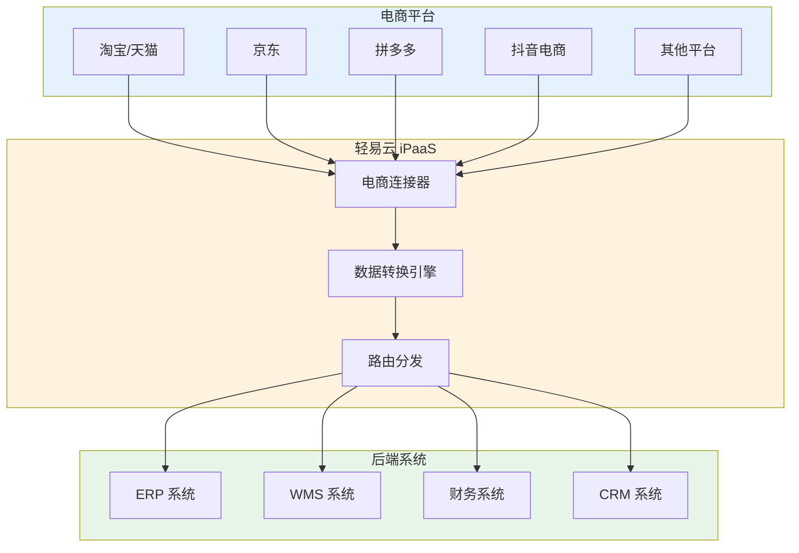
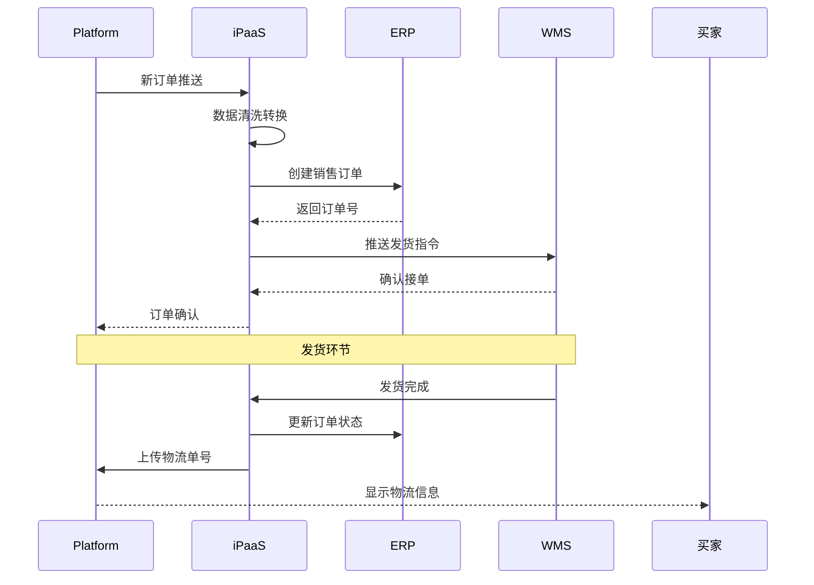
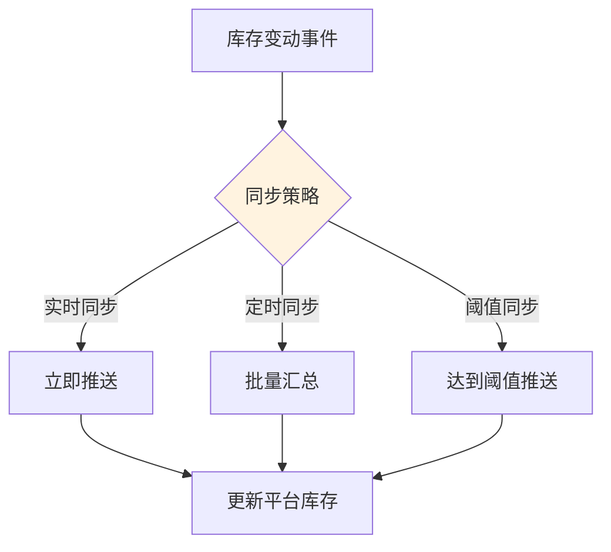
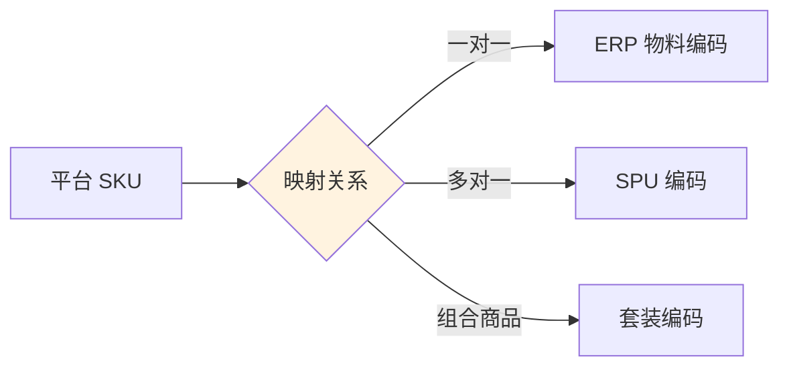
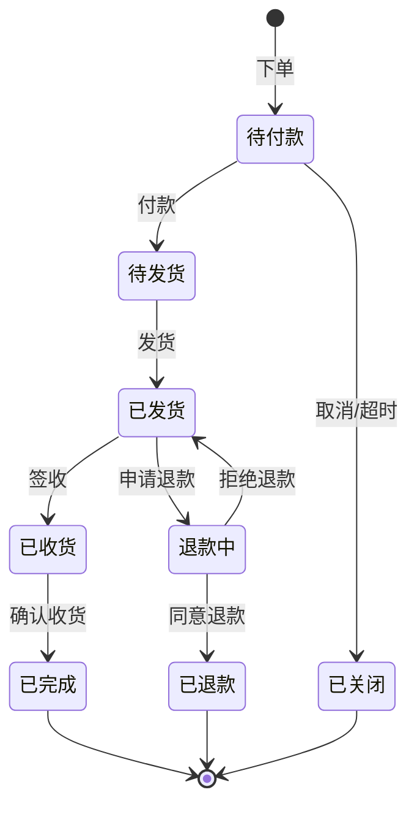
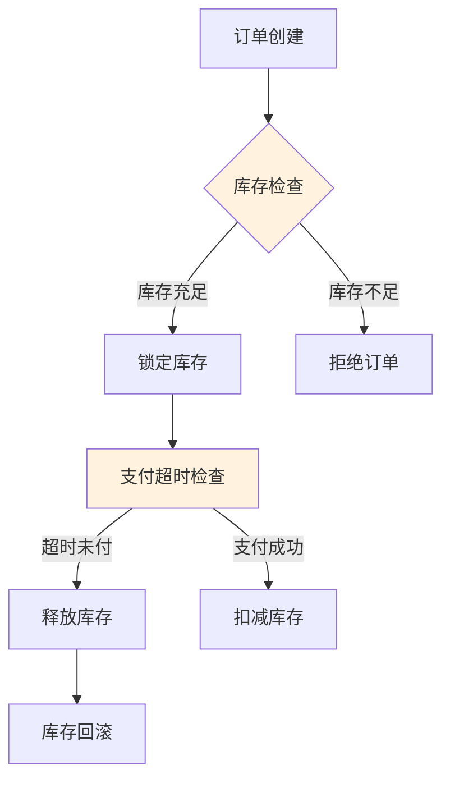
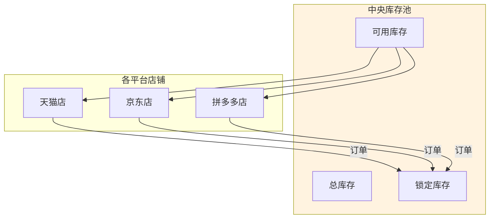

# 电商 / WMS 类连接器概览

轻易云 iPaaS 平台提供全面的电商和仓储管理系统（WMS）连接器，支持主流电商平台、ERP 电商模块以及专业 WMS 系统，帮助企业实现订单、库存、物流数据的实时同步和高效管理。

## 电商连接器介绍

电商连接器是连接企业业务系统与电商平台、WMS 系统的桥梁，实现以下核心能力：

- **订单同步**：电商平台订单自动下载到 ERP / 业务系统
- **库存同步**：实时库存数据推送到电商平台，防止超卖
- **物流回传**：发货信息自动回传到电商平台
- **售后处理**：退款、退货信息的自动同步
- **商品管理**：商品信息、价格、库存的批量管理



## 支持的电商平台列表

### 综合电商平台

| 平台名称 | 连接器标识 | 主要功能 | 支持模式 |
|---------|-----------|---------|---------|
| [旺店通](./ecommerce/wangdian) | `wangdian` | 订单、库存、商品 | 主流通用 |
| [聚水潭](./ecommerce/jushuitan) | `jushuitan` | 订单、库存、采购 | 电商 ERP |
| [管易云](./ecommerce/guanyi) | `guanyi` | 订单、仓储、财务 | 金蝶生态 |
| [网店管家](./ecommerce/wangdianguanjia) | `wangdianguanjia` | 订单、库存、售后 | 老牌电商 ERP |
| [网店精灵](./ecommerce/wangdianjingling) | `wangdianjingling` | 订单处理、批量操作 | 店铺管理工具 |

### 垂直领域平台

| 平台名称 | 连接器标识 | 主要功能 | 适用场景 |
|---------|-----------|---------|---------|
| [万里牛](./ecommerce/maliniu) | `maliniu` | 订单、库存、分销 | 多平台店铺 |
| [快麦](./ecommerce/kuaimai) | `kuaimai` | 订单、仓储、数据 | 光云科技 |
| [班牛](./ecommerce/banniu) | `banniu` | 客服工单、售后 | 客服协同 |
| [易仓](./ecommerce/ecang) | `ecang` | 跨境 ERP | 跨境电商 |

### 平台官方接口

| 平台名称 | 连接器标识 | 主要功能 | 接入方式 |
|---------|-----------|---------|---------|
| 淘宝/天猫 | `taobao` | 订单、商品、物流 | TOP 接口 |
| 京东 | `jd` | 订单、库存、售后 | 宙斯接口 |
| 拼多多 | `pdd` | 订单、物流、售后 | 开放平台 |
| 抖音电商 | `douyin` | 订单、商品、物流 | 抖店接口 |
| 快手电商 | `kuaishou` | 订单、商品、物流 | 开放平台 |

## 订单库存同步说明

### 订单同步流程



### 库存同步策略



#### 同步策略对比

| 策略 | 实时性 | 系统压力 | 适用场景 |
|------|--------|---------|---------|
| 实时同步 | 最高 | 高 | 高并发、爆款商品 |
| 定时同步 | 一般 | 低 | 常规商品、多店铺 |
| 阈值同步 | 较高 | 中 | 库存预警、安全库存 |

#### 库存同步公式

```text
可售库存 = 实际库存 - 锁定库存 - 安全库存
         = 可用库存 - 平台在途订单
```

### 数据映射规范

#### 订单字段映射

| 电商平台字段 | 标准字段 | ERP 字段 | 说明 |
|------------|---------|---------|------|
| `tid` | `orderNo` | `FBillNo` | 订单编号 |
| `buyer_nick` | `buyerName` | `FCustName` | 买家昵称 |
| `payment` | `paymentAmount` | `FAmount` | 实付金额 |
| `created` | `orderTime` | `FDate` | 下单时间 |
| `receiver_name` | `receiverName` | `FReceiveName` | 收货人 |
| `receiver_mobile` | `receiverPhone` | `FPhone` | 联系电话 |

#### 商品映射



## 通用配置说明

### 连接配置参数

| 参数名 | 类型 | 必填 | 说明 |
|-------|------|------|------|
| `app_key` | string | ✅ | 应用标识 |
| `app_secret` | string | ✅ | 应用密钥 |
| `shop_id` | string | ✅ | 店铺 ID |
| `platform` | string | ✅ | 平台类型 |
| `session` | string | — | 授权令牌 |
| `environment` | string | — | 环境（prod/sandbox）|

### 适配器选择

| 适配器名称 | 用途 | 适用场景 |
|-----------|------|---------|
| `EcommerceQueryAdapter` | 订单查询 | 拉取平台订单 |
| `EcommerceExecuteAdapter` | 订单操作 | 确认、取消订单 |
| `InventorySyncAdapter` | 库存同步 | 推送库存数据 |
| `LogisticsAdapter` | 物流回传 | 上传物流信息 |

### 分页配置

```json
{
  "pagination": {
    "pageSize": 100,
    "startTime": "{{LAST_SYNC_TIME}}",
    "endTime": "{{CURRENT_TIME}}",
    "status": "WAIT_SELLER_SEND_GOODS"
  }
}
```

## 最佳实践

### 1. 订单状态管理



### 2. 库存防超卖机制



### 3. 异常处理策略

| 异常类型 | 处理策略 | 重试机制 |
|---------|---------|---------|
| 接口限流 | 指数退避 | 3 次 |
| 网络超时 | 立即重试 | 5 次 |
| 数据异常 | 记录日志 | 人工介入 |
| 授权失效 | 刷新令牌 | 自动刷新 |

## 常见问题

### Q: 如何处理平台接口限流？

建议采用以下策略：
1. 合理设置同步频率，避免频繁调用
2. 实现请求队列，平滑处理突发流量
3. 配置指数退避重试机制

```python
# 伪代码示例
def request_with_retry(api, params, max_retries=3):
    for i in range(max_retries):
        try:
            return call_api(api, params)
        except RateLimitError:
            time.sleep(2 ** i)  # 指数退避
    raise MaxRetryExceeded()
```

### Q: 多店铺如何统一管理库存？

建议使用中央库存池模式：



## 相关文档

- [旺店通连接器](./ecommerce/wangdian)
- [聚水潭连接器](./ecommerce/jushuitan)
- [管易云连接器](./ecommerce/guanyi)
- [订单集成方案](../standard-schemes/order-integration)
- [库存同步方案](../standard-schemes/inventory-sync)

> [!NOTE]
> 电商平台的接口会定期更新，请及时关注平台公告和轻易云更新日志。
