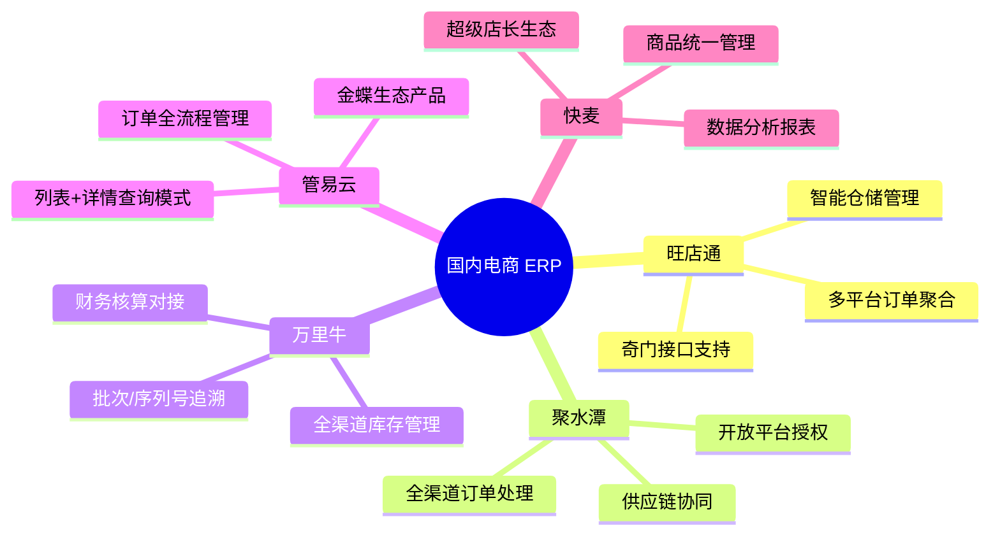
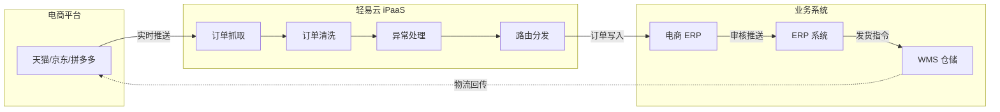
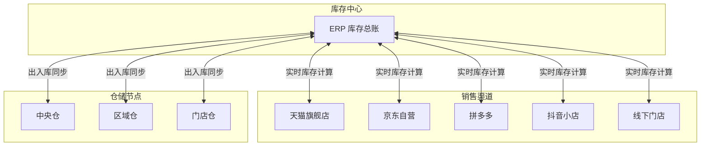
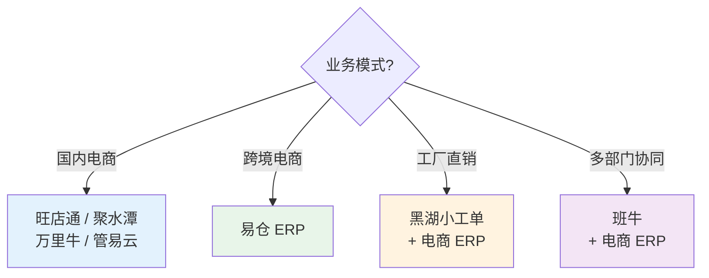

# 电商 / WMS 类连接器

本文档汇总轻易云 iPaaS 支持的电商平台与仓储管理系统（WMS）连接器，帮助企业实现电商业务全流程自动化。涵盖订单管理、库存同步、物流跟踪、售后处理等核心场景的系统集成方案。

> [!TIP]
> 如需了解连接器的基础使用方法，请先阅读 [配置连接器](../../guide/configure-connector)。

---

## 连接器总览

轻易云 iPaaS 目前支持 **10+** 款电商与 WMS 系统连接器，覆盖国内主流电商 ERP 及仓储管理平台。

| 类型 | 连接器 | 定位 | 核心功能 | 状态 |
|------|--------|------|----------|------|
| **电商 ERP** | [旺店通](./wangdian) | 电商 ERP / WMS | 订单管理、仓储管理、多渠道销售 | ✅ 稳定 |
| | [聚水潭](./jushuitan) | 电商 ERP | 订单处理、库存管理、供应链协同 | ✅ 稳定 |
| | [万里牛](./maliniu) | 电商 ERP | 全渠道订单、库存管理、财务核算 | ✅ 稳定 |
| | [管易云](./guanyi) | 电商 ERP | 订单管理、仓储物流、会员营销 | ✅ 稳定 |
| | [快麦](./kuaimai) | 电商 ERP | 订单处理、商品管理、数据报表 | ✅ 稳定 |
| | [网店管家](./wangdianguanjia) | 电商 ERP | 多平台订单聚合、库存同步 | ✅ 稳定 |
| | [网店精灵](./wangdianjingling) | 店铺管理 | 店铺运营、商品上下架、数据分析 | ✅ 稳定 |
| **跨境 ERP** | [易仓](./yicang) | 跨境 ERP / WMS | 跨境订单、海外仓、物流追踪 | ✅ 稳定 |
| **工单系统** | [黑湖小工单](./heihexiaogongdan) | 生产工单管理 | 工单派发、进度跟踪、生产协同 | 🆕 新增 |
| **协同平台** | [班牛](./banniu) | 电商协同平台 | 工作流管理、跨部门协作、数据分析 | 🆕 NEW |

---

## 按类型分类

### 国内电商 ERP

国内电商 ERP 连接器专注于解决国内电商平台（淘宝、天猫、京东、拼多多等）的订单、库存、物流等业务场景的集成需求。

#### 国内电商 ERP 选型指南

| 企业规模 | 推荐产品 | 核心特点 |
|----------|----------|----------|
| 大型电商企业（日单量 > 10 万） | 旺店通企业版 / 旗舰版 | 高并发处理、多仓协同 |
| 中大型电商（日单量 1-10 万） | 聚水潭 / 旺店通 | 全渠道能力、供应链协同 |
| 成长型电商（日单量 1000-1 万） | 万里牛 / 管易云 | 性价比高、对接金蝶生态 |
| 小型电商（日单量 < 1000） | 快麦 / 网店精灵 | 轻量级、易上手 |

> [!NOTE]
> 旺店通敏感数据（如销售出库、销售退货）需通过奇门自定义应用获取，请参考 [旺店通连接器文档](./wangdian) 完成应用申请与上线流程。

---

### 跨境电商 ERP

跨境电商 ERP 连接器专注于解决跨境业务的特殊需求，包括多币种结算、海外仓管理、国际物流追踪等。

| 连接器 | 定位 | 核心功能 |
|--------|------|----------|
| [易仓](./yicang) | 跨境 ERP / 海外仓 WMS | 跨境订单管理、海外仓库存、物流渠道对接 |

#### 易仓特色功能

- **多平台订单聚合**：支持 Amazon、eBay、Wish、Shopee、Lazada 等主流跨境电商平台
- **海外仓管理**：对接全球 100+ 海外仓，实现库存实时同步
- **物流渠道对接**：内置 500+ 物流渠道，自动计算运费、打印面单
- **合规申报**：自动生成报关资料、VAT 申报数据

> [!IMPORTANT]
> 易仓连接器需要配置 `service_id` 参数，请在易仓开放平台创建应用后获取。详细配置步骤请参考 [易仓连接器文档](./yicang)。

---

### 工单与协同系统

工单系统与电商协同平台连接器帮助企业实现生产工单管理、跨部门业务协作等场景的系统集成。

#### 黑湖小工单

黑湖小工单是面向制造业的轻量级生产工单管理系统，帮助企业实现生产过程的数字化管理。

| 功能模块 | 说明 |
|----------|------|
| 工单派发 | 生产任务一键下发至车间 |
| 进度跟踪 | 实时查看工单执行进度 |
| 生产协同 | 工序间无缝衔接、异常预警 |
| 数据报表 | 产量、效率、质量多维度分析 |

#### 班牛

班牛是电商行业专用的协同工作平台，帮助电商企业实现跨部门、跨系统的业务流程自动化。

| 功能模块 | 说明 |
|----------|------|
| 工作流引擎 | 可视化流程设计、自动化流转 |
| 表单定制 | 灵活的业务表单配置 |
| 数据集成 | 对接 ERP、OMS、WMS 等系统 |
| 业务协同 | 客服、运营、仓储跨部门协作 |

> [!TIP]
> 班牛接口文档需要申请权限后才能访问，请联系班牛管理员获取文档访问权限。

---

## 通用集成场景

电商 / WMS 类系统的集成场景具有高度相似性，以下是轻易云 iPaaS 支持的典型集成场景：

### 1. 订单全流程自动化

实现从电商平台下单到 ERP 发货的全程自动化，消除人工录入环节。

| 业务场景 | 数据流向 | 同步内容 |
|----------|----------|----------|
| 订单下载 | 电商平台 → ERP | 订单主表、商品明细、收货地址 |
| 订单状态同步 | ERP → 电商平台 | 审单状态、发货状态、退款状态 |
| 物流单号回传 | ERP → 电商平台 | 快递公司、运单号、发货时间 |
| 售后单处理 | 电商平台 → ERP | 退款申请、退货入库、换货处理 |

### 2. 库存实时同步

实现多平台库存的实时共享，避免超卖或断货风险。

| 同步策略 | 适用场景 | 延迟 |
|----------|----------|------|
| 实时同步 | 爆款商品、库存紧张 SKU | < 5 秒 |
| 定时同步 | 常规商品、大批量更新 | 5~15 分钟 |
| 阈值预警 | 安全库存监控 | 实时 |

### 3. 商品资料同步

实现商品信息的多平台统一管理，确保商品资料一致性。

| 同步内容 | 说明 |
|----------|------|
| 基础资料 | 商品编码、名称、规格、重量 |
| 价格信息 | 销售价、成本价、活动价 |
| 图文资料 | 主图、详情图、商品描述 |
| 库存信息 | 可用库存、在途库存、预占库存 |

### 4. 财务数据对接

实现电商业务数据向财务系统的自动流转，支持业财一体化。

| 财务场景 | 数据来源 | 目标系统 | 输出结果 |
|----------|----------|----------|----------|
| 销售对账 | 电商平台账单 | 财务 ERP | 应收账款、收入确认 |
| 成本核算 | 采购入库单 | 财务 ERP | 成本结转凭证 |
| 费用分摊 | 物流、平台费用 | 财务 ERP | 费用凭证 |
| 资金对账 | 支付宝/微信支付 | 财务 ERP | 资金流水核对 |

---

## 连接器选择指南

### 根据业务模式选择

### 根据电商平台选择

| 主营平台 | 推荐 ERP | 理由 |
|----------|----------|------|
| 天猫/淘宝 | 旺店通、聚水潭 | 阿里生态深度整合 |
| 京东 | 旺店通、管易云 | 自营入仓对接成熟 |
| 拼多多 | 聚水潭、快麦 | 拼团模式支持好 |
| 抖音/快手 | 旺店通、聚水潭 | 直播电商场景完善 |
| 多平台经营 | 旺店通、聚水潭 | 全渠道能力强 |
| Amazon | 易仓 | FBA 对接完善 |
| 独立站 | 易仓、店小秘 | 海外仓、物流渠道多 |

---

## 快速开始

### 第一步：创建连接器

1. 登录轻易云 iPaaS 控制台
2. 进入 **连接器管理** → **新建连接器**
3. 选择对应的电商平台或 WMS 系统
4. 填写连接参数（AppKey、AppSecret、Token 等）
5. 点击 **测试连接** 验证连通性

> [!TIP]
> 不同平台的授权方式各异，大部分需要通过开放平台创建应用获取授权参数。请参考对应连接器的详细文档获取具体配置步骤。

### 第二步：配置集成方案

1. 进入 **集成方案** → **新建方案**
2. 选择源平台（电商平台 / ERP / WMS）
3. 选择目标平台（ERP / WMS / 财务系统）
4. 配置数据映射与转换规则
5. 设置调度策略（实时 / 定时）与异常处理机制

### 第三步：测试与上线

1. 使用 **调试模式** 验证数据流转
2. 检查订单、库存等关键数据的完整性与准确性
3. 配置监控告警（失败通知、数据延迟告警）
4. 切换至生产环境运行

---

## 常见问题

### Q: 旺店通企业版和旗舰版有什么区别？

旺店通企业版面向中大型电商企业，支持多仓管理、奇门接口；旗舰版面向超大型电商，支持更高并发、更复杂的业务场景。连接器配置时需选择对应版本。

### Q: 聚水潭 V1 和 V2 接口如何切换？

聚水潭已全面切换至 V2 接口，新建方案请直接使用 V2 适配器。旧方案迁移时，需在方案配置中修改适配器为 `JstQueryAdapter`（查询）或 `JstExecuteAdapter`（写入）。详细步骤请参考 [聚水潭连接器文档](./jushuitan)。

### Q: 易仓的 `service_id` 如何获取？

登录易仓开放平台，进入 **生态中心** → **应用管理**，在已创建应用的授权状态中点击查看，即可获取 `service_id`。

### Q: 电商 ERP 与财务 ERP 对接需要多长时间？

标准场景（订单、库存、基础资料同步）通常 **1-2 周** 可完成上线。涉及复杂业务（如多仓发货、预售规则、退换货、财务凭证对接）可能需要 **3-4 周**。

### Q: 是否支持同一平台对接多个店铺？

支持。轻易云 iPaaS 支持为同一电商平台创建多个连接器实例，每个实例对应不同的店铺授权，适用于多店铺运营的电商企业。

---

## 相关资源

- [配置连接器](../../guide/configure-connector) — 连接器基础使用指南
- [自定义连接器开发](../../developer/custom-connector) — 开发自定义连接器
- [标准集成方案 — 跨境电商](../../standard-schemes/crossborder) — 跨境业务集成最佳实践
- [标准集成方案 — 国内电商](../../standard-schemes/domestic-ecommerce) — 国内电商集成最佳实践
- [解决方案 — 零售业](../../solutions/retail) — 零售行业集成方案
- [解决方案 — 跨境电商](../../solutions/crossborder-ecommerce) — 跨境业务集成方案

---

> [!NOTE]
> 本文档持续更新中，如有疑问请联系轻易云技术支持团队。
