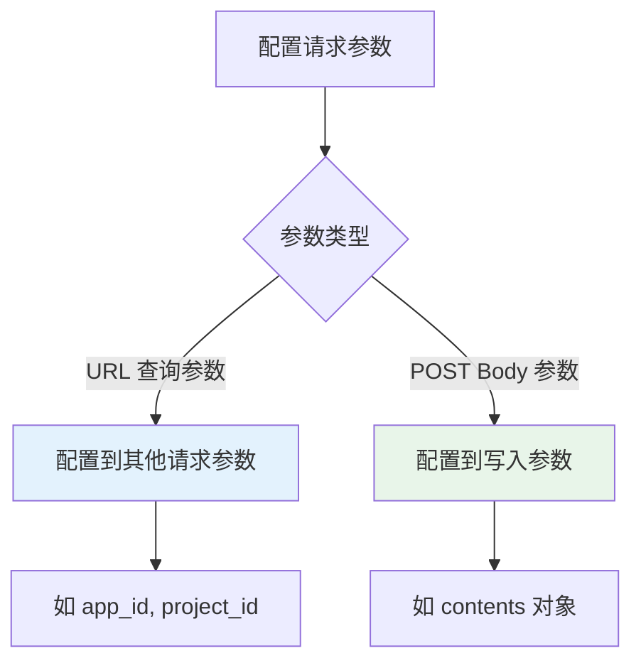

# 班牛连接器

本文档详细介绍轻易云 iPaaS 平台与班牛（Banniu）电商协同平台的集成配置方法。班牛是电商行业专用的协同工作平台，帮助电商企业实现跨部门、跨系统的业务流程自动化，提供工作流引擎、表单定制、数据集成、业务协同等核心功能。

> [!TIP]
> 如需了解连接器的基础使用方法，请先阅读 [配置连接器](../../guide/configure-connector)。

## 概述

班牛是面向电商行业的全域服务履约一体化解决方案提供商，服务了众多世界五百强和新锐高增长品牌，帮助企业实现跨平台多店铺订单的自动获取、售后流程管理、工单协同等核心业务场景。

| 产品定位 | 核心功能 | 适用场景 |
|---------|---------|---------|
| **电商协同平台** | 工作流引擎、表单定制、数据分析 | 跨部门协作、业务流程自动化 |
| **工单管理系统** | 工单派发、进度跟踪、异常处理 | 售后管理、客服协同 |
| **数据集成平台** | 多系统对接、数据同步、接口管理 | ERP、OMS、WMS 系统集成 |

轻易云 iPaaS 提供专用的班牛连接器，支持以下核心能力：

- **工作表数据查询**：支持查询班牛工作表中的业务数据
- **工作流程触发**：支持发起班牛工作流程，实现自动化业务处理
- **数据写入同步**：支持向班牛系统写入业务数据
- **组件化管理**：支持获取工作表组件、灵活配置表单字段

> [!NOTE]
> 班牛接口文档需要申请权限后才能访问，请联系班牛管理员获取文档访问权限。官方接口文档地址：https://banniu.yuque.com/staff-dmhmqa/sg1xhc/agxfxu

## 准备工作

在开始配置连接器之前，需要完成以下准备工作：

### 所需材料清单

| 序号 | 材料 | 说明 | 获取方式 |
|------|------|------|----------|
| 1 | 班牛账号 | 已开通 API 权限的账号 | 客户管理员提供 |
| 2 | 接口访问权限 | 班牛 API 接口文档访问权限 | 联系班牛管理员申请 |
| 3 | 应用标识 | 开放平台应用相关标识 | 班牛开放平台获取 |

### 接口文档访问

班牛平台的接口文档托管在语雀平台，访问地址为：https://banniu.yuque.com/staff-dmhmqa/sg1xhc/agxfxu

> [!IMPORTANT]
> 该文档需要班牛管理员授权后才能访问。如无法打开，请联系客户的班牛管理员申请文档查看权限。

## 连接器配置

### 创建连接器

1. 登录轻易云 iPaaS 控制台，进入 **连接器管理** 页面
2. 点击 **新建连接器**，选择 **电商 / WMS 类** 下的 **班牛**
3. 填写连接参数（详见下方参数说明）
4. 点击 **测试连接** 验证连通性
5. 连接成功后点击 **保存**

### 连接参数说明

| 参数名 | 类型 | 必填 | 说明 |
|--------|------|------|------|
| `host` | string | ✅ | API 主机地址，固定值为 `https://open.bytenew.com/gateway/api/miniAPI` |
| `api` | string | ✅ | 接口方法名，根据业务场景选择对应接口 |
| `method` | string | ✅ | 请求方法，`GET` 或 `POST` |

### API 主机地址配置

在连接器配置的 **主机地址** 一栏输入：

```text
https://open.bytenew.com/gateway/api/miniAPI
```

> [!NOTE]
> 班牛 API 采用统一的网关入口，不同接口通过 `api` 参数区分具体调用的接口方法。

## 方案配置

### 查询类方案配置

#### 步骤 1：选择查询适配器

在方案配置中，源平台适配器选择：

```text
\Adapter\Banniu\BanniuQueryAdapter
```

#### 步骤 2：配置接口参数

在源平台配置中设置以下参数：

| 参数 | 示例值 | 说明 |
|------|--------|------|
| `api` | `4.4.1 工作表列表` | 班牛接口文档中定义的接口名称 |
| `method` | `GET` 或 `POST` | 根据接口文档要求选择 |

#### 步骤 3：配置请求参数

根据所选接口的要求，在 **请求参数** 中配置相应的查询条件。例如查询工作表数据时：

```json
{
  "field": "app_id",
  "label": "应用ID",
  "type": "string",
  "is_required": true,
  "value": "9271"
}
```

### 写入类方案配置

#### 步骤 1：选择写入适配器

在方案配置中，目标平台适配器选择：

```text
\Adapter\Banniu\BanniuExecuteAdapter
```

#### 步骤 2：配置接口参数

在目标平台配置中设置以下参数：

| 参数 | 示例值 | 说明 |
|------|--------|------|
| `api` | `4.4.15 发起流程` | 班牛接口文档中定义的接口名称 |
| `method` | `POST` | 写入操作通常使用 POST 方法 |

#### 步骤 3：配置 POST 请求参数

对于 POST 请求，在 **写入参数** 中配置请求体参数：

```json
{
  "app_id": 9271,
  "project_id": 214996,
  "contents": {
    "2": "110485258",
    "5": "0",
    "7": "2021-09-10 00:00:00"
  }
}
```

> [!TIP]
> 如果 POST 请求需要携带 URL 查询参数（如 `app_id`、`project_id`），请将这类参数配置在 **其他请求参数** 中，而非写入参数内。

### URL 参数与 Body 参数分离配置

当接口需要同时传递 URL 参数和 Body 参数时：

1. **URL 参数**：在 **其他请求参数** 中配置，例如 `app_id`、`project_id`
2. **Body 参数**：在 **写入参数** 中配置，例如 `contents` 对象



## 工作流与工作表接口区分

班牛平台中存在两种主要的业务对象：**工作流程** 和 **工作表**，它们对应不同的接口，配置时请务必区分：

| 业务对象 | 接口类型 | 适用场景 | 接口示例 |
|---------|---------|---------|---------|
| **工作流程** | 工作流程接口 | 需要发起审批流程、触发工作流 | `4.4.15 发起流程` |
| **工作表** | 工作表接口 | 查询表单数据、操作表单记录 | `4.4.2 工作表组件`、`4.4.1 工作表列表` |

> [!WARNING]
> 配置方案前请确认业务需求：如需创建审批流程，请使用工作流程接口；如需查询或操作表单数据，请使用工作表接口。混淆使用会导致接口调用失败。

### 如何识别接口类型

在班牛接口文档中，每个接口都有明确的分类标识：

```text
├── 工作表相关接口
│   ├── 4.4.1 工作表列表
│   ├── 4.4.2 工作表组件
│   └── ...
├── 工作流程相关接口
│   ├── 4.4.15 发起流程
│   └── ...
```

## 工作表组件获取

在创建流程或操作工作表之前，通常需要先获取工作表的组件（字段）定义，以确定 `contents` 中各字段的 ID 和类型。

### 获取组件的步骤

1. 创建查询方案，使用接口 `4.4.2 工作表组件`
2. 配置请求参数：
   - `app_id`：应用 ID
   - `project_id`：工作表 ID
3. 执行查询，获取组件列表

### 组件响应示例

```json
{
  "data": [
    {
      "id": 2,
      "name": "订单编号",
      "type": "input"
    },
    {
      "id": 215033,
      "name": "地址",
      "type": "address"
    }
  ]
}
```

组件 ID 将用于后续流程发起时的 `contents` 字段映射。

## 发起流程接口配置

### 场景说明

发起流程是班牛最常用的写入操作之一，用于在班牛系统中创建新的工作流实例，例如：

- 售后工单提交
- 退款申请审批
- 异常情况上报

### 配置步骤

#### 步骤 1：获取工作表组件

按照上文 **工作表组件获取** 章节，先获取目标工作表的字段组件信息，记录各字段的 ID。

#### 步骤 2：配置发起流程方案

创建新的集成方案：

1. **目标平台适配器**：`\Adapter\Banniu\BanniuExecuteAdapter`
2. **接口方法**：`4.4.15 发起流程`
3. **请求方式**：`POST`

#### 步骤 3：映射表单字段

在数据映射中，将源系统字段映射到班牛 `contents` 对象的对应字段 ID：

```json
{
  "app_id": 9271,
  "project_id": 214996,
  "contents": {
    "2": "{{source.order_no}}",
    "5": "{{source.status}}",
    "7": "{{source.create_time}}",
    "214997": "{{source.remark}}"
  }
}
```

### 特殊字段类型说明

#### 地址组件

地址组件需要传递省、市、区/县三级编码，格式如下：

```json
{
  "215033": "215012,215026,215029"
}
```

其中：
- `215033`：地址组件的字段 ID
- `215012`：一级地址编码（省）
- `215026`：二级地址编码（市）
- `215029`：三级地址编码（区/县）

#### 单选/多选组件

单选组件传递选项 ID：

```json
{
  "215005": "214998"
}
```

多选组件传递多个选项 ID，使用逗号分隔：

```json
{
  "215004": "215002,215003"
}
```

## 常用接口说明

### 查询类接口

| 接口方法 | 说明 | 常用场景 |
|---------|------|---------|
| `4.4.1 工作表列表` | 查询工作表记录列表 | 获取工作表中的业务数据 |
| `4.4.2 工作表组件` | 获取工作表字段定义 | 获取表单字段 ID、类型信息 |
| `4.4.3 工作表详情` | 查询单条记录详情 | 根据 ID 获取完整数据 |

### 写入类接口

| 接口方法 | 说明 | 常用场景 |
|---------|------|---------|
| `4.4.15 发起流程` | 发起工作流程 | 创建审批流程、提交工单 |
| `4.4.16 工作表新增` | 新增工作表记录 | 直接写入表单数据 |
| `4.4.17 工作表更新` | 更新工作表记录 | 修改已有表单数据 |

> [!NOTE]
> 以上为常用接口示例，具体接口名称和版本请以班牛官方接口文档为准。

## 数据映射参考

### 流程发起常用字段

| 班牛字段 | 说明 | 示例值 | 备注 |
|---------|------|--------|------|
| `app_id` | 应用 ID | `9271` | 班牛应用标识 |
| `project_id` | 工作表/流程 ID | `214996` | 目标表单或流程 ID |
| `contents` | 表单内容对象 | `{...}` | 包含各字段值的对象 |
| `contents.{field_id}` | 具体字段值 | 根据字段类型而定 | field_id 为组件 ID |

### 地址组件字段格式

| 级别 | 字段值格式 | 说明 |
|------|-----------|------|
| 一级（省） | `215012` | 省份编码 |
| 二级（市） | `215026` | 城市编码 |
| 三级（区/县） | `215029` | 区县编码 |
| 完整地址 | `215012,215026,215029` | 三级编码逗号拼接 |

## 常见问题

### Q：如何获取班牛的 `app_id` 和 `project_id`？

`app_id` 和 `project_id` 需要在班牛系统后台查看：

1. 登录班牛管理后台
2. 进入 **应用管理** 查看 `app_id`
3. 进入具体工作表/流程的配置页面查看 `project_id`
4. 也可以联系班牛管理员获取这些参数

### Q：班牛接口返回 "权限不足" 怎么办？

1. 确认班牛账号已开通 API 调用权限
2. 检查接口文档访问权限是否已申请
3. 确认调用的接口在账号权限范围内
4. 联系班牛管理员确认授权状态

### Q：如何确认应该使用工作流程接口还是工作表接口？

| 判断条件 | 推荐接口类型 |
|---------|-------------|
| 需要发起审批流程 | 工作流程接口 |
| 需要触发自动化流转 | 工作流程接口 |
| 仅查询/操作表单数据 | 工作表接口 |
| 不涉及审批逻辑的数据写入 | 工作表接口 |

### Q：`contents` 中的字段 ID 如何获取？

使用 `4.4.2 工作表组件` 接口查询工作表的字段定义，响应中会包含各字段的 ID、名称、类型等信息。在班牛后台的表单设计器中也可以查看字段 ID。

### Q：地址组件如何正确传值？

地址组件需要以逗号分隔的形式传递三级地址编码：

```json
{
  "地址字段ID": "省编码,市编码,区县编码"
}
```

例如：`"215033": "215012,215026,215029"`

### Q：班牛接口有调用频率限制吗？

班牛接口存在频率限制，具体限制根据账号类型和接口不同而有所差异。建议：

- 合理设置同步频率，避免触发限流
- 使用轻易云 iPaaS 的队列机制进行流量控制
- 配置完善的失败重试和告警机制

### Q：测试连接成功但查询不到数据？

1. 检查 `app_id` 和 `project_id` 是否正确
2. 确认查询的工作表中确实存在数据
3. 检查查询条件是否过于严格导致无匹配数据
4. 查看班牛后台确认数据权限范围

## 相关资源

- [配置连接器](../../guide/configure-connector) — 连接器基础使用指南
- [电商 / WMS 类连接器概览](./README) — 电商连接器总览
- [新建集成方案](../../guide/create-integration) — 集成方案配置指南
- [数据映射](../../guide/data-mapping) — 数据映射配置详解

---

> [!NOTE]
> 本文档持续更新中，如有疑问请联系轻易云技术支持团队。
