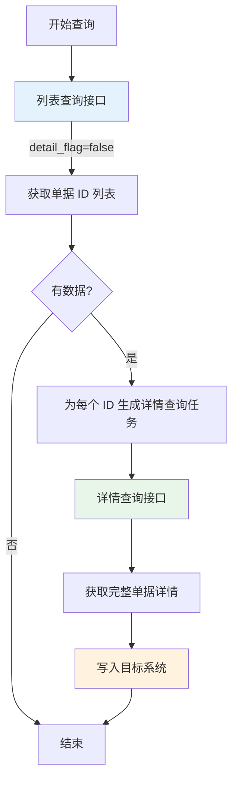
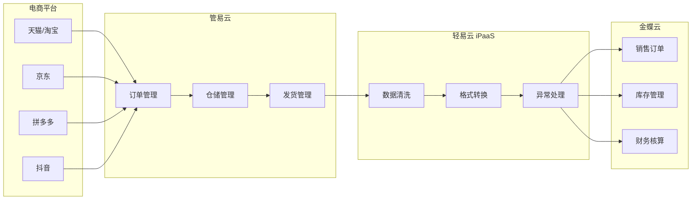

# 管易云连接器

本文档详细介绍轻易云 iPaaS 平台与管易云（GuanYi ERP）的集成配置方法。管易云是金蝶旗下专业的电商 ERP 系统，提供订单管理、仓储物流、会员营销等核心功能，支持与主流电商平台（淘宝、天猫、京东、拼多多、抖音等）无缝对接。

> [!TIP]
> 如需了解连接器的基础使用方法，请先阅读 [配置连接器](../../guide/configure-connector)。

## 概述

管易云 C-ERP 是金蝶集团旗下的电商 ERP 产品，专注于为电商企业提供全渠道订单管理、智能仓储物流、会员营销等一站式解决方案。

| 产品版本 | 定位 | 核心特点 |
|---------|------|---------|
| **C-ERP 标准版** | 中小型电商企业 | 订单处理、库存管理、基础财务核算 |
| **C-ERP 专业版** | 中大型电商企业 | 多仓管理、供应链协同、奇门接口支持 |
| **C-ERP 旗舰版** | 大型电商集团 | 全渠道管理、高并发处理、智能决策分析 |

轻易云 iPaaS 提供专用的管易云连接器，支持以下核心能力：

- **订单数据同步**：销售订单、发货单、退货单的自动抓取与同步
- **库存实时同步**：多平台库存共享，避免超卖风险
- **基础资料管理**：商品、仓库、物流等主数据同步
- **奇门接口支持**：通过阿里奇门平台获取淘系订单数据
- **列表+详情查询模式**：支持高效的分页列表查询与详情补充查询

## 准备工作

在开始配置连接器之前，需要完成以下准备工作：

### 所需材料清单

| 序号 | 材料 | 说明 | 获取方式 |
|------|------|------|----------|
| 1 | AppKey | 开放平台应用标识 | 管易云开放平台创建应用后获取 |
| 2 | AppSecret | 应用密钥 | 管易云开放平台创建应用后获取 |
| 3 | SessionKey | 会话密钥 | 管易云授权后获取 |
| 4 | 管易云账号 | 已开通 API 权限的账号 | 客户管理员提供 |

### 管易云开放平台接入

1. 登录管易云系统后台
2. 进入 **应用授权** 菜单
3. 创建或查看已授权的应用信息
4. 记录 AppKey、AppSecret 和 SessionKey

> [!IMPORTANT]
> 管易云 API 调用需要申请相应的接口权限，请确保账号已开通所需的数据接口访问权限。

## 连接器配置

### 创建连接器

1. 登录轻易云 iPaaS 控制台，进入 **连接器管理** 页面
2. 点击 **新建连接器**，选择 **电商 / WMS 类** 下的 **管易云**
3. 填写连接参数（详见下方参数说明）
4. 点击 **测试连接** 验证连通性
5. 连接成功后点击 **保存**

### 连接参数说明

| 参数名 | 类型 | 必填 | 说明 |
|--------|------|------|------|
| `app_key` | string | ✅ | 开放平台应用的 AppKey |
| `app_secret` | string | ✅ | 开放平台应用的 AppSecret |
| `session` | string | ✅ | 授权会话密钥 SessionKey |
| `api_url` | string | ✅ | API 接口地址，固定值为 `http://v2.api.guanyierp.com/rest/erp_open` |

### API 地址配置

在连接器配置的 **API 地址** 一栏输入：

```text
http://v2.api.guanyierp.com/rest/erp_open
```

> [!NOTE]
> 管易云目前主要使用 V2 版本接口，请确保使用正确的 API 地址。如需使用其他版本接口，请联系管易云技术支持获取对应地址。

## 方案配置：先查列表再查详情

管易云部分接口支持 **先查询列表再查询详情** 的优化模式，可大幅提升大数据量场景下的查询效率。

### 适用场景

| 场景 | 说明 |
|------|------|
| 大数据量查询 | 单次查询返回数据量较大，需要分页处理 |
| 明细数据补充 | 列表接口返回概要数据，需要详情接口补充完整信息 |
| 性能优化 | 减少单次请求的数据传输量，提升接口响应速度 |

### 支持接口

此模式仅支持列表查询接口请求参数包含 `detail_flag` 的接口，常见接口包括：

| 接口名称 | 列表接口方法 | 详情接口方法 |
|---------|-------------|-------------|
| 发货单查询 | `gy.erp.trade.deliverys.get` | `gy.erp.trade.deliverys.detail.get` |
| 退换货单查询 | `gy.erp.trade.return.get` | `gy.erp.trade.return.detail.get` |

> [!IMPORTANT]
> 具体接口是否支持 `detail_flag` 参数，请参考管易云 C-ERP 接口文档确认。

### 配置步骤

#### 步骤 1：备份原有方案

> [!WARNING]
> 建议保留原方案，复制一个新的方案进行修改，避免影响现有业务运行。

#### 步骤 2：修改源平台适配器

打开方案切换到 **More Info** 页签，修改源平台适配器 `source_adapter`：

| 接口类型 | 适配器路径 |
|---------|-----------|
| 非奇门接口 | `\Adapter\GuanYiERP\GuanYiERPDetailQueryAdapter` |
| 奇门接口 | `\Adapter\GuanYiERP\GuanYiERPDetailQMQueryAdapter` |

#### 步骤 3：添加 detail_flag 参数

在源平台配置的请求参数中增加 `detail_flag` 字段：

```json
{
  "field": "detail_flag",
  "label": "detail_flag",
  "type": "string",
  "is_required": false,
  "describe": null,
  "value": "false"
}
```

将上述 JSON 添加到 `request` 数组下方。

#### 步骤 4：配置详情查询 API

在源平台配置的其他请求参数中增加子对象 `detailApi`：

```json
{
  "field": "detailApi",
  "label": "详情查询 API",
  "type": "object",
  "is_required": false,
  "describe": null,
  "children": [
    {
      "field": "api",
      "label": "api",
      "type": "string",
      "is_required": false,
      "describe": null,
      "value": "gy.erp.trade.deliverys.detail.get",
      "parent": "detailApi"
    }
  ]
}
```

> [!TIP]
> 请将 `value` 的值修改为对应详情查询的接口方法名。例如：
> - 发货单详情查询：`gy.erp.trade.deliverys.detail.get`
> - 退换货单详情查询：`gy.erp.trade.return.detail.get`

切换到参数配置视图，添加成功后应能看到 `detailApi` 下面包含 `api` 参数。

#### 步骤 5：验证配置

完成所有配置后，按以下步骤验证配置是否成功：

1. **生成请求队列**
   - 设置能查到数据的查询条件
   - 点击 **DS 生成请求队列**
   - 检查请求参数中是否包含 `detail_flag`

2. **查看请求队列**
   - 切换到请求队列列表
   - 应看到生成了一条接口列**不带 detail** 的请求队列（列表查询）

3. **激活列表查询队列**
   - 激活该请求队列
   - 如有数据返回，会生成多条接口列**带 detail** 的请求队列（详情查询）

4. **验证数据写入**
   - 激活带 detail 的请求队列
   - 在数据管理中查看是否新增数据
   - 数据成功写入即表示配置成功

### 工作原理



### 注意事项

> [!CAUTION]
> 该方案将一次查询拆分为多次查询。例如，原方案一次查询 100 条数据，现在会拆分为 100 个请求分别查询。如果其中任意一次查询失败，会导致对应单据漏同步。请根据实际业务情况谨慎使用。

| 注意事项 | 说明 |
|---------|------|
| 请求次数增加 | 列表查询 1 次 + N 次详情查询，总请求次数大幅增加 |
| 失败重试机制 | 建议配置完善的失败重试和告警机制 |
| 数据完整性 | 单个详情查询失败可能导致对应单据缺失 |
| 适用数据量 | 建议仅在数据量较大且网络稳定的环境下使用 |

## 常用接口说明

### 订单类接口

| 接口方法 | 说明 | 常用场景 |
|---------|------|---------|
| `gy.erp.trade.get` | 订单查询 | 获取销售订单数据 |
| `gy.erp.trade.deliverys.get` | 发货单查询 | 获取已发货订单 |
| `gy.erp.trade.deliverys.detail.get` | 发货单详情查询 | 获取发货单明细 |
| `gy.erp.trade.return.get` | 退换货单查询 | 获取售后单据 |
| `gy.erp.trade.return.detail.get` | 退换货单详情查询 | 获取售后单明细 |

### 商品类接口

| 接口方法 | 说明 | 常用场景 |
|---------|------|---------|
| `gy.erp.item.get` | 商品查询 | 获取商品基础资料 |
| `gy.erp.item.add` | 商品新增 | 向管易云新增商品 |
| `gy.erp.item.update` | 商品修改 | 更新商品信息 |
| `gy.erp.sku.get` | SKU 查询 | 获取 SKU 资料 |

### 库存类接口

| 接口方法 | 说明 | 常用场景 |
|---------|------|---------|
| `gy.erp.stock.get` | 库存查询 | 获取实时库存数据 |
| `gy.erp.stock.increase` | 库存增加 | 入库操作 |
| `gy.erp.stock.decrease` | 库存减少 | 出库操作 |

### 基础资料接口

| 接口方法 | 说明 | 常用场景 |
|---------|------|---------|
| `gy.erp.shop.get` | 店铺查询 | 获取店铺资料 |
| `gy.erp.warehouse.get` | 仓库查询 | 获取仓库资料 |
| `gy.erp.logistics.get` | 物流公司查询 | 获取物流资料 |
| `gy.erp.vip.get` | 会员查询 | 获取会员资料 |

## 数据映射参考

### 订单常用字段

| 管易云字段 | 说明 | 常见映射目标字段 |
|-----------|------|-----------------|
| `tid` | 订单编号 | 订单号 |
| `shop_code` | 店铺代码 | 店铺编码 |
| `warehouse_code` | 仓库代码 | 仓库编码 |
| `buyer_nick` | 买家昵称 | 客户名称 |
| `receiver_name` | 收货人姓名 | 收货人 |
| `receiver_mobile` | 收货人手机 | 联系电话 |
| `receiver_address` | 收货地址 | 详细地址 |
| `payment` | 实付金额 | 订单金额 |
| `post_fee` | 邮费 | 运费 |
| `created` | 创建时间 | 下单时间 |

### 发货单常用字段

| 管易云字段 | 说明 | 备注 |
|-----------|------|------|
| `code` | 发货单号 | 唯一标识 |
| `mail_no` | 快递单号 | 物流单号 |
| `express_code` | 快递公司代码 | 需映射为快递名称 |
| `express_name` | 快递公司名称 | 物流名称 |
| `delivery_time` | 发货时间 | 出库时间 |
| `details` | 明细列表 | 包含商品明细数组 |

### 商品常用字段

| 管易云字段 | 说明 | 备注 |
|-----------|------|------|
| `code` | 商品代码 | 商家编码 |
| `name` | 商品名称 | - |
| `simple_name` | 商品简称 | - |
| `category_code` | 类目代码 | 商品分类 |
| `category_name` | 类目名称 | 商品分类名称 |
| `skus` | SKU 列表 | 多规格商品的 SKU 数组 |

## 管易云与金蝶云集成

管易云作为金蝶生态产品，与金蝶云星空、金蝶云星辰等系统的集成是常见的电商 + ERP 一体化场景：



### 集成流程

| 序号 | 流程节点 | 说明 |
|------|---------|------|
| 1 | 订单抓取 | 管易云从电商平台抓取订单 |
| 2 | 订单处理 | 管易云完成审单、配货 |
| 3 | 发货出库 | 管易云完成拣货、打包、发货 |
| 4 | 数据同步 | 轻易云 iPaaS 将销售数据同步至金蝶 |
| 5 | 库存更新 | 金蝶更新库存数据 |
| 6 | 财务核算 | 金蝶生成凭证，完成财务核算 |

### 集成优势

- **生态互通**：同为金蝶产品，数据标准统一，集成更顺畅
- **单据对应**：管易云的订单、发货单可直接对应金蝶的销售订单、销售出库单
- **库存共享**：库存数据双向同步，确保账实一致
- **业财一体**：电商业务数据自动流转至财务系统

## 常见问题

### Q：管易云各版本之间有什么区别？

| 维度 | 标准版 | 专业版 | 旗舰版 |
|------|--------|--------|--------|
| 适用规模 | 中小型电商 | 中大型电商 | 大型电商集团 |
| 日单量 | < 5000 单 | 5000-10 万单 | > 10 万单 |
| 多仓支持 | 基础支持 | 多仓协同 | 智能分仓 |
| 奇门接口 | 不支持 | 支持 | 支持 |

### Q：如何获取管易云的授权信息？

1. 登录管易云系统后台
2. 进入 **应用授权** 菜单
3. 查看或创建应用授权
4. 记录 AppKey、AppSecret 和 SessionKey

### Q：管易云接口调用频率限制是多少？

管易云接口有频率限制，具体限制根据账号类型和接口不同而有所差异。建议：

- 合理设置同步频率，避免触发限流
- 使用轻易云 iPaaS 的队列机制进行流量控制
- 关注接口返回的限流提示，做好重试机制

### Q：如何处理淘系订单（淘宝、天猫）？

如需处理淘宝、天猫订单，需要：

1. 管易云开通奇门接口权限
2. 在轻易云配置中选择奇门适配器
3. 配置奇门接口专用参数

### Q：列表+详情查询模式适合什么场景？

适合以下场景：

- 单次查询数据量较大（> 1000 条）
- 网络环境不稳定，需要分批处理
- 需要补充列表接口未返回的详细字段

不适合以下场景：

- 数据量较小（< 100 条）
- 对实时性要求极高的场景
- 网络环境极不稳定，容易导致详情查询失败

### Q：对接完成后如何测试？

1. 使用轻易云 iPaaS 的 **调试模式** 验证单条数据流转
2. 检查订单、库存等关键数据的完整性与准确性
3. 进行小批量数据试运行（建议 10-50 条）
4. 配置监控告警，关注失败通知和数据延迟告警
5. 观察 1-2 个同步周期后切换至正式运行

## 相关资源

- [配置连接器](../../guide/configure-connector) — 连接器基础使用指南
- [金蝶云星空集成专题](../erp/kingdee-cloud-galaxy) — 金蝶云星空连接器文档
- [金蝶云星辰集成专题](../erp/kingdee-cloud-star) — 金蝶云星辰连接器文档
- [电商 / WMS 类连接器概览](./README) — 电商连接器总览
- [标准集成方案 — 国内电商](../../standard-schemes/domestic-ecommerce) — 国内电商集成最佳实践
- [解决方案 — 零售业](../../solutions/retail) — 零售行业集成方案

---

> [!NOTE]
> 本文档持续更新中，如有疑问请联系轻易云技术支持团队。
