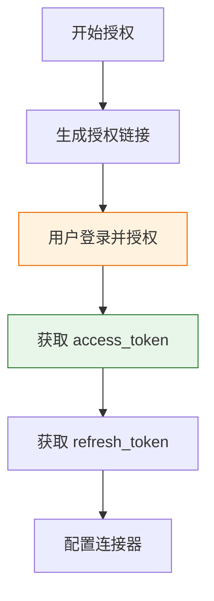
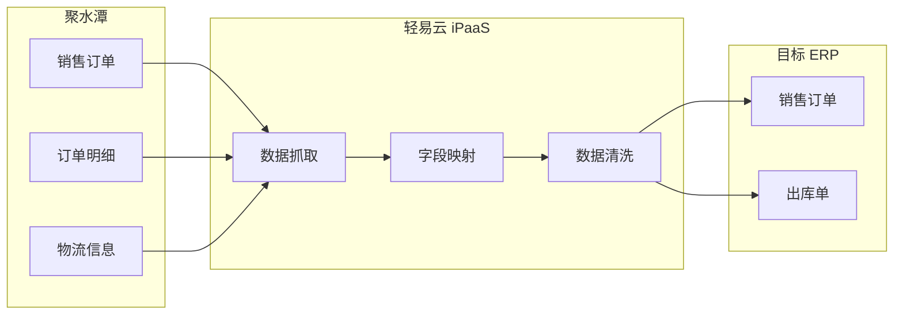

# 聚水潭连接器

本文档详细介绍轻易云 iPaaS 平台与聚水潭（JuShuiTan）的集成配置方法。聚水潭是国内领先的电商 SaaS ERP 系统，提供订单管理、库存管理、采购管理、分销管理等核心功能，支持与主流电商平台（淘宝、天猫、京东、拼多多、抖音、小红书等）无缝对接。

> [!TIP]
> 如需了解连接器的基础使用方法，请先阅读 [配置连接器](../../guide/configure-connector)。

## 概述

聚水潭 ERP 面向不同规模的电商企业提供灵活的解决方案：

| 版本 | 适用规模 | 核心特点 |
|------|----------|----------|
| **标准版** | 中小型电商（日单量 < 1 万） | 基础 ERP 功能、单仓管理 |
| **专业版** | 中大型电商（日单量 1-10 万） | 多仓协同、奇门接口支持、分销管理 |
| **企业版** | 超大型电商（日单量 > 10 万） | 超高并发、全渠道管理、定制化能力 |

轻易云 iPaaS 提供专用的聚水潭连接器，支持以下核心能力：

- **订单数据同步**：销售订单、售后订单的自动抓取与回传
- **库存实时同步**：多平台库存共享，避免超卖风险
- **基础资料管理**：商品、仓库、供应商、客户等主数据同步
- **奇门接口支持**：通过阿里奇门平台获取淘系订单敏感数据
- **分销业务支持**：分销商订单、供货订单的数据流转

## 准备工作

在开始配置连接器之前，需要完成以下准备工作：

### 所需材料清单

| 序号 | 材料 | 说明 | 获取方式 |
|------|------|------|----------|
| 1 | 聚水潭账号 | 聚水潭 ERP 系统登录账号 | 客户提供 |
| 2 | 应用 ID | 轻易云在聚水潭开放平台的应用标识 | 轻易云提供 |
| 3 | access_token | 用户授权后的访问令牌 | 通过授权流程获取 |
| 4 | refresh_token | 用于刷新 access_token | 通过授权流程获取 |

> [!IMPORTANT]
> 聚水潭开放平台应用授权需要用户亲自操作完成，无法由第三方代替授权。

## 应用授权流程

聚水潭采用 OAuth 2.0 授权机制，需要用户授权后才能访问其店铺数据。

### 授权流程概览



### 步骤 1：生成授权链接

1. 访问聚水潭开放平台 [用户授权工具](https://openweb.jushuitan.com/doc?docId=130&name=%E7%94%A8%E6%88%B7%E6%8E%88%E6%9D%83%E5%B7%A5%E5%85%B7)
2. 在页面中输入轻易云应用的应用 ID（请联系轻易云技术支持获取）
3. 点击生成授权链接

### 步骤 2：用户授权

1. 将生成的授权链接发送给用户
2. 用户使用聚水潭账号登录并点击**授权**
3. 授权成功后，页面将显示授权凭证信息

### 步骤 3：获取授权凭证

用户授权成功后，你将获得以下关键信息：

| 字段 | 说明 |
|------|------|
| `access_token` | 访问令牌，用于接口调用认证 |
| `refresh_token` | 刷新令牌，用于在 access_token 过期后获取新的令牌 |

> [!CAUTION]
> 请妥善保存 `access_token` 和 `refresh_token`，不要泄露给未授权人员。令牌信息一旦丢失，需要重新进行用户授权流程。

## 奇门连接器信息获取

聚水潭奇门连接器用于获取淘系平台（淘宝、天猫）的敏感订单数据。配置奇门连接器需要获取 `customer_id` 信息。

### 获取 customer_id

聚水潭现已支持在前端自助申请配置服务获取 `customer_id`，操作步骤如下：

#### 步骤 1：进入奇门配置页面

1. 登录聚水潭 ERP 系统
2. 进入 **设置** → **开放平台** → **奇门配置**（具体路径可能因版本略有差异）

#### 步骤 2：填写奇门应用信息

1. 在奇门配置页面，找到**新增配置**或**申请配置**入口
2. 填写奇门应用的 `appkey`（请联系轻易云技术支持获取）

#### 步骤 3：提交并查看结果

1. 提交配置申请
2. 点击**搜索**按钮查看绑定完成的 `customer_id` 信息

> [!NOTE]
> 部分聚水潭版本可能需要联系聚水潭客服协助完成奇门配置，如遇问题请联系聚水潭官方客服或轻易云技术支持。

## 连接器配置

### 创建连接器

1. 登录轻易云 iPaaS 控制台，进入 **连接器管理** 页面
2. 点击 **新建连接器**，选择 **电商 / WMS 类** 下的 **聚水潭**
3. 填写连接参数（详见下方参数说明）
4. 点击 **测试连接** 验证连通性
5. 连接成功后点击 **保存**

### 连接参数说明

| 参数名 | 类型 | 必填 | 说明 |
| ------ | ---- | ---- | ---- |
| `access_token` | string | ✅ | 用户授权后获取的访问令牌 |
| `app_key` | string | ✅ | 开放平台应用的 AppKey |
| `app_secret` | string | ✅ | 开放平台应用的 AppSecret |
| `customer_id` | string | — | 奇门连接器客户标识，使用奇门接口时必填 |

### 连接器类型选择

根据业务场景选择对应的连接器类型：

| 连接器类型 | 适用场景 |
|------------|----------|
| **聚水潭标准连接器** | 普通订单、库存、商品数据同步 |
| **聚水潭奇门连接器** | 需要获取淘系平台敏感数据的场景 |

## V2 版本切换指南

聚水潭开放平台接口已升级至 V2 版本，建议新方案统一使用 V2 接口以获得更好的性能和更丰富的功能。

### V2 版本适配器配置

在集成方案中切换至 V2 适配器：

#### 查询数据场景

将 Source 适配器修改为：

```text
\Adapter\Jushuitan\V2\JstQueryAdapter
```

#### 写入数据场景

将 Target 适配器修改为：

```text
\Adapter\Jushuitan\V2\JstExecuteAdapter
```

> [!WARNING]
> 切换适配器时，请确保在 **More Info** 或 **高级配置** 中完成修改，避免直接修改基础配置导致错误。

### 接口名称变更

V2 版本接口字段保持一致，但部分接口名称有所调整。请参照最新的 [聚水潭开放平台文档](https://openweb.jushuitan.com/dev-doc?docType=4&docId=22) 修改接口名称。

### Token 刷新机制

> [!IMPORTANT]
> 使用 V2 接口时，需要确保有一个定时查询聚水潭的方案（建议每 4 小时执行一次），用于检查并刷新 `access_token`，避免因令牌过期导致接口调用失败。

## 集成方案配置示例

### 销售订单同步方案

以下是一个典型的聚水潭销售订单同步至 ERP 系统的配置流程：



#### 配置步骤

1. **创建方案**：新建集线器方案，选择聚水潭 **销售订单查询** 接口
2. **设置调度**：配置定时调度策略（建议 5-10 分钟一次）
3. **字段映射**：完成聚水潭字段与目标系统字段的映射
4. **数据加工**：如需特殊处理，在加工厂中编写处理逻辑
5. **测试验证**：使用调试模式验证数据流转

### 库存同步方案

| 聚水潭字段 | 说明 | 常见映射目标字段 |
|------------|------|------------------|
| `sku_id` | SKU 唯一标识 | SKU 编码 |
| `name` | 商品名称 | 商品名称 |
| `sku_name` | 规格名称 | 规格名称 |
| `qty` | 库存数量 | 库存数量 |
| `warehouse` | 仓库名称 | 仓库 |

## 数据映射参考

### 销售订单常用字段

| 聚水潭字段 | 说明 | 备注 |
|------------|------|------|
| `o_id` | 订单编号 | 聚水潭内部订单号 |
| `so_id` | 线上单号 | 电商平台原始订单号 |
| `shop_id` | 店铺编号 | 店铺唯一标识 |
| `shop_name` | 店铺名称 | 店铺显示名称 |
| `buyer_nick` | 买家昵称 | 电商平台买家账号 |
| `receiver_name` | 收货人姓名 | 收件人姓名 |
| `receiver_mobile` | 收货人手机 | 收件人电话 |
| `receiver_address` | 收货地址 | 完整收货地址 |
| `pay_amount` | 应付金额 | 订单总金额 |
| `pay_time` | 付款时间 | 订单付款时间 |
| `send_date` | 发货时间 | 实际发货时间 |

### 商品资料常用字段

| 聚水潭字段 | 说明 |
|------------|------|
| `sku_id` | SKU 唯一标识 |
| `i_id` | 款式 ID |
| `name` | 商品名称 |
| `sku_name` | SKU 规格名称 |
| `properties_value` | 属性值（颜色、尺码等）|
| `sku_code` | SKU 商家编码 |
| `pic` | 商品图片 URL |
| `s_price` | 销售价 |
| `c_price` | 成本价 |

## 常见问题

### Q：如何获取轻易云的应用 ID？

应用 ID 由轻易云技术支持提供，请联系您的专属顾问或拨打客服热线获取。

### Q：access_token 过期如何处理？

`access_token` 有效期通常为 24 小时，过期后可使用 `refresh_token` 换取新的 `access_token`。轻易云 iPaaS 平台会自动处理令牌刷新，无需手动干预。

### Q：奇门接口和普通接口有什么区别？

| 维度 | 普通接口 | 奇门接口 |
|------|----------|----------|
| 数据范围 | 非敏感数据 | 包含淘系敏感数据 |
| 适用平台 | 所有电商平台 | 淘宝、天猫等淘系平台 |
| 配置要求 | 标准授权 | 需额外获取 customer_id |
| 使用场景 | 普通订单同步 | 需要完整订单信息的场景 |

### Q：V1 和 V2 接口可以同时使用吗？

不建议在同一方案中混用 V1 和 V2 接口。建议新方案统一使用 V2 接口，旧方案可逐步迁移至 V2。

### Q：接口调用频率限制是多少？

聚水潭接口有频率限制，具体限制根据接口类型和账号等级不同而有所差异。建议：

- 合理设置同步频率，建议 5-10 分钟一次
- 使用轻易云 iPaaS 的队列机制进行流量控制
- 关注接口返回的限流提示，做好重试机制

### Q：如何判断应该使用哪种适配器？

| 场景 | 适配器选择 |
|------|------------|
| 从聚水潭查询数据 | `\Adapter\Jushuitan\V2\JstQueryAdapter` |
| 向聚水潭写入数据 | `\Adapter\Jushuitan\V2\JstExecuteAdapter` |
| 使用奇门接口查询 | `\Adapter\Jushuitan\V2\JstQueryAdapter`（需配置 customer_id）|

### Q：对接完成后如何测试？

1. 使用轻易云 iPaaS 的 **调试模式** 验证单条数据流转
2. 检查订单、库存等关键数据的完整性与准确性
3. 进行小批量数据试运行（建议 10-50 条）
4. 配置监控告警，关注失败通知和数据延迟告警
5. 确认无误后开启正式调度

## 相关资源

- [配置连接器](../../guide/configure-connector) — 连接器基础使用指南
- [旺店通集成专题](./wangdian) — 旺店通连接器文档
- [金蝶云星空集成专题](../erp/kingdee-cloud-galaxy) — 金蝶云星空连接器文档
- [电商 / WMS 类连接器概览](./README) — 电商连接器总览
- [标准集成方案 — 国内电商](../../standard-schemes/domestic-ecommerce) — 国内电商集成最佳实践
- [聚水潭开放平台文档](https://openweb.jushuitan.com/dev-doc?docType=4&docId=22) — 官方接口文档

---

> [!NOTE]
> 本文档持续更新中，如有疑问请联系轻易云技术支持团队。
