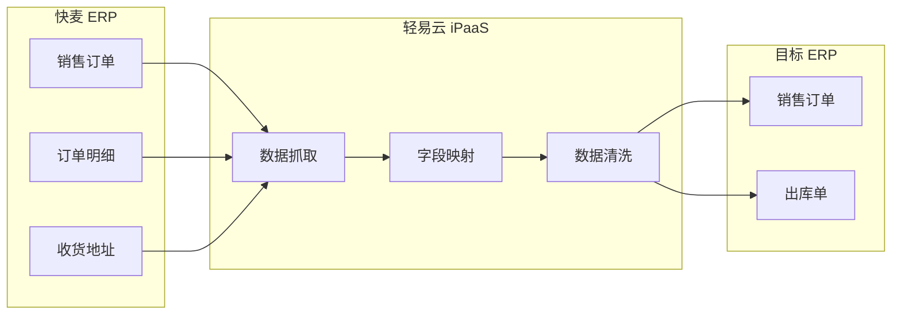

# 快麦连接器

本文档详细介绍轻易云 iPaaS 平台与快麦 ERP 的集成配置方法。快麦 ERP 是阿里生态旗下的电商管理系统，为电商企业提供订单处理、商品管理、库存管理、数据报表等核心功能，支持与主流电商平台（淘宝、天猫、京东、拼多多等）无缝对接。

> [!TIP]
> 如需了解连接器的基础使用方法，请先阅读 [配置连接器](../../guide/configure-connector)。

## 概述

快麦 ERP 是阿里巴巴集团旗下光云科技推出的电商 ERP 产品，专注于为中小电商企业提供轻量级的店铺管理解决方案。

| 产品版本 | 定位 | 核心特点 |
|---------|------|---------|
| **快麦 ERP 标准版** | 小型电商企业 | 基础订单处理、单店铺管理 |
| **快麦 ERP 专业版** | 中型电商企业 | 多店铺聚合、库存同步、数据报表 |
| **快麦 ERP 旗舰版** | 中大型电商企业 | 全渠道管理、供应链协同、智能分析 |

轻易云 iPaaS 提供专用的快麦连接器，支持以下核心能力：

- **订单数据同步**：销售订单、售后订单的自动抓取与同步
- **库存实时同步**：多平台库存共享，避免超卖风险
- **商品资料管理**：商品信息、SKU 资料的主数据同步
- **采购与供应链管理**：采购订单、供应商资料的数据流转
- **数据报表对接**：销售报表、库存报表的数据抽取

## 准备工作

在开始配置连接器之前，需要完成以下准备工作：

### 所需材料清单

| 序号 | 材料 | 说明 | 获取方式 |
|------|------|------|----------|
| 1 | AppKey | 开放平台应用标识 | 快麦开放平台申请 |
| 2 | AppSecret | 应用密钥 | 快麦开放平台申请 |
| 3 | Token | 接口访问令牌 | 授权后获取 |
| 4 | RefreshToken | 刷新令牌 | 授权后获取 |
| 5 | CompanyID | 公司 ID | 快麦 ERP 系统内查看 |

> [!IMPORTANT]
> 为避免 Token 冲突，请勿在两个不同的连接器配置中使用同一组 Token。

### 快麦开放平台接入

1. 访问 [快麦开放平台](https://open.kuaimai.com/apiDoc) 注册开发者账号
2. 创建应用并获取 `AppKey` 和 `AppSecret`
3. 联系快麦商务开通相应的接口权限
4. 完成应用授权流程，获取 `Token` 和 `RefreshToken`

## 连接器配置

### 创建连接器

1. 登录轻易云 iPaaS 控制台，进入 **连接器管理** 页面
2. 点击 **新建连接器**，选择 **电商 / WMS 类** 下的 **快麦 ERP**
3. 填写连接参数（详见下方参数说明）
4. 点击 **测试连接** 验证连通性
5. 连接成功后点击 **保存**

### 连接参数说明

| 参数名 | 类型 | 必填 | 说明 |
|--------|------|------|------|
| `host` | string | ✅ | 快麦接口请求地址，如 `https://gw.superboss.cc/router` |
| `app_key` | string | ✅ | 快麦开放平台提供的 AppKey |
| `app_secret` | string | ✅ | 快麦开放平台提供的 AppSecret |
| `company_id` | string | ✅ | 公司 ID，在快麦 ERP 系统中查看 |
| `token` | string | ✅ | 接口访问 Token |
| `refresh_token` | string | ✅ | 用于刷新 Token 的 RefreshToken |

### API 地址配置

在连接器配置的 **Host** 一栏输入：

```text
https://gw.superboss.cc/router
```

> [!NOTE]
> 请确认快麦提供的实际接口地址，不同版本或不同区域可能使用不同的网关地址。

## 方案配置

### 适配器选择

根据业务场景选择对应的适配器：

| 适配器 | 适用场景 | 适配器路径 |
|--------|----------|-----------|
| **查询适配器** | 从快麦查询数据 | `\Adapter\KuaiMai\KuaiMaiQueryAdapter` |
| **列表详情查询适配器** | 列表查询后再查详情 | `\Adapter\KuaiMai\KuaiMaiDetailsQueryAdapter` |
| **写入适配器** | 向快麦写入数据 | `\Adapter\KuaiMai\KuaiMaiExecuteAdapter` |

> [!IMPORTANT]
> 普通查询和列表详情查询需要使用不同的适配器。当需要查询列表后根据列表结果再查询详情时，请使用 `KuaiMaiDetailsQueryAdapter`。

### 查询配置

#### 接口信息配置

在方案配置中指定快麦接口方法名，例如：

| 接口名称 | 接口方法 | 说明 |
|---------|---------|------|
| 获取系统时间 | `open.system.time.get` | 测试连接可用 |
| 采购订单查询 | `purchase.order.get` | 查询采购订单列表 |
| 商品标签新增 | `erp.item.tag.add` | 新增商品标签 |

#### Request 参数配置

根据接口文档要求配置请求参数，常用参数包括：

| 参数名 | 类型 | 说明 |
|--------|------|------|
| `pageNo` | int | 页码，从 1 开始 |
| `pageSize` | int | 每页记录数 |
| `startModified` | string | 修改时间起始，格式 `YYYY-MM-DD HH:mm:ss` |
| `endModified` | string | 修改时间结束，格式 `YYYY-MM-DD HH:mm:ss` |
| `timeType` | string | 时间类型，如 `upd_time` |

#### 列表详情查询配置

使用 `KuaiMaiDetailsQueryAdapter` 时，需要配置以下额外参数：

| 参数名 | 说明 | 示例值 |
|--------|------|--------|
| `otherapi` | 详情接口请求地址 | `purchase.order.get` |
| `detailkey` | 详情响应数据字段 | `list` |
| `detailkey1` | 详情请求参数 key | `id` |
| `detailkey2` | 列表响应参数 key，用于详情请求 | `id` |

**配置示例**：

```json
{
  "otherapi": "purchase.order.get",
  "detailkey1": "id",
  "detailkey2": "id",
  "pageNo": "1",
  "pageSize": "1",
  "timeType": "upd_time",
  "startModified": "2024-04-16 23:26:43",
  "endModified": "2024-04-30 14:51:14"
}
```

#### OtherResponse 参数配置

配置接口响应解析参数：

| 参数名 | 说明 | 示例值 |
|--------|------|--------|
| `StatusKey` | 接口响应状态字段 | `code` |
| `StatusValue` | 接口响应成功状态值 | `200` |
| `DataKey` | 接口响应数据的 key，支持最多三级 | `data/list` |
| `PageKey` | 分页 key | `pagination` |

### 写入配置

#### 接口信息配置

指定写入接口方法名，例如：

| 接口名称 | 接口方法 | 说明 |
|---------|---------|------|
| 商品标签新增 | `erp.item.tag.add` | 新增商品分类标签 |

#### Request 参数配置

根据接口文档要求配置写入参数，示例：

```json
{
  "name": "春季新款"
}
```

#### OtherResponse 参数配置

写入操作的响应解析参数配置与查询配置相同。

## 常用接口说明

### 订单类接口

| 接口方法 | 说明 | 常用场景 |
|---------|------|---------|
| `trade.sold.get` | 销售订单查询 | 获取销售订单数据 |
| `trade.return.get` | 退货订单查询 | 获取售后退货单据 |
| `trade.refund.get` | 退款订单查询 | 获取退款申请数据 |

### 商品类接口

| 接口方法 | 说明 | 常用场景 |
|---------|------|---------|
| `item.inventory.get` | 库存查询 | 获取商品库存数据 |
| `erp.item.tag.add` | 商品标签新增 | 新增商品分类 |
| `erp.item.tag.get` | 商品标签查询 | 查询商品分类 |

### 采购类接口

| 接口方法 | 说明 | 常用场景 |
|---------|------|---------|
| `purchase.order.get` | 采购订单查询 | 获取采购单据 |

### 基础资料接口

| 接口方法 | 说明 | 常用场景 |
|---------|------|---------|
| `open.system.time.get` | 获取系统时间 | 测试连接、时间校准 |
| `shop.seller.get` | 店铺查询 | 获取店铺资料 |

## 数据映射参考

### 订单常用字段

| 快麦字段 | 说明 | 常见映射目标字段 |
|-----------|------|-----------------|
| `tid` | 订单编号 | 订单号 |
| `buyer_nick` | 买家昵称 | 客户名称 |
| `receiver_name` | 收货人姓名 | 收货人 |
| `receiver_mobile` | 收货人手机 | 联系电话 |
| `receiver_address` | 收货地址 | 详细地址 |
| `payment` | 实付金额 | 订单金额 |
| `post_fee` | 邮费 | 运费 |
| `created` | 创建时间 | 下单时间 |
| `modified` | 修改时间 | 更新时间 |

### 商品常用字段

| 快麦字段 | 说明 | 备注 |
|-----------|------|------|
| `num_iid` | 商品数字 ID | 平台商品唯一标识 |
| `title` | 商品标题 | 商品名称 |
| `sku_id` | SKU ID | SKU 唯一标识 |
| `outer_id` | 商家编码 | 商家自定义编码 |
| `quantity` | 库存数量 | 可用库存 |
| `price` | 销售价格 | 商品售价 |

## 集成方案示例

### 销售订单同步方案

以下是一个典型的快麦销售订单同步至 ERP 系统的配置流程：



#### 配置步骤

1. **创建方案**：新建集成方案，选择快麦 **销售订单查询** 接口
2. **配置连接器**：选择已创建的快麦连接器
3. **设置调度**：配置定时调度策略（建议 5-10 分钟一次）
4. **字段映射**：完成快麦字段与目标系统字段的映射
5. **数据加工**：如需特殊处理，在加工厂中编写处理逻辑
6. **测试验证**：使用调试模式验证数据流转

### 库存同步方案

| 快麦字段 | 说明 | 常见映射目标字段 |
|------------|------|------------------|
| `sku_id` | SKU 唯一标识 | SKU 编码 |
| `title` | 商品标题 | 商品名称 |
| `quantity` | 库存数量 | 库存数量 |
| `outer_id` | 商家编码 | 商家 SKU 编码 |

## 常见问题

### Q：快麦与超级店长是什么关系？

快麦 ERP 与超级店长同属阿里生态光云科技旗下产品。超级店长主要提供店铺运营工具，而快麦 ERP 提供完整的电商 ERP 功能，两者可以实现数据互通。

### Q：如何获取快麦的开放平台权限？

1. 访问 [快麦开放平台](https://open.kuaimai.com/) 注册开发者账号
2. 创建应用并提交审核
3. 联系快麦商务开通接口权限
4. 部分接口可能需要签署额外协议

### Q：Token 过期如何处理？

`Token` 有有效期限制，过期后需要使用 `RefreshToken` 换取新的 `Token`。轻易云 iPaaS 平台会自动处理令牌刷新，无需手动干预。

### Q：普通查询和列表详情查询有什么区别？

| 维度 | 普通查询 | 列表详情查询 |
|------|----------|-------------|
| 适配器 | `KuaiMaiQueryAdapter` | `KuaiMaiDetailsQueryAdapter` |
| 适用场景 | 单条查询、简单列表查询 | 先查列表再查详情 |
| 请求次数 | 单次请求 | 列表请求 + N 次详情请求 |
| 数据完整性 | 列表返回的基础字段 | 详情返回完整字段 |

### Q：如何选择正确的适配器？

| 场景 | 适配器选择 |
|------|------------|
| 从快麦查询基础数据 | `\Adapter\KuaiMai\KuaiMaiQueryAdapter` |
| 列表查询后再查详情 | `\Adapter\KuaiMai\KuaiMaiDetailsQueryAdapter` |
| 向快麦写入数据 | `\Adapter\KuaiMai\KuaiMaiExecuteAdapter` |

### Q：对接完成后如何测试？

1. 使用轻易云 iPaaS 的 **调试模式** 验证单条数据流转
2. 检查订单、库存等关键数据的完整性与准确性
3. 进行小批量数据试运行（建议 10-50 条）
4. 配置监控告警，关注失败通知和数据延迟告警
5. 确认无误后开启正式调度

### Q：快麦接口调用频率限制是多少？

快麦接口有频率限制，具体限制根据账号类型和接口不同而有所差异。建议：

- 合理设置同步频率，避免触发限流
- 使用轻易云 iPaaS 的队列机制进行流量控制
- 关注接口返回的限流提示，做好重试机制

## 相关资源

- [配置连接器](../../guide/configure-connector) — 连接器基础使用指南
- [旺店通集成专题](./wangdian) — 旺店通连接器文档
- [聚水潭集成专题](./jushuitan) — 聚水潭连接器文档
- [管易云集成专题](./guanyi) — 管易云连接器文档
- [电商 / WMS 类连接器概览](./README) — 电商连接器总览
- [标准集成方案 — 国内电商](../../standard-schemes/domestic-ecommerce) — 国内电商集成最佳实践
- [快麦开放平台文档](https://open.kuaimai.com/apiDoc) — 官方接口文档

---

> [!NOTE]
> 本文档持续更新中，如有疑问请联系轻易云技术支持团队。
