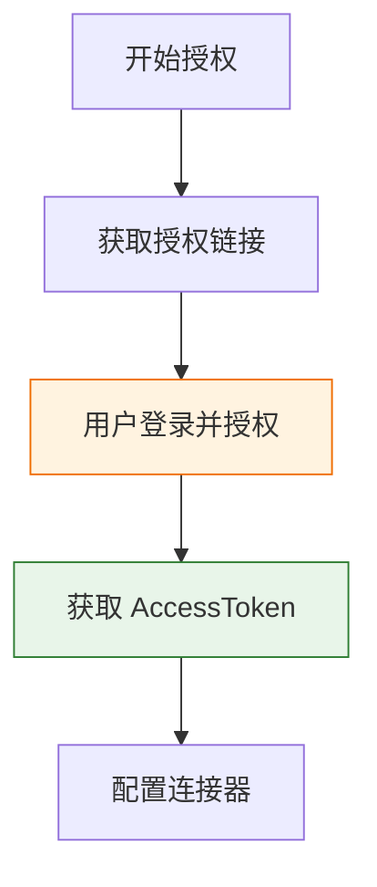
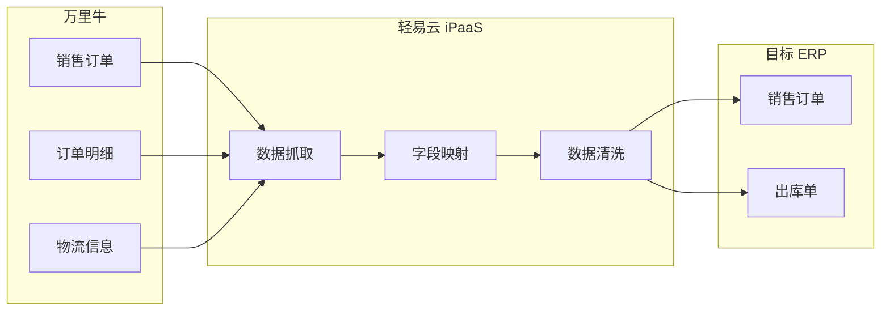
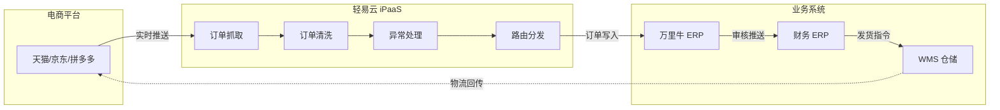
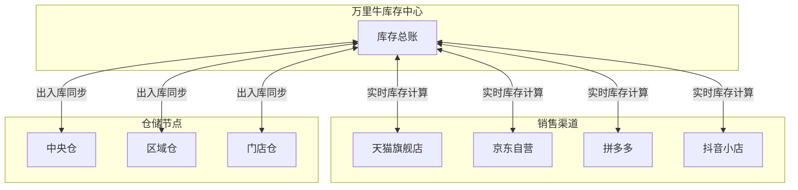

# 万里牛连接器

本文档详细介绍轻易云 iPaaS 平台与万里牛 ERP 的集成配置方法。万里牛是专注于电商领域的 SaaS ERP 系统，提供全渠道订单管理、智能仓储管理、供应链协同等核心功能，支持与主流电商平台（淘宝、天猫、京东、拼多多、抖音等）无缝对接。

> [!TIP]
> 如需了解连接器的基础使用方法，请先阅读 [配置连接器](../../guide/configure-connector)。

## 概述

万里牛 ERP 是一款面向成长型电商企业的管理软件，具有以下核心特点：

| 特点 | 说明 |
|------|------|
| **全渠道管理** | 支持多平台、多店铺订单统一管理 |
| **智能仓储** | 支持批次管理、序列号追溯、多仓协同 |
| **供应链协同** | 采购、销售、库存全流程打通 |
| **财务核算** | 支持成本核算、利润分析、对账管理 |
| **开放平台** | 提供完善的 OpenAPI，支持系统间数据互通 |

轻易云 iPaaS 提供专用的万里牛连接器，支持以下核心能力：

- **订单数据同步**：销售订单、售后订单的自动抓取与回传
- **库存实时同步**：多平台库存共享，避免超卖风险
- **基础资料管理**：商品、仓库、供应商等主数据同步
- **出入库单据同步**：采购入库、销售出库等单据对接
- **批次追溯**：支持批次号、生产日期、有效期管理

## 准备工作

在开始配置连接器之前，需要完成以下准备工作：

### 所需材料清单

| 序号 | 材料 | 说明 | 获取方式 |
|------|------|------|----------|
| 1 | 万里牛账号 | 万里牛 ERP 系统登录账号 | 客户提供 |
| 2 | AppKey | 开放平台应用标识 | 万里牛开放平台创建应用后获取 |
| 3 | AppSecret | 应用密钥 | 创建应用后获取 |
| 4 | AccessToken | 访问令牌 | 通过授权流程获取 |

> [!IMPORTANT]
> 万里牛开放平台授权需要用户亲自操作完成，无法由第三方代替授权。

### 创建万里牛开放平台应用

1. 访问 [万里牛开放平台](https://open.hupun.com/)
2. 使用万里牛账号登录
3. 进入 **应用管理** → **创建应用**
4. 填写应用名称、应用描述等信息
5. 提交审核，审核通过后即可获取 `AppKey` 和 `AppSecret`

## 应用授权流程

万里牛采用 OAuth 2.0 授权机制，需要用户授权后才能访问其店铺数据。

### 授权流程概览



### 步骤 1：构建授权链接

使用以下格式构建授权链接：

```text
https://open.hupun.com/oauth2/authorize?
    app_key={YOUR_APP_KEY}
    &response_type=code
    &redirect_uri={YOUR_REDIRECT_URI}
    &state={STATE}
```

| 参数 | 说明 |
|------|------|
| `app_key` | 你的应用 AppKey |
| `response_type` | 固定值 `code` |
| `redirect_uri` | 授权回调地址，需与开放平台配置一致 |
| `state` | 可选，用于防止 CSRF 攻击 |

### 步骤 2：用户授权

1. 将授权链接发送给用户
2. 用户使用万里牛账号登录并点击 **授权**
3. 授权成功后，浏览器将重定向至回调地址，并携带 `code` 参数

### 步骤 3：换取 AccessToken

使用获取到的 `code` 调用接口换取 `access_token`：

```http
POST https://open.hupun.com/oauth2/token
Content-Type: application/x-www-form-urlencoded

app_key={APP_KEY}
&app_secret={APP_SECRET}
&code={CODE}
&grant_type=authorization_code
```

响应示例：

```json
{
  "access_token": "your_access_token_here",
  "refresh_token": "your_refresh_token_here",
  "expires_in": 86400
}
```

> [!CAUTION]
> 请妥善保存 `access_token` 和 `refresh_token`，不要泄露给未授权人员。令牌信息一旦丢失，需要重新进行用户授权流程。

## 连接器配置

### 创建连接器

1. 登录轻易云 iPaaS 控制台，进入 **连接器管理** 页面
2. 点击 **新建连接器**，选择 **电商 / WMS 类** 下的 **万里牛**
3. 填写连接参数（详见下方参数说明）
4. 点击 **测试连接** 验证连通性
5. 连接成功后点击 **保存**

### 连接参数说明

| 参数名 | 类型 | 必填 | 说明 |
| ------ | ---- | ---- | ---- |
| `app_key` | string | ✅ | 开放平台应用的 AppKey |
| `app_secret` | string | ✅ | 开放平台应用的 AppSecret |
| `access_token` | string | ✅ | 用户授权后获取的访问令牌 |

### 适配器类型选择

根据业务场景选择对应的适配器类型：

| 适配器类型 | 适配器类名 | 适用场景 |
|------------|------------|----------|
| **查询适配器** | `\Adapter\Hupun\HupunQueryAdapter` | 从万里牛查询数据 |
| **写入适配器** | `\Adapter\Hupun\HupunExecuteAdapter` | 向万里牛写入数据 |

## 集成方案配置示例

### 销售订单同步方案

以下是一个典型的万里牛销售订单同步至 ERP 系统的配置流程：



#### 配置步骤

1. **创建方案**：新建集成方案，选择万里牛 **销售订单查询** 接口
2. **设置调度**：配置定时调度策略（建议 5~10 分钟一次）
3. **字段映射**：完成万里牛字段与目标系统字段的映射
4. **数据加工**：如需特殊处理，在加工厂中编写处理逻辑
5. **测试验证**：使用调试模式验证数据流转

### 请求参数说明

销售订单查询接口常用请求参数：

| 参数名 | 类型 | 必填 | 说明 | 默认值 |
|--------|------|------|------|--------|
| `limit` | string | — | 每页大小，最大 200 | 100 |
| `page` | string | — | 当前页码，从 1 开始 | 1 |
| `modify_time` | datetime | — | 修改开始时间 | `{{LAST_SYNC_TIME\|datetime}}` |
| `end_time` | datetime | — | 修改结束时间 | `{{CURRENT_TIME\|datetime}}` |
| `bill_code` | string | — | 出库单据编码 | — |
| `trade_status` | string | — | 订单状态 | — |

### 其他请求参数

| 参数名 | 类型 | 必填 | 说明 | 默认值 |
|--------|------|------|------|--------|
| `type` | string | — | 类型参数 | 12 |
| `detailApi` | string | — | 批次详情 API 路径 | `/erp/batch/billbatch` |
| `code` | string | — | 编码参数 | — |

### 返回字段说明

销售订单查询接口返回主要字段：

| 字段名 | 类型 | 说明 |
|--------|------|------|
| `uid` | string | 订单唯一标识 |
| `shop_name` | string | 店铺名称 |
| `shop_nick` | string | 店铺昵称 |
| `storage_name` | string | 仓库名称 |
| `storage_code` | string | 仓库编码 |
| `trade_no` | string | 交易单号 |
| `buyer_msg` | string | 买家留言 |
| `seller_msg` | string | 卖家留言 |
| `remark` | string | 备注信息 |
| `buyer_account` | string | 买家账号 |
| `buyer` | string | 买家名称 |
| `receiver` | string | 收货人 |
| `phone` | string | 联系电话 |
| `province` | string | 省份 |
| `city` | string | 城市 |
| `district` | string | 区县 |
| `address` | string | 详细地址 |
| `create_time` | integer | 创建时间（时间戳） |
| `modify_time` | integer | 修改时间（时间戳） |
| `pay_time` | integer | 支付时间（时间戳） |
| `send_time` | integer | 发货时间（时间戳） |
| `status` | integer | 订单状态 |
| `is_pay` | boolean | 是否已支付 |

#### 订单商品明细（orders）

| 字段名 | 类型 | 说明 |
|--------|------|------|
| `orders[].item_name` | string | 商品名称 |
| `orders[].sku_code` | string | SKU 编码 |
| `orders[].size` | integer | 数量 |
| `orders[].price` | number | 单价 |
| `orders[].discounted_unit_price` | number | 折扣后单价 |
| `orders[].payment` | number | 支付金额 |
| `orders[].inventory_status` | string | 库存状态 |
| `orders[].bar_code` | string | 条形码 |
| `orders[].unit` | string | 单位 |

#### 金额相关字段

| 字段名 | 类型 | 说明 |
|--------|------|------|
| `sum_sale` | number | 销售总额 |
| `post_fee` | number | 邮费 |
| `paid_fee` | number | 已付金额 |
| `discount_fee` | number | 折扣金额 |
| `real_payment` | number | 实际支付金额 |

#### 批次信息（_qeasybatchs）

| 字段名 | 类型 | 说明 |
|--------|------|------|
| `_qeasybatchs[].bill_code` | string | 单据编码 |
| `_qeasybatchs[].sku_code` | string | SKU 编码 |
| `_qeasybatchs[].batchs[].batch_no` | string | 批次号 |
| `_qeasybatchs[].batchs[].num` | integer | 批次数量 |
| `_qeasybatchs[].batchs[].produce_date` | integer | 生产日期（时间戳） |
| `_qeasybatchs[].batchs[].expired_date` | integer | 过期日期（时间戳） |

## 常见集成场景

### 场景一：订单全流程自动化

实现从电商平台下单到 ERP 发货的全程自动化，消除人工录入环节。



| 业务场景 | 数据流向 | 同步内容 |
|----------|----------|----------|
| 订单下载 | 电商平台 → 万里牛 | 订单主表、商品明细、收货地址 |
| 订单状态同步 | 万里牛 → 电商平台 | 审单状态、发货状态、退款状态 |
| 物流单号回传 | 万里牛 → 电商平台 | 快递公司、运单号、发货时间 |

### 场景二：库存实时同步

实现多平台库存的实时共享，避免超卖或断货风险。



| 同步策略 | 适用场景 | 延迟 |
|----------|----------|------|
| 实时同步 | 爆款商品、库存紧张 SKU | < 5 秒 |
| 定时同步 | 常规商品、大批量更新 | 5~15 分钟 |
| 阈值预警 | 安全库存监控 | 实时 |

### 场景三：批次追溯管理

适用于医药、食品、化妆品等对批次管理有严格要求的行业。


批次管理核心能力：

| 功能 | 说明 |
|------|------|
| 批次号管理 | 记录商品的生产批次号 |
| 生产日期 | 跟踪商品生产日期 |
| 有效期管理 | 预警即将过期商品 |
| 先进先出 | 支持按批次先进先出策略出库 |

### 场景四：财务数据对接

实现电商业务数据向财务系统的自动流转，支持业财一体化。


| 财务场景 | 数据来源 | 目标系统 | 输出结果 |
|----------|----------|----------|----------|
| 销售对账 | 电商平台账单 | 财务 ERP | 应收账款、收入确认 |
| 成本核算 | 采购入库单 | 财务 ERP | 成本结转凭证 |
| 费用分摊 | 物流、平台费用 | 财务 ERP | 费用凭证 |

## 数据映射参考

### 销售订单常用字段

| 万里牛字段 | 说明 | 备注 |
|------------|------|------|
| `uid` | 订单唯一标识 | 万里牛内部订单号 |
| `trade_no` | 交易单号 | 电商平台原始订单号 |
| `shop_name` | 店铺名称 | 店铺显示名称 |
| `buyer` | 买家名称 | 电商平台买家账号 |
| `receiver` | 收货人姓名 | 收件人姓名 |
| `phone` | 收货人手机 | 收件人电话 |
| `address` | 收货地址 | 完整收货地址 |
| `real_payment` | 实际支付金额 | 订单实付金额 |
| `pay_time` | 付款时间 | 订单付款时间戳 |
| `send_time` | 发货时间 | 实际发货时间戳 |

### 商品资料常用字段

| 万里牛字段 | 说明 |
|------------|------|
| `sku_code` | SKU 编码 |
| `item_name` | 商品名称 |
| `sku_name` | SKU 规格名称 |
| `bar_code` | 条形码 |
| `unit` | 单位 |

### 库存相关字段

| 万里牛字段 | 说明 |
|------------|------|
| `storage_code` | 仓库编码 |
| `storage_name` | 仓库名称 |
| `inventory_status` | 库存状态 |

## 常见问题

### Q：如何获取万里牛的 AppKey 和 AppSecret？

1. 访问 [万里牛开放平台](https://open.hupun.com/)
2. 使用万里牛账号登录
3. 进入 **应用管理** → **创建应用**
4. 填写应用信息后提交审核
5. 审核通过后即可在应用详情页查看 `AppKey` 和 `AppSecret`

### Q：access_token 过期如何处理？

`access_token` 有效期通常为 24 小时，过期后可使用 `refresh_token` 换取新的 `access_token`。轻易云 iPaaS 平台会自动处理令牌刷新，无需手动干预。

### Q：如何判断应该使用哪种适配器？

| 场景 | 适配器选择 |
|------|------------|
| 从万里牛查询数据 | `\Adapter\Hupun\HupunQueryAdapter` |
| 向万里牛写入数据 | `\Adapter\Hupun\HupunExecuteAdapter` |

### Q：接口调用频率限制是多少？

万里牛接口有频率限制，具体限制根据接口类型和账号等级不同而有所差异。建议：

- 合理设置同步频率，建议 5~10 分钟一次
- 使用轻易云 iPaaS 的队列机制进行流量控制
- 关注接口返回的限流提示，做好重试机制

### Q：万里牛与其他电商 ERP 如何选择？

| 维度 | 万里牛 | 旺店通 | 聚水潭 |
|------|--------|--------|--------|
| 适用规模 | 成长型电商 | 中大型电商 | 中大型电商 |
| 核心优势 | 性价比高、批次管理 | 高并发、多仓协同 | 全渠道、供应链协同 |
| 财务对接 | 与金蝶深度集成 | 独立财务模块 | 开放平台对接 |
| 价格 | 中等 | 较高 | 较高 |

### Q：对接完成后如何测试？

1. 使用轻易云 iPaaS 的 **调试模式** 验证单条数据流转
2. 检查订单、库存等关键数据的完整性与准确性
3. 进行小批量数据试运行（建议 10~50 条）
4. 配置监控告警，关注失败通知和数据延迟告警
5. 确认无误后开启正式调度

### Q：万里牛支持哪些电商平台？

万里牛支持与以下主流电商平台对接：

- **国内电商**：淘宝、天猫、京东、拼多多、抖音、快手、小红书
- **跨境电商**：支持部分跨境平台（建议咨询万里牛官方）
- **自建商城**：支持有赞、微盟等 SaaS 商城

## 相关资源

- [配置连接器](../../guide/configure-connector) — 连接器基础使用指南
- [旺店通集成专题](./wangdian) — 旺店通连接器文档
- [聚水潭集成专题](./jushuitan) — 聚水潭连接器文档
- [电商 / WMS 类连接器概览](./README) — 电商连接器总览
- [标准集成方案 — 国内电商](../../standard-schemes/domestic-ecommerce) — 国内电商集成最佳实践
- [万里牛开放平台文档](https://open.hupun.com/) — 官方接口文档

---

> [!NOTE]
> 本文档持续更新中，如有疑问请联系轻易云技术支持团队。
