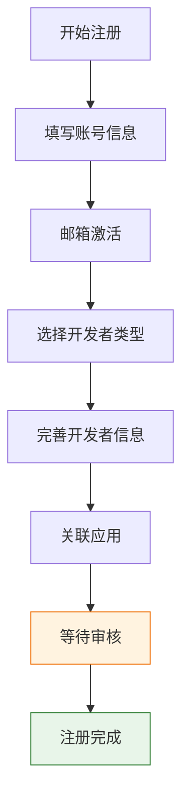
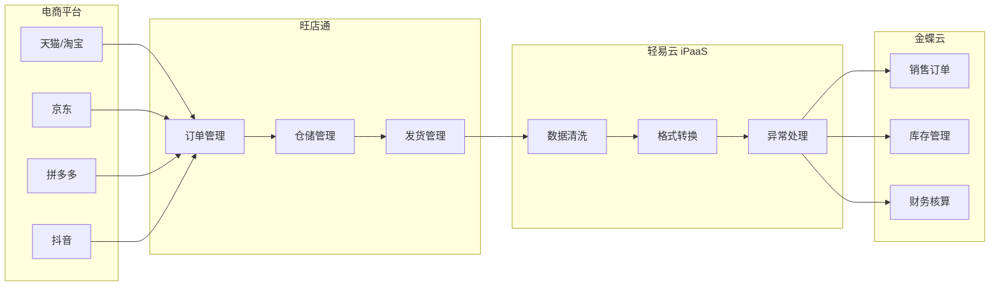

# 旺店通连接器

本文档详细介绍轻易云 iPaaS 平台与旺店通（Wangdian Tong）的集成配置方法。旺店通是国内领先的电商 ERP 系统，提供订单管理、仓储管理、多渠道销售等核心功能，支持与主流电商平台（淘宝、天猫、京东、拼多多、抖音等）无缝对接。

> [!TIP]
> 如需了解连接器的基础使用方法，请先阅读 [配置连接器](../../guide/configure-connector)。

## 概述

旺店通分为**企业版**和**旗舰版**两个主要版本，分别面向不同规模的电商企业：

| 版本 | 适用规模 | 核心特点 |
|------|----------|----------|
| **企业版** | 中大型电商（日单量 1-10 万） | 高并发处理、多仓协同、奇门接口支持 |
| **旗舰版** | 超大型电商（日单量 > 10 万） | 更高并发能力、复杂业务场景、全渠道管理 |

轻易云 iPaaS 提供专用的旺店通连接器，支持以下核心能力：

- **订单数据同步**：销售订单、退货订单的自动抓取与回传
- **库存实时同步**：多平台库存共享，避免超卖风险
- **基础资料管理**：商品、仓库、物流等主数据同步
- **奇门接口支持**：通过阿里奇门平台获取淘系订单敏感数据
- **多仓协同**：支持中央仓、区域仓、门店仓的多仓联动

## 准备工作

在开始配置连接器之前，需要完成以下准备工作：

### 所需材料清单

| 序号 | 材料 | 说明 | 获取方式 |
|------|------|------|----------|
| 1 | 公司全名 | 企业营业执照名称 | 客户提供 |
| 2 | 联系人信息 | 姓名、电话、电子邮箱 | 客户提供 |
| 3 | 旺店通商家编码 | 旺店通系统中的唯一标识 | 客户提供 |
| 4 | 旺店通销售负责人联系方式 | 用于审核加速 | 客户提供 |

> [!IMPORTANT]
> 旺店通开放平台账号申请需要 **1-3 个工作日** 审核，请提前安排，避免影响项目进度。

## 开放平台账号注册

### 注册地址

根据使用的旺店通版本选择对应的开放平台：

| 版本 | 注册地址 |
|------|----------|
| 企业版 | [https://open.wangdian.cn/qyb/open/welcome](https://open.wangdian.cn/qyb/open/welcome) |
| 旗舰版 | [https://open.wangdian.cn/qjb/open/welcome](https://open.wangdian.cn/qjb/open/welcome) |

### 注册流程

注册成为旺店通开放平台用户共分为 **7 个步骤**：



#### 步骤 1：进入注册页面

访问上述开放平台地址，点击顶部导航栏的 **注册** 按钮进入注册流程。

#### 步骤 2：填写注册账号信息

填写真实有效的电子邮箱地址，设置登录密码，填写验证码，并勾选同意《旺店通合作伙伴开发协议》，点击 **注册** 按钮进入邮箱激活流程。

#### 步骤 3：激活邮箱

登录注册时填写的邮箱，查看激活邮件，点击邮件中的激活链接进入开发者类型选择页面。

> [!WARNING]
> 激活邮件可能会被归类到垃圾邮件，如未收到请检查垃圾邮件箱。

#### 步骤 4：选择开发者类型

根据企业实际情况选择开发者类型：

| 类型 | 适用场景 |
|------|----------|
| **开放本企业** | 旺店通商家（客户）方开发者，为自己企业做接入开发 |
| **代理服务商** | 服务于旺店通商家的应用服务提供商 |

勾选同意协议后，点击 **下一步** 进入开发者信息填写流程。

#### 步骤 5：完善开发者信息

按照界面提示填写开发者信息，包括企业信息、联系人信息等。

#### 步骤 6：关联应用

点击完成后，跳转至关联应用界面：

- 如以往通过邮件等线下方式获取过 AppKey，请按照真实信息填写关联
- 如为首次申请，请选择 **跳过**

#### 步骤 7：等待审核

注册成功后，账号状态处于**审核中**，需旺店通运维人员审核后，方可使用开放平台所有功能。

> [!TIP]
> 建议将通知邮箱维护好，避免错过重要审核通知信息。

## 应用创建与上线

完成开放平台注册并通过审核后，需要创建应用并申请上线，获取接口调用所需的凭证。

### 创建应用

1. 登录旺店通开放平台
2. 进入 **应用管理** 页面
3. 点击 **创建应用**
4. 填写应用名称
5. 勾选需要的接口权限

> [!IMPORTANT]
> 旺店通销售出库、销售退货等敏感信息需要通过 **奇门自定义应用** 获取数据。如涉及淘系订单同步，请务必选择奇门应用类型。

### 申请应用上线

应用创建完成后：

1. 在应用管理界面找到已创建的应用
2. 点击 **上线** 按钮
3. 填写对应的信息（应用说明、使用场景等）
4. 联系旺店通对应商务人员进行应用审核
5. 审核完成后即可获取应用参数进行接口配置

## 连接器配置

### 创建连接器

1. 登录轻易云 iPaaS 控制台，进入 **连接器管理** 页面
2. 点击 **新建连接器**，选择 **电商 / WMS 类** 下的 **旺店通**
3. 填写连接参数（详见下方参数说明）
4. 点击 **测试连接** 验证连通性
5. 连接成功后点击 **保存**

### 连接参数说明

| 参数名 | 类型 | 必填 | 说明 |
| ------ | ---- | ---- | ---- |
| `app_key` | string | ✅ | 开放平台应用的 AppKey |
| `app_secret` | string | ✅ | 开放平台应用的 AppSecret |
| `sid` | string | ✅ | 商家账号（店铺 ID） |
| `version` | string | ✅ | 版本号，`2` 表示 2.0 接口 |
| `platform` | string | — | 平台类型，旗舰版填 `qjb`，企业版填 `qyb` |

> [!NOTE]
> 旺店通 2.0 接口与 1.0 接口字段有所差异，新建方案建议使用 2.0 接口。

## 集成方案配置

### 新版发货单查询配置

使用旺店通新版发货单查询接口（2.0）需要以下配置步骤：

#### 步骤 1：创建商品查询方案

首先创建管易商品查询方案（用于后续关联查询）：

1. 新建集线器方案，选择 **管易商品查询** 接口
2. 记录方案 ID（浏览器 URL 后面的一段字符串）
3. 在商品查询的加工厂中，需要将 `skus` 移到外面的 `goods_id`

> [!WARNING]
> 含 SKU 的商品需要在加工厂处理。如果管易是多规格商品，此方案不适用，需使用其他方案。

**SKUs 移到 goods_id 的示例代码**：

```php
<?php

class Processor
{
    private $response;
    private $adapter;

    public function __construct(&$response, $adapter)
    {
        $this->response = &$response;
        $this->adapter = $adapter;
    }

    public function run()
    {
        if ($this->response['success'] == false) {
            return;
        }
        $items = [];
        foreach ($this->response['items'] as $item) {
            if (count($item['skus']) > 0) {
                foreach ($item['skus'] as $sk) {
                    $item['goods_id'] = $sk['goods_id'];
                    $item['qeasy_remark'] = 'skus id 移到外面的 goods_id，里面的 skus 暂时无用';
                    $items[] = $item;
                }
            } else {
                $items[] = $item;
            }
        }
        $this->response['items'] = $items;
    }
}
```

#### 步骤 2：选择发货单查询 2.0 接口

在集线器中选择 **发货单查询 2.0** 接口。

#### 步骤 3：关联查询商品编码

新版发货单只返回商品 ID，需要在加工厂关联查询出商品编码：

```php
<?php

class Processor
{
    private $response;
    private $adapter;

    public function __construct(&$response, $adapter)
    {
        $this->response = &$response;
        $this->adapter = $adapter;
    }

    /**
     * 工厂事件执行函数
     *
     * @return void
     */
    public function run()
    {
        if ($this->response['success'] != true) {
            return;
        }
        foreach ($this->response['details'] as $key => &$col) {
            // 替换为步骤 1 中记录的商品查询方案 ID
            $accountStrategyId = 'f1e6ac6a-46bf-30ca-80a1-c98aa54be247';
            $storage = new DataStorage($this->adapter->strategy->lessee_id, $accountStrategyId);
            $where = ['content.goods_id' => ['$eq' => $col['goods_id']]];
            $query = $storage->find($where);
            $col['goods_code'] = '';
            if ($query) {
                $content = $query[0]['content'];
                $col['goods_code'] = $content['code'];
            }
        }
    }
}
```

> [!IMPORTANT]
> 请将 `$accountStrategyId` 替换为步骤 1 中实际记录的商品查询方案 ID。

#### 步骤 4：字段映射替换

根据新版接口返回的字段完成替换配置。新版接口和旧版接口字段可能有所不同，需留意检查：

| 检查项 | 说明 |
|--------|------|
| 源平台配置 | 检查是否有 `condition` 过滤、`beatFlat` 拍扁等函数，字段需替换为新版接口字段 |
| 目标配置 | 检查是否有 `merge` 合并等函数，函数配置里面的字段也要相应替换成新版的字段 |

> [!TIP]
> 加工厂里面的符号都要使用英文符号，建议直接复制文档示例做修改。

### 新版退货单查询配置

退货单查询配置与发货单类似：

#### 前置条件

确保已完成新版发货单配置中的**商品查询方案**创建。

#### 配置步骤

1. 新增集线器，选择 **退货单查询 2.0** 接口
2. 使用与发货单相同的加工厂代码关联查询商品编码
3. 根据新版接口返回的字段完成映射配置

> [!NOTE]
> 新版退货单同样只返回商品 ID，需要通过加工厂关联查询商品编码。

## 旺店通与金蝶云集成

旺店通与金蝶云星空/星辰的集成是常见的电商 + ERP 一体化场景：



### 集成流程

| 序号 | 流程节点 | 说明 |
|------|----------|------|
| 1 | 旺店通订单抓取 | 从电商平台抓取订单到旺店通 |
| 2 | 订单审核 | 在旺店通完成订单审核 |
| 3 | 发货出库 | 旺店通完成拣货、打包、发货 |
| 4 | 数据同步 | 轻易云 iPaaS 将销售数据同步至金蝶 |
| 5 | 财务核算 | 金蝶生成凭证，完成财务核算 |

### 注意事项

- 普通的旺店通接口**不支持获取淘系订单**，如有淘系订单需要集成同步，必须在申请旺店通应用时使用 **奇门应用**
- 金蝶云集成需提前准备第三方授权资料，参考 [金蝶云星空集成专题](../erp/kingdee-cloud-galaxy)

## 多语言版本基础资料获取

在对接旺店通或其他系统时，如基础资料需要同时获取中文和英文名称（或其他语言），可以使用**逐单查询**方式获取多语言信息。

### 场景示例

以获取供应商信息为例，抓取到的数据中包含 `MultiLanguageText` 字段：

| 字段 | 说明 |
|------|------|
| `localeId` | 语言编码：1033（英文）、2052（简体中文）、3076（繁体中文） |
| `Name` | 对应语言版本下的名称 |

### 处理方式

在集成方案的数据加工厂中，可以通过解析 `MultiLanguageText` 数组，提取所需语言版本的字段内容。具体实现方式根据目标系统的数据结构进行映射配置。

## 数据映射参考

### 销售订单常用字段

| 旺店通字段 | 说明 | 常见映射目标字段 |
|------------|------|------------------|
| `tid` | 订单编号 | 订单号 |
| `shop_no` | 店铺编号 | 店铺编码 |
| `warehouse_no` | 仓库编号 | 仓库编码 |
| `receiver_name` | 收货人姓名 | 收货人 |
| `receiver_telno` | 收货人电话 | 联系电话 |
| `receiver_address` | 收货地址 | 收货地址 |
| `goods_count` | 商品数量 | 数量 |
| `paid` | 实付金额 | 金额 |

### 发货单常用字段

| 旺店通字段 | 说明 | 备注 |
|------------|------|------|
| `delivery_id` | 发货单 ID | 唯一标识 |
| `logistics_no` | 物流单号 | 快递单号 |
| `logistics_name` | 物流公司 | 快递名称 |
| `goods_id` | 商品 ID | 需关联查询商品编码 |
| `spec_no` | 商家编码 | SKU 编码 |
| `num` | 数量 | 发货数量 |

### 库存同步字段

| 旺店通字段 | 说明 |
|------------|------|
| `warehouse_no` | 仓库编码 |
| `goods_no` | 货品编码 |
| `spec_no` | 规格编码 |
| `stock_num` | 库存数量 |
| `modified` | 修改时间 |

## 常见问题

### Q：旺店通企业版和旗舰版如何选择？

| 维度 | 企业版 | 旗舰版 |
|------|--------|--------|
| 日单量 | 1-10 万单 | > 10 万单 |
| 多仓支持 | 支持 | 更强的多仓协同 |
| 并发能力 | 高并发 | 超高并发 |
| 适用对象 | 中大型电商 | 超大型电商/集团 |

### Q：奇门应用与普通应用有什么区别？

奇门应用用于获取淘系平台的敏感数据（如销售出库、销售退货），普通应用无法获取这些数据。如有淘宝、天猫订单同步需求，必须使用奇门应用。

### Q：应用审核需要多长时间？

开放平台账号注册审核需要 **1-3 个工作日**，应用上线审核通常需要 **1-2 个工作日**。建议提前准备并联系旺店通商务人员加速审核。

### Q：接口调用频率限制是多少？

旺店通接口有频率限制，具体限制根据应用类型和接口不同而有所差异。建议：

- 合理设置同步频率，避免触发限流
- 使用轻易云 iPaaS 的队列机制进行流量控制
- 关注接口返回的限流提示，做好重试机制

### Q：如何处理淘系订单？

如需处理淘宝、天猫订单，必须：

1. 申请奇门自定义应用
2. 通过奇门接口获取敏感数据
3. 配置奇门接口的特定参数

### Q：多仓环境下如何配置？

多仓环境下，需要在数据映射中正确处理 `warehouse_no`（仓库编码）字段，确保数据路由到正确的仓库。

### Q：对接完成后如何测试？

1. 使用轻易云 iPaaS 的 **调试模式** 验证单条数据流转
2. 检查订单、库存等关键数据的完整性与准确性
3. 进行小批量数据试运行
4. 配置监控告警，关注失败通知和数据延迟告警

## 相关资源

- [配置连接器](../../guide/configure-connector) — 连接器基础使用指南
- [金蝶云星空集成专题](../erp/kingdee-cloud-galaxy) — 金蝶云星空连接器文档
- [金蝶云星辰集成专题](../erp/kingdee-cloud-star) — 金蝶云星辰连接器文档
- [电商 / WMS 类连接器概览](./README) — 电商连接器总览
- [标准集成方案 — 国内电商](../../standard-schemes/domestic-ecommerce) — 国内电商集成最佳实践
- [解决方案 — 零售业](../../solutions/retail) — 零售行业集成方案

---

> [!NOTE]
> 本文档持续更新中，如有疑问请联系轻易云技术支持团队。
