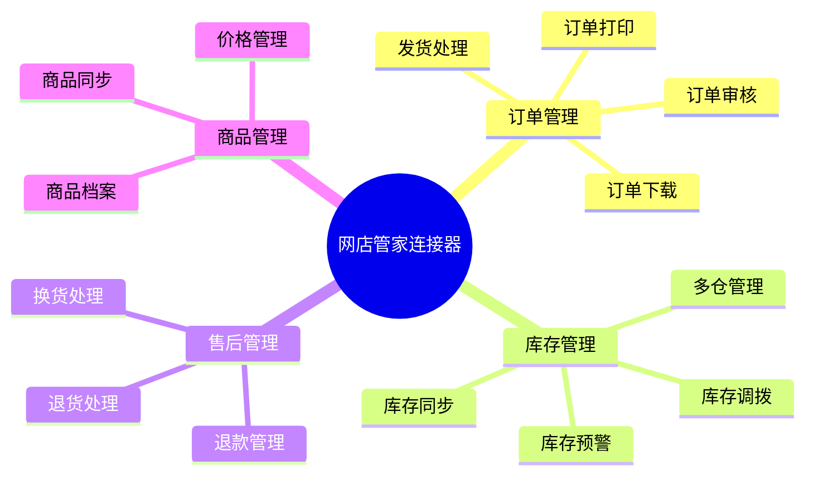
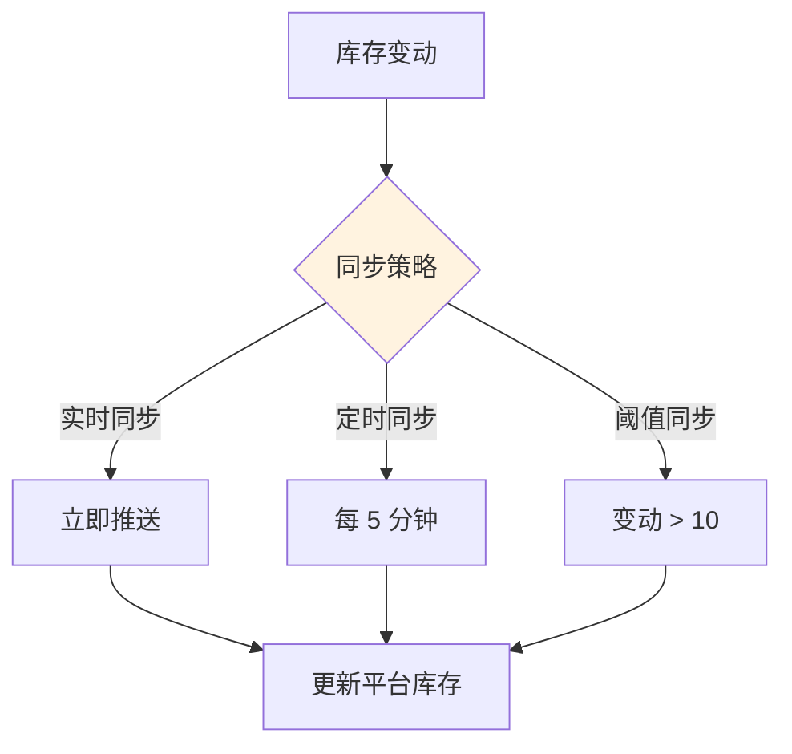

# 网店管家连接器

网店管家是一款成熟的电商 ERP 软件，专注于订单处理、库存管理、售后处理等电商核心业务。轻易云 iPaaS 提供专用的网店管家连接器，帮助企业实现网店管家与 ERP、WMS 等系统的数据集成。

## 连接器概述

### 产品简介

网店管家具有以下特点：

- **订单处理**：高效的订单批量处理能力
- **多平台支持**：支持主流电商平台接入
- **库存管理**：多仓库、多渠道库存统一管理
- **售后管理**：完善的退换货处理流程
- **数据开放**：标准 API 接口，支持系统集成

### 核心功能



## 配置说明

### 前置条件

1. **开通 API 权限**
   - 登录网店管家后台
   - 进入【系统设置】→【API 设置】
   - 申请开通 API 访问权限

2. **获取连接信息**

| 参数 | 说明 | 获取位置 |
|-----|------|---------|
| `appKey` | 应用标识 | API 设置页面 |
| `appSecret` | 应用密钥 | API 设置页面 |
| `shopId` | 店铺 ID | 店铺管理页面 |

### 连接配置参数

| 参数名 | 类型 | 必填 | 说明 |
|-------|------|------|------|
| `baseUrl` | string | ✅ | API 基础地址 |
| `appKey` | string | ✅ | 应用标识 |
| `appSecret` | string | ✅ | 应用密钥 |
| `shopId` | string | ✅ | 店铺 ID |
| `timeout` | number | — | 超时时间（毫秒） |

### 配置示例

```json
{
  "baseUrl": "https://api.wdgj.com",
  "appKey": "your-app-key",
  "appSecret": "your-app-secret",
  "shopId": "your-shop-id",
  "timeout": 30000
}
```

## 常用接口

### 订单接口

| 接口名称 | 接口标识 | 类型 | 说明 |
|---------|---------|------|------|
| 订单查询 | `/order/list` | 查询 | 查询订单列表 |
| 订单详情 | `/order/detail` | 查询 | 查询订单详情 |
| 订单发货 | `/order/delivery` | 写入 | 订单发货处理 |
| 订单备注 | `/order/remark` | 写入 | 添加订单备注 |

### 库存接口

| 接口名称 | 接口标识 | 类型 | 说明 |
|---------|---------|------|------|
| 库存查询 | `/stock/query` | 查询 | 查询商品库存 |
| 库存同步 | `/stock/sync` | 写入 | 同步库存数量 |
| 库存变动 | `/stock/log` | 查询 | 查询库存变动 |

### 商品接口

| 接口名称 | 接口标识 | 类型 | 说明 |
|---------|---------|------|------|
| 商品查询 | `/goods/list` | 查询 | 查询商品列表 |
| 商品详情 | `/goods/detail` | 查询 | 查询商品详情 |
| 商品修改 | `/goods/update` | 写入 | 修改商品信息 |

### 售后接口

| 接口名称 | 接口标识 | 类型 | 说明 |
|---------|---------|------|------|
| 退款查询 | `/refund/list` | 查询 | 查询退款单 |
| 退货查询 | `/return/list` | 查询 | 查询退货单 |
| 售后处理 | `/refund/deal` | 写入 | 处理售后单 |

## 使用示例

### 查询订单列表

```json
{
  "api": "/order/list",
  "method": "POST",
  "body": {
    "startTime": "2026-03-01 00:00:00",
    "endTime": "2026-03-13 23:59:59",
    "pageNo": 1,
    "pageSize": 50,
    "status": "待发货"
  }
}
```

**响应示例**：

```json
{
  "code": 200,
  "message": "success",
  "data": {
    "total": 100,
    "list": [
      {
        "orderNo": "TB20260313001",
        "platform": "淘宝",
        "shopName": "测试店铺",
        "status": "待发货",
        "buyerNick": "买家昵称",
        "receiverName": "张三",
        "receiverMobile": "13800138000",
        "receiverAddress": "北京市朝阳区",
        "payment": 199.99,
        "postage": 10.00,
        "items": [
          {
            "skuCode": "SKU001",
            "skuName": "商品 A",
            "quantity": 2,
            "price": 99.99
          }
        ]
      }
    ]
  }
}
```

### 订单发货

```json
{
  "api": "/order/delivery",
  "method": "POST",
  "body": {
    "orderNo": "TB20260313001",
    "logisticsCompany": "顺丰速运",
    "logisticsNo": "SF1234567890",
    "warehouse": "默认仓库",
    "items": [
      {
        "skuCode": "SKU001",
        "quantity": 2
      }
    ]
  }
}
```

### 同步库存

```json
{
  "api": "/stock/sync",
  "method": "POST",
  "body": {
    "warehouse": "默认仓库",
    "items": [
      {
        "skuCode": "SKU001",
        "quantity": 100
      },
      {
        "skuCode": "SKU002",
        "quantity": 50
      }
    ]
  }
}
```

### 查询库存

```json
{
  "api": "/stock/query",
  "method": "POST",
  "body": {
    "warehouse": "默认仓库",
    "skuCodes": ["SKU001", "SKU002"]
  }
}
```

## 适配器配置

### 查询适配器

```json
{
  "source": {
    "adapter": "WangdianguanjiaQueryAdapter",
    "api": "/order/list",
    "params": {
      "startTime": "{{startTime}}",
      "endTime": "{{endTime}}",
      "pageNo": 1,
      "pageSize": 100
    }
  }
}
```

### 写入适配器

```json
{
  "target": {
    "adapter": "WangdianguanjiaExecuteAdapter",
    "api": "/order/delivery",
    "mapping": {
      "orderNo": "{{orderNo}}",
      "logisticsCompany": "{{logisticsCompany}}",
      "logisticsNo": "{{logisticsNo}}"
    }
  }
}
```

## 常见问题

### Q: 如何获取店铺 ID？

1. 登录网店管家后台
2. 进入【基础设置】→【店铺管理】
3. 查看店铺列表中的【店铺 ID】

### Q: 连接测试失败？

**排查步骤：**

1. 检查 `appKey` 和 `appSecret` 是否正确
2. 确认 `shopId` 是否正确
3. 验证 API 权限已开通
4. 检查网络连通性

### Q: 订单状态有哪些？

| 状态 | 说明 |
|-----|------|
| `待付款` | 订单未付款 |
| `待审核` | 已付款待审核 |
| `待发货` | 审核通过待发货 |
| `已发货` | 已发货待签收 |
| `已完成` | 订单已完成 |
| `已关闭` | 订单已关闭 |
| `退款中` | 退款处理中 |

### Q: 分页查询限制？

| 参数 | 默认值 | 最大值 | 说明 |
|-----|--------|--------|------|
| `pageNo` | 1 | — | 当前页码 |
| `pageSize` | 50 | 200 | 每页条数 |

### Q: 如何映射平台编码？

| 平台名称 | 平台编码 |
|---------|---------|
| 淘宝/天猫 | `taobao` |
| 京东 | `jd` |
| 拼多多 | `pdd` |
| 抖音 | `douyin` |
| 快手 | `kuaishou` |

### Q: 库存同步策略建议？



## 相关资源

- [网店管家官网](http://www.wdgj.com/)
- [网店精灵连接器](./wangdianjingling)
- [旺店通连接器](./wangdian)
- [电商连接器概览](../ecommerce)

> [!NOTE]
> 网店管家的 API 能力可能因版本不同有所差异，建议参考具体版本的接口文档。
