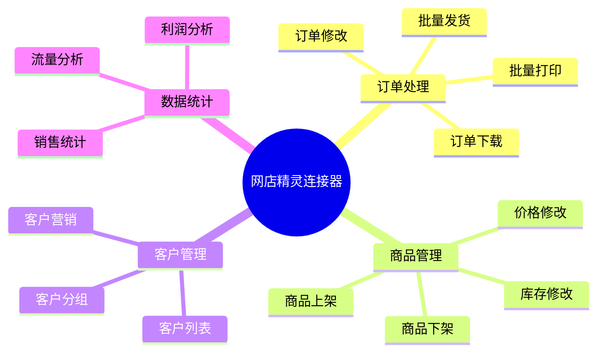

# 网店精灵连接器

网店精灵是一款专业的电商店铺管理工具，提供订单批量处理、商品管理、数据统计等功能，帮助卖家提升店铺运营效率。轻易云 iPaaS 提供专用的网店精灵连接器，实现网店精灵与 ERP、WMS 等系统的数据集成。

## 连接器概述

### 产品简介

网店精灵具有以下特点：

- **批量处理**：订单、商品的批量操作能力
- **多店管理**：支持多店铺统一管理
- **智能工具**：自动评价、自动上下架等智能功能
- **数据统计**：销售数据、流量数据统计分析
- **开放接口**：支持 API 对接，系统集成

### 核心功能



## 配置说明

### 前置条件

1. **开通 API 权限**
   - 登录网店精灵后台
   - 进入【设置】→【API 管理】
   - 申请开通 API 访问

2. **获取连接信息**

| 参数 | 说明 | 获取位置 |
|-----|------|---------|
| `apiKey` | API 密钥 | API 管理页面 |
| `apiSecret` | API 密钥 | API 管理页面 |
| `shopKey` | 店铺密钥 | 店铺管理页面 |

### 连接配置参数

| 参数名 | 类型 | 必填 | 说明 |
|-------|------|------|------|
| `baseUrl` | string | ✅ | API 基础地址 |
| `apiKey` | string | ✅ | API 密钥 |
| `apiSecret` | string | ✅ | API 密钥 |
| `shopKey` | string | ✅ | 店铺密钥 |
| `timeout` | number | — | 超时时间（毫秒） |

### 配置示例

```json
{
  "baseUrl": "https://api.wdjl.com",
  "apiKey": "your-api-key",
  "apiSecret": "your-api-secret",
  "shopKey": "your-shop-key",
  "timeout": 30000
}
```

## 常用接口

### 订单接口

| 接口名称 | 接口标识 | 类型 | 说明 |
|---------|---------|------|------|
| 订单查询 | `/trade/list` | 查询 | 查询交易订单 |
| 订单详情 | `/trade/detail` | 查询 | 查询订单详情 |
| 订单发货 | `/trade/send` | 写入 | 订单发货 |
| 修改订单 | `/trade/modify` | 写入 | 修改订单信息 |

### 商品接口

| 接口名称 | 接口标识 | 类型 | 说明 |
|---------|---------|------|------|
| 商品列表 | `/item/list` | 查询 | 查询商品列表 |
| 商品详情 | `/item/detail` | 查询 | 查询商品详情 |
| 修改库存 | `/item/stock` | 写入 | 修改商品库存 |
| 修改价格 | `/item/price` | 写入 | 修改商品价格 |
| 上下架 | `/item/listing` | 写入 | 商品上下架 |

### 物流接口

| 接口名称 | 接口标识 | 类型 | 说明 |
|---------|---------|------|------|
| 物流列表 | `/logistics/list` | 查询 | 查询物流公司 |
| 面单打印 | `/waybill/print` | 写入 | 打印电子面单 |

### 统计接口

| 接口名称 | 接口标识 | 类型 | 说明 |
|---------|---------|------|------|
| 销售统计 | `/statistics/sales` | 查询 | 销售数据统计 |
| 订单统计 | `/statistics/trade` | 查询 | 订单数据统计 |

## 使用示例

### 查询交易订单

```json
{
  "api": "/trade/list",
  "method": "POST",
  "body": {
    "startTime": "2026-03-01 00:00:00",
    "endTime": "2026-03-13 23:59:59",
    "page": 1,
    "pageSize": 50,
    "status": "WAIT_SELLER_SEND_GOODS"
  }
}
```

**响应示例**：

```json
{
  "code": 200,
  "message": "success",
  "data": {
    "total": 200,
    "list": [
      {
        "tid": "123456789",
        "platform": "taobao",
        "status": "WAIT_SELLER_SEND_GOODS",
        "buyerNick": "买家昵称",
        "payment": 299.99,
        "postFee": 0,
        "created": "2026-03-13 10:30:00",
        "receiver": {
          "name": "张三",
          "mobile": "13800138000",
          "address": "北京市朝阳区"
        },
        "orders": [
          {
            "oid": "1234567891",
            "numIid": "456789",
            "title": "商品标题",
            "skuId": "789012",
            "skuProperties": "颜色:红色;尺码:L",
            "price": 299.99,
            "num": 1
          }
        ]
      }
    ]
  }
}
```

### 订单发货

```json
{
  "api": "/trade/send",
  "method": "POST",
  "body": {
    "tid": "123456789",
    "companyCode": "SF",
    "outSid": "SF1234567890"
  }
}
```

### 修改商品库存

```json
{
  "api": "/item/stock",
  "method": "POST",
  "body": {
    "numIid": "456789",
    "skuId": "789012",
    "quantity": 100
  }
}
```

### 查询商品列表

```json
{
  "api": "/item/list",
  "method": "POST",
  "body": {
    "page": 1,
    "pageSize": 50,
    "status": "onsale"
  }
}
```

## 适配器配置

### 查询适配器

```json
{
  "source": {
    "adapter": "WangdianjinglingQueryAdapter",
    "api": "/trade/list",
    "params": {
      "startTime": "{{startTime}}",
      "endTime": "{{endTime}}",
      "page": 1,
      "pageSize": 100
    }
  }
}
```

### 写入适配器

```json
{
  "target": {
    "adapter": "WangdianjinglingExecuteAdapter",
    "api": "/trade/send",
    "mapping": {
      "tid": "{{orderNo}}",
      "companyCode": "{{logisticsCode}}",
      "outSid": "{{logisticsNo}}"
    }
  }
}
```

## 常见问题

### Q: 如何获取 API 密钥？

1. 登录网店精灵后台
2. 进入【设置】→【API 管理】
3. 点击【生成密钥】
4. 复制 `apiKey` 和 `apiSecret`

### Q: 连接测试失败？

**排查步骤：**

1. 检查 `apiKey` 和 `apiSecret` 是否正确
2. 确认 `shopKey` 是否正确
3. 验证 API 权限已开通
4. 检查网络连通性

### Q: 订单状态说明？

| 状态 | 说明 |
|-----|------|
| `WAIT_BUYER_PAY` | 等待买家付款 |
| `WAIT_SELLER_SEND_GOODS` | 等待卖家发货 |
| `SELLER_CONSIGNED_PART` | 卖家部分发货 |
| `WAIT_BUYER_CONFIRM_GOODS` | 等待买家确认收货 |
| `TRADE_FINISHED` | 交易成功 |
| `TRADE_CLOSED` | 交易关闭 |

### Q: 分页查询参数？

| 参数 | 默认值 | 最大值 | 说明 |
|-----|--------|--------|------|
| `page` | 1 | — | 当前页码 |
| `pageSize` | 50 | 100 | 每页条数 |

### Q: 物流公司编码？

| 物流公司 | 编码 |
|---------|------|
| 顺丰速运 | `SF` |
| 中通快递 | `ZTO` |
| 圆通速递 | `YTO` |
| 申通快递 | `STO` |
| 韵达速递 | `YD` |
| 邮政 EMS | `EMS` |

### Q: 平台编码说明？

| 平台 | 编码 |
|-----|------|
| 淘宝 | `taobao` |
| 天猫 | `tmall` |
| 京东 | `jd` |
| 拼多多 | `pdd` |
| 1688 | `1688` |

## 相关资源

- [网店精灵官网](https://www.wdjl.com/)
- [网店管家连接器](./wangdianguanjia)
- [旺店通连接器](./wangdian)
- [电商连接器概览](../ecommerce)

> [!NOTE]
> 网店精灵的 API 能力可能因版本不同有所差异，建议参考具体版本的接口文档。
