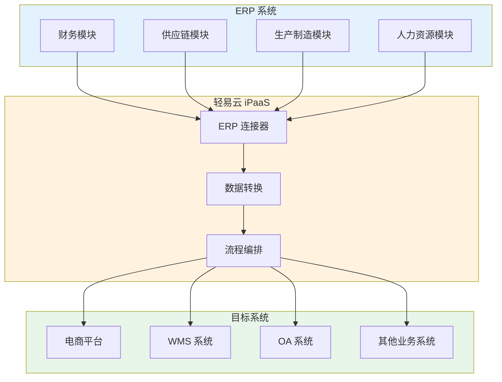
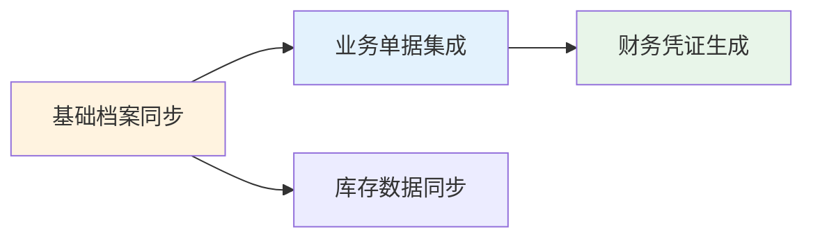
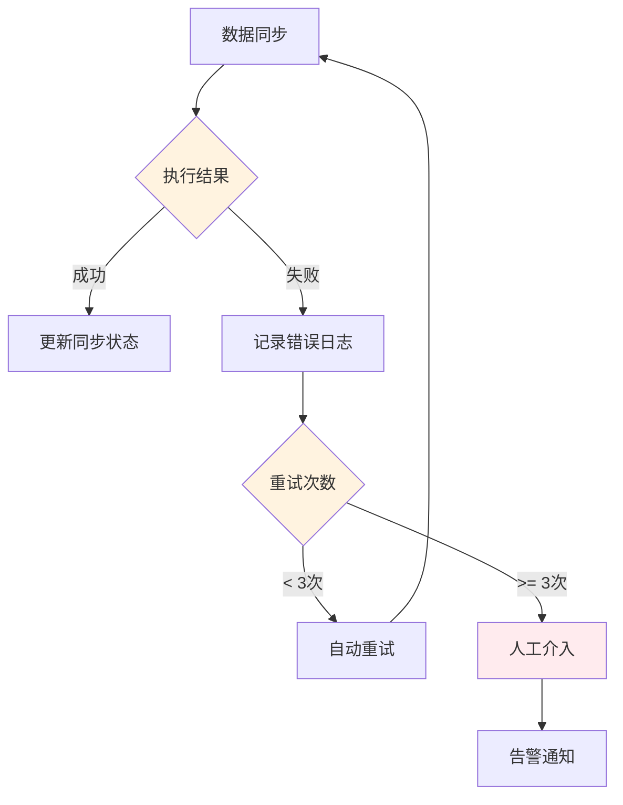
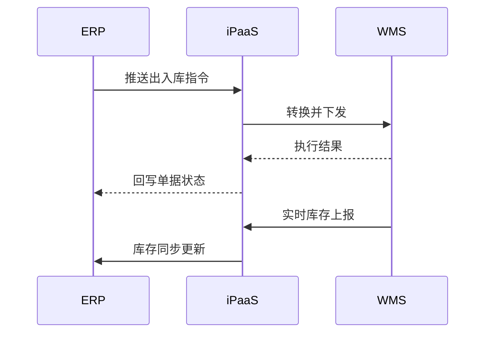

# ERP 类连接器概览

轻易云 iPaaS 平台提供丰富的 ERP 系统连接器，覆盖国内企业主流的 ERP 产品，包括金蝶、用友、畅捷通、Oracle 等品牌，帮助企业实现 ERP 系统与其他业务系统的无缝集成。

## ERP 连接器介绍

ERP（Enterprise Resource Planning，企业资源计划）系统是企业管理的核心系统，涵盖财务、供应链、生产制造、人力资源等业务领域。轻易云 iPaaS 的 ERP 连接器通过标准化的接口适配，实现以下核心能力：

- **基础档案同步**：物料、客户、供应商、部门、人员等主数据双向同步
- **业务单据集成**：采购订单、销售订单、出入库单、财务凭证的自动化流转
- **库存数据交互**：实时库存查询、库存台账同步
- **财务数据对接**：凭证生成、科目余额查询、账簿数据抽取



## 支持的 ERP 系统列表

### 金蝶系列

| 系统名称 | 连接器标识 | 适用企业规模 | 主要功能 |
|---------|-----------|-------------|---------|
| [金蝶云星空](./erp/kingdee-cloud-cosmos) | `kingdee-cloud-cosmos` | 中大型 | 财务、供应链、生产 |
| [金蝶云星辰](./erp/kingdee-cloud-star) | `kingdee-cloud-star` | 中小微 | 财务、进销存 |
| [金蝶云 Galaxy](./erp/kingdee-cloud-galaxy) | `kingdee-cloud-galaxy` | 大型 | 多组织、集团管控 |
| [金蝶 EAS](./erp/kingdee-eas) | `kingdee-eas` | 大型集团 | 集团财务、资金 |
| [金蝶 K/3 WISE](./erp/kingdee-k3wise) | `kingdee-k3wise` | 中型 | 财务、供应链 |
| [金蝶 KIS](./erp/kingdee-kis) | `kingdee-kis` | 小微 | 财务、商贸 |

### 用友系列

| 系统名称 | 连接器标识 | 适用企业规模 | 主要功能 |
|---------|-----------|-------------|---------|
| [用友 U8+](./erp/yonyou-u8) | `yonyou-u8` | 中型 | 财务、供应链、生产 |
| [用友 NC](./erp/yonyou-nc) | `yonyou-nc` | 大型集团 | 集团管控、财务 |
| [用友 NC Cloud](./erp/yonyou-nc-cloud) | `yonyou-nc-cloud` | 大型集团 | 云原生、数字化 |
| [用友 U9](./erp/yonyou-u9) | `yonyou-u9` | 中大型制造 | 多工厂、多组织 |
| [用友 BIP](./erp/yonyou-bip) | `yonyou-bip` | 大型集团 | 商业创新平台 |
| [用友 YonSuite](./erp/yonyou-yonsuite) | `yonyou-yonsuite` | 成长型 | 云 ERP 全场景 |

### 畅捷通系列

| 系统名称 | 连接器标识 | 适用企业规模 | 主要功能 |
|---------|-----------|-------------|---------|
| [畅捷通 T+](./erp/chanjet-tplus) | `chanjet-tplus` | 中小微 | 云管理、移动应用 |
| [畅捷通好会计](./erp/chanjet-accounting) | `chanjet-accounting` | 小微 | 智能云财务 |
| [畅捷通 T3/T6](./erp/chanjet) | `chanjet` | 小微 | 财务、进销存 |

### 其他 ERP

| 系统名称 | 连接器标识 | 适用企业规模 | 主要功能 |
|---------|-----------|-------------|---------|
| [Oracle EBS](./erp/oracle-ebs) | `oracle-ebs` | 大型跨国 | 全球化、制造业 |

## ERP 集成最佳实践

### 1. 基础数据优先原则

在集成业务单据之前，务必先完成基础档案的同步：



**基础档案优先级**：
1. 组织架构（部门、人员）
2. 物料/商品档案
3. 客户档案
4. 供应商档案
5. 仓库档案
6. 会计科目

### 2. 数据映射标准化

建立统一的编码映射规范，避免数据混乱：

| 映射类型 | 说明 | 示例 |
|---------|------|------|
| 直接映射 | 编码完全一致 | `A001` → `A001` |
| 对照表映射 | 通过映射表转换 | `SKU123` → `M001` |
| 规则映射 | 按规则生成 | `CUST_` + 序号 |
| 混合映射 | 多种方式组合 | 客户分类 + 编码 |

### 3. 增量同步策略

对于大数据量场景，采用增量同步减少系统压力：

```json
{
  "syncStrategy": {
    "type": "incremental",
    "timestampField": "lastModifiedTime",
    "batchSize": 500,
    "schedule": "0 */5 * * * *"
  }
}
```

### 4. 异常处理机制

建立完善的异常处理和补偿机制：



## 通用配置说明

### 连接配置参数

| 参数名 | 类型 | 必填 | 说明 |
|-------|------|------|------|
| `server_url` | string | ✅ | ERP 服务器地址 |
| `app_key` | string | ✅ | 应用标识 |
| `app_secret` | string | ✅ | 应用密钥 |
| `account_id` | string | ✅ | 账套/组织 ID |
| `timeout` | number | — | 连接超时时间（毫秒） |
| `retry_times` | number | — | 重试次数 |

### 适配器选择

| 操作类型 | 适配器名称 | 说明 |
|---------|-----------|------|
| 查询 | `ERPQueryAdapter` | 标准查询适配器 |
| 写入 | `ERPWriteAdapter` | 标准写入适配器 |
| 批量写入 | `ERPBatchAdapter` | 批量数据写入 |
| 审核 | `ERPAuditAdapter` | 单据审核操作 |

### 分页配置

```json
{
  "pagination": {
    "enabled": true,
    "pageSize": 500,
    "pageParam": "pageIndex",
    "sizeParam": "pageSize"
  }
}
```

> [!TIP]
> 建议分页大小设置在 100~1000 之间，根据实际数据量和网络状况调整。

## 集成场景示例

### 场景一：ERP 与电商平台集成


**核心流程**：
1. 电商平台订单自动推送
2. 轻易云进行数据清洗和格式转换
3. 生成 ERP 销售订单
4. ERP 出库后回传物流信息
5. 同步库存到电商平台

### 场景二：ERP 与 WMS 集成



## 相关文档

- [连接器快速入门](../guide/configure-connector)
- [数据映射指南](../guide/data-mapping)
- [集成方案配置](../guide/create-integration)
- [ERP 连接器目录](./erp/README)

> [!NOTE]
> 如需接入未列出的 ERP 系统，请联系轻易云技术支持团队或参考 [自定义连接器开发](../developer/custom-connector) 文档自行开发。
