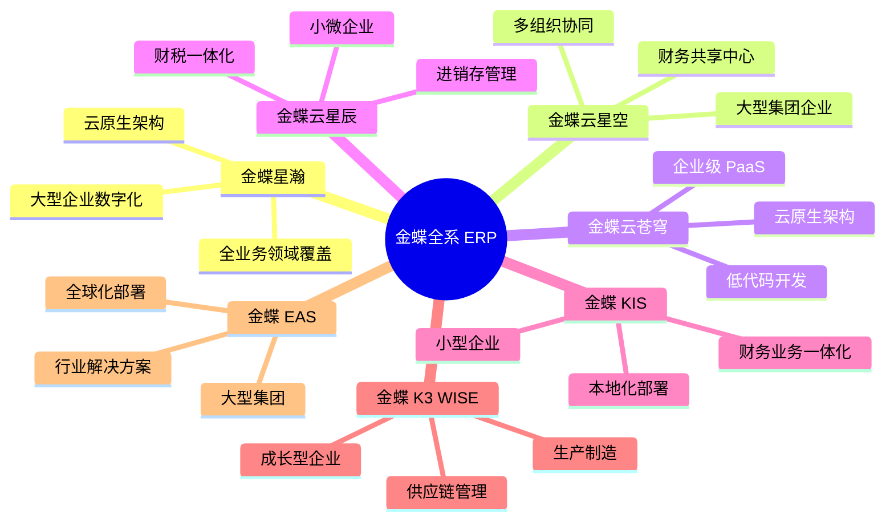
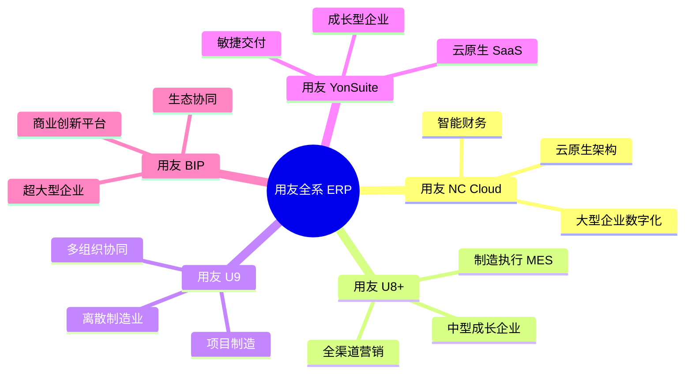
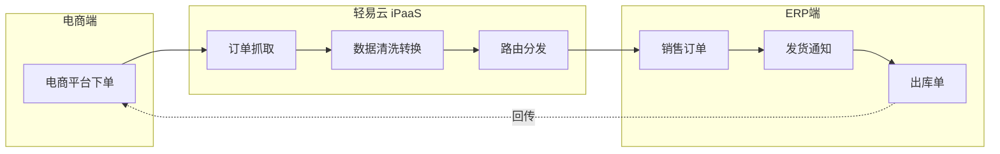
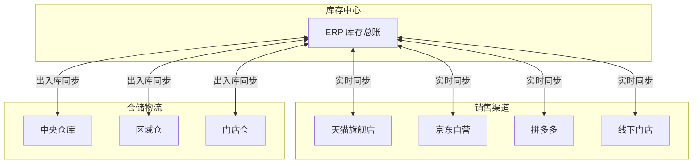
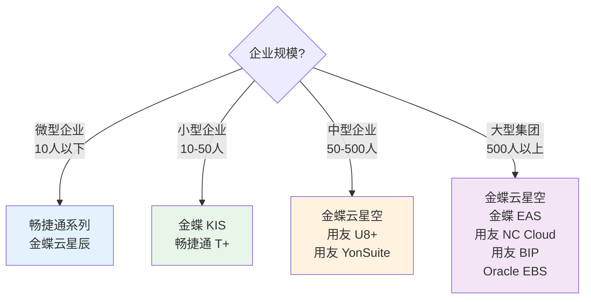

# ERP 类连接器

本文档汇总轻易云 iPaaS 支持的所有 ERP（Enterprise Resource Planning，企业资源计划）系统连接器，帮助企业实现核心业务系统与其他应用的数据互通。涵盖金蝶、用友、畅捷通、Oracle EBS 等主流 ERP 品牌全系产品。

> [!TIP]
> 如需了解连接器的基础使用方法，请先阅读 [配置连接器](../../guide/configure-connector)。

---

## 连接器总览

轻易云 iPaaS 目前支持 **11+** 款 ERP 系统连接器，覆盖国产 ERP 市场占有率最高的金蝶、用友全系产品，以及 Oracle EBS 等国际主流 ERP 系统。

| 品牌 | 连接器 | 适用场景 | 状态 |
|------|--------|----------|------|
| **金蝶** | [金蝶星瀚](./kingdee-galaxystar) | 大型企业数字化平台 | 🆕 新增 |
| | [金蝶云星空](./kingdee-cloud-galaxy) | 中大型集团企业 | ✅ 稳定 |
| | [金蝶云苍穹](./kingdee-cloud-cosmos) | 企业级 PaaS 平台 | ✅ 稳定 |
| | [金蝶云星辰](./kingdee-cloud-star) | 小微型企业 | ✅ 稳定 |
| | [金蝶 KIS](./kingdee-kis) | 小型企业财务业务一体化 | ✅ 稳定 |
| | [金蝶 K3 WISE](./kingdee-k3wise) | 成长型企业 | ✅ 稳定 |
| | [金蝶 EAS](./kingdee-eas) | 大型集团企业 | ✅ 稳定 |
| **用友** | [用友 NC](./yonyou-nc) | 大型集团企业 | ✅ 稳定 |
| | [用友 NC Cloud](./yonyou-nc-cloud) | 大型集团企业云原生 | 🆕 新增 |
| | [用友 U8+](./yonyou-u8) | 中型成长企业 | ✅ 稳定 |
| | [用友 U9](./yonyou-u9) | 离散制造行业 | ✅ 稳定 |
| | [用友 YonSuite](./yonyou-yonsuite) | 成长型企业云 ERP | ✅ 稳定 |
| | [用友 BIP](./yonyou-bip) | 大型企业数智化平台 | ✅ 稳定 |
| **畅捷通** | [畅捷通 T+](./chanjet-tplus) | 商贸及工贸企业 | ✅ 稳定 |
| | [畅捷通好会计](./chanjet-accounting) | 小微企业财税管理 | ✅ 稳定 |
| | [畅捷通好业财](./chanjet-business) | 小微企业业财一体 | ✅ 稳定 |
| **Oracle** | [Oracle EBS](./oracle-ebs) | 大型跨国企业 | 🆕 新增 |

---

## 按品牌分类

### 金蝶全系

金蝶是中国领先的企业管理软件及云服务提供商，产品线覆盖从微型企业到大型集团的全场景需求。

#### 金蝶产品选型指南

| 企业规模 | 推荐产品 | 核心特点 |
|----------|----------|----------|
| 超大型企业（1000 人以上） | 金蝶星瀚 | 云原生架构，全业务数字化 |
| 大型集团（500 人以上） | 金蝶星瀚 / 云星空 / EAS | 集团管控，财务共享 |
| 中型企业（50-500 人） | 金蝶云星空 | 支持多组织，扩展性强 |
| 小型企业（10-50 人） | 金蝶 KIS / 云星辰 | 功能完整，操作简单 |
| 微型企业（10 人以下） | 金蝶云星辰 | 开箱即用，免部署，价格低 |
| 建筑/房地产 | 金蝶 EAS / 星瀚 | 行业解决方案成熟 |
| 离散制造 | 金蝶云星空 / 星瀚 | MRP / APS 能力突出 |

> [!NOTE]
> 金蝶各产品间的数据迁移方案请参考 [金蝶系产品数据迁移指南](./kingdee-migration-guide)。

---

### 用友全系

用友网络是全球领先的企业云服务平台，服务超过 700 万家企业，YonBIP 平台是国内首个纯云原生的企业级 PaaS 平台。

#### 用友产品选型指南

| 企业规模 | 推荐产品 | 核心特点 |
|----------|----------|----------|
| 中型制造企业 | 用友 U8+ | 制造模块完善，行业经验丰富 |
| 离散/项目制造 | 用友 U9 | 项目制造、按单设计能力强 |
| 大型集团企业 | 用友 NC Cloud | 集团财务、人力资源领先 |
| 快速成长的中小企业 | 用友 YonSuite | 云原生、按需订阅、快速上线 |
| 超大型集团 | 用友 BIP | 商业创新、产业互联网平台 |

---

### 畅捷通系列

畅捷通信息技术股份有限公司是用友集团旗下的成员企业，专注为小微企业提供财务及管理服务。

| 连接器 | 定位 | 核心功能 |
|--------|------|----------|
| [畅捷通 T+](./chanjet-tplus) | 商贸及工贸企业 | 进销存、财务、生产一体化 |
| [畅捷通好会计](./chanjet-accounting) | 小微企业财税 | 智能记账、一键报税 |
| [畅捷通好业财](./chanjet-business) | 小微企业业财 | 业务财务深度融合 |

> [!TIP]
> 畅捷通产品采用云原生架构，支持多端访问（PC、APP、小程序），适合移动办公场景。

---

### Oracle EBS

Oracle E-Business Suite（EBS）是全球大型跨国企业广泛使用的 ERP 系统，功能覆盖财务、供应链、制造、人力资源等全业务领域。

| 特性 | 说明 |
|------|------|
| 适用对象 | 大型跨国企业、上市公司、外资企业在华分支机构 |
| 部署方式 | 本地部署、私有云、Oracle Cloud |
| 集成方式 | WebService、REST API、数据库直连 |
| 主要模块 | GL 总账、AP 应付、AR 应收、PO 采购、INV 库存、OM 订单、WIP 生产 |

> [!IMPORTANT]
> Oracle EBS 集成通常需要具备 EBS 技术背景的顾问参与，涉及接口开发、PL/SQL 存储过程等技术工作。

---

## 通用集成场景

ERP 系统作为企业核心业务系统，与周边系统的集成场景高度相似。以下是轻易云 iPaaS 支持的典型 ERP 集成场景：

### 1. 基础资料同步

确保各系统间基础数据的一致性，避免信息孤岛。

| 数据类型 | 同步方向 | 典型场景 |
|----------|----------|----------|
| 物料 / 商品 | ERP ↔ 电商平台 | 商品信息上下架同步 |
| 客户 / 供应商 | ERP ↔ CRM | 客户主数据统一管理 |
| 组织架构 | ERP → OA / 钉钉 | 人员信息自动同步 |
| 科目 / 核算维度 | ERP → 费控系统 | 预算控制口径一致 |

### 2. 业务单据流转

实现业务流程跨系统自动化，减少人工录入。

| 业务场景 | 源系统 | 目标系统 | 同步内容 |
|----------|--------|----------|----------|
| 电商订单对接 | 旺店通 / 聚水潭 | 金蝶 / 用友 | 销售订单、发货单、退款单 |
| 采购业务协同 | SRM 系统 | ERP | 采购订单、收货单、对账单 |
| 费用报销 | OA / 钉钉 | ERP | 报销单、付款单、凭证 |
| 生产指令 | MES | ERP | 生产订单、领料单、入库单 |

### 3. 财务凭证对接

实现业财一体化，自动生成财务凭证。

- **业务系统 → ERP**：电商平台、WMS、OMS 等业务数据自动生成会计凭证
- **费控系统 → ERP**：报销审批完成后自动生成付款凭证
- **银行系统 → ERP**：银行流水自动对账、生成收付款凭证

### 4. 库存实时同步

实现全渠道库存共享，避免超卖或断货。

### 5. 报表数据抽取

将 ERP 数据抽取至数据仓库或 BI 系统，支持管理决策。

| 报表类型 | 数据来源 | 目标系统 |
|----------|----------|----------|
| 财务报表 | 总账、应收应付 | BI 系统、数据大屏 |
| 销售分析 | 销售订单、出库单 | 数据中台、领导驾驶舱 |
| 库存分析 | 库存账、出入库流水 | 库存预警系统 |
| 成本分析 | 生产成本、物料成本 | 成本管理系统 |

---

## 连接器选择指南

### 根据企业规模选择

### 根据行业特性选择

| 行业 | 推荐 ERP | 理由 |
|------|----------|------|
| 离散制造 | 用友 U9、金蝶云星空 | 项目制造、MRP 能力强 |
| 流程制造 | 金蝶云星空、用友 U8+ | 配方管理、批次追溯 |
| 商贸流通 | 畅捷通 T+、金蝶云星辰 | 进销存灵活、价格策略丰富 |
| 连锁零售 | 金蝶云星空、用友 NC | 多组织、全渠道能力 |
| 建筑工程 | 金蝶 EAS、用友 NC | 项目核算、工程管理 |
| 跨国企业 | Oracle EBS | 多币种、多会计准则、全球化部署 |

---

## 快速开始

### 第一步：创建 ERP 连接

1. 登录轻易云 iPaaS 控制台
2. 进入 **连接器管理** → **新建连接器**
3. 选择对应的 ERP 品牌与产品版本
4. 填写连接参数（应用 ID、密钥、数据中心等）
5. 点击 **测试连接** 验证连通性

> [!TIP]
> 不同 ERP 系统的授权方式各异，请参考对应连接器的详细文档获取配置参数。

### 第二步：配置集成方案

1. 进入 **集成方案** → **新建方案**
2. 选择源平台（ERP 或其他系统）
3. 选择目标平台（ERP 或其他系统）
4. 配置数据映射与转换规则
5. 设置调度策略与异常处理

### 第三步：测试与上线

1. 使用 **调试模式** 验证数据流转
2. 检查数据完整性与准确性
3. 配置监控告警
4. 切换至生产环境运行

---

## 常见问题

### Q: 金蝶云星空与金蝶云苍穹有什么区别？

金蝶云星空是面向中大型企业的 SaaS ERP，功能覆盖财务、供应链、生产制造等全业务领域；金蝶云苍穹是企业级 PaaS 平台，提供低代码开发能力，企业可基于苍穹平台构建个性化应用。

### Q: 用友 U8+ 与 YonSuite 如何选择？

U8+ 是用友传统的产品化 ERP，功能成熟稳定，适合有明确需求的中型企业；YonSuite 是云原生 SaaS 产品，部署快、按需订阅，适合快速成长的中小企业。

### Q: ERP 与电商平台对接需要多长时间？

标准场景（订单、库存、商品同步）通常 **1-2 周**可完成上线。涉及复杂业务（如多仓发货、预售规则、退换货）可能需要 **3-4 周**。

### Q: 是否可以同时对接多个 ERP 系统？

可以。轻易云 iPaaS 支持同时连接多个 ERP 系统，适用于集团型企业多品牌 ERP 并存、或并购后系统整合的场景。

---

## 相关资源

- [配置连接器](../../guide/configure-connector) — 连接器基础使用指南
- [自定义连接器开发](../../developer/custom-connector) — 开发自定义连接器
- [标准集成方案](../../standard-schemes/erp-integration) — ERP 对接最佳实践
- [解决方案 — 制造业](../../solutions/manufacturing) — 制造行业集成方案
- [解决方案 — 零售业](../../solutions/retail) — 零售行业集成方案

---

> [!NOTE]
> 本文档持续更新中，如有疑问请联系轻易云技术支持团队。
