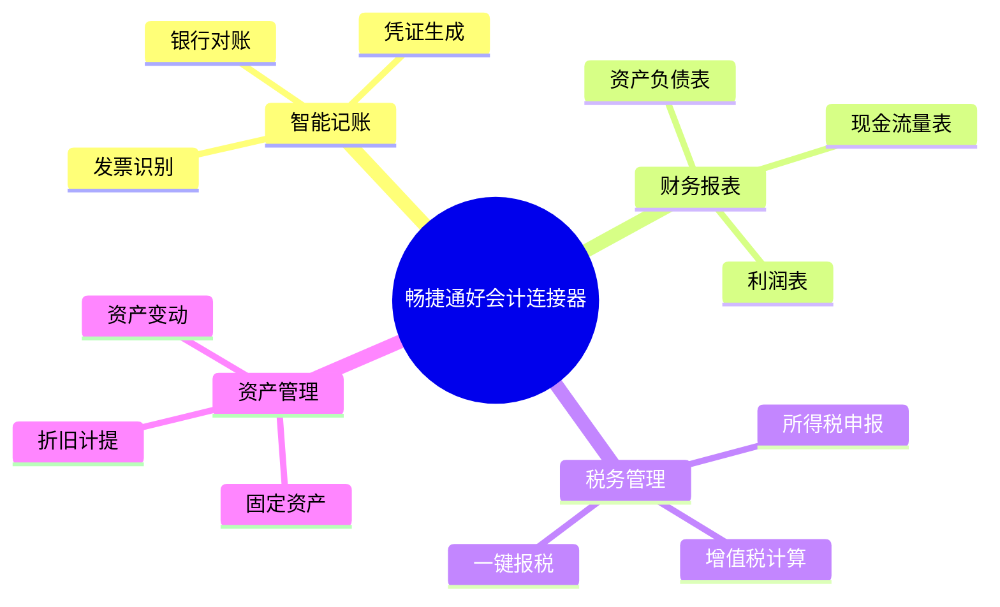

# 畅捷通好会计连接器

畅捷通好会计是面向小微企业的智能云财务软件，提供在线记账、自动报表、税务管理等功能。轻易云 iPaaS 提供专用的好会计连接器，帮助企业实现好会计与业务系统的财务数据集成。

## 连接器概述

### 产品简介

畅捷通好会计具有以下特点：

- **云端部署**：无需安装，浏览器即用
- **智能记账**：智能识别发票，自动生成凭证
- **多端同步**：PC、手机、小程序多端操作
- **税务合规**：自动算税，一键报税
- **开放接口**：标准 API，支持数据集成

### 核心功能



## 配置说明

### 前置条件

1. **开通 API 权限**
   - 登录好会计管理后台
   - 进入【设置】→【开放接口】
   - 申请开通 API 访问

2. **获取授权信息**

| 参数 | 说明 | 获取位置 |
|-----|------|---------|
| `appKey` | 应用标识 | 开放接口页面 |
| `appSecret` | 应用密钥 | 开放接口页面 |
| `orgId` | 企业 ID | 企业信息页面 |
| `accountId` | 账套 ID | 账套管理页面 |

### 连接配置参数

| 参数名 | 类型 | 必填 | 说明 |
|-------|------|------|------|
| `appKey` | string | ✅ | 应用标识 |
| `appSecret` | string | ✅ | 应用密钥 |
| `orgId` | string | ✅ | 企业组织 ID |
| `accountId` | string | ✅ | 账套 ID |
| `baseUrl` | string | — | API 基础地址 |
| `timeout` | number | — | 请求超时时间 |

### 配置示例

```json
{
  "baseUrl": "https://api.chanjet.com",
  "appKey": "your-app-key",
  "appSecret": "your-app-secret",
  "orgId": "your-org-id",
  "accountId": "your-account-id",
  "timeout": 30000
}
```

## 使用示例

### 查询凭证列表

```json
{
  "api": "/fin/voucher/list",
  "method": "POST",
  "body": {
    "startDate": "2026-01-01",
    "endDate": "2026-03-31",
    "pageNo": 1,
    "pageSize": 50
  }
}
```

**响应示例**：

```json
{
  "code": "200",
  "message": "success",
  "data": {
    "total": 100,
    "list": [
      {
        "voucherId": "V20260313001",
        "voucherNo": "记-001",
        "voucherDate": "2026-03-13",
        "debitAmount": 10000.00,
        "creditAmount": 10000.00,
        "entries": [
          {
            "accountCode": "1002",
            "accountName": "银行存款",
            "debitAmount": 10000.00,
            "creditAmount": 0,
            "summary": "收到货款"
          },
          {
            "accountCode": "6001",
            "accountName": "主营业务收入",
            "debitAmount": 0,
            "creditAmount": 10000.00,
            "summary": "收到货款"
          }
        ]
      }
    ]
  }
}
```

### 创建会计凭证

```json
{
  "api": "/fin/voucher/create",
  "method": "POST",
  "body": {
    "voucherDate": "2026-03-13",
    "voucherWord": "记",
    "entries": [
      {
        "accountCode": "1002",
        "debitAmount": 5000.00,
        "creditAmount": 0,
        "summary": "销售收入"
      },
      {
        "accountCode": "6001",
        "debitAmount": 0,
        "creditAmount": 5000.00,
        "summary": "销售收入"
      }
    ]
  }
}
```

### 查询科目余额

```json
{
  "api": "/fin/account/balance",
  "method": "POST",
  "body": {
    "startDate": "2026-01-01",
    "endDate": "2026-03-31",
    "accountCode": "1002"
  }
}
```

### 查询科目档案

```json
{
  "api": "/fin/account/list",
  "method": "POST",
  "body": {
    "pageNo": 1,
    "pageSize": 100
  }
}
```

## 适配器配置

### 查询适配器

```json
{
  "source": {
    "adapter": "ChanjetAccountingQueryAdapter",
    "api": "/fin/voucher/list",
    "params": {
      "startDate": "{{startDate}}",
      "endDate": "{{endDate}}",
      "pageNo": 1,
      "pageSize": 100
    }
  }
}
```

### 写入适配器

```json
{
  "target": {
    "adapter": "ChanjetAccountingExecuteAdapter",
    "api": "/fin/voucher/create",
    "mapping": {
      "voucherDate": "{{date}}",
      "entries": "{{entries}}"
    }
  }
}
```

## 业务接口列表

### 凭证管理

| 接口名称 | 接口标识 | 类型 | 说明 |
|---------|---------|------|------|
| 凭证列表 | `/fin/voucher/list` | 查询 | 查询会计凭证 |
| 凭证详情 | `/fin/voucher/detail` | 查询 | 查询凭证详情 |
| 创建凭证 | `/fin/voucher/create` | 写入 | 创建会计凭证 |
| 删除凭证 | `/fin/voucher/delete` | 写入 | 删除会计凭证 |

### 科目管理

| 接口名称 | 接口标识 | 类型 | 说明 |
|---------|---------|------|------|
| 科目列表 | `/fin/account/list` | 查询 | 查询会计科目 |
| 科目余额 | `/fin/account/balance` | 查询 | 查询科目余额 |
| 科目明细 | `/fin/account/detail` | 查询 | 查询科目明细账 |

### 报表查询

| 接口名称 | 接口标识 | 类型 | 说明 |
|---------|---------|------|------|
| 资产负债表 | `/fin/report/balance` | 查询 | 查询资产负债表 |
| 利润表 | `/fin/report/profit` | 查询 | 查询利润表 |
| 现金流量表 | `/fin/report/cashflow` | 查询 | 查询现金流量表 |

### 辅助核算

| 接口名称 | 接口标识 | 类型 | 说明 |
|---------|---------|------|------|
| 客户列表 | `/fin/aux/customer/list` | 查询 | 查询客户档案 |
| 供应商列表 | `/fin/aux/vendor/list` | 查询 | 查询供应商档案 |
| 项目列表 | `/fin/aux/project/list` | 查询 | 查询项目档案 |
| 部门列表 | `/fin/aux/dept/list` | 查询 | 查询部门档案 |

## 常见问题

### Q: 如何获取企业 ID 和账套 ID？

1. 登录好会计系统
2. 进入【设置】→【企业信息】
3. 查看企业 ID（`orgId`）
4. 进入【设置】→【账套管理】
5. 查看账套 ID（`accountId`）

### Q: 连接测试失败？

**排查步骤：**

1. 检查 `appKey` 和 `appSecret` 是否正确
2. 确认 `orgId` 和 `accountId` 是否匹配
3. 验证 API 权限已开通
4. 检查网络连通性

### Q: 凭证借贷不平衡怎么办？

好会计会校验凭证借贷平衡，确保：

```text
∑(借方金额) = ∑(贷方金额)
```

```json
{
  "entries": [
    {
      "accountCode": "1002",
      "debitAmount": 10000.00,  // 借方
      "creditAmount": 0
    },
    {
      "accountCode": "6001",
      "debitAmount": 0,
      "creditAmount": 10000.00  // 贷方 = 借方
    }
  ]
}
```

### Q: 分页查询限制？

| 参数 | 默认值 | 最大值 | 说明 |
|-----|--------|--------|------|
| `pageNo` | 1 | — | 当前页码 |
| `pageSize` | 20 | 500 | 每页条数 |

### Q: 日期格式要求？

好会计接口使用标准日期格式：

```json
{
  "voucherDate": "2026-03-13",
  "startDate": "2026-01-01",
  "endDate": "2026-03-31"
}
```

### Q: 如何处理外币业务？

创建外币凭证时需要指定币种和汇率：

```json
{
  "voucherDate": "2026-03-13",
  "entries": [
    {
      "accountCode": "100202",
      "debitAmount": 1000.00,
      "foreignCurrency": "USD",
      "exchangeRate": 7.2,
      "foreignAmount": 138.89
    }
  ]
}
```

### Q: API 调用频率限制？

| 接口类型 | 频率限制 | 说明 |
|---------|---------|------|
| 查询接口 | 100 次/分钟 | 超过会限流 |
| 写入接口 | 60 次/分钟 | 超过会限流 |

建议实现请求队列和重试机制：

```json
{
  "retryPolicy": {
    "maxRetries": 3,
    "backoffStrategy": "exponential",
    "initialDelay": 1000
  }
}
```

## 相关资源

- [畅捷通好会计官网](https://www.chanjet.com/product/hkj/)
- [畅捷通 T+ 连接器](./chanjet-tplus)
- [用友 YonSuite 连接器](./yonyou-yonsuite)
- [ERP 连接器概览](../erp)

> [!NOTE]
> 好会计的 API 能力可能因版本不同有所差异，建议使用最新版本以获得完整功能支持。
