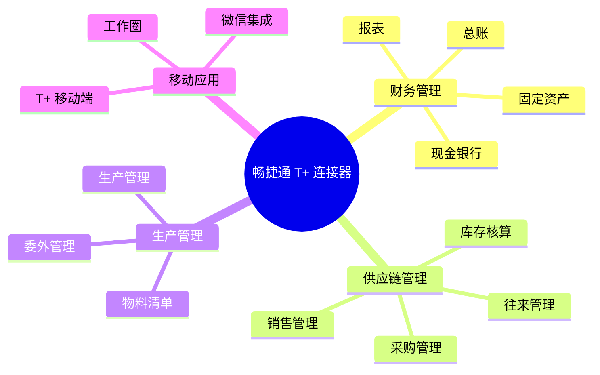

# 畅捷通 T+ 连接器

畅捷通 T+ 是用友旗下畅捷通公司推出的面向小微企业的云 ERP 产品，支持云管理、移动应用，覆盖财务、供应链、生产等业务领域。轻易云 iPaaS 提供专用的 T+ 连接器，帮助企业实现 T+ 系统与第三方应用的数据集成。

## 连接器概述

### 产品简介

畅捷通 T+ 具有以下特点：

- **云管理**：支持云端部署，随时随地访问
- **移动应用**：手机端随时处理业务
- **灵活扩展**：按需购买，弹性扩展
- **简单易用**：界面友好，上手快速
- **生态开放**：标准 API 接口，支持集成

### 适用版本

| 版本 | 支持状态 | 说明 |
|-----|---------|------|
| T+ 13.0 | ✅ 支持 | 推荐使用 |
| T+ 12.3 | ✅ 支持 | 稳定版本 |
| T+ 12.2 | ✅ 支持 | 基础功能 |
| T+ Cloud | ✅ 支持 | 云版本 |



## 配置说明

### 前置条件

1. **开通 API 服务**
   - 登录 T+ 系统管理
   - 进入【云服务】→【OpenAPI】
   - 申请开通 API 访问权限

2. **获取连接信息**

| 参数 | 说明 | 获取方式 |
|-----|------|---------|
| `appKey` | 应用标识 | OpenAPI 应用管理 |
| `appSecret` | 应用密钥 | OpenAPI 应用管理 |
| `accountNum` | 账套号 | 系统管理 |
| `userName` | 用户名 | T+ 登录用户 |
| `password` | 密码 | T+ 登录密码 |

### 连接配置参数

| 参数名 | 类型 | 必填 | 说明 |
|-------|------|------|------|
| `serverUrl` | string | ✅ | T+ 服务器地址 |
| `appKey` | string | ✅ | 应用标识 |
| `appSecret` | string | ✅ | 应用密钥 |
| `accountNum` | string | ✅ | 账套编号 |
| `userName` | string | ✅ | 登录用户名 |
| `password` | string | ✅ | 登录密码 |
| `timeout` | number | — | 超时时间（毫秒） |

### 配置示例

```json
{
  "serverUrl": "http://tplus-server:8080",
  "appKey": "your-app-key",
  "appSecret": "your-app-secret",
  "accountNum": "001",
  "userName": "admin",
  "password": "your-password",
  "timeout": 30000
}
```

## 使用示例

### 查询存货档案

```json
{
  "api": "inventory/query",
  "method": "POST",
  "body": {
    "param": {
      "Inventory": {
        "Code": "",
        "Name": ""
      }
    }
  }
}
```

**响应示例**：

```json
{
  "code": "200",
  "message": "success",
  "data": {
    "Inventory": [
      {
        "Code": "1001",
        "Name": "商品 A",
        "Specification": "规格 1",
        "Unit": {
          "Name": "件"
        },
        "SalePrice": 100.00
      }
    ]
  }
}
```

### 创建销售订单

```json
{
  "api": "saleDelivery/create",
  "method": "POST",
  "body": {
    "dto": {
      "Code": "SO20260313001",
      "VoucherDate": "2026-03-13",
      "Customer": {
        "Code": "C001"
      },
      "SaleDeliveryDetails": [
        {
          "Inventory": {
            "Code": "1001"
          },
          "Quantity": 10,
          "Unit": {
            "Name": "件"
          },
          "Price": 100.00,
          "Amount": 1000.00
        }
      ]
    }
  }
}
```

### 查询现存量

```json
{
  "api": "currentStock/query",
  "method": "POST",
  "body": {
    "param": {
      "Warehouse": {
        "Code": ""
      },
      "Inventory": {
        "Code": ""
      }
    }
  }
}
```

## 适配器配置

### 查询适配器

```json
{
  "source": {
    "adapter": "TPlusQueryAdapter",
    "api": "inventory/query",
    "params": {
      "param": {
        "Inventory": {
          "Code": "{{inventoryCode}}"
        }
      }
    }
  }
}
```

### 写入适配器

```json
{
  "target": {
    "adapter": "TPlusExecuteAdapter",
    "api": "saleDelivery/create",
    "mapping": {
      "dto.Code": "{{orderNo}}",
      "dto.VoucherDate": "{{orderDate}}",
      "dto.Customer.Code": "{{customerCode}}"
    }
  }
}
```

## 业务接口列表

### 基础档案

| 接口名称 | 接口标识 | 类型 | 说明 |
|---------|---------|------|------|
| 存货查询 | `inventory/query` | 查询 | 查询存货档案 |
| 客户查询 | `partner/query` | 查询 | 查询客户档案 |
| 供应商查询 | `partner/query` | 查询 | 查询供应商档案 |
| 仓库查询 | `warehouse/query` | 查询 | 查询仓库档案 |
| 部门查询 | `department/query` | 查询 | 查询部门档案 |
| 职员查询 | `person/query` | 查询 | 查询职员档案 |

### 供应链

| 接口名称 | 接口标识 | 类型 | 说明 |
|---------|---------|------|------|
| 销售订单查询 | `saleOrder/query` | 查询 | 查询销售订单 |
| 销售订单创建 | `saleOrder/create` | 写入 | 创建销售订单 |
| 销货单查询 | `saleDelivery/query` | 查询 | 查询销货单 |
| 销货单创建 | `saleDelivery/create` | 写入 | 创建销货单 |
| 采购订单查询 | `purchaseOrder/query` | 查询 | 查询采购订单 |
| 采购入库查询 | `purchaseReceive/query` | 查询 | 查询采购入库 |
| 现存量查询 | `currentStock/query` | 查询 | 查询库存 |

### 财务

| 接口名称 | 接口标识 | 类型 | 说明 |
|---------|---------|------|------|
| 凭证查询 | `voucher/query` | 查询 | 查询会计凭证 |
| 凭证创建 | `voucher/create` | 写入 | 创建会计凭证 |
| 科目查询 | `ledgerAccount/query` | 查询 | 查询会计科目 |
| 科目余额查询 | `balance/query` | 查询 | 查询科目余额 |

## 常见问题

### Q: 如何获取账套号？

1. 登录 T+ 系统管理
2. 点击【账套设置】
3. 查看账套列表中的【账套号】列

### Q: 连接测试失败？

**排查步骤：**

1. 确认 T+ 服务器地址和端口正确
2. 检查账套号是否正确（注意区分大小写）
3. 验证用户名和密码正确
4. 确认 API 服务已开通
5. 检查网络连通性

### Q: API 返回 "签名错误"？

1. 检查 `appKey` 和 `appSecret` 是否匹配
2. 确认系统时间准确（时间偏差会导致签名失败）
3. 检查请求参数是否编码正确

### Q: 如何处理分页？

T+ API 支持分页参数：

```json
{
  "param": {
    "PageIndex": 1,
    "PageSize": 100
  }
}
```

| 参数 | 说明 | 限制 |
|-----|------|------|
| `PageIndex` | 当前页码 | 从 1 开始 |
| `PageSize` | 每页条数 | 最大 1000 |

### Q: 单据编码如何生成？

建议方式：
1. **系统自增**：不传 Code，由 T+ 自动按编码规则生成
2. **外部传入**：传入 Code，需确保唯一性

```json
// 系统自增
{
  "dto": {
    "VoucherDate": "2026-03-13",
    "Customer": { "Code": "C001" }
  }
}

// 外部传入
{
  "dto": {
    "Code": "SO20260313001",
    "VoucherDate": "2026-03-13",
    "Customer": { "Code": "C001" }
  }
}
```

### Q: 日期格式要求？

T+ 接口要求日期格式为 `yyyy-MM-dd`：

```json
{
  "VoucherDate": "2026-03-13",
  "DeliveryDate": "2026-03-20"
}
```

## 相关资源

- [畅捷通官网](https://www.chanjet.com/)
- [畅捷通好会计连接器](./chanjet-accounting)
- [用友 U8+ 连接器](./yonyou-u8)
- [ERP 连接器概览](../erp)

> [!TIP]
> T+ 的 API 能力可能因版本不同有所差异，建议参考具体版本的接口文档。
