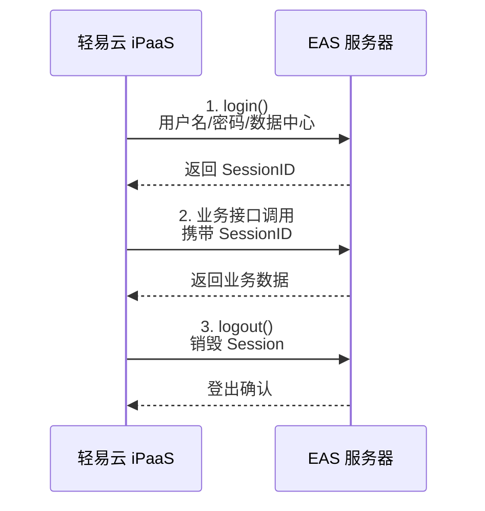
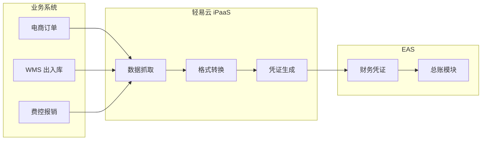
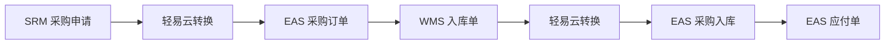
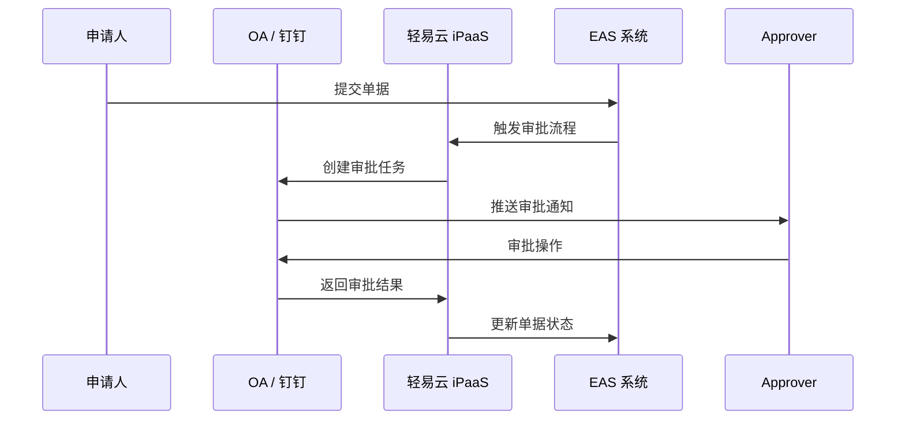

# 金蝶 EAS 集成专题

本文档详细介绍轻易云 iPaaS 平台与金蝶 EAS（Enterprise Application Suite）的集成配置方法，涵盖连接配置、WebService 接口说明、常见集成场景以及鉴权方式等内容。

## 概述

金蝶 EAS（Enterprise Application Suite）是金蝶软件面向大型集团企业推出的高端 ERP 管理平台，支持集团管控、财务共享、多组织协同等复杂业务场景。轻易云 iPaaS 提供专用的金蝶 EAS 连接器，通过 WebService 接口实现与 EAS 系统的深度集成。

### 核心能力

- **集团主数据同步**：组织、科目、物料、客户、供应商等主数据跨系统同步
- **财务凭证集成**：业务系统自动生成 EAS 财务凭证，实现业财一体化
- **供应链协同**：采购、销售、库存单据的双向流转与状态同步
- **审批流程对接**：将 EAS 审批流与 OA / 钉钉 / 企业微信等协同平台打通

### 适用版本

| EAS 版本 | 支持状态 | 备注 |
|----------|----------|------|
| EAS 8.0 | ✅ 支持 | 推荐使用 |
| EAS 8.1 | ✅ 支持 | 推荐使用 |
| EAS 8.2 | ✅ 支持 | 推荐使用 |
| EAS 8.5 | ✅ 支持 | 推荐使用 |

## 连接配置

### 前置条件

在开始配置之前，请确保已获取以下信息：

1. **EAS 服务器地址**：WebService 访问地址，通常格式为 `http://{服务器IP}:{端口}/easpi/services`
2. **数据中心编码**：EAS 登录的数据中心编码
3. **用户名和密码**：具有相应操作权限的 EAS 用户账号
4. **账套信息**：目标账套编码

### 创建连接器

1. 登录轻易云 iPaaS 控制台，进入**连接器管理**页面
2. 点击**新建连接器**，选择 **ERP** 分类下的**金蝶 EAS**
3. 填写连接参数（详见下方参数说明）
4. 点击**测试连接**验证连通性
5. 连接成功后点击**保存**

### 连接参数说明

| 参数名 | 类型 | 必填 | 说明 |
| ------ | ---- | ---- | ---- |
| `server_url` | string | ✅ | EAS WebService 服务地址，如 `http://192.168.1.100:6888/easpi/services` |
| `datacenter` | string | ✅ | 数据中心编码 |
| `username` | string | ✅ | EAS 登录用户名 |
| `password` | string | ✅ | EAS 登录密码 |
| `account` | string | — | 账套编码，多账套环境必填 |
| `language` | string | — | 语言编码，默认 `zh_CN` |
| `timeout` | integer | — | 连接超时时间（秒），默认 60 |

> [!IMPORTANT]
> 确保 EAS 服务器网络可达，且 WebService 端口（默认为 6888）已开放访问权限。

### 适配器选择

| 场景 | 查询适配器 | 写入适配器 |
| ---- | ---------- | ---------- |
| 标准业务对象查询 | `EASQueryAdapter` | — |
| 标准业务对象写入 | — | `EASExecuteAdapter` |
| 财务凭证导入 | — | `EASVoucherAdapter` |
| 基础资料同步 | `EASBaseDataQueryAdapter` | `EASBaseDataExecuteAdapter` |

## 鉴权方式

金蝶 EAS 的 WebService 接口采用 **Session 会话机制**进行身份认证，调用流程如下：



### 登录接口

**接口方法**：`login`

**请求参数**：

| 参数名 | 类型 | 说明 |
| ------ | ---- | ---- |
| `userName` | string | EAS 用户名 |
| `password` | string | EAS 密码（明文或 MD5 加密） |
| `datacenter` | string | 数据中心编码 |
| `language` | string | 语言，默认 `zh_CN` |

**响应结果**：

```xml
<soap:Envelope xmlns:soap="http://schemas.xmlsoap.org/soap/envelope/">
  <soap:Body>
    <loginResponse xmlns="http://webservice.eas.kingdee.com">
      <return>SessionID:xxxxxxxxx</return>
    </loginResponse>
  </soap:Body>
</soap:Envelope>
```

### Session 使用

在后续接口调用中，需要在 SOAP Header 中携带 SessionID：

```xml
<soap:Header>
  <SessionId xmlns="http://webservice.eas.kingdee.com">xxxxxxxxx</SessionId>
</soap:Header>
```

### 登出接口

**接口方法**：`logout`

调用登出接口销毁当前 Session，释放服务器资源。

> [!TIP]
> 轻易云 iPaaS 连接器会自动管理 Session 的生命周期，包括登录、Session 刷新和登出，无需手动处理。

## WebService 接口说明

### 接口地址规范

金蝶 EAS WebService 接口遵循以下 URL 规范：

```text
http://{服务器地址}:{端口}/easpi/services/{接口名}
```

常用接口地址示例：

| 接口名称 | 接口路径 |
| -------- | -------- |
| EAS 登录 | `/easpi/services/EASLogin` |
| 基础数据服务 | `/easpi/services/WSBaseDataFacade` |
| 凭证服务 | `/easpi/services/WSGLWebServiceFacade` |
| 单据服务 | `/easpi/services/WSBillFacade` |

### 基础数据查询接口

**接口**：`WSBaseDataFacade.queryBaseData`

**功能**：查询 EAS 基础资料数据，如物料、客户、供应商等。

**请求参数**：

| 参数名 | 类型 | 说明 |
| ------ | ---- | ---- |
| `type` | string | 基础资料类型，如 `Material`、`Customer`、`Supplier` |
| `queryInfo` | string | 查询条件 XML |

**请求示例**：

```xml
<soap:Envelope xmlns:soap="http://schemas.xmlsoap.org/soap/envelope/">
  <soap:Header>
    <SessionId xmlns="http://webservice.eas.kingdee.com">xxxxxxxxx</SessionId>
  </soap:Header>
  <soap:Body>
    <queryBaseData xmlns="http://webservice.eas.kingdee.com">
      <type>Material</type>
      <queryInfo>
        <![CDATA[
        <queryInfo>
          <select>
            <field>number</field>
            <field>name</field>
            <field>model</field>
          </select>
          <filter>
            <condition property="number" operator="like" value="MAT%"/>
          </filter>
        </queryInfo>
        ]]>
      </queryInfo>
    </queryBaseData>
  </soap:Body>
</soap:Envelope>
```

### 财务凭证导入接口

**接口**：`WSGLWebServiceFacade.importVoucher`

**功能**：将外部系统数据导入 EAS 生成财务凭证。

**请求参数**：

| 参数名 | 类型 | 说明 |
| ------ | ---- | ---- |
| `voucherInfo` | string | 凭证信息 XML |

**凭证 XML 结构示例**：

```xml
<voucher>
  <voucherHead>
    <company>001</company>           <!-- 公司编码 -->
    <bookType>101</bookType>         <!-- 账簿类型 -->
    <period>2026-03</period>         <!-- 会计期间 -->
    <voucherType>记</voucherType>    <!-- 凭证字 -->
    <bizDate>2026-03-13</bizDate>    <!-- 业务日期 -->
    <description>摘要</description>  <!-- 摘要 -->
  </voucherHead>
  <voucherEntries>
    <entry>
      <seq>1</seq>                   <!-- 分录序号 -->
      <account>1001</account>        <!-- 科目编码 -->
      <debit>10000</debit>           <!-- 借方金额 -->
      <credit>0</credit>             <!-- 贷方金额 -->
      <description>摘要</description>
    </entry>
    <entry>
      <seq>2</seq>
      <account>6001</account>
      <debit>0</debit>
      <credit>10000</credit>
      <description>摘要</description>
    </entry>
  </voucherEntries>
</voucher>
```

> [!IMPORTANT]
> 凭证借贷必须平衡，否则导入会失败。科目编码、公司编码等必须在 EAS 中存在。

### 业务单据接口

**接口**：`WSBillFacade.submitBill`

**功能**：提交业务单据到 EAS。

**常用单据类型**：

| 单据类型 | 编码 | 说明 |
| -------- | ---- | ---- |
| 销售订单 | `SAL_SaleOrder` | 销售业务订单 |
| 采购订单 | `PUR_PurchaseOrder` | 采购业务订单 |
| 采购入库单 | `STK_InStock` | 采购入库业务 |
| 销售出库单 | `SAL_OutStock` | 销售出库业务 |

## 常见集成场景

### 场景一：财务凭证自动生成

将业务系统（电商、WMS、费控等）的数据自动转换为 EAS 财务凭证。



**配置要点**：

1. **科目映射**：在轻易云配置业务类型与 EAS 科目的映射关系
2. **辅助核算**：配置客户、供应商、项目等辅助核算维度映射
3. **凭证模板**：定义不同业务场景的凭证模板（一借一贷、多借多贷等）

### 场景二：基础资料双向同步

保持 EAS 与其他系统基础资料的一致性。

| 资料类型 | 同步方向 | 同步频率 |
| -------- | -------- | -------- |
| 组织架构 | EAS → 其他系统 | 实时 |
| 会计科目 | EAS → 其他系统 | 每日 |
| 物料档案 | 双向同步 | 实时 |
| 客户档案 | 双向同步 | 实时 |
| 供应商档案 | 双向同步 | 实时 |

### 场景三：供应链单据协同

实现采购、销售、库存业务单据的跨系统流转。

**采购业务流**：



### 场景四：审批流程集成

将 EAS 审批流程与 OA / 钉钉 / 企业微信集成。



## 配置示例

### 凭证集成方案配置

**源平台**：电商系统
**目标平台**：金蝶 EAS
**同步对象**：销售订单 → 财务凭证

**查询配置**：

```json
{
  "api": "/api/orders",
  "method": "GET",
  "params": {
    "status": "completed",
    "date_from": "{{last_sync_time}}"
  }
}
```

**数据映射**：

| 源字段 | 目标字段 | 转换规则 |
| ------ | -------- | -------- |
| `order_no` | `voucherHead.voucherNumber` | 前缀 `XS` |
| `order_date` | `voucherHead.bizDate` | 格式转换 |
| `amount` | `voucherEntries[0].debit` | 金额/100 |
| `customer_id` | `voucherEntries[0].assist.customer` | 查表转换 |

**写入配置**：

```json
{
  "interface": "WSGLWebServiceFacade",
  "method": "importVoucher",
  "adapter": "EASVoucherAdapter",
  "autoAudit": false
}
```

### 基础资料同步配置

**源平台**：金蝶 EAS
**目标平台**：外部系统
**同步对象**：物料档案

**查询适配器配置**：

```json
{
  "interface": "WSBaseDataFacade",
  "method": "queryBaseData",
  "adapter": "EASBaseDataQueryAdapter",
  "params": {
    "type": "Material",
    "fields": ["number", "name", "model", "unit", "category"],
    "filter": {
      "lastModifyTime": ">={{last_sync_time}}"
    }
  }
}
```

## 常见问题

### Q：连接 EAS 时提示 "登录失败"？

A：请检查以下配置：

- 服务器地址和端口是否正确
- 用户名和密码是否正确
- 数据中心编码是否正确
- 用户是否有 WebService 访问权限

### Q：调用接口返回 "Session 已过期"？

A：轻易云 iPaaS 会自动管理 Session，如遇此错误：

- 检查连接器配置中的 `timeout` 设置是否过小
- 确认 EAS 服务器的 Session 超时配置
- 检查网络连接是否稳定

### Q：凭证导入失败，提示 "借贷不平衡"？

A：请检查：

- 所有分录的借方金额合计是否等于贷方金额合计
- 金额字段是否为数值类型
- 是否存在空值或未映射的金额字段

### Q：如何获取 EAS 的科目编码、组织编码等基础资料？

A：可通过以下方式获取：

1. 登录 EAS 客户端，在基础资料管理中查看编码
2. 使用 `WSBaseDataFacade` 接口查询
3. 通过 EAS 数据库直接查询（需数据库权限）

### Q：EAS WebService 返回中文乱码？

A：请检查：

- 请求头中是否设置了 `Content-Type: text/xml; charset=UTF-8`
- EAS 服务器的编码配置是否为 UTF-8
- 轻易云连接器默认使用 UTF-8 编码，一般无需额外配置

### Q：大量数据同步时性能较慢？

A：优化建议：

- 启用批量处理模式，每次传输 100-500 条记录
- 仅同步变更数据，使用 `lastModifyTime` 等字段过滤
- 避开 EAS 业务高峰期进行同步
- 考虑使用 EAS 的数据导入工具进行初始化

## 相关资源

- [ERP 类连接器概览](./README) — 了解所有支持的 ERP 连接器
- [配置连接器](../../guide/configure-connector) — 连接器基础配置指南
- [数据映射](../../guide/data-mapping) — 数据字段映射配置方法
- [金蝶云星空集成](./kingdee-cloud-galaxy) — 金蝶云星空连接器文档
- [标准集成方案 — ERP 对接](../../standard-schemes/erp-integration) — ERP 集成最佳实践

---

> [!NOTE]
> 本文档基于金蝶 EAS 8.x 版本编写，不同版本接口可能存在差异。如有疑问，请联系轻易云技术支持团队或查阅金蝶官方文档。
