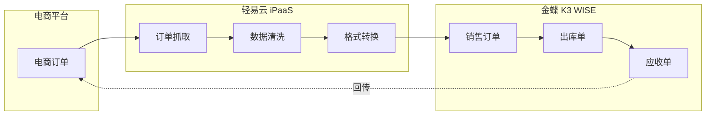
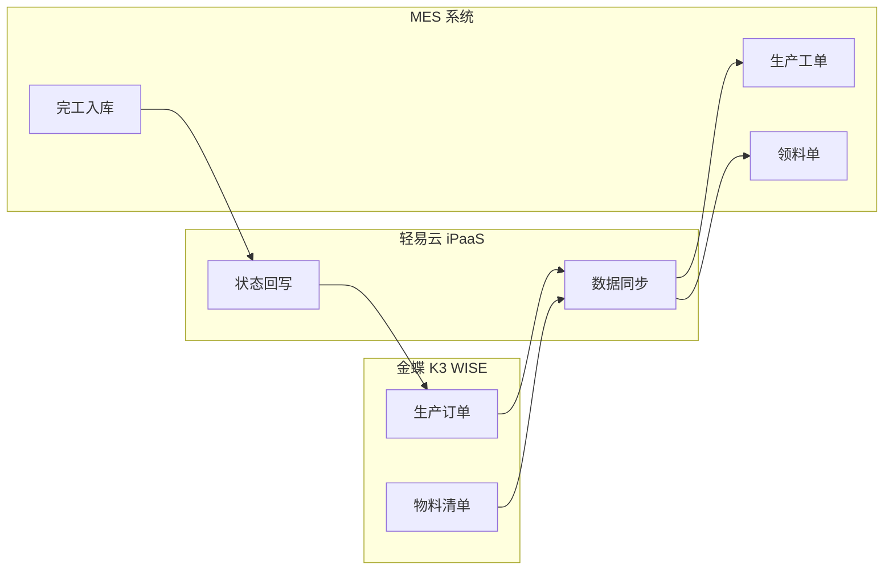
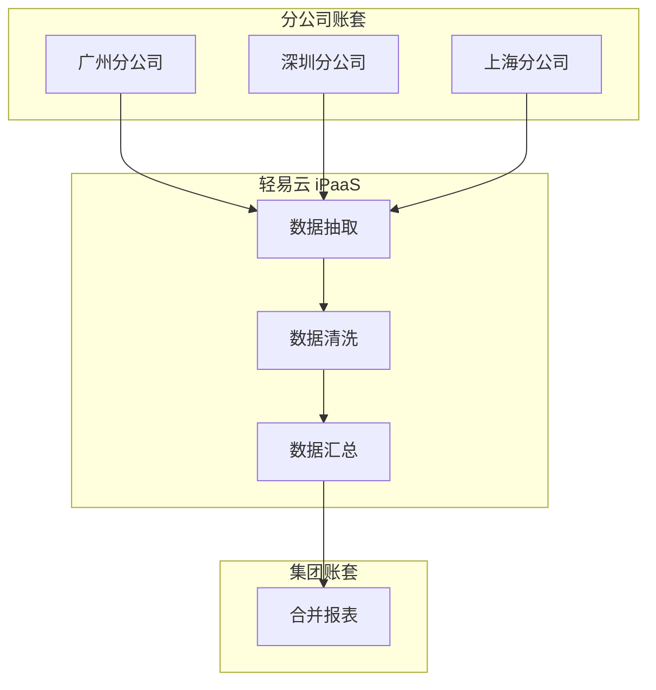

# 金蝶 K3 WISE 集成专题

本文档详细介绍轻易云 iPaaS 平台与金蝶 K3 WISE 的集成配置方法，涵盖连接器配置、EBDI 接口授权、基础资料同步、业务单据集成等场景。

## 概述

金蝶 K3 WISE（Kingdee K/3 WISE）是金蝶软件面向成长型企业推出的 ERP 管理系统，涵盖财务、供应链、生产制造、人力资源等核心业务模块。轻易云 iPaaS 提供专用的金蝶 K3 WISE 连接器，支持以下核心能力：

- **基础数据同步**：物料、客户、供应商、部门、职员等主数据双向同步
- **业务单据集成**：采购、销售、库存、生产单据的自动化流转
- **库存管理**：实时库存查询、调拨单、出入库单据对接
- **财务集成**：凭证、科目、核算维度等财务数据交换

> [!NOTE]
> 金蝶 K3 WISE 采用 WebService 方式对外提供数据交换接口，通过 EBDI（Enterprise Business Data Interface，企业业务数据接口）实现与外部系统的集成。

## 连接器配置

### 创建连接器

1. 登录轻易云 iPaaS 控制台，进入**连接器管理**页面
2. 点击**新建连接器**，选择 **ERP** 分类下的**金蝶 K3 WISE**
3. 填写连接参数（详见下方参数说明）
4. 点击**测试连接**验证连通性
5. 连接成功后点击**保存**

### 连接参数说明

| 参数名 | 类型 | 必填 | 说明 |
| ------ | ---- | ---- | ---- |
| `server_url` | string | ✅ | K3 WISE 服务器地址，格式如 `http://k3server:8080/` |
| `database` | string | ✅ | 账套数据库名称 |
| `username` | string | ✅ | 集成用户账号 |
| `password` | string | ✅ | 集成用户密码 |
| `auth_code` | string | ✅ | EBDI 接口授权码 |

> [!IMPORTANT]
> 在使用连接器之前，必须先在 K3 WISE 系统中完成 EBDI 接口授权配置，获取授权码。

## EBDI 接口授权配置

金蝶 K3 WISE 通过 EBDI（Enterprise Business Data Interface）模块实现与外部系统的数据交换。默认情况下，以下模块已开放接口授权：

- 客户管理
- 物料管理
- 供应商管理
- 采购订单
- 销售订单
- 外购入库
- 销售出库
- 会计科目
- 计量单位
- 部门档案
- 职员档案
- 仓库档案

### 开通其他模块接口授权

如需对接其他业务模块，需手动在 K3 WISE 主控台中配置 EBDI 接口授权。

#### 步骤一：进入授权管理

1. 登录金蝶 K3 WISE 主控台
2. 依次进入 **EBDI** → **API 授权功能** → **授权管理**

#### 步骤二：选择企业并添加授权

1. 在授权管理页面，点击对应的企业名称
2. 点击**添加**按钮，进入模块选择界面

#### 步骤三：选择授权模块

1. 在模块列表中，勾选需要开放接口调用的业务模块
2. 模块列表涵盖采购、销售、库存、生产、财务等各业务领域

#### 步骤四：配置接口权限

1. 勾选需要开放调用权限的具体接口
2. 根据业务需求，选择查询、新增、修改、删除等操作权限
3. 点击**保存**完成配置

> [!WARNING]
> 配置完成后务必点击保存按钮，否则授权设置不会生效。

### 授权验证

完成授权配置后，可以通过以下方式验证接口是否可用：

1. 在轻易云 iPaaS 连接器配置页面，填写服务器地址和授权信息
2. 点击**测试连接**按钮
3. 如提示连接成功，则表示 EBDI 接口授权配置正确

## 常用接口说明

### 物料查询接口

**接口地址**：`Material/GetList`

**请求方式**：`POST`

#### 请求参数

| 字段 | 名称 | 类型 | 说明 |
| ---- | ---- | ---- | ---- |
| `FItemID` | 物料代码 | string | 物料编码 |
| `FItemName` | 物料名称 | string | 物料名称 |
| `FItemModel` | 规格型号 | string | 规格型号 |
| `FHelpCode` | 助记码 | string | 助记码 |
| `FUnitID` | 单位 | string | 计量单位 |
| `FUnitWeight` | 单位重量 | string | 单位重量 |
| `PageIndex` | 页码 | int | 开始行索引 |
| `PageSize` | 每页条数 | int | 每页返回记录数 |
| `Filter` | 过滤条件 | string | SQL 过滤条件 |

#### 响应参数

| 字段 | 名称 | 类型 |
| ---- | ---- | ---- |
| `FItemID` | 物料代码 | string |
| `FItemName` | 物料名称 | string |
| `FItemModel` | 规格型号 | string |
| `FUnitID` | 单位 | string |
| `FErpClsID` | 物料属性 | string |
| `FTrack` | 计价方法 | string |

### 调拨单查询接口

**接口地址**：`Transfer/GetList`

**请求方式**：`POST`

#### 请求参数

| 字段 | 名称 | 类型 | 说明 |
| ---- | ---- | ---- | ---- |
| `FBillNo` | 编号 | string | 调拨单号 |
| `Fdate` | 日期 | string | 调拨日期 |
| `FSCStockID` | 调出仓库 | string | 调出仓库代码 |
| `FDCStockID` | 调入仓库 | string | 调入仓库代码 |
| `FDeptID` | 部门 | string | 部门代码 |
| `FEmpID` | 业务员 | string | 业务员代码 |
| `FCheckerID` | 审核人 | string | 审核人代码 |
| `PageIndex` | 页码 | int | 开始行索引 |
| `PageSize` | 每页条数 | int | 每页返回记录数 |

#### 响应参数

| 字段 | 名称 | 类型 |
| ---- | ---- | ---- |
| `FBillNo` | 编号 | string |
| `Fdate` | 日期 | string |
| `FSCStockID` | 调出仓库 | string |
| `FDCStockID` | 调入仓库 | string |
| `FItemID` | 物料代码 | string |
| `FItemName` | 物料名称 | string |
| `FQty` | 基本单位数量 | decimal |
| `Fauxqty` | 数量 | decimal |

### 采购订单查询接口

**接口地址**：`POOrder/GetList`

**请求方式**：`POST`

#### 请求参数

| 字段 | 名称 | 类型 | 说明 |
| ---- | ---- | ---- | ---- |
| `FBillNo` | 编号 | string | 采购订单号 |
| `Fdate` | 日期 | string | 订单日期 |
| `FSupplyID` | 供应商 | string | 供应商代码 |
| `FDeptID` | 部门 | string | 部门代码 |
| `FEmpID` | 采购员 | string | 采购员代码 |
| `FStatus` | 状态 | int | 订单状态 |
| `PageIndex` | 页码 | int | 开始行索引 |
| `PageSize` | 每页条数 | int | 每页返回记录数 |

### 销售订单查询接口

**接口地址**：`SEOrder/GetList`

**请求方式**：`POST`

#### 请求参数

| 字段 | 名称 | 类型 | 说明 |
| ---- | ---- | ---- | ---- |
| `FBillNo` | 编号 | string | 销售订单号 |
| `Fdate` | 日期 | string | 订单日期 |
| `FCustID` | 客户 | string | 客户代码 |
| `FDeptID` | 部门 | string | 部门代码 |
| `FEmpID` | 业务员 | string | 业务员代码 |
| `FStatus` | 状态 | int | 订单状态 |
| `PageIndex` | 页码 | int | 开始行索引 |
| `PageSize` | 每页条数 | int | 每页返回记录数 |

## 数据映射配置

### 基础资料映射示例

#### 物料主数据同步

| 源系统字段 | 目标系统字段 | 转换规则 |
| ---------- | ------------ | -------- |
| `FItemID` | `material_code` | 直接映射 |
| `FItemName` | `material_name` | 直接映射 |
| `FItemModel` | `specification` | 直接映射 |
| `FUnitID` | `unit` | 单位编码映射 |
| `FErpClsID` | `material_type` | 属性转换：1→原材料，2→半成品，3→产成品 |

#### 客户档案同步

| 源系统字段 | 目标系统字段 | 转换规则 |
| ---------- | ------------ | -------- |
| `FItemID` | `customer_code` | 直接映射 |
| `FName` | `customer_name` | 直接映射 |
| `FAddress` | `address` | 直接映射 |
| `FPhone` | `phone` | 直接映射 |
| `FContact` | `contact_person` | 直接映射 |

### 业务单据映射示例

#### 采购订单同步

| 源系统字段 | 目标系统字段 | 转换规则 |
| ---------- | ------------ | -------- |
| `FBillNo` | `order_no` | 直接映射 |
| `Fdate` | `order_date` | 日期格式转换 |
| `FSupplyID` | `supplier_code` | 供应商编码映射 |
| `FDeptID` | `dept_code` | 部门编码映射 |
| `FEntryID` | `line_no` | 行号映射 |
| `FItemID` | `material_code` | 物料编码映射 |
| `Fauxqty` | `quantity` | 数量映射 |
| `FPrice` | `price` | 单价映射 |

## 集成场景示例

### 场景一：金蝶 K3 WISE 对接电商平台

**实现步骤**：

1. 配置电商平台连接器（如旺店通、聚水潭）
2. 配置金蝶 K3 WISE 连接器
3. 创建集成方案：源平台选择电商平台，目标平台选择 K3 WISE
4. 配置销售订单、发货单、退款单的数据映射
5. 设置定时同步策略，建议每 5~10 分钟同步一次

### 场景二：金蝶 K3 WISE 对接 MES 系统

**实现步骤**：

1. 配置 K3 WISE 连接器，授权生产管理模块
2. 配置 MES 系统连接器
3. 创建生产订单下发方案：K3 WISE → MES
4. 创建完工入库回写方案：MES → K3 WISE
5. 配置工序汇报、领料单等单据的双向同步

### 场景三：多账套数据汇总

**实现步骤**：

1. 分别为各分公司账套创建 K3 WISE 连接器
2. 创建集团账套连接器
3. 配置基础资料、科目余额表、凭证等数据的抽取方案
4. 设置定时任务，每日凌晨自动汇总数据

## 常见问题

### Q：连接 K3 WISE 时提示 "认证失败"？

A：请检查以下配置：
- 服务器地址是否正确，是否包含端口号（默认 8080）
- 账套数据库名称是否正确
- 集成用户账号密码是否正确
- EBDI 接口授权码是否有效

### Q：如何获取 EBDI 授权码？

A：EBDI 授权码需要在 K3 WISE 系统中申请：
1. 登录 K3 WISE 主控台
2. 进入 **EBDI** → **授权管理**
3. 选择对应企业，查看或生成授权码
4. 如未显示授权码，请联系金蝶技术支持开通 EBDI 模块

### Q：接口调用返回 "模块未授权"？

A：表示该业务模块未在 EBDI 中开放接口权限：
1. 按照本文档「EBDI 接口授权配置」章节操作
2. 在授权管理中添加对应模块
3. 勾选需要开放的接口权限
4. 保存后重新测试连接

### Q：分页查询如何配置？

A：K3 WISE 接口支持分页查询，配置方式如下：
- `PageIndex`：起始行索引，从 0 开始
- `PageSize`：每页返回记录数，建议设置为 100~500
- 总页数需要通过多次调用获取，直到返回数据为空

### Q：单据写入后如何自动审核？

A：K3 WISE 的单据审核需要单独调用审核接口：
1. 先调用保存接口写入单据
2. 获取返回的单据内码（InterID）
3. 调用审核接口完成单据审核
4. 审核接口地址通常为 `{FormId}/Audit`

### Q：如何实现增量数据同步？

A：建议采用以下策略实现增量同步：
1. 使用时间戳字段（如 `FDate`、`FCreateDate`）作为增量标识
2. 在 Filter 参数中添加时间范围条件，如 `FDate >= '2026-01-01'`
3. 记录上次同步的最大时间戳，下次同步时作为起始条件
4. 对于删除数据，可定期执行全量比对

## 相关资源

- [配置连接器](../../guide/configure-connector) — 连接器基础使用指南
- [金蝶云星空集成专题](./kingdee-cloud-galaxy) — 金蝶云星空对接指南
- [金蝶 KIS 集成专题](./kingdee-kis) — 金蝶 KIS 对接指南
- [标准集成方案](../../standard-schemes/erp-integration) — ERP 对接最佳实践

---

> [!TIP]
> 如需更多技术支持，请联系轻易云客户成功团队或访问 [轻易云官网](https://www.qeasy.cloud/)。
